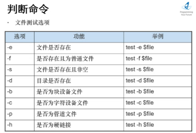

# shell脚本

该语言凭借系统自身解析编译，不需要下载编译器

```shell
#!/bin/bash              ##这是一个shell脚本   
```

### 两种执行脚本方式

```shell
source 或者 . ##在当前shell进程下执行
. first.sh                 //必须加点杠才能执行sh命令


bash 脚本    ##在新开的子bash中执行脚本
bash first.sh          //第二种方式，根据脚本定义的解析器来执行命令   无视权限

##无权限仍可以执行     ，可以得出用户在可读当前脚本时即使无执行权限仍可借由解析器间接执行

-rw-r--r--. 1 root root 37 11月 18 11:08 first.sh
-rw-r--r--. 1 root root 88 11月 18 11:17 test
[root@liyonghai shell]# bash first.sh 
 2 10 88 test
```

##### 子shell不会覆盖变量

bash执行脚本创建子shell执行脚本,所以不会更改当前的环境变量

而直接点执行会成功修改, 因为子shell只会在自己的作用域中修改变量

```shell
vim b.sh
#!/bin/bash
$name="hedley"

. b.sh  ##当前shell下执行该脚本

vim a.sh
#!/bin/bash
$name="son"

bash a.sh  ##开一个子shell执行
echo $name   ##hedley,说明没有发生覆盖更改
```


### 变量

##### 变量种类

本地变量  只能用在bash的当前进程中,会被销毁

环境变量   称为全局变量,所有的bash中都可以用,已经被持久化的变量,不会被销毁

局部变量   shell脚本中定义的变量

##### 系统变量

$HOME  $PATH   获取值加$

##### 用户自定义变量

```shell
A=100                          ##等号前后不要加空格,shell脚本中不能乱加空格
echo "A=$A"

##当我们想在复制诸如lyh 123则会报错

a="100 sjdksa"
##想要值中有空格就加双引号
```

##### 变量与字符串拼接

```shell
#!/bin/bash
name="${1}sadasdasd"
echo $name

##所以字符串拼接时就用花括号包变量,然后用双引号包整个字符串
```

##### 静态变量不能unset

```shell
readonly a=1000
echo "a=$a"
unset a                       //报错
```


##### 变量拼接字符串

```shell
name="Alice"
greeting="Hello, ${name}!"
```

##### 单引号和飘号双引号

```shell
#!/bin/bash
#a:lyh

name=lyh
echo ${name}              //输出为lyh
echo "${name}"            //输出为lyh
echo '${name}'           //输出为$name

##单引号不解析语法,飘号表示当做命令输出
```

飘号让变量可以接收命令的输出

```shell
dir=`ls`
echo $dir
bin boot data dev etc home lib lib64 lost+found media mnt opt proc root run sbin shellscript.sh 
```

双引号做参数替换防止意外

```shell
是否要加双引号取决于这个串会不会做替换
tip="a=$0"
echo "$tip"
##如果一个字符串包含空格或特殊字符（如$、*、|等）
##shell脚本本身对于命令替换和赋值单纯就是简单的字符串拼接替换,所以不加双引号容易出现意外情况

```


##### read读取输入值

```shell
read -t 10 -p "输入个值" S        #-p输入友好提示
echo "$S"						 #-t 10 表示10秒内输入,10秒接收不到直接执行程序
```

### 常用环境变量

##### 特殊状态变量

```shell
echo $?  ##输出上一命令是否执行成功  1-255执行失败  0表示执行成功
##脚本中常用来判断上一步骤是否执行成功

```

##### 个人环境变量配置文件

```shell
~/.bash_profile    ~/.bashrc  ##这些文件上配置用户特有的环境变量,当用户远程登录时会执行赋值
##所以修改后要exit退出重新登录才会生效
```

系统环境配置文件

```shell
/etc/profile   /etc/bashrc
```

##### 查询和设置环境变量

查询环境变量

set查看所有变量

```shell
name=hedley        ##定义一个临时变量
set | grep ^name    ##set包括所有变量,可以查到临时变量,持久化的环境变量
##输出name=hedley
```

env查看环境变量

```shell
env | grep PATH
PATH=/usr/local/sbin:/usr/local/bin:/usr/sbin:/usr/bin:/root/bin

export | grep PATH   ##效果一样
```


```shell
在/etc/profile下 export TOMCAT_HOME=/opt/tomcat

source /etc/profile   刷新数据重新配置

然后输出echo $TOMCAT_HOME
```

### 脚本执行

##### 脚本入参

```shell
$0 表示命令本身
$1-9 表示入参  9以后需要加花括号${10}
$# 获取参数总个数
$* $@都是获取所有参数$@接收的是一个数组
```

```shell
#!bin/bash
echo "命令本身是\$0=$0 第一个参数\$1=$1 第二个参数\$2=$2"
echo "\$*,所有参数为'$*"
echo "\$@是$@"
echo "\$#参数个数$#"  


[root@lyh share]# bash paramtest 1 2
命令本身是$0=paramtest 第一个参数$1=1 第二个参数$2=2
$*,所有参数为'1 2
$@是1 2
$#参数个数2
```

##### 运算符号


```shell
#!/bin/bash

read -p "n1:" n1
read -p "n2:" n2
sum="$(($n1+$n2))"  ##sum之前不能加空格
echo "n1+n2=$sum"

 . sum.sh
n1:1
n2:2
n1+n2=3

--例2  读取命令行第一第二个参数
#!/bin/bash

echo "$(($1+$2))"
[root@VM-4-10-centos testdir]# . sumab.sh 1 2
3

```

```shell
##赋值运算
##写法一内部赋值
echo $((i=i+1))
##外部赋值
i=$(i+1)
echo $i
##逻辑运算
echo $((8>7))  ##输出为1     false为0

((8>7&&5==5))   ##输出为1
```


### 控制语句

#### if


```shell
#必定返回真或假的情况
if[  ] #默认返回false ,两边括号内部要有空格
if[ sss ] #括号内有内容默认返回true ,两边括号内部要有空格
```

##### 条件判断式





所有括号


read -p "are you ok(yes/no)" str

```shell
if[[ $str = [Yy]es ]];then
```


##### 程序实践

```shell
#!/bin/bash
if [ $1 -ge 60 ]
then
echo "及格"
elif [ $1 -lt 60 ]   #注意elif后面也需要空格
then
echo "不及格"
fi

[root@lyh share]# bash iftest1 47
不及格
```


##### 菜单

```shell
#! /bin/bash
source luanf.sh
source guess.sh

function show(){
echo "diyi$1"

}
while true
do
echo "menu"
echo "1 add_int"
echo "2 add_users"
echo "3 guess"
echo "4 exit"
read -p "please choose" choice 
case $choice in
1)sum ;;
2)show 22 ;;
3)rand ;;
*)show 44444 ;;
esac
done
```


#### for

##### 取值运算符


##### for实践

```shell
[root@lyh share]# bash fortest.sh 1 2 55
58


#!/bin/bash

RESU=0
for i in "$@"
do
RESU=$[$RESU+$i]
done
echo $RESU
```


#批量创建用户

```shell
[root@liyonghai shell]# cat add_users.sh 
usr=`cat ./use.txt`
for i in $user
do
  useradd $i
  echo "123456"|passwd --stdin $i
  #删除 userdel -r $i
done


bash -x add_users.sh
```

cat /etc/passwd  查看创建的用户

#### while

```shell
#!/bin/bash
#从输入的参数截止0到n的和,步长为1
SUM=0
X=0
while [ $X -le $1 ]

do
SUM=$[$SUM + $X]
X=$[$X+1]
done
echo "$SUM"

#bash -x以debug模式调试程序
[root@lyh share]# bash -x  whiletest.sh 4
+ SUM=0
+ X=0
+ '[' 0 -le 4 ']'
+ SUM=0
+ X=1
+ '[' 1 -le 4 ']'
+ SUM=1
+ X=2
+ '[' 2 -le 4 ']'
+ SUM=3
+ X=3
+ '[' 3 -le 4 ']'
+ SUM=6
+ X=4
+ '[' 4 -le 4 ']'
+ SUM=10
+ X=5
+ '[' 5 -le 4 ']'
+ echo 10
10
```

##### 猜数

```shell
[root@liyonghai shell]# cat guess.sh 
#!/bin/bash

num=$((RANDOM%100))          #$[RANDOM%100]


while true
do
read -p "please write your guess number" answer
if [ $num -gt $answer ]                 #注意if和elif后面要加空格
then
echo "your num is smaller"
elif [ $num -lt $answer ]             #[[ $num < $answer ]] 采用c语言方式算 要额外加个括号
then                                #由于shell内本来就没有< >号 而是-eq -lt -gt
echo "your num is bigger"
elif [ $num -eq $answer ]
then
echo "yes";break
fi
done
```


### 函数

#### 系统函数

##### basename和dirname

```shell
basename /home/aaa/test.txt
#结果test.txt
basename /home/aaa/test.txt txt
#结果test

dirname /home/aaa/test.txt
#结果/home/aaa
```

#### 函数

输入两个数相加

```shell
bash -x funtest.sh 
read -p 请输入第一个加数 n1
请输入第一个加数4
read -p 请输入第二个加数 n2
请输入第二个加数5
+ getSum 4 5
+ SUM=9
+ echo 9
9

#!/bin/bash
read -p "请输入第一个加数" n1
read -p "请输入第二个加数" n2
function getSum(){
        SUM=$[$n1+$n2]
        echo "$SUM"
        exit 1       ##给函数一个退出码
}


getSum $n1 $n2
```

##### 函数调用

```shell
#! /bin/bash
function sum(){    #在脚本文件外加个function就可以变为函数

 n=0
 for((i=0;i<=100;i++))
 do
  let n+=$i

 done
 echo "$n"
}
sum                             #函数调用


#通过source 另一个文件调用luan.sh的sum函数
yonghai shell]# cat menu.sh 
source luanf.sh
sum

```

##### 脚本参数和函数参数

```shell
[root@liyonghai shell]# cat hh.sh 
function show(){
echo "diyi$1"


}

case $1 in 
1) show h1;;
2) show h2;;
*) show h3;;
esac


[root@liyonghai shell]# bash hh.sh 1
diyih1
[root@liyonghai shell]# bash hh.sh 4
diyih3
[root@liyonghai shell]# bash hh.sh 455
diyih3
```


### ansible

ansible环境搭建,下载epel-


###   参数获取

#!/bin/bash

echo $0
echo $1
echo $2
echo $#
echo $@

[root@liyonghai shell]# ./lll.sh  1 2 3 4
./lll.sh
1
2
4
1 2 3 4


#### 多参数循环取出

#!/bin/bash
for i in $@
do
ls -l $i
done

结果：

[root@liyonghai shell]# ./loop.sh lll.sh ll.sh
-rwxr-xr-x. 1 root root 53 11月 23 16:34 lll.sh
-rwxrwxrwx. 1 root root 28 11月 23 16:45 ll.sh

## 变量替换


unset 将test变量的值清空

若空则输出999


冒号减：若变量为空  则用后面值替换  本值为null

冒号=：变量为空 后面值替换 本值被替换

冒号加：若变量有值 则用后面值替换


