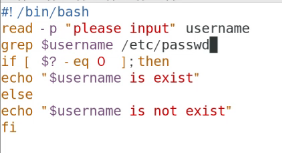
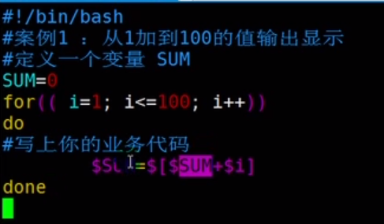
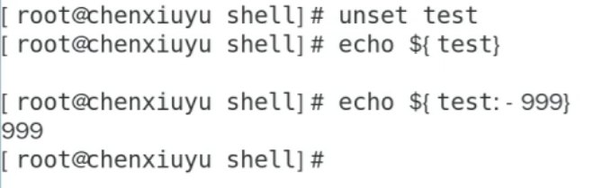

# shell脚本

该语言凭借系统自身解析编译，不需要下载编译器

```shell
#!/bin/bash              ##这是一个shell脚本   
```

### 两种执行脚本方式

```shell
source 或者 . ##在当前shell进程下执行
. first.sh                 //必须加点杠才能执行sh命令


bash 脚本    ##在新开的子bash中执行脚本
bash first.sh          //第二种方式，根据脚本定义的解析器来执行命令   无视权限

##无权限仍可以执行     ，可以得出用户在可读当前脚本时即使无执行权限仍可借由解析器间接执行

-rw-r--r--. 1 root root 37 11月 18 11:08 first.sh
-rw-r--r--. 1 root root 88 11月 18 11:17 test
[root@liyonghai shell]# bash first.sh 
 2 10 88 test
```

##### 子shell不会覆盖变量

bash执行脚本创建子shell执行脚本,所以不会更改当前的环境变量

而直接点执行会成功修改, 因为子shell只会在自己的作用域中修改变量

```shell
vim b.sh
#!/bin/bash
$name="hedley"

. b.sh  ##当前shell下执行该脚本

vim a.sh
#!/bin/bash
$name="son"

bash a.sh  ##开一个子shell执行
echo $name   ##hedley,说明没有发生覆盖更改
```


### 变量

##### 变量种类

本地变量  只能用在bash的当前进程中,会被销毁

环境变量   称为全局变量,所有的bash中都可以用,已经被持久化的变量,不会被销毁

局部变量   shell脚本中定义的变量

##### 系统变量

$HOME  $PATH   获取值加$

##### 用户自定义变量

```shell
A=100                          ##等号前后不要加空格,shell脚本中不能乱加空格
echo "A=$A"

##当我们想在复制诸如lyh 123则会报错

a="100 sjdksa"
##想要值中有空格就加双引号
```

##### 变量与字符串拼接

```shell
#!/bin/bash
name="${1}sadasdasd"
echo $name

##所以字符串拼接时就用花括号包变量,然后用双引号包整个字符串
```

##### 静态变量不能unset

```shell
readonly a=1000
echo "a=$a"
unset a                       //报错
```


##### 变量拼接字符串

```shell
name="Alice"
greeting="Hello, ${name}!"
```

##### 单引号和飘号双引号

```shell
#!/bin/bash
#a:lyh

name=lyh
echo ${name}              //输出为lyh
echo "${name}"            //输出为lyh
echo '${name}'           //输出为$name

##单引号不解析语法,飘号表示当做命令输出
```

飘号让变量可以接收命令的输出

```shell
dir=`ls`
echo $dir
bin boot data dev etc home lib lib64 lost+found media mnt opt proc root run sbin shellscript.sh 
```

双引号做参数替换防止意外

```shell
是否要加双引号取决于这个串会不会做替换
tip="a=$0"
echo "$tip"
##如果一个字符串包含空格或特殊字符（如$、*、|等）
##shell脚本本身对于命令替换和赋值单纯就是简单的字符串拼接替换,所以不加双引号容易出现意外情况

```


##### read读取输入值

```shell
read -t 10 -p "输入个值" S        #-p输入友好提示
echo "$S"						 #-t 10 表示10秒内输入,10秒接收不到直接执行程序
```

### 常用环境变量

##### 特殊状态变量

```shell
echo $?  ##输出上一命令是否执行成功  1-255执行失败  0表示执行成功
##脚本中常用来判断上一步骤是否执行成功

```

##### 个人环境变量配置文件

```shell
~/.bash_profile    ~/.bashrc  ##这些文件上配置用户特有的环境变量,当用户远程登录时会执行赋值
##所以修改后要exit退出重新登录才会生效
```

系统环境配置文件

```shell
/etc/profile   /etc/bashrc
```

##### 查询和设置环境变量

查询环境变量

set查看所有变量

```shell
name=hedley        ##定义一个临时变量
set | grep ^name    ##set包括所有变量,可以查到临时变量,持久化的环境变量
##输出name=hedley
```

env查看环境变量

```shell
env | grep PATH
PATH=/usr/local/sbin:/usr/local/bin:/usr/sbin:/usr/bin:/root/bin

export | grep PATH   ##效果一样
```


```shell
在/etc/profile下 export TOMCAT_HOME=/opt/tomcat

source /etc/profile   刷新数据重新配置

然后输出echo $TOMCAT_HOME
```

### 脚本执行

##### 脚本入参

```shell
$0 表示命令本身
$1-9 表示入参  9以后需要加花括号${10}
$# 获取参数总个数
$* $@都是获取所有参数$@接收的是一个数组
```

```shell
#!bin/bash
echo "命令本身是\$0=$0 第一个参数\$1=$1 第二个参数\$2=$2"
echo "\$*,所有参数为'$*"
echo "\$@是$@"
echo "\$#参数个数$#"  


[root@lyh share]# bash paramtest 1 2
命令本身是$0=paramtest 第一个参数$1=1 第二个参数$2=2
$*,所有参数为'1 2
$@是1 2
$#参数个数2
```

##### 运算符号


```shell
#!/bin/bash

read -p "n1:" n1
read -p "n2:" n2
sum="$(($n1+$n2))"  ##sum之前不能加空格
echo "n1+n2=$sum"

 . sum.sh
n1:1
n2:2
n1+n2=3

--例2  读取命令行第一第二个参数
#!/bin/bash

echo "$(($1+$2))"
[root@VM-4-10-centos testdir]# . sumab.sh 1 2
3

```

```shell
##赋值运算
##写法一内部赋值
echo $((i=i+1))
##外部赋值
i=$(i+1)
echo $i
##逻辑运算
echo $((8>7))  ##输出为1     false为0

((8>7&&5==5))   ##输出为1
```


### 控制语句

#### if


```shell
#必定返回真或假的情况
if[  ] #默认返回false ,两边括号内部要有空格
if[ sss ] #括号内有内容默认返回true ,两边括号内部要有空格
```

##### 条件判断式





所有括号


read -p "are you ok(yes/no)" str

```shell
if[[ $str = [Yy]es ]];then
```


##### 程序实践

```shell
#!/bin/bash
if [ $1 -ge 60 ]
then
echo "及格"
elif [ $1 -lt 60 ]   #注意elif后面也需要空格
then
echo "不及格"
fi

[root@lyh share]# bash iftest1 47
不及格
```


##### 菜单

```shell
#! /bin/bash
source luanf.sh
source guess.sh

function show(){
echo "diyi$1"

}
while true
do
echo "menu"
echo "1 add_int"
echo "2 add_users"
echo "3 guess"
echo "4 exit"
read -p "please choose" choice 
case $choice in
1)sum ;;
2)show 22 ;;
3)rand ;;
*)show 44444 ;;
esac
done
```


#### for

##### 取值运算符




##### for实践

```shell
[root@lyh share]# bash fortest.sh 1 2 55
58


#!/bin/bash

RESU=0
for i in "$@"
do
RESU=$[$RESU+$i]
done
echo $RESU
```


#批量创建用户

```shell
[root@liyonghai shell]# cat add_users.sh 
usr=`cat ./use.txt`
for i in $user
do
  useradd $i
  echo "123456"|passwd --stdin $i
  #删除 userdel -r $i
done


bash -x add_users.sh
```

cat /etc/passwd  查看创建的用户

#### while

```shell
#!/bin/bash
#从输入的参数截止0到n的和,步长为1
SUM=0
X=0
while [ $X -le $1 ]

do
SUM=$[$SUM + $X]
X=$[$X+1]
done
echo "$SUM"

#bash -x以debug模式调试程序
[root@lyh share]# bash -x  whiletest.sh 4
+ SUM=0
+ X=0
+ '[' 0 -le 4 ']'
+ SUM=0
+ X=1
+ '[' 1 -le 4 ']'
+ SUM=1
+ X=2
+ '[' 2 -le 4 ']'
+ SUM=3
+ X=3
+ '[' 3 -le 4 ']'
+ SUM=6
+ X=4
+ '[' 4 -le 4 ']'
+ SUM=10
+ X=5
+ '[' 5 -le 4 ']'
+ echo 10
10
```

##### 猜数

```shell
[root@liyonghai shell]# cat guess.sh 
#!/bin/bash

num=$((RANDOM%100))          #$[RANDOM%100]


while true
do
read -p "please write your guess number" answer
if [ $num -gt $answer ]                 #注意if和elif后面要加空格
then
echo "your num is smaller"
elif [ $num -lt $answer ]             #[[ $num < $answer ]] 采用c语言方式算 要额外加个括号
then                                #由于shell内本来就没有< >号 而是-eq -lt -gt
echo "your num is bigger"
elif [ $num -eq $answer ]
then
echo "yes";break
fi
done
```


### 函数

#### 系统函数

##### basename和dirname

```shell
basename /home/aaa/test.txt
#结果test.txt
basename /home/aaa/test.txt txt
#结果test

dirname /home/aaa/test.txt
#结果/home/aaa
```

#### 函数

输入两个数相加

```shell
bash -x funtest.sh 
read -p 请输入第一个加数 n1
请输入第一个加数4
read -p 请输入第二个加数 n2
请输入第二个加数5
+ getSum 4 5
+ SUM=9
+ echo 9
9

#!/bin/bash
read -p "请输入第一个加数" n1
read -p "请输入第二个加数" n2
function getSum(){
        SUM=$[$n1+$n2]
        echo "$SUM"
        exit 1       ##给函数一个退出码
}


getSum $n1 $n2
```

##### 函数调用

```shell
#! /bin/bash
function sum(){    #在脚本文件外加个function就可以变为函数

 n=0
 for((i=0;i<=100;i++))
 do
  let n+=$i

 done
 echo "$n"
}
sum                             #函数调用


#通过source 另一个文件调用luan.sh的sum函数
yonghai shell]# cat menu.sh 
source luanf.sh
sum

```

##### 脚本参数和函数参数

```shell
[root@liyonghai shell]# cat hh.sh 
function show(){
echo "diyi$1"


}

case $1 in 
1) show h1;;
2) show h2;;
*) show h3;;
esac


[root@liyonghai shell]# bash hh.sh 1
diyih1
[root@liyonghai shell]# bash hh.sh 4
diyih3
[root@liyonghai shell]# bash hh.sh 455
diyih3
```

### 三剑客

#### 正则表达式

##### ^行首定位符

```shell
^ ##行首定位符

##把以sum开头的文件找出来
ls | grep ^sum    
输出:
sumab.sh
sum.sh

##把文件内容中的以ec开头的行输出出来
cat forelem.sh | grep ^ec
输出:
echo $0_$1_$2
echo $*
echo $@ 
```

##### $行尾定位符

```shell
$ ##行尾定位符

##把文件内容中以句号结尾的内容输出出来
cat end.txt | grep 群星。$
输出:
当因为错过太阳而哭泣时,你也会错过群星。

##把以txt结尾的文件都输出出来
ls | grep txt$
输出:
a.txt
blank.txt
```

##### .通配符匹配任意单个字符

```shell
grep a.c a.txt
输出
abc
adc
```

##### *匹配0-n个符合数量控制

```shell
*
cat a.txt | grep abc*    ## 在这里*让c能出现0-任意多次   在这里*不是占位符,而是×[0,n]
输出
ab   ##注意:ab也会被匹配,因为前导字母c的出现次数是0到任意多
abc

##区分*在正则中和在普通环境中的占位符的区别
*在一般情况下是占位符,表示0到任意多个字符
但在正则中则是对前导字符进行数量匹配
```

扩展

> 点和星可以组合起来 以点为前导,星为数量  -->就能表示任意多个字符

```shell
 ls | grep ".*"  
a.txt
b.txt
c.txt
```

##### []字符条件匹配

> 比如你不确定是hedley还是hadley,你就可以将那个不确定的位置用单字符条件匹配
>
> 匹配[ ]中包含的任一字符

```shell
[root@VM-4-10-centos testdir]# cat aaa.txt 
love
Love
iove
|ove
1ove
ove

[root@VM-4-10-centos testdir]# grep  "[Ll]ove" aaa.txt 
love      ##在方括号中输入那个你想匹配的字符
Love
```

扩展

> ^在[ ]中表示取反,匹配不在条件内的字符

```shell
grep "[^Ll]ove" aaa.txt
iove
|ove
1ove
```

> [ - ]单字符用杠匹配连续条件内的范围   比如[0-9]   [a-z]  

```shell
[root@VM-4-10-centos testdir]# grep "[a-k]ove" aaa.txt 
iove
```

##### \脱意符

> 由于上面的那些 匹配符 比较特殊,所以为了让那些匹配符失效就有了脱意符 \

```shell
grep "l\.ve" b.txt
l.ve

grep "l.ve" b.txt
love
l.ve
```

##### {}字符出现次数区间匹配

```shell
x{n} ##x出现n次
x{n,m}  ##x出现n到m次
x{n,}  ##x初心n到无数次匹配

因为花括号在shell中有特殊含义,所以要加转义符
x\{n\}
x\{n,m\}
x\{n,\}


[root@VM-4-10-centos testdir]# grep "a\{3,4\}" bbb.txt 
aaaa.txt
aaaaaa.txt
```

##### <>词首词尾定位符

```shell
\<     ##词首定位符   每一行有一个单词符合就行,不是每一行第一个单词符合条件   
\>  ##词尾定位符

##这两个符号需要转义

grep "\<love" 1.txt
love is sosadas 
aaa love is sadsa
dog love cat
```

##### 其他

括号匹配没学会

| \d   | 匹配一个数字字符                   |
| ---- | ---------------------------------- |
| \D   | 匹配一个非数字字符。等价于[^0-9]。 |
| \s   | 空白符                             |
| \S   | 非空白符                           |

#### 扩展正则

##### +匹配1-n个符合数量控制

```shell
[root@VM-4-10-centos testdir]# egrep "a+.txt" bbb.txt 
aaaa.txt
oaa.txt
aaaaaa.txt
```

##### ?匹配0-1个符合数量控制

```shell
[root@VM-4-10-centos testdir]# egrep "lo?ve" aaa.txt 
love
lve
```

##### ()多字符串的或匹配

>(aa|bb)

```shell
egrep "love(able|tion)" a.txt
loveable
lovetion
```

#### 练习

```shell
/.*/   匹配任意数量任意字符
/^$/   匹配空行
/^[A-Z]..$/  匹配大写字母开头后面任意两个字符
/^[A-Z][a-z]*3[0-5]/  匹配以大写字母开头然后0到任意多个小写字母,然后以3为十位数,任意数字为个位数
/[a-z]*\./      任意多个字母后面跟.
/^[A-Za-z]*[^,][A-Za-z]*$/以大小写字母开头和结尾,中间不包括逗号
/\<java\>/ 查找含有一个词,这个词是java的行,注意是词,不是只包含就显示了,比如javable不会匹配的
/\<j.[*]ble\>/
/5{2}3{2,3}\./  5出现两次,3出现2到3次后面跟个点
/^[ \t]*$/  匹配开头任意多个空格或者制表符,结尾也是,所以匹配的是连续的空格或制表符串

vim模式下编辑
## 1-$ 表示从当前文件的第一行到最后一行  s表示替换
##/前表达式/后表达式/
##前表达式的括号对应后表达式的\1,同理如果两个括号,第二个括号对应后表达式的\2
括号前需要加\  因为和某些规则冲突了

:1,$ s/\([oO]ccur\)ence/\1rence/     ##将occurence换成occurrence
:1,$ s/\(one\) and \(two\)/\2 and \1/   ##将one和two换位置

```

#### grep

```shell
grep
egrep  ##支持扩展正则
fgrep  ##不需要考虑符号转义
```

> grep -v 取反

```shell
$ ls | grep .png
Pasted image 20231005221011.png
Pasted image 20231006002349.png
Pasted image 20231006004643.png
Pasted image 20231006214403.png

HUAWEI@DESKTOP-K5DG4PL MINGW64 /d/net (master)
$ ls | grep .png | grep -v 11
Pasted image 20231006002349.png
Pasted image 20231006004643.png
Pasted image 20231006214403.png
```

>对文件夹进行grep递归查找内容

```shell
$ grep -R linux linux-rche/

linux-rche/servera第一天.md:##### 调试selinux
linux-rche/servera第一天.md:什么是selinux?
linux-rche/servera第一天.md:linux的安全模块,对于端口,文件定义哪些进程可以执行操作,哪些端口,文件可以被访问
linux-rche/命令.md:# linux文件管理
linux-rche/命令.md:# linux基本命令
linux-rche/命令.md:linux中的所有命令相当于可执行文件,你可以这样理解:在linux中软件,二进制可执行文件,一行命令
linux-rche/命令.md:# linux磁盘管理
linux-rche/命令.md:各种linux内核,linux启动boot引导程序,用户个人文件都是需要挂载到linux的目录上的

```

````shell
当然可以！Shell脚本是一种用来编写命令行任务的脚本语言，非常适合处理文件和系统操作。您可以使用Shell脚本来自动化各种重复性的任务，包括文件操作、进程管理、定时任务等。

在Shell脚本中，反斜杠 `\` 通常用于转义字符。它可以将特殊字符转换为普通字符，例如将换行符转义为`\n`，将制表符转义为`\t`等。此外，还可以使用反斜杠将长命令行拆分为多行，方便阅读和维护。

以下是一个简单的示例，展示了如何使用Shell脚本自动执行一系列Git操作：

```shell
#!/bin/bash

# 设置仓库路径和消息
repository_path="/path/to/repository"
commit_message="Daily commit"

# 切换到仓库目录
cd $repository_path

# 添加所有修改的文件
git add .

# 提交更改
git commit -m "$commit_message"

# 推送到远程仓库
git push origin master

# 输出完成消息
echo "Daily commit completed."
```

以上脚本会进入到指定的仓库路径，自动添加所有修改的文件，并将更改提交到本地仓库和远程仓库。

您可以根据需要修改脚本中的仓库路径和提交消息。另外，如果您希望定期执行该脚本，可以将其添加到定时任务中（例如使用`crontab`命令）。

希望这个例子能够帮助您开始编写自己的Shell脚本！如有任何问题，请随时提问。
````


###   参数获取

#!/bin/bash

echo $0
echo $1
echo $2
echo $#
echo $@

[root@liyonghai shell]# ./lll.sh  1 2 3 4
./lll.sh
1
2
4
1 2 3 4


#### 多参数循环取出

#!/bin/bash
for i in $@
do
ls -l $i
done

结果：

[root@liyonghai shell]# ./loop.sh lll.sh ll.sh
-rwxr-xr-x. 1 root root 53 11月 23 16:34 lll.sh
-rwxrwxrwx. 1 root root 28 11月 23 16:45 ll.sh

## 变量替换


unset 将test变量的值清空

若空则输出999




冒号减：若变量为空  则用后面值替换  本值为null

冒号=：变量为空 后面值替换 本值被替换

冒号加：若变量有值 则用后面值替换


