# linux上线项目

### 环境安装

#### rpm安装jdk

下载地址:https://www.oracle.com/java/technologies/downloads/#java8


```shell
java -version #查看是否安装

rpm -qa|grep jdk #搜索检测jdk版本信息(用来获取要删除jdk版本信息)
rpm -e --nodeps jdk-8ussssss.rpm  #写在rpm

rpm -ivh jdk-8usssssss.rpm

```

安装后进入usr/java/jdk1.8

查看到bin文件

所以将 到jdk1.8的路径设置为环境变量

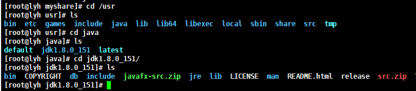


##### 配置<span style='background:green;'>环境变量</span>

```shell
vim /etc/profile
```

```properties
#在文件最后加上

#根路径
export JAVA_HOME=/usr/java/jdk1.8.0_271-amd64
export JRE_HOME=${JAVA_HOME}/jre
#CLASSPATH类路径 是 运行所需要的库文件(jar包/lib包)
export CLASSPATH=.:${JAVA_HOME}/lib:${JRE_HOME}/lib
#PATH是环境变量路径(win可以看出path一般都指向bin文件) 
export PATH=${JAVA_HOME}/bin:$PATH
 
source /etc/profile 
```

##### 对于classpath的理解

类路径告诉JDK工具和应用程序在哪里可以找到第三方和用户定义的类 - 即不是Java 扩展或Java平台的一部分的类。类路径需要找到你用javac编译器编译的任何类——其默认值是当前目录，以方便地找到这些类。         相当于坐标上的0.0点参考系(src)

这个classpath和刚才配的不是一个概念

#### tomcat安装

war包要放到tomcat下运行

```shell
tar -zxvf apache-tomcat-9.0.55.tar.gz
```

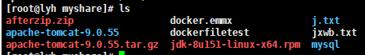

这个蓝色的目录就是解压后的文件

```shell
#进入到tomcat 然后启动bin下面的startup.sh

cd apache-tomcat-9.0.55/bin

./starup.sh
```

##### 修改server.xml

使得访问时不需要输入8080

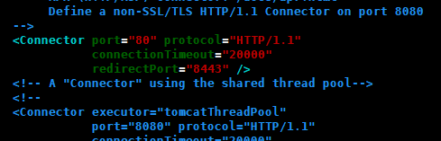

```shell
#注意qr不要加war
<Context docBase="/usr/local/tomcat/webapps/qr" path="" reloadable="false"/> 
```


##### 防火墙

把防火墙给禁用就显得捞了

建议先listports开哪些端口被打开了,若8080没开

使用开端口命令将8080端口开放,然后重启防火墙

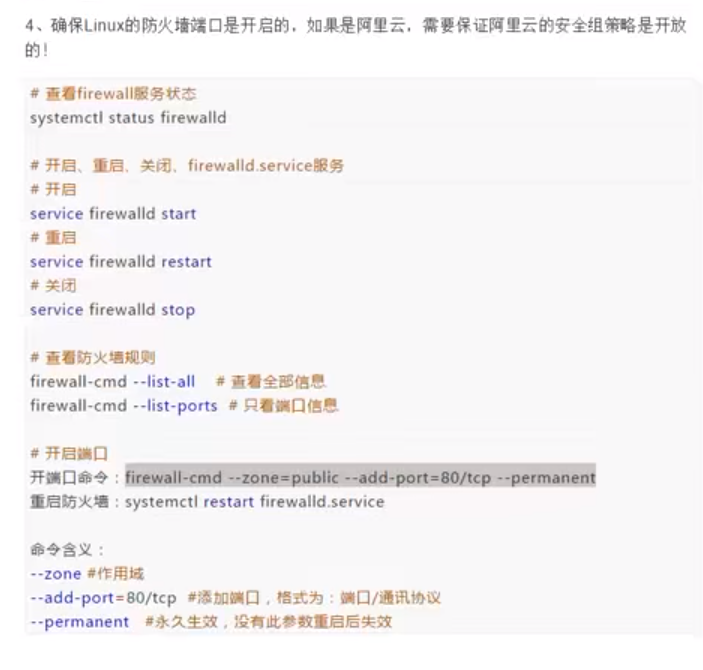

```xml
<Context docBase="/usr/local/tomcat/***/webapps/项目名" path="" reloadable="false"/>

/usr/local/tomcat8/webapps/qr.war
```


##### 导出sql文件

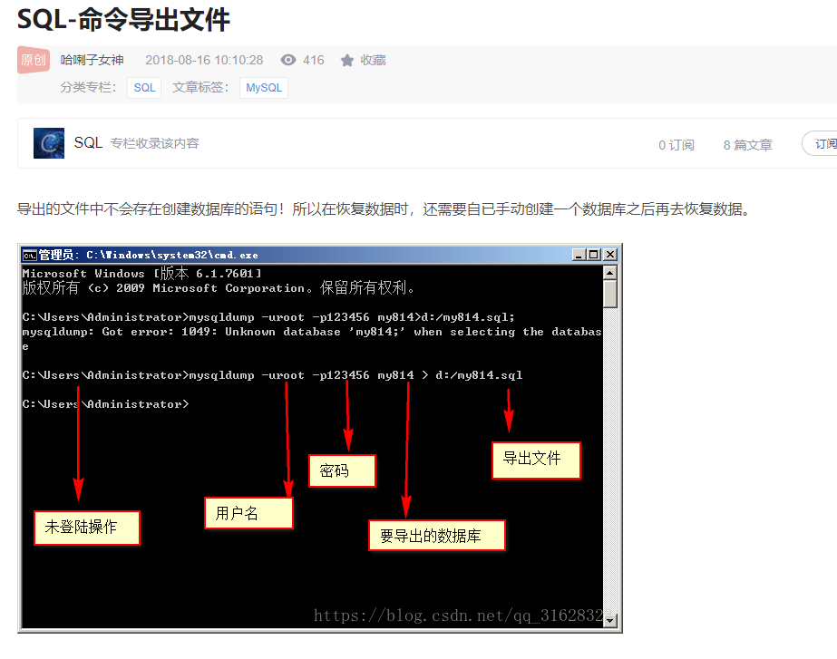

##### 导入sql数据

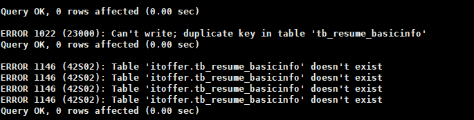

```sql
create database itoffer
向数据库itoffer中导入数据,由于导出的是库的sql,所以不需要建表,直接导入
mysql> use itoffer;

mysql> source /myshare/itoffer2.sql
```

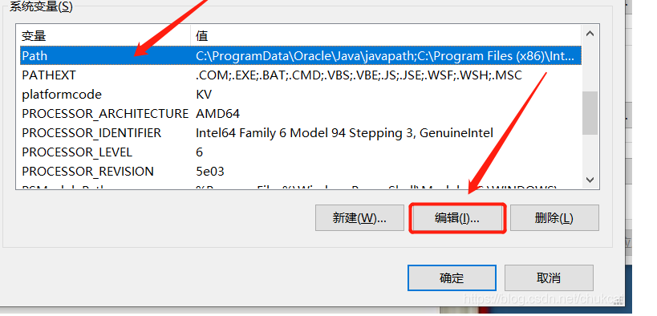

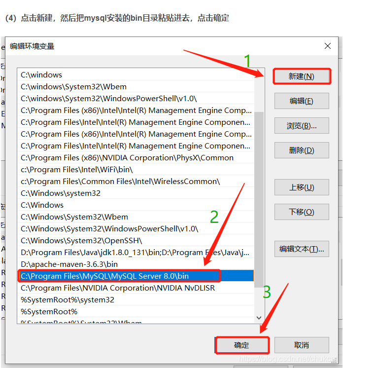

##### idea导出war包

```xml-dtd
<packaging>war</packaging>      #设置导出方式

<build>                        
        <plugins>
            <!--加上此代码即可-->
            <plugin>
                <groupId>org.apache.maven.plugins</groupId>
                <artifactId>maven-war-plugin</artifactId>
                <version>3.0.0</version>
                <configuration>
                    <webResources>
                        <resource>
                            <directory>Web</directory>                #指定web
                        </resource>
                    </webResources>
                </configuration>
            </plugin>
        </plugins>
    </build>
```

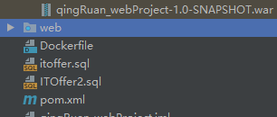

项目识别不到web时,这个web文件上的蓝点就会消失

### rpm/tar和yum安装的区别

### 安装mysql

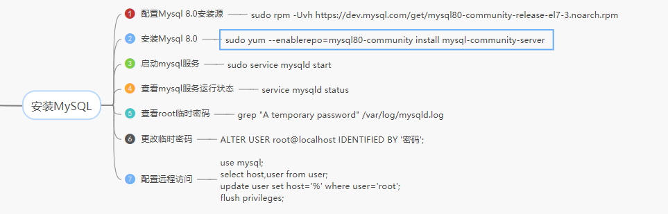

##### **安装必要的组件**

```
yum install –y autoconf automake imake libxml2-devel expat-devel cmake gcc gcc-c++ libaio libaio-devel bzr bison libtool ncurses5-devel
```

##### **下载mysql**

```
wget https://dev.mysql.com//Downloads/MySQL-5.7/mysql-5.7.11-linux-glibc2.5-x86_64.tar.gz
```

##### **将安装包拷贝到/usr/local目录下并且解压**

```
tar -xzvf mysql-5.7.11-linux-glibc2.5-x86_64.tar.gz
```

**为了方便可以给文件夹改名字**

```
mv mysql-5.7.11-linux-glibc2.5-x86_64 mysql
```


一下是跟着hsp的

libaio、net-tools、perl

3、 yum -y install libaio

4、yum install numactl*

这几个包按上就可以下载rpm文件

```shell
下载对应网址的tar包
wget https://dev.mysql.com/get/mysql-5.7.26-1.el7.x86_64.rpm-bundle.tar

tar -xvf mysql-5.7.26-1.el7.x86_64.rpm-bundle.tar

 rpm -ivh mysql-community-common-5.7.26-1.el7.x86_64.rpm
 rpm -ivh mysql-community-libs-5.7.26-1.el7.x86_64.rpm
 rpm -ivh mysql-community-client-5.7.26-1.el7.x86_64.rpm
 rpm -ivh mysql-community-server-5.7.26-1.el7.x86_64.rpm 
 
 
启动mysql
systemctl start mysqld.service
查看随机生成的密码
grep "password" /var/log/mysqld.log
登录
mysql -u root -p
粘贴密码
取消设置密码保护提示策略
set global validate_password_policy=0
设置密码
set password for 'root'@'localhost'=password('1377');
刷新一下
flush privileges
退出
exit/quit
```


### tomcat错误排查

```shell
#查找异常的前后5行 
cat catalina.out | grep -C 5 Exception    
```

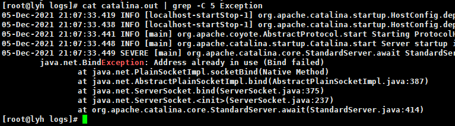

### 解决端口占用

```shell
netstat -nltp | grep 8080
tcp6     0     0 :::8080        :::*           LISTEN      32854/java 
#杀对应id的进程
kill 32854
```


https://blog.csdn.net/weixin_43975277/article/details/113786489?ops_request_misc=&request_id=&biz_id=102&utm_term=JasperException:%20The%20absolute%20&utm_medium=distribute.pc_search_result.none-task-blog-2~all~sobaiduweb~default-0-113786489.pc_search_es_clickV2&spm=1018.2226.3001.4187

