# shell脚本

该语言凭借系统自身解析编译，不需要下载编译器

管道|

who|wc   统计使用人数

/>覆盖 

输入重定向<      <<


> #/bin/bash                         


这是一个shell脚本

### 编译方式      #!/bin/bash                 

#a:lyh

who>test                        //相对于当前文件下的test
wc test


### 两种执行方式

#### ./first.sh                 //执行sh命令

#### bash first.sh          //第二种方式，根据脚本定义的解析器来执行命令   无视权限

无权限仍可以执行     ，可以得出用户在可读当前脚本时即使无执行权限仍可借由解析器间接执行

-rw-r--r--. 1 root root 37 11月 18 11:08 first.sh
-rw-r--r--. 1 root root 88 11月 18 11:17 test
[root@liyonghai shell]# bash first.sh 
 2 10 88 test


### 变量

##### 系统变量

$HOME  $PATH   获取值加$

##### 普通变量

A=100                          等号前后不要加空格

echo "A=$A"

##### 静态变量不能unset

readonly a=1000

echo "a=$a"

unset a                       //报错


##### vim在普通模式下    dd删除一整行

##### yy复制当前行     p粘贴


#!/bin/bash
#a:lyh

name=lyh
echo $name              //输出为lyh
echo "$name"         //输出为lyh
echo '$name'           //输出为$name

结论：双引号和无符号被当做正常输出

单引号表示字符串

飘号表示当做命令输出

注意：弱类型一律视为字符


#!/bin/bash
echo "pleeeeee"             
read year                    //输入
echo $year              //输出变量
         

##### 设置环境变量

在/etc/profile下 export TOMCAT_HOME=/opt/tomcat

source /etc/profile   刷新数据重新配置

然后输出echo $TOMCAT_HOME

##### 位置参数

```shell
#!bin/bash
echo "命令本身是\$0=$0 第一个参数\$1=$1 第二个参数\$2=$2"
echo "\$*,所有参数为'$*"
echo "\$@是$@"
echo "\$#参数个数$#"  


[root@lyh share]# bash paramtest 1 2
命令本身是$0=paramtest 第一个参数$1=1 第二个参数$2=2
$*,所有参数为'1 2
$@是1 2
$#参数个数2
```

##### 预定义变量

```shell
#!bin/bash
echo "当前运行进程id为$$"
/share/myshell.sh &             随便后台启动一个程序
echo "最近一个后台方式运行的进程id为$!"
echo "当前运行进程结果为$?,为0则执行成功"
```

##### read读取输入值

```shell
read -t 10 -p "输入个值" S        #-p输入友好提示
echo "$S"						 #-t 10 表示10秒内输入,10秒接收不到直接执行程序
```


### 控制语句

#### if

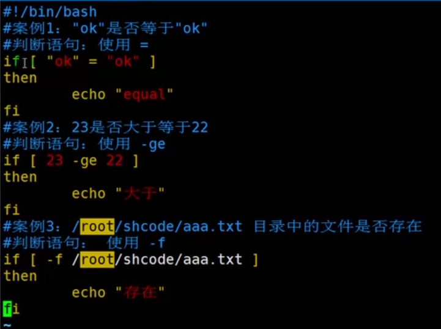

```shell
#必定返回真或假的情况
if[  ] #默认返回false ,两边括号内部要有空格
if[ sss ] #括号内有内容默认返回true ,两边括号内部要有空格
```

##### 条件判断式

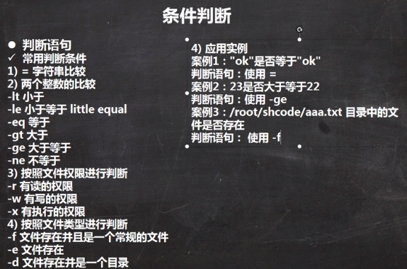


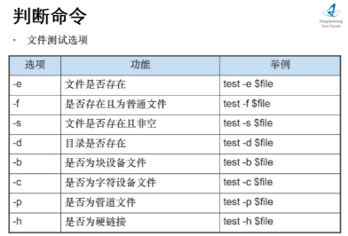


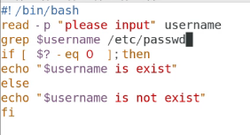


所有括号

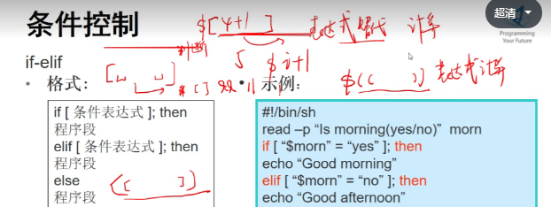

read -p "are you ok(yes/no)" str

```shell
if[[ $str = [Yy]es ]];then
```


##### 程序实践

```shell
#!/bin/bash
if [ $1 -ge 60 ]
then
echo "及格"
elif [ $1 -lt 60 ]   #注意elif后面也需要空格
then
echo "不及格"
fi

[root@lyh share]# bash iftest1 47
不及格
```


##### 菜单

```shell
#! /bin/bash
source luanf.sh
source guess.sh

function show(){
echo "diyi$1"

}
while true
do
echo "menu"
echo "1 add_int"
echo "2 add_users"
echo "3 guess"
echo "4 exit"
read -p "please choose" choice 
case $choice in
1)sum ;;
2)show 22 ;;
3)rand ;;
*)show 44444 ;;
esac
done
```


#### for

##### 取值运算符

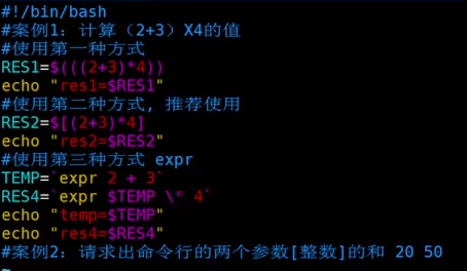

推荐第二种


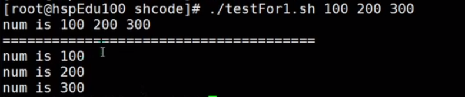

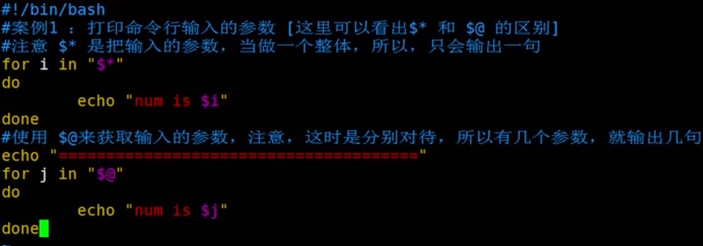

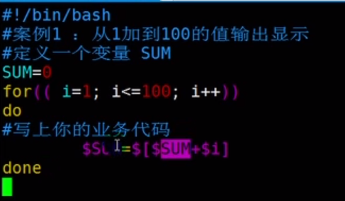

##### for实践

```shell
[root@lyh share]# bash fortest.sh 1 2 55
58


#!/bin/bash

RESU=0
for i in "$@"
do
RESU=$[$RESU+$i]
done
echo $RESU
```


#批量创建用户

```shell
[root@liyonghai shell]# cat add_users.sh 
usr=`cat ./use.txt`
for i in $user
do
  useradd $i
  echo "123456"|passwd --stdin $i
  #删除 userdel -r $i
done


bash -x add_users.sh
```

cat /etc/passwd  查看创建的用户

#### while

```shell
#!/bin/bash
#从输入的参数截止0到n的和,步长为1
SUM=0
X=0
while [ $X -le $1 ]

do
SUM=$[$SUM + $X]
X=$[$X+1]
done
echo "$SUM"

#bash -x以debug模式调试程序
[root@lyh share]# bash -x  whiletest.sh 4
+ SUM=0
+ X=0
+ '[' 0 -le 4 ']'
+ SUM=0
+ X=1
+ '[' 1 -le 4 ']'
+ SUM=1
+ X=2
+ '[' 2 -le 4 ']'
+ SUM=3
+ X=3
+ '[' 3 -le 4 ']'
+ SUM=6
+ X=4
+ '[' 4 -le 4 ']'
+ SUM=10
+ X=5
+ '[' 5 -le 4 ']'
+ echo 10
10
```

##### 猜数

```shell
[root@liyonghai shell]# cat guess.sh 
#!/bin/bash

num=$((RANDOM%100))          #$[RANDOM%100]


while true
do
read -p "please write your guess number" answer
if [ $num -gt $answer ]                 #注意if和elif后面要加空格
then
echo "your num is smaller"
elif [ $num -lt $answer ]             #[[ $num < $answer ]] 采用c语言方式算 要额外加个括号
then                                #由于shell内本来就没有< >号 而是-eq -lt -gt
echo "your num is bigger"
elif [ $num -eq $answer ]
then
echo "yes";break
fi
done
```


### 函数

#### 系统函数

##### basename和dirname

```shell
basename /home/aaa/test.txt
#结果test.txt
basename /home/aaa/test.txt txt
#结果test

dirname /home/aaa/test.txt
#结果/home/aaa
```

#### 函数


输入两个数相加

```shell
[root@lyh share]# bash -x funtest.sh 
+ read -p 请输入第一个加数 n1
请输入第一个加数4
+ read -p 请输入第二个加数 n2
请输入第二个加数5
+ getSum 4 5
+ SUM=9
+ echo 9
9

#!/bin/bash

function getSum(){

        SUM=$[$n1+$n2]
        echo "$SUM"

}

read -p "请输入第一个加数" n1
read -p "请输入第二个加数" n2

getSum $n1 $n2
```

##### 函数调用

```shell
#! /bin/bash
function sum(){    #在脚本文件外加个function就可以变为函数

 n=0
 for((i=0;i<=100;i++))
 do
  let n+=$i

 done
 echo "$n"
}
sum                             #函数调用


#通过source 另一个文件调用luan.sh的sum函数
yonghai shell]# cat menu.sh 
source luanf.sh
sum

```

##### 脚本参数和函数参数

```shell
[root@liyonghai shell]# cat hh.sh 
function show(){
echo "diyi$1"


}

case $1 in 
1) show h1;;
2) show h2;;
*) show h3;;
esac


[root@liyonghai shell]# bash hh.sh 1
diyih1
[root@liyonghai shell]# bash hh.sh 4
diyih3
[root@liyonghai shell]# bash hh.sh 455
diyih3
```


###   参数获取

#!/bin/bash

echo $0
echo $1
echo $2
echo $#
echo $@

[root@liyonghai shell]# ./lll.sh  1 2 3 4
./lll.sh
1
2
4
1 2 3 4

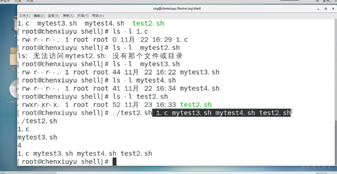


#### 多参数循环取出

#!/bin/bash
for i in $@
do
ls -l $i
done

结果：

[root@liyonghai shell]# ./loop.sh lll.sh ll.sh
-rwxr-xr-x. 1 root root 53 11月 23 16:34 lll.sh
-rwxrwxrwx. 1 root root 28 11月 23 16:45 ll.sh

## 变量替换

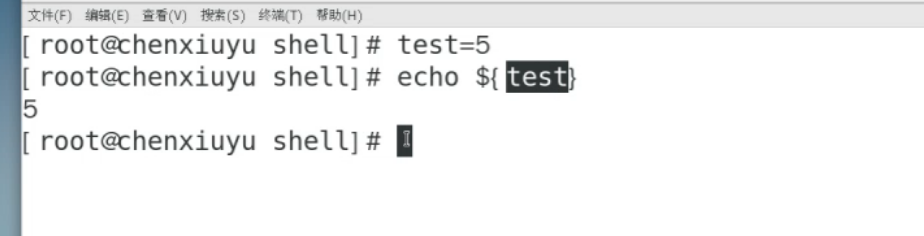

unset 将test变量的值清空

若空则输出999

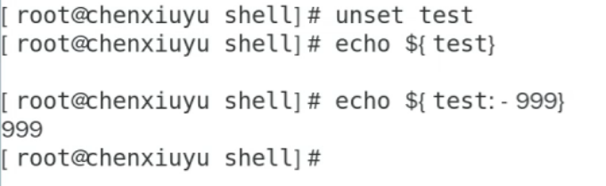


冒号减：若变量为空  则用后面值替换  本值为null

冒号=：变量为空 后面值替换 本值被替换

冒号加：若变量有值 则用后面值替换

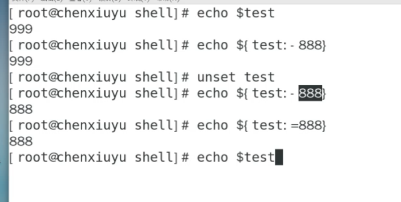

