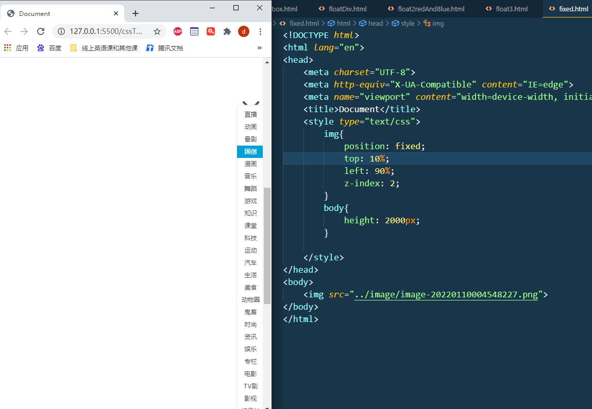

# htmlAndCss


##### 盒模型

[超链接](https://blog.csdn.net/fdsfasf/article/details/104466911?ops_request_misc=%257B%2522request%255Fid%2522%253A%2522164143527716780264057315%2522%252C%2522scm%2522%253A%252220140713.130102334..%2522%257D&request_id=164143527716780264057315&biz_id=0&utm_medium=distribute.pc_search_result.none-task-blog-2~all~top_click~default-2-104466911.pc_search_em_sort&utm_term=%E7%9B%92%E6%A8%A1%E5%9E%8B&spm=1018.2226.3001.4187)


```javascript
<!DOCTYPE html>
<html lang="en">
<head>
    <meta charset="UTF-8">
    <meta http-equiv="X-UA-Compatible" content="IE=edge">
    <meta name="viewport" content="width=device-width, initial-scale=1.0">
    <title>Document</title>
    <style type="text/css">
        #big{
            border-width: 1px;
            width: 430px;
            height: 430px;
            background-color:blue;
            /* padding: 10px 10px 10px 10px; */
        }
        .little1{
            background-color: red;
            width: 120px;
            height: 120px;
            margin: 10px 0 0 10px;
            float: left;
            padding: 40px 40px 40px 40px;
            
        }
        #ll1{
            background-color:gray;
            width: 120px;
            height: 120px;

        }
    </style>
</head>
<body>
    <div id="big">
        <div class="little1">
            <div id="ll1"></div>
        </div>
        <div class="little1"></div>
        <div class="little1"></div>
        <div class="little1"></div>
    </div>
</body>
</html>
```

> 无论是padding还是margin  设置它们的大小均会扩张整个盒子的大小      ,当然border也额外占空间
> 所以在设计大盒子之初就要考虑各个间隙尺寸
> 给大盒子内部的小盒子加margin尚且还能直接将小盒子设置小点,防止小盒子超过预期尺寸
> 但设置大盒子的padding就比较复杂了,可能会直接将大盒子扩大


##### 超链接

取消超链接跳转页面, 

1.  在响应函数中return false
2. href ="Javascript:;"


##### input标签

value即是输入的值


### css

#### css属性

[css所有属性](https://blog.csdn.net/qq_37160320/article/details/77484240?ops_request_misc=%7B%22request_id%22%3A%22164143479116780255261450%22%2C%22scm%22%3A%2220140713.130102334..%22%7D&request_id=164143479116780255261450&biz_id=0&utm_medium=distribute.pc_search_result.none-task-blog-2~all~sobaiduend~default-1-77484240.pc_search_em_sort&utm_term=css%E6%89%80%E6%9C%89%E5%B1%9E%E6%80%A7&spm=1018.2226.3001.4187)

#### 布局

##### float

> <font color=#FFCCCC style=" font-weight:bold;">浮动</font>可以设置元素，会使得元素跳出正常的文档流，向右或者向左，靠近父元素的边缘或者是设置了浮动的其他的元素的边缘靠拢。
>
> <font color=#FFCCCC style=" font-weight:bold;">何为跳出文档流</font>?  =>也就是说当设置了float的元素后面还有元素时，其他元素会无视它所占据了的区域(一整行)，直接在它身下布局。(不是在下一行布局,而是把他当前位置都占掉了, 就如同飞升上天一样漂浮在文档流的上方,此时就是脱离了正常文档流)    这个标签脱离了文档流的管理,这个标签在原文档流中**所占的空间也被清除了**。
>
> inline-block和float相互矛盾,可相互覆盖
> 虽然有时inline-block和float达到的效果类似,但本质不同
> 浮动元素会脱离文档流,而inline-block则只是修改了元素的块级或内联属性,本质还是在正常文档流内,因此设置inline-block不需要清除浮动。


```html
<head>
    <style type="text/css">
        .d1{
            background-color:royalblue;
            width: 200px;
            height: 200px;
            float: left;
            margin-top:10px;
            margin-left: 10px;
        }
        .d2{
            background-color:rgb(34, 40, 56);
            width: 200px;
            height: 200px;
            /* float: left; */
            margin-top:30px;
            margin-left: 10px;
        }
    </style>
</head>
<body>
    <div class="d1"></div>
    <div class="d1"></div>
    <div class="d1"></div>

    <div class="d2"></div>
    <div class="d2"></div>
    <div class="d2"></div>
</body>
```


##### 文字会考虑浮动元素的存在

> 蓝框占据了红框位置,但蓝框中的字识别到了红框


```html
<head>
	<style>  
        .first {  
            width: 200px;  
            height: 200px;  
            border: 1px solid red;  
            float: left;  
        }  
        .second {  
            width: 300px;  
            height: 150px;  
            border: 3px solid blue;  
        }  
    </style>  
</head>  
  
<body>  
  
<div class="first">123</div>  
<div class="second">456</div>  
  
</body>  
 
```


##### 高度坍塌问题


> 在页面中设置一个盒子box，其中在嵌套一个子元素小盒子box1。box设置边框宽度，而高度不去设置**（**高度会由内容撑开**）
>
> 但是当我们向盒子里面添加内容的时候<div class="box1">a</div>,就可以发现父元素被撑开了。
>
> 在文档流定位中**，**父元素的高度默认是被子元素撑开的高度。即子元素的高度就是父元素的高度。
>
> **当为父元素中的子元素设置了向浮动时。**比如说为box1设置向左浮动。就会发现子元素的位置没变，但是父元素box发生了高度坍塌。
>
> **得出结论**：**当为子元素设置浮动的时候，子元素就会完全脱离文档流，此时将会导致子元素无法撑开父元素，导致父元素的高度塌陷**。


[解决方案链接-博客园](https://www.cnblogs.com/nyw1983/p/11374405.html)


##### overflow

当子元素高度大于父元素,子元素会超出父元素

 


此时在父元素中设置overflow-hidden 会将超出的子元素隐藏起来
设置overflow-auto父元素会出现滚动条,可以下滑看多余的子元素部分


#### 定位


##### 分层z-index

> z-index是针对网页显示中的一个特殊**属性**。因为显示器是显示的图案是一个二维平面，拥有x轴和y轴来表示位置属性。为了表示三维立体的概念如显示元素的上下层的叠加顺序引入了z-index属性来表示z轴的区别。**表示一个元素在叠加顺序上的上下关系**。
>
> z-index属性适用于定位元素（position属性值为 relative 或 absolute 或 fixed的对象）
> z-index值较大的元素将叠加在z-index值较小的元素之上


##### 相对定位relative

> 相对定位元素不可层叠，依据left、right、top、bottom等属性**在正常文档流中偏移自身位置,但其空间不会被其他元素占据**。


```javascript
<head>
  <style type="text/css">
    .box {
      background: red;
      width: 100px;
      height: 100px;
      float: left;
      margin: 5px;
    }
    .two {
      position: relative;
      top: 50px;
      left: 50px;
    }
  </style>
</head>
<body>
  <div class="box">One</div>
  <div class="box two">Two</div>
  <div class="box">Three</div>
  <div class="box">Four</div>

  <div class="box">One</div>
  <div class="box">Two</div>
  <div class="box">Three</div>
  <div class="box">Four</div>
  <div class="box">Four</div>
  <div class="box">Four</div>
  <div class="box">Four</div>
</body>
```


##### 绝对定位absolute

> 相对于第一个position不是static的父级元素定位，当父级元素的position全是static的时候，absolute是相对于html来进行定位
> 使用left、right、top、bottom等属性相对于其最接近的一个最有定位设置的父级元素进行绝对定位


##### 相对定位与绝对定位区别

> 左边是position: absolute;	右边是position: relative;
>
> 相对定位与绝对定位区别:
>
> 绝对定位好像把不同元素安排到了一栋楼的不同楼层(除首层，文本流放在首层)，它们之间互不影响；相对定位元素在首层，与文本流一起存放，它们之间互相影响。
>
> 被设置了绝对定位的元素，在文档流中是不占据空间的，如果某元素设置了绝对定位，那么它在文档流中的位置会被删除，它浮了起来，其实设置了相对定位也会让元素浮起来，但它们的不同点在于，<font color=#FF6666 size=3>**相对定位不会删除它本身在文档流中占据的空间**</font>，其他元素不可以占据该空间，而绝对定位则会删除掉该元素在文档流中的位置，使其完全从文档流中抽了出来，其他元素可以占据其空间，可以通过z-index来设置它们的堆叠顺序 。

<span></span> <span></span>   


```html
<html>
	<head>
		<meta charset="UTF-8">
		<style type="text/css">
			.wrapper{
				height:100px;
				width:100px;
				border:1px solid black;
				background-color: gold;
				line-height: 100px;
				text-align: center;
			}
			.wrapper_out{
				height:100px;
				width:100px;
				background-color: purple;
				color: white;
				position: absolute;								//设置float/absolute/fixed/会使该元素脱离普通文档流
                /* position: relative; */
			}
</style>
	</head>
	<body>
		<div class="wrapper">div1</div>
		<div class="wrapper wrapper_out">div2</div>			<!--使第二个div图例文档流-->
		<div class="wrapper">div3</div>
		<div class="wrapper">div4</div>
	</body>
</html>
```


##### fixed

> 完全脱离文档流，相对于浏览器窗口进行定位。（相对于浏览器窗口就是相对于html）



```html
<head>
	<style type="text/css">
        img{
            position: fixed;
            top: 10%;
            left: 90%;
            z-index: 2;
        }
        body{
            height: 2000px;
        }

    </style>
</head>
<body>
    
</body>
</html>
```


#### 块级元素和行内元素

display属性

> 每一个元素都有默认的display属性值，比如div元素，它的**默认display属性值为“block”**，成为“块级”元素(block-level)；而span元素的默认**display属性值为“inline”**，称为“行内”元素。

> 块级元素：占据一定矩形空间，可以通过设置高度、宽度、内外边距等属性，来调整的这个矩形；
> 行内元素 ：自己的独立空间，它是依附于其他块级元素存在的，因此，<font color=#99CCFF size=3>**对行内元素设置高度、宽度、内外边距等属性，都是无效的**</font>


块状元素也可以通过代码display:inline将元素设置为内联元素。如下代码就是将块状元素div转换为内联元素，从而使div元素具有内联元素特点。
这样div一行就也可以有多个

```css
div{

     display:inline;

}
```


内联元素display:inline特点：

1、和其他元素都在一行上

2、**元素的高度、宽度及顶部和底部边距不可设置**

3、**元素的宽度就是它包含的文字或图片的宽度，不可改变。**


块级元素display:block的特点：

1、block元素会独占一行，多个block元素会各自新起一行。默认情况下，block元素宽度自动填满其父元素宽度。

2、block元素可以设置width,height属性。块级元素即使设置了宽度,仍然是独占一行。

3、block元素可以设置margin和padding属性。


##### inline-block

> 当我们既要设置高度宽度(块级元素特点),又不想换行时(内联元素特点)  使用

```html
<head>
	 <style>
		 span{
			background-color:#43be60;
			width:100px;
			height:50px;
			margin-top:20px;
			margin-left:20px;
			display:inline-block;
		 }
	 </style>
</head>
 
<body>
	<div style="background-color:#ededed;width:400px;height:400px;">
		 <span>1</span>
		 <span>10</span>
		 <span>100</span>
		 <span>1000</span>
	</div>
</body>
```


#### 类

> 我们可以通过修改元素的clas性来间接的修改样式这样一来,我们只需要修改一次，
> 即可同时修改多个样式,浏览器只需要重新渲染页面一次，性能比较好，
> 并且这种方式，可以使表现和行为进一步的分离

```css
.classA{
            background-color:red;
            width: 80px;
            height: 80px;
}
.classB{
            background-color: aquamarine;
            width: 100px;
            height: 100px;
            border-radius: 3px;
}

box.className = "classB"

/*we can update css more efficiently by modifying className ,instead of updating as follows*/
box.style.width = "20epx";
box.style.height = "20epx" ;
box.style.backgroundcolor = "yellow" ;
```

但这样缺点也明显,一次全部属性都换掉
