# js

@time: from November 5th
@author: lyh
@description: to expand knowledge which we have not studied and review what have learned in the past


### 数据类型

##### undefined

```javascript
var a = null;
console.log(a)      null

var b;
console.log(b)      undefined,当声明一个变量不给他赋值就是undefined
```


##### typeof

```javascript
        var a = 123;
        console.log(a)

        var b = '123';
        console.log(b)

        console.log(a == b)
        console.log(a === b)   //作比较时===检查类型是否一致
        console.log(typeof a == 'string')  //typeof以字符串形式返回变量类型(注意小写)
        console.log(typeof a == 'number')     
    //   123
    //   123            javascript中数字类型全是number 
    //   true
    //   false
    //   false
    //   true
```


##### Number数据类型

> Number.MAX_VALUE为最大值  变量超过则该值是Infinity
> javascript中数字类型全是number ,包括浮点数字
> **NaN** 是一个特殊的数字,表示Not a Number
> 浮点运算不能直接进行运算,会有**精度损失**

```javascript
let c = 0.1
let d = 0.2

console.log(c + d)   //0.300000000000004
```

##### 数据类型转换

```javascript
//其他类型转为字符串   采用toString方法   或  String()函数
a.toString
String(a)   //String函数比较强,可以将undefined null转为字符串

//字符串转为数字
let a = 'abc';
console.log(Number(a))    //NaN

let b = '123';
console.log(Number(b))    //123
//如果字符串是空串则转换为0
//null => 0
//undefined => NaN
```


### var let const区别

##### 1.变量提升

> var声明变量有变量提升的功能,即var会把变量提升到顶部
> var关键字,<font color=#99CCFF size=3>**会在所有代码执行之前声明变量**</font>,**但是不会被赋值**,undefined

```javascript
console.log(a)    //虽然a在输出语句后面定义,也能输出a,但a的值没赋值上4,输出的是undefined
var a = 4

c = 55
console.log(c)     //虽然c在输出语句后面定义,但仍然能输出a的值为55
var c;

console.log(b)    //直接报错
let b = 4
```


##### 2.块级作用域

> et和const可以形成块级作用域，var不行

```javascript
let n = 123
let nn = 456
{
    let n = 789
    let nn = 789

    console.log(n)      //789
    console.log(nn)     //789
}
console.log(n)     //123
console.log(nn)    //456
```

 

> {}就是一个最简单的形成块级作用域的方式，由上代码可见，{}外无法读取到{}内部的由let声明的变量，而
> <font color=#99CCFF size=3>**var则不会形成块级作用域，外部仍读取到了内部的重新赋值**</font>
> <font color=#99CCFF size=3>
> 比如for循环就是一个块级作用域</font>

```javascript
for(var i = 0;i < 5;i ++){
    //code
}
console.log(i)  //5
 
for(let i = 0;i < 5;i ++){
    //code
}
console.log(i)  //Uncaught ReferenceError: i is not defined
```


##### 3.重复声明变量

```javascript
var num = 1 
var num = 2
console.log(num)  //2
 
let str = 'a'
let str = 'b'
console.log(str)  //Uncaught SyntaxError: Identifier 'str' has already been declared
```


##### 4.var会覆盖顶级对象属性

> var声明的变量会作为属性添加到顶层对象中，这样会污染顶层对象，不利于项目的开发
> 所以实际使用中，**尽量只用let和const，以防止污染全局对象**

```javascript
var num = 1
console.log(window.num)  //1
 
let str = 'a'
console.log(window.str) //undefined
```

##### 5.let与const区别

const不可改,且效率高


### 函数

<font color=#FF6666 size=3>明确函数和变量何时被申明,何时被赋值</font>

#### 函数声明

函数的两种声明方式,第一种在所有代码之前声明

```javascript
a()
function a(){
    console.log(45);
}

f()   //error f is not a function  why?
//the first way to declare the function will be executed before all code
var f = function(){
    console.log(46)
}
f()
```

> 上面第二种仅仅只是var f 这个变量会被提前声明,但赋值不会提前赋值

##### 函数返回

如果函数中不写return   或者 是return;
则输出接收的变量打印出来是undefined


#### 快速执行函数(匿名函数)

> 无需调用,直接执行,注意,要在后面加上(参数);
> 即把(function(){})视为一个函数名

```javascript
//the execute immediately nonparametric function
(function(){
    console.log("this is a anonymous function");

})();
//the execute immediately parametric function
(function(a,b){
    console.log(a+"+"+b+"="+Number(a+b))
})(2,1);
```


#### 函数和对象可作为实参

```javascript
function goHome(teacher){
    console.log(teacher.name+" her age is "+teacher.age+" will go home by "+teacher.transport);
}

var teacher = {
    name: 'xxx',
    age: 28,
    transport: "bus",

    assignHomework:function(){
        return teacher.name+" monitor release the homework please!";
    }
}

//function name can be passed to another function as an argument
//you just give the function name ,you do not need to give the function's argument 
function b(x,teacher){
    console.log("b is    =="+x)
    console.log(teacher.assignHomework())
}
function a(goHome,b){
    goHome(teacher)
    b("second",teacher)

}
a(goHome,b) 
```

#### 函数可作为对象值放入数组中

函数可作为对象这是JavaScript区别于java的重要特点

```javascript
let funa = ()=> {
    alert('a');
}

let funb = ()=> {
    alert('b');
}

let func = ()=> {
    alert('c')
}
let funArr = [funa,funb,func];

for (let i = 0; i < funArr.length; i++) {
    funArr[i].call();
    
}
```


#### arguments输出参数

<font color=#99CCFF size=3>**arguments是函数被调用时的传入参数的数组**</font>
是函数被调用时传入的隐含对象,和this一样
这也说明js的函数可以不定义形参就能获取到传入的参数

```javascript
function a() {
    for (let i = 0; i < arguments.length; i++) {
        console.log(arguments[i]);
    }
}
a('lyh','male',14)
```


#### 作用域

> -直接编写在script标签中的JS代码,都在全局作用域-全局作用域在页面打开时创建,在页面关闭时销毁
> -在全局作用域中有一个全局对象window,
> 		它代表的是一个浏览器的窗口，它由浏览器创建我们可以直接使用
> 	    **在全局作用域中:创建的变量都会作为window对象的属性保存创建的函数都会作为window对象的方法保存**
>         <font color=#FF6666 size=3>**万物归一**</font>
> -全局作用域中的变量都是全局变量，
> 		在页面的任意的部分都可以访问的到

```javascript
var c = 4;
function ss(){
    var a = 44;
}

ss()
//console.log(a)         //throw error
console.log(window.a)
//why a is undefined? because after the call of function,
//variable 'a' created during the function runtime will be replaced by undefined

console.log(window.c)

//the variable created in loop for is include in window object as well as {} code block
//so only variable create in function will be excluded by window object
for (var i = 0; i < 4; i++) {
    console.log(i)
}

console.log("======================="+i)   //var i is a global variable
```


##### 函数作用域(闭包)

> 函数作用域区别于块级作用域,你块级用var,全局还能访问到
> **函数内部能访问/修改全局作用域的值**
> **全局作用域无法访问函数作用域内的值**
> 函数里套函数的,同名变量就近原则


##### 事件函数的绑定问题

> 对于一个集合,是不能集体绑定事件函数的,要绑定多个最好用for循环

```javascript
let deleteElements = document.getElementsByClassName("dd");
deleteElements.onclick = function(){

}
```

```javascript
function deleteElements(deleteElement){
    deleteElement.onclick = function(){
    this.parentNode.remove()
    console.log(this.parentNode)
    
}
}

let arr = document.getElementsByClassName("dd");

for (let i = 0; i < array.length; i++) {
deleteElements(arr[i])

}    
```


### this

> 这个this输出的是函数调用者
> 解析器在调用函数每次都会向函数内部传递进一个隐含的参数,这个隐含的参数就是this， 
> this指向的是一个对象，这个对象我们称为<font color=#99CCFF size=3>**函数执行的上下文对象**</font>，
> 根据函数的调用方式的不同,this会指向不同的对象|

```javascript
function a(){
    console.log(this)
}

var teacher = {
    name: 'lyh',
    oa:a
}

a();           //window   ==>调用者是全局对象window   可以理解为window.a()
teacher.oa();      //object   ==>调用者是teacher对象
```


通过this来加工getName函数, 使得多个不同对象来可以调用该函数,已达到for循环输出name的效果
即<font color=#FF6666 size=3>**使函数与函数调用者松耦合**</font>

```javascript
var name = 'lyh'

function getName() {
    // console.log(name)
    // console.log(wfw.name)
    console.log(this.name)    //这个name前面加this. 使得这个函数根据不同的调用者来输出不同调用者的name
    //即与函数调用者松耦合

}


var wfw = {
    name:'wfw',
    get:getName
}
var dhq = {
    name:'dhq',
    get:getName
}
function get(){   //相当于window对象的get方法
    getName()
}

//getName()  //==>lyh

let arr = [wfw, dhq,window]
for (let i = 0; i < arr.length; i++) {

    arr[i].get()
}
```


##### call()和apply()

可以让函数主动选定函数的调用者(对象)
你传递进去的参数是哪个对象,这个函数内的this就指向这个对象

```javascript
function a() {
    //将调用者输出
    console.log(this)
}

a()           //window
function Student() {

}
var lyh = new Student()
a.call(lyh)  //student
```


### 对象


##### 工厂模式创建

> 通过函数来快速创建对象
> 缺点:创建的对象都是Object类型的 var obj = {}  /   var obj = new Object( )

```javascript
function learn22(){
    console.log(this.name+' study age is '+this.age)   //注意this的使用
}
function createStudent(name,age,gender){
    var student = {
        name:name,
        age:age,
        gender:gender,

        learning:function(){
            console.log(this.name+' study')
        },
        learn:learn22
    }
    return student
}


var lyh = createStudent('lyh',12,'男');
var dhq = createStudent('dhq',52,'男');
var wfw = createStudent('wfw',18,'男');

var array = [lyh,dhq,wfw]
for (var i = 0; i < array.length; i++) {
    array[i].learning();
    array[i].learn();
}
```


##### 构造函数创建

构造函数首字母大写
构造函数只能new调用  var person = new Person( )

```javascript
function learn22() {
    console.log(this.name + ' study age is ' + this.age)
}

function Student(name, age, gender) {
    this.name = name;
    this.age = age;
    this.gender = gender;

    this.learning = function () {
        console.log(this.name + ' study')
    };
    this.learn = learn22

    //return student             //note that construct method have no return
}

//the object creation of construction method differ from 
// factory function,method have to add an extra 'new' before function
let lyh = new Student('lyh', 12, '男');
let dhq = new Student('dhq', 52, '男');
let wfw = new Student('wfw', 18, '男');

let array = [lyh, dhq, wfw]
for (let i = 0; i < array.length; i++) {
    array[i].learning();
    array[i].learn();
}

console.log(lyh instanceof Student)            //true
```

> 注意:第一个方法learning()   会因为创建多个对象而生成许多重复的方法,但有利于维护
> 而第二个learn() 则通过在 全局作用域里创建函数,然后映射过去,
> 这意味着**多个对象共享同一个**learn22(), 有效减少创建函数的时间和空间
> 所以<font color=#99CCFF size=3>**一般方法在全局作用域内创建,然后对象映射,但放进全局作用域会污染命名空间,且不利于不同开发者协作,不利于维护代码,所以要辩证地看待,java中采用第一种用空间换安全**</font>


##### 原形

**对象的原形相当于类模板, 对象原形的原形相当于java里Object究极父类**

> 原型prototype
> 我们所创建的每一个函数，解析器都会向函数中添加一个属性prototype
> 这个属性对应着一个对象,这个对象就是我们所谓的原型对象
> 如果函数作为普通函数调用prototype没有任何作用
> <font color=#99CCFF size=3>**当函数以构造函数的形式调用时**</font>，它所创建的对象中都会有一个隐含的属性，
> 指向该构造函数的原型对象，我们可以通过__proto__来访问该属性
> <font color=#FF6666 size=3>**原型对象就相当于一个公共的区域**</font>，所有同一个类的实例都可以访问到这个原型对象，       //**相当于类的成员方法和成员变量**
> 我们可以将对象中共有的内容，统—设置到原型对象中。
> 当我们访间对象的一个属性或方法时,它会先在对象自身中寻找

```tex
__proto__所有对象都有,函数也有(js里函数也是对象), 当我们访问该对象的属性或方法时,若该对象没有,则去__proto__所指向的对象去找
相当于催债人去找该对象的父亲讨债

prototype 的作用是: 首先只有函数有这个属性, 通过构造函数的prototype可以找到这个构造函数构造的对象的原形
当这个构造函数构建出好几个对象,这几个对象需要共用某个属性或函数时,可以通过该属性往共用原形里赛东西
```

##### 原型链


```
从图上可以看出
首先无视constructor和prototype的线
以对象/原形/函数   这三种类型去思考__proto__  
函数就是对象,那所有函数的原形就都是Function.prototype
原形也是对象,那所有原形的原形就是Object.prototype
```


**[原型链详细博客地址](https://blog.csdn.net/cc18868876837/article/details/81211729?ops_request_misc=%257B%2522request%255Fid%2522%253A%2522164111459916780271583326%2522%252C%2522scm%2522%253A%252220140713.130102334.pc%255Fall.%2522%257D&request_id=164111459916780271583326&biz_id=0&utm_medium=distribute.pc_search_result.none-task-blog-2~all~first_rank_ecpm_v1~rank_v31_ecpm-1-81211729.pc_search_em_sort&utm_term=__proto__&spm=1018.2226.3001.4187)**


通过原形来存储值和函数以达到代码复用的效果

```javascript
function Animal() {
    this.gender = "雄"//注意这是dog和cat的属性
}
let cat = new Animal()
let dog = new Animal()
console.log(Animal.prototype)

//向原形中塞入属性
Animal.prototype.p = 456

console.log(cat.p)
console.log(dog.p)
//向原形中塞入函数
Animal.prototype.say = function () {
    console.log('fuck')
}

cat.say()
dog.say()

console.log(dog.__proto__ == Animal.prototype)

console.log("-------------")
//in 运算符判断 属性是否在对象或对象的原形中
console.log(456 in dog)//不是值是属性
console.log("p" in dog)//p在dog的原形中,所以为true
console.log("gender" in dog)//gender在dog中,所以为true
console.log("-------------")

console.log("sadas   "+dog.hasOwnProperty("gender"))  //true意味着gender是dog的属性
console.log(dog.__proto__.hasOwnProperty("p"))//true意味着 p是dog原形的属性
console.log(dog.__proto__.hasOwnProperty("say"))//true意味着 say函数是dog原形的属性
console.log(dog.__proto__.__proto__.hasOwnProperty("hasOwnProperty"))
//true意味着 hasOwnProperty是dog原形的原形的属性
```

##### in和hasOwnProperty() 

> in
> 使用in检查对象中是否含有某个属性时，如果对象中没有但是原型中有，也会返回true 
> hasOwnProperty() 
> 可以使用对象的hasOwnProperty()来检查对象自身中是否含有该属性,使用该方法只有当对象自身中含有属性时,才会返回true
>
> *<font color=#FF6666 size=3>**原型对象也是对象，所以它也有原型**</font>，
> *当我们使用一个对象的属性或方法时，会现在自身中寻找，自身中如果有,则直接使用，
> *如果没有则去原型对象中寻找，如果原型对象中有，则使用，如果没有则去原型的原型中寻找


##### toString

在对象的原形上创建toString方法, 相当于类class

```javascript
function Animal(type,age) {
    this.type = type;
    this.age = age;

}

let cat = new Animal('cat',14);
let dog = new Animal('dog',18);

Animal.prototype.toString = function() { return "种类"+this.type+"年龄"+this.age}
//dog.__proto__.toString = function() { return "种类"+this.type+"年龄"+this.age}

console.log(cat.toString())
console.log(dog.toString())

console.log('toString' in dog)
console.log(dog.hasOwnProperty('toString'))
console.log(dog.__proto__.hasOwnProperty('toString'))
```


##### 垃圾回收

同java一样,当一个对象没有任何的变量或属性对它进行引用，此时我们将永远无法操作该对象，此时这种对象就是一个垃圾，这种对象过多会占用大量的内存空间，导致程序运行变慢,


### 数组

##### 常用函数

shift 首位添加
unshift  首位删除
push 末尾添加
pop 末尾删除

slice 分割数组
splice


### dom

节点:构成html文档的最基本单元

- 文档节点   

  ​	整个html文档

- 元素节点
      html文档中的html标签

- 属性节点
       元素的属性

- 文本节点
       html标签中的文本内容

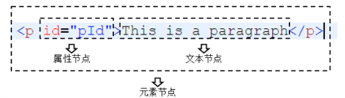 


#### 节点属性

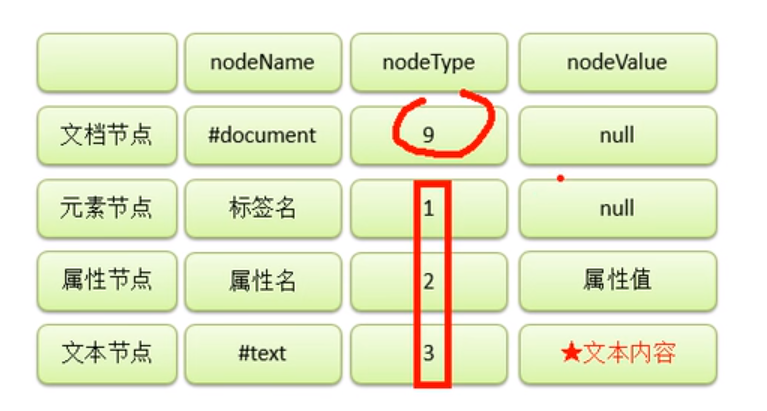

innerHTML和outerHTML区别  以及 子节点的所有类型节点的输出(不包括文档类型节点)

```typescript
let tags = document.getElementsByTagName('h5')
//h就是h5元素节点
let h = tags[0]
document.write(h.innerHTML)
console.log(h.innerHTML) //文本<em>斜体</em><strong>加粗</strong>
document.write(h.outerHTML)
console.log(h.outerHTML) //<h5>文本<em>斜体</em><strong>加粗</strong></h5>
document.write(h.childNodes)
console.log(h.childNodes)

// NodeList(5) [text, em, text, strong, text]
// 0: text
// 1: em
// 2: text
// 3: strong
// 4: text
// length: 5
// __proto__: NodeList

let childList = h.childNodes
for (let i = 0; i < childList.length; i++) {
    console.log("=========")
    console.log(childList[i].nodeValue)
    console.log(childList[i].nodeName)
    console.log(childList[i].nodeType)

}
// node.html:30 =========
// node.html:31 文本
// node.html:32 #text
// node.html:33 3
// node.html:30 =========
// node.html:31 null
// node.html:32 EM
// node.html:33 1
// node.html:30 =========
// node.html:31
// node.html:32 #text
// node.html:33 3
// node.html:30 =========
// node.html:31 null
// node.html:32 STRONG
// node.html:33 1
// node.html:30 =========
// node.html:31
// node.html:32 #text
```


##### innerHtml

该属性保存的是元素节点的文本内容
通过修改该属性可以修改元素节点的文本节点内容

innerText 获取和设置标签间的纯文本 ，不包含标签


#### document

document 是window属性,是文档节点对象

```html
<body>
    <button id="b">asdas</button>

    <script>
        console.log(document)
        let btn = document.getElementById('b')     
        btn.innerHTML = 'yes'
        
        let btns = document.getElementsByTagName('button')
        btns[0].innerHTML = 'update'
        
    </script>
</body>
```

输出document文档节点对象,结果就是整个html标签所包裹的内容

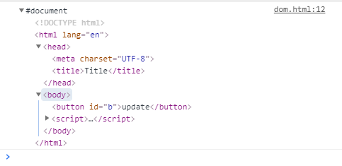 


##### 获取元素节点

除去id获取以外,其他获取的均是数组 ,所以要加下标[0]

```javascript
document.getElementById('idname')
//通过 id 进行获取 获取的结果是一个 dom 节点,只返回一个元素

document.getElementsByClassName('classname')
//通过类名进行获取 返回一个 HTMLCollection(类数组) 数据结构,如果需要其中的某一个 dom 节点,则需要通过下标进行获取

document.getElementsByName('form1')
//通过 tag 获取 返回一个 HTMLCollection(类数组) 数据结构 如果需要获取 divList2 中的某一项，则通过下标获取

document.getElementsByTagName('div')
//返回一个 NodeList(类数组) 数据结构 如果需要获取 divList3 中的某一项，则通过下标获取 

```

###### 对获取节点及点击的封装

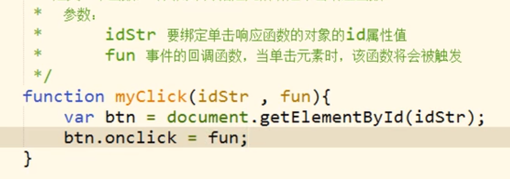


##### 获取html内的元素

[html接口链接](https://www.w3school.com.cn/js/js_htmldom_document.asp)


##### 实践-员工增加与删除

```html
<!DOCTYPE html>
<html lang="en">
<head>
    <meta charset="UTF-8">
    <meta http-equiv="X-UA-Compatible" content="IE=edge">
    <meta name="viewport" content="width=device-width, initial-scale=1.0">
    <title>Document</title>
    <style type="text/css">
        table {
            background-color: aquamarine;
            /* width: 300px; */
            /* height: 150px; */
            border: 1px solid;
            
        }
        td {
            width: 100px;
            height: 50px;
            text-align: center;
            
        }
        td,tr{
            border: 1px solid;

        }
        #addDiv{
            border: 1px solid;
            height: 300px;
            width: 600px;
            margin: 0 auto;
        }
        input{
            margin-top: 70px;
            /* margin-left: 60px; */
            /* padding-top: 50px; */
        }
    </style>
</head>
<body>
    <center>
        <table id="tb">
            <tr>
                <td>lyh</td>
                <td>20</td>
                <td class="dd">delete</a></td>
            </tr>
            <tr>
                <td>lzy</td>
                <td>20</td>
                <!-- <td><a href="javascript:add();">delete</a></td> -->
                <!-- <td><a href="javascript:;">delete</a></td>         set href to null to avoid page jump-->
                <td class="dd">delete</td>
            </tr>
            <tr>
                <td>sgc</td>
                <td>19</td>
                <td class="dd">delete</td>
            </tr>
        </table>
    </center>
    <div id="addDiv">
        <!-- <form action="">

        </form> -->
        name: <input type="text" value="" id="name"><br>
        age &nbsp&nbsp: <input type="text" value="" id="age">

        <input type ="button" value="submit" id="btn" >

    </div>


    <script type="text/javascript">
        //for binding the event to 'delete' 
        function deleteElements(deleteElement){
                deleteElement.onclick = function(){
                let conf = confirm("确认删除吗");
                if(conf){
                    this.parentNode.remove()
                    console.log(this.parentNode)
                }
                
                
            }
        }
        //batch bind
        function batchBindFun(){
            let arr = document.getElementsByClassName("dd");

            for (let i = 0; i < arr.length; i++) {
                deleteElements(arr[i])
                
            }   
        }


        function addElement(){
            let btn = document.getElementById("btn");
            btn.onclick = function(){
                let conf = confirm("确认添加吗");
                if(conf){
                    let name = document.getElementById("name");
                    let age = document.getElementById("age");

                    let table = document.getElementById("tb")
                    let tr = document.createElement("tr");

                    let td1 = document.createElement("td");
                    td1.innerText = name.value;    
                    let td2 = document.createElement("td");
                    td2.innerText = age.value;    
                    let td3 = document.createElement("td");
                    td3.innerText = 'delete'; 
                    deleteElements(td3);

                    tr.appendChild(td1);    
                    tr.appendChild(td2);
                    tr.appendChild(td3);

                    console.log(tr)
                    let tbody = document.getElementsByTagName('tbody')[0];
                    //table.appendChild(tr);
                    tbody.appendChild(tr)
                }

            }

        }
        addElement();

    </script>
</body>
</html>
```

1. 在添加tr节点时遇到的问题
   后面添加的tr节点在不知道哪来的tbody外面
   解决方案: 
   获取tbody节点,然后插入到tbody而不是table里

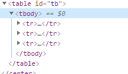

2. 添加的新节点不要忘记绑定事件


##### style获取和修改节点的内联样式

> 通过js函数来修改dom中的内联样式  来改变节点样式
> 通过属性style
> 但需要注意优先级问题
> js修改的css的优先级要大于css中定义的
> 想要css中样式优先级高,就在后面添加!important
>
> 注意:使用style只能获取到节点的内联样式,就是写在html标签的后面的属性
> 		无法获取到css样式表中的样式

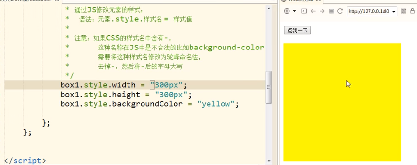


##### getComputedStyle获取当前样式

> getComputedStyle获取当前元素显示的样式,已解决style无法获取css样式表的缺点
> 若获取的样式没有被设置,就返回该样式当前屏幕所显示的属性:比如全屏时返回1350px,你缩小后就是500px,完全取决于屏幕,比较随意
> 通过getComputedStyle获取的对象是一个封装了当前元素所显示的样式表
> 注意:style和getComputedStyle输出的width的值时包含px的,比如100px,所以不能直接获取用于加减
>
> 不同于style,可以修改,这个方法获取的属性只读

```javascript
var obj = getComputedStyle(box1,null);   //the first argument is the element to get style,要获取样式的元素
										 //the second argument is pseudo element,we usually give it null,伪元素,一般传给他null
console.log(obj.width);	
console.log(obj.backgroundColor);								
```


##### 实践-写一个兼容的函数

由于ie8不兼容上面的getComputedStyle函数且其有自己的函数currentStyle
所以写一个兼容ie8 和其他浏览器的获取当前css的函数

```javascript
<!DOCTYPE html>
<html lang="en">
<head>
    <meta charset="UTF-8">
    <meta http-equiv="X-UA-Compatible" content="IE=edge">
    <meta name="viewport" content="width=device-width, initial-scale=1.0">
    <title>Document</title>
    <style type="text/css">
        #d{
            background-color:red;
            width: 100px;
            height: 100px;
        }
    </style>
</head>
<body>
    <div id="d"></div>
    <script type="text/javascript">
        function getStyle(obj,name) {
        
            if(window.getComputedStyle){
                // if the attribute name of object and parameter name are the same, 
                //obj.attribute and obj.parameter is easy to be confused 
                //we can use ' [parameter] '  to replace the ' . parameter'

                return getComputedStyle(obj,null)[name];
                //return getComputedStyle(obj,null).name; //this will return the name in css sheet not the backgroundColor

            }else{
                return obj.currentStyle[name];
                //return obj.currentStyle(name);
            }
        }


        let div = document.getElementById("d");
        console.log(getStyle(div,"backgroundColor"));
    </script>
</body>
</html>
```

注意:if(window.getComputedStyle){   此处不能不写window  
在非ie8中,getComputedStyle是全局的函数<font color=#99CCFF size=3>,**容易被编译器误当做一个变量处理**</font>
如果不写,这个getComputedStyle虽然是一个对象,但它会被误当做一个变量,编译器首先会在函数作用域再到全局作用域找
注意,<font color=#FF6666 size=3>**变量一旦全局作用域找不到,就会报错,代码停止执行       而对象的属性找不到会返回undefined=>false**</font>

> js中,如果该位置要返回布尔值,比如if括号中,若该值返回的不是布尔值则
> 会将该值转换为相应的布尔值
> 所以我们要知道哪些数据会返回真,哪些返回假


##### 真值和假值

> 假值
>
> false、0、""、null、undefined 和 NaN    一共6种

> 真值
> if (true) 
> if ({}) 
> if ([]) 
> if (42) 
> if ("foo")
> if (new Date())
> if (-42) 
> if (3.14)
> if (Infinity)


### bom

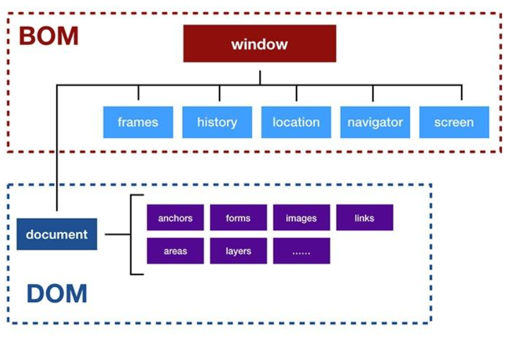


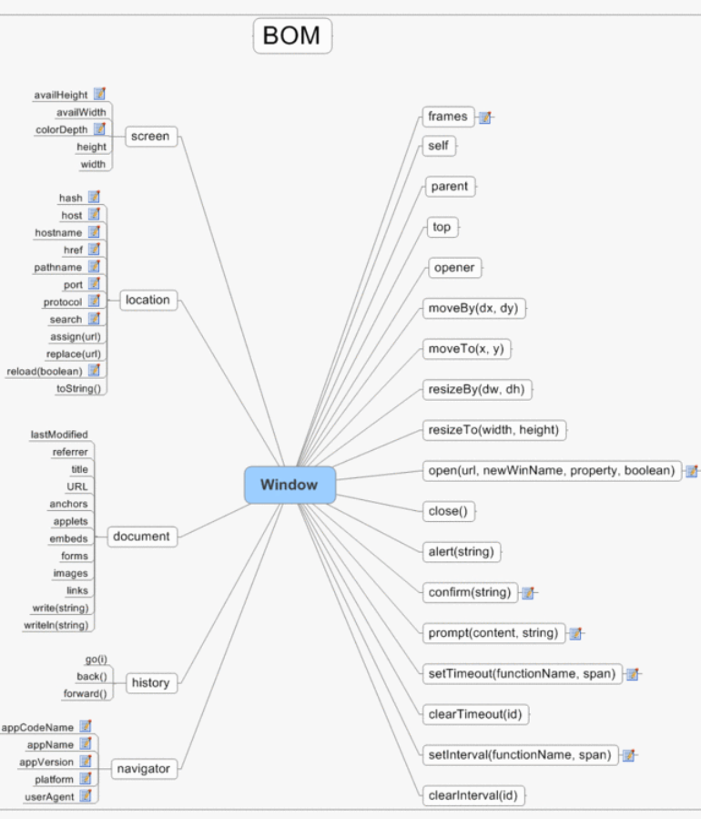


> **DOM** 是为了操作文档/网页 出现的 API，**document** 是其的一个对象；
>
> **BOM** 是为了操作浏览器出现的 API，**window** 是其的一个对象。

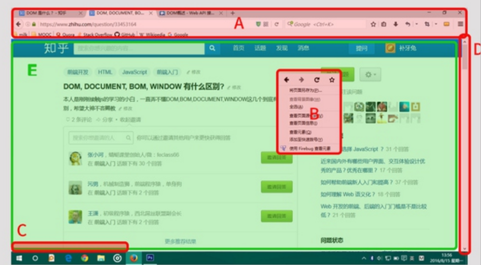

**归DOM管的**：

E区：即document 

 

**归BOM管的**：

A区：浏览器的地址栏，书签栏等

B区：右键菜单

C区：document加载时的状态等

D区：滚动条

E区：document         可以看出,要为整个页面绑定事件时,就绑定document


#### window

代表整个浏览器的窗口(当然事件绑定时窗口指document,document隶属于window),同时window也是网页文档的全局对象, 所有声明的变量都将成为window的属性,所有声明的函数都将成为window的方法

<font color=#99CCFF size=3>**上面ABCDE所有区域的并集就是window   **</font>

所以下面的navigator location history screen 都作为window的属性保存的


#### navigator

当前浏览器的信息,识别浏览器

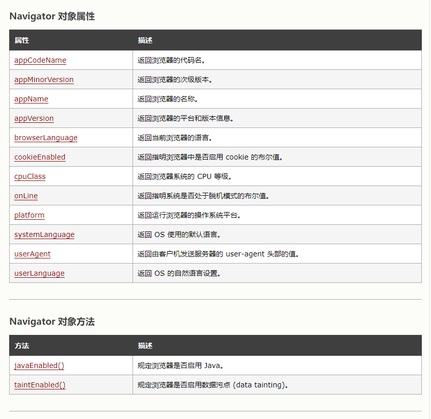


**[详细接口信息](https://www.w3school.com.cn/jsref/dom_obj_navigator.asp)**

##### 识别ie浏览器

```javascript
console.log(navigator.userAgent);
//chrome:
//Mozilla/5.0 (Windows NT 10.0; Win64; x64) AppleWebKit/537.36 (KHTML, like Gecko) Chrome/86.0.4240.75 Safari/537.36
//firefox
//Mozilla/5.0 (Windows NT 10.0; Win64; x64; rv:95.0) Gecko/20100101 Firefox/95.0

let userAgent = navigator.userAgent;

if (/chrome/i.test(userAgent)) {
  alert("this is chrome");
} else if (/firefox/i.test(userAgent)) {
  alert("this is firefox");
} else if(/msie/i.test(userAgent)){    //can not identify ie,please use ActiveXObject which is unique property of ie
  alert("this is IE")
}
```

ie11以后userAgent里已经没有任何微软和ie的字样来识别了

如果通过UserAgent不能判断，还可以通过一些浏|览器中特有的对象，来判断浏览器的信息比如:Activexobject
window.ActiveXObject ie11特有,但会伪装返回false  所以只能用 in 来判断window对象中是否有该属性来判断是否是ie

```javascript
if("ActiveXObject" in window){   //window.ActiveXObject 
     alert("please not use ie browser to visit the website")
}

```


#### location

> 代表当前浏览器的地址栏信息，通过Location可以获取地址栏信息，
> 或者操作浏览器跳转页面*如果直接打印location，则可以获取到地址栏的信息（当前页面的完整路径)
> 如果直接将location属性修改为一个完整的路径，或相对路径则我们页面会自动跳转到该路径
> 主要用于获取修改url

```javascript
btn.onclick = function () {
  
  location = "http://www.baidu.com";
  location = "e1.BOM.html";
};

```

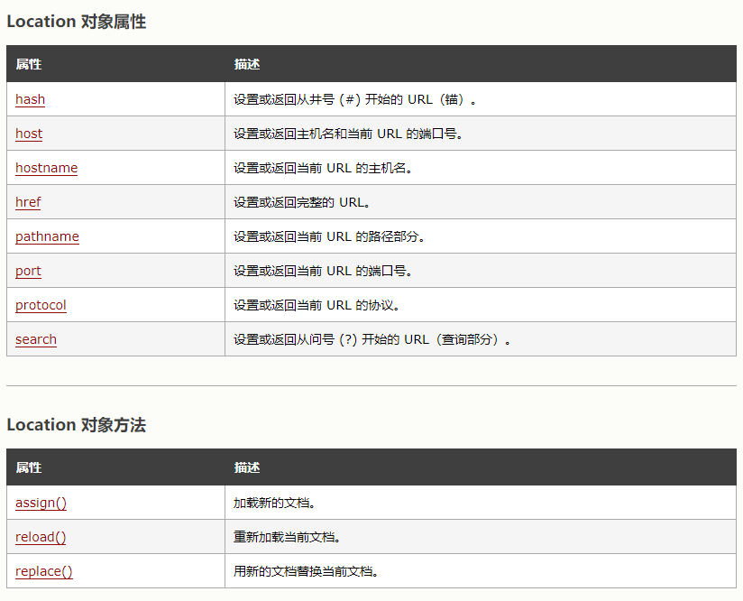

location.reload(true)//刷新页面并清除缓存,后面参数决定是否清空缓存
下面是每次向文本框内写文字,当点击刷新时,文字清空

```html
<body>
    <input type="text" id=input>
    <input type="button" id=button value="flush">
    <script type="text/javascript">
        let input = document.getElementById("input");
        let button = document.getElementById("button");

        button.onclick = function() {
            location.reload();  //chome can clear cache by null argument
        }
    </script>

</body>
```

location.replace()跳转并替换当前页面


#### History

代表浏览器的历史记录，可以通过该对象来操作浏览器的历史记录
由于隐私原因，该对象不能获取到具体的历史记录，只能操作浏览器向前或向后翻页而且该操作,只在当这访问时有效,关闭浏览器后再次打开后是获取不到上次打开的历史的

#### Screen

代表用户的屏幕的信息，通过该对象可以获取到用户的显示器的相关的信息.
主要由于移动端开发,由于移动端屏幕大多不同,用以识别


### 事件

##### onload

> 浏览器在加载一个页面时，是按照自上向下的顺序加载的，
> 读取到一行就运行一行,如果将script标签写到页面的上边，在代码执行时，页面还没有加载
> <font color=#99CCFF size=3>**为window绑定一个onload事件** <br>**即在onload事件中的代码 ,会在整个页面加载完成之后才触发**</font>

```html
<script>
        window.onload = function() {

        }
</script>
```

注意:webstorm里热更新会因为这个事件而失效,所以还是在body里写script代码然后再将代码迁移出去

注意:  千万不要在文档加载后使用 document.write()。这么做会覆盖文档,页面只剩一个write的内容


##### 事件对象

> 当事件的响应函数被触发时，浏览器每次都会将一个事件对象作为实参传递进响应函数，
> 在事件对象中封装了当前事件相关的一切信息，比如，鼠标的坐标键盘哪个按键被按下鼠标滚轮滚动的方向

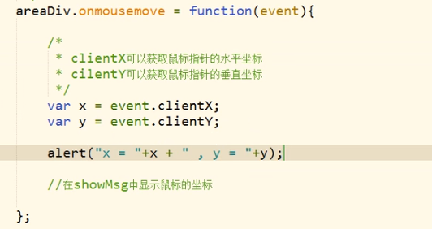

**[详细事件接口文档](https://www.w3school.com.cn/jsref/dom_obj_event.asp)**

**[事件对象可操作属性文档](https://www.w3school.com.cn/jsref/obj_mouseevent.asp)**


鼠标移动获取div中坐标
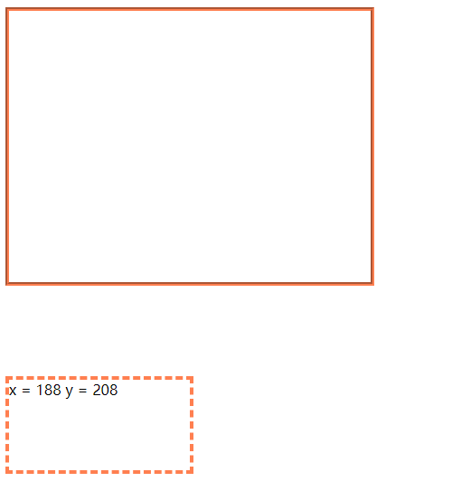


```javascript
<div id="moveArea"></div>
<div id="messageArea"></div>
<script>
    let moveArea = document.getElementById("moveArea");
    let messageArea = document.getElementById("messageArea");

    moveArea.onmousemove = function(event){
        if (!event){
            event = window.event;             //considering to be compatible with IE browser
												//for browser with ie version less than 8,there is no default event parameter in the 														//	function when the event is triggered,but the event is saved in window object
        }
        //we can also write
		//event = event || window.event
        
        let x = event.clientX;
        let y = event.clientY;

        messageArea.innerHTML = "x = "+x+"  y = "+y;
    }
    moveArea.onmouseleave = function(event){
        messageArea.innerHTML = "x = "+0+"  y = "+0;
    }


</script>
```

when the code to be compatible to the multiple browsers , to solve the difference of getting object , we can use two solutions
<font color=#99CCFF size=3>**the return value of object in js is true when the object is not undefined,which is the underly logic of judgement  **</font>


##### 事件的写法

```javascript
ul.onclick = function() {
    addLi('li','uu','stjt');
}

ul.onclick = addLi('li','uu','stjt');
```

> 事件函数不能用第二种写法
>
> 事件应该至少有个=function(){}匿名函数
>
> 然后**在匿名function中调用其他函数**


##### 事件冒泡

当子元素和父元素事件触发条件相同时,触发子元素时也会触发父元素
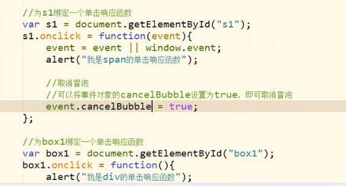

子元素设置取消冒泡后   在子元素上就不会触发父元素的事件了
但随之而来的问题
比如
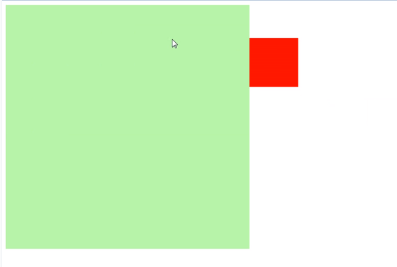

上面为document绑定移动盒子事件,当给绿盒子取消冒泡后,鼠标移动到上面后,绑定在页面上的事件就失效了,红盒子不跟着鼠标了


##### 事件的委派

> 当一个绑定事件的既定结构中添加新元素时,新元素还需要绑定一遍事件
> 这样太过于麻烦,可以利用事件冒泡的机制,将事件绑定到其共有的父元素中
> 就比如dom-实践-员工增加与删除中,可以省略部分代码


但出现问题了,点右边的绿色区域也会触发事件
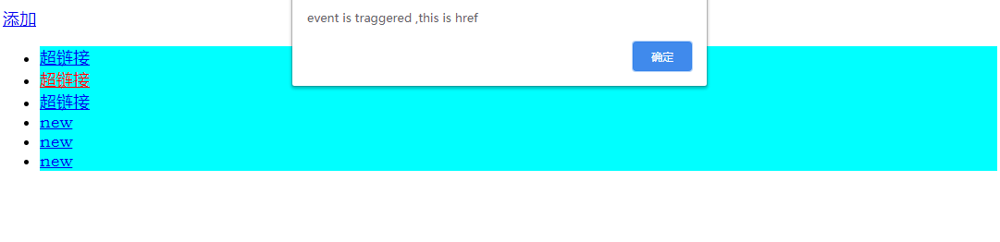

解决方案:

> 将超链接上绑定class类名   
> 采用event中的target接口,target返回事件触发者对象
> 所以通过event.target.className来获取触发者对线的类名进而判断是否是预期要触发的对象
> 这样可以避免其他非预期区域误触发事件

```html
<head>
    <style>
        .l{
            background-color:aqua;

        }
    </style>
</head>
<body>
    <div id="d1">
        <a href="javascript:;">添加</a>
       
    </div>
    <ul>
        <li class="l"><a href="javascript:;" class = "a1">超链接</a></li>
        <li class="l"><a href="javascript:;" class = "a1">超链接</a></li>
        <li class="l"><a href="javascript:;" class = "a1">超链接</a></li>
    </ul>

    <script>
        let add = document.getElementById("d1");
        let ul = document.getElementsByTagName("ul")[0];
        add.onclick=function(){
            
            ul.innerHTML+= "<li class='l'><a href='javascript:;' class = 'a1'>new</a></li>";
        }

        ul.onclick=function(event){
            // alert("event is traggered");
            event = event || window.event;
            if (event.target.className == 'a1'){
                alert("event is traggered ,this is href");

            }
            //note that: it does not make sense to set class for <li>, as <li> occupys the whole line,other unexpected area 										 will trigger the event when click
            //note that: 将li上设置class没有意义,因为 li也是占一整行的,到时候点击别的区域也会触发事件 
            if(event.target.className == 'l'){
                alert("this is extra area");
            }
        }
    </script>
</body>
```


##### 事件多重绑定


当多个事件绑定一个元素时会进行覆盖,此时要绑定多个事件可用addEventListener

> addEventListener( )
> -通过这个方法也可以为元素绑定响应函数
> -参数:
> 1.事件的字符串，不要on
> 2.回调函数，当事件触发时该函数会被调用
> 3.是否在捕获阶段触发事件，需要一个布尔值，一般都传false

 

```javascript
<script type="text/javascript">
        let btn = document.getElementById("btn");
        btn.addEventListener("click",function(){
            alert("this is the first bind function")
        })

        btn.addEventListener("click",function(){
            alert("this is the second bind function")
        })

        btn.addEventListener("click",function(){
            alert("this is the third bind function")
        })
</script>
```


##### 事件的传播

 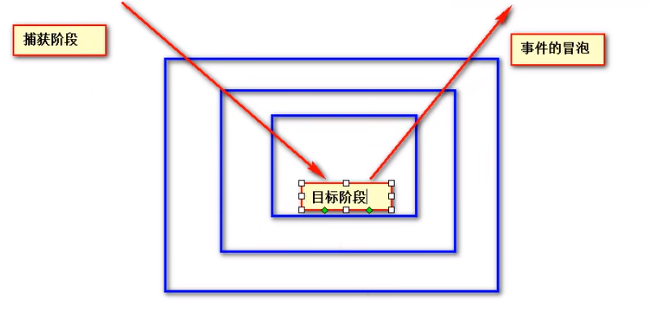


1. 捕获阶段
   -在捕获阶段时从最外层的祖先元素，向目标元素进行事件的捕获，但是默认此时不会触发事件

2. 目标阶段
   -事捕获到目标元素，捕获结束开始在目标元素上触发事件

3. 冒泡阶段
   -事件从目标元素向他的祖先元素传递，依次触发祖先元素上的事件

   

如果希望在捕获阶段就触发事件，可以将addEventListener()      的第三个参数设置为true
一般情况下我们不会希望在捕获阶段触发事件，所以这个参数一般都是falsel


##### event对象参考文档

[超链接](https://www.w3school.com.cn/jsref/dom_obj_event.asp)


### 定时器

##### setInterval( )

> -定时调用
> -可以将一个函数，每隔一段时间执行一次
> -参数.
> 	1.回调函数，该函数会每隔一段时间被调用一次
> 	2.每次调用间隔的时间，单位是毫秒

屏幕每1秒加一

```html
<p>1</p>
<script>
let nums = document.getElementsByTagName('p')
let num = nums[0];

const timer = setInterval(function(){

        num.innerHTML = Number(num.innerHTML)+1;
        console.log(num.innerHTML)
        if (num.innerHTML == 10){
            clearInterval(timer);
        }

    },1000) 
</script>
```

屏幕每秒换图

> 通过设置两个定时器可以看出, 每次定时器返回的timer值是有规律的
> 一开始是1
> 若两个同时计时则是1 ,2       
> 若页面未刷新,你点击图片,图片轮换停止后,再点击页面重写调用interval时  此时是 3 4    /////
> 所以我就把mytimer = 0当做interval函数销毁时的状态 ,当mytimer创建时,自然会把mytimer修改为大于0的值

```html
         
<script>
    
    //效果:第一次点击图片,图片轮换,第二次点击图片,图片停止  ,只需一个定时器足矣,另一个用作返回值的观察
    
    let images = document.getElementsByTagName('img');
    let image = images[0];

    let myTimer = 0;
    function rotation(){
        let num = 2
        myTimer = setInterval(function () {
            image.src = "./image/image-2021"+num+".png";
            
            num = (num % len)+1;
            
            console.log(myTimer)

        },1000)
    }

    let myTimer2 = 0;
    function rotation2(){
        let num = 2
        myTimer2 = setInterval(function () {
            image.src = "./image/image-2021"+num+".png"
            num++;
            if (num > 4){
                num = 1;
            }
            console.log(myTimer2)

        },1000)
    }

    image.onclick = function () {
        if (myTimer == 0&&myTimer2 == 0){
            rotation()
            rotation2()
        }else {
            clearInterval(myTimer)
            myTimer = 0;

            clearInterval(myTimer2)
            myTimer2 = 0;
        }
    }

</script>
```


##### 定时器返回值

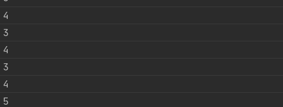


##### 索引下摆的%运算

```javascript
num = (num % len)+1              //将num++和num判断转换为  %运算

console.log(num)
```

##### clearInterval(myTimer)

在开启定时器之前,将之前的定时器关掉,只保留一个定时器(只针对于同一个对象  ,两个定时器不是同一个dom对象则不需要清除)

```javascript
清除定时器
let timer = 0;
btn01.onclick = function () {
    clearInterval(timer)             //在多次触发事件后,将会开启多个事件,直接表现就是,一张图片按开始轮播会越换越快
										//所以在第二次点击开始轮播按钮时,进行清除定时器
    									//在开启定时器之前,将之前的定时器关掉,只保留一个定时器
										//将上一定时器标识符作为参数传入销毁对应定时器
    timer = setInterval(function () {
        //rotate picture code
    }    
    
}
```


##### 实践-盒子移动优化

盒子在刚按下移动键时,都会卡一下再移动

```html
<style type="text/css">
  #box1 {
    background-color: red;
    width: 200px;
    height: 200px;
    position: absolute;      	/*if we want the div can leave the normal document stream and 
      							be moved by event,we must add property 'position: absolute'*/
  }
</style>
<body>
<div id="box1"></div>
<script type="text/javascript">
  let box1 = document.getElementById("box1");  //bind to the whole page
  let speed = 10;
  //为document绑定一个按键按下的事件
  document.onkeydown = function (event) {
    event = event || window.event;
    //定义一个变量，来表示移动的速度
    
    //当用户按了ctrl以后，速度加快
     if (event.ctrlKey) {
           speed = 60;
      }else {
           speed = 10;
     }


    switch (event.keyCode) {
      case 37:
        //alert("向左");
        //left值减小;
        box1.style.left = box1.offsetLeft - speed + "px";
        break;
      case 39:
        //alert("向右");
        box1.style.left = box1.offsetLeft + speed + "px";
        break;
      case 38:
        //alert("向上");
        box1.style.top = box1.offsetTop - speed + "px";
        break;
      case 40:
        //alert("向下");
        box1.style.top = box1.offsetTop + speed + "px";
        break;
    }
  };
</script>
</body>  


```

After optimization

```javascript
let box1 = document.getElementById("box1");
let speed = 0;
// let direction = event.keyCode;
let direction = 0;

//For displaying real-time box movement we can set a global timer
//to update the screen all the time
let timer = setInterval(function () {
  switch (direction) {
    case 37:
      //alert("向左");
      //left值减小;
      box1.style.left = box1.offsetLeft - speed + "px";
      break;
    case 39:
      //alert("向右");
      box1.style.left = box1.offsetLeft + speed + "px";
      break;
    case 38:
      //alert("向上");
      box1.style.top = box1.offsetTop - speed + "px";
      break;
    case 40:
      //alert("向下");
      box1.style.top = box1.offsetTop + speed + "px";
      break;
  }
}, 10); //to improve the fluency,we can reduce time interval

document.onkeydown = function (event) {
  event = event || window.event;

  if (event.ctrlKey) {
    speed = 30;
  } else {
    speed = 10;
  }

  direction = event.keyCode;
};

document.onkeyup = function (event) {
  event = event || window.event;

  if (!event.ctrlKey) {
    speed = 0;
    // direction = 0;
    //stop the box moving by modifing the direction value also worked
  }
};

```


##### setTimeout()

延时调用
延时调用一个函数不马上执行，而是隔一段时间以后在执行，而且只会执行一次
延时调用和定时调用的区别，定时调用会执行多次，而延时调用只会执行一次

clearTimeout用以关闭一个延时器

延时调用和定时调用实际上是可以互相代替的，在开发中可以根据自己需要去选择


### json

JavaScript Object Notation         js对象表示法
json是一个特殊格式的字符串,这个字符串能被其他语言识别
效果:跨语言传输对象信息,数据交互
Json和JS对象的格式一样，只不过JSON字符串中的属性名必须加双引号
json中分为

1. 对象
2. 数组  

```javascript
const studentsObj ={
    name: 'lyh',
    age: 21
}
//add double quotation mark to property
//add single quotation mark to the Json String
const studentsJson = '{"name": "lyh","age": 21}'


//array
const array = '[1,2,3,"lyh",true]'
```


##### json的序列化反序列化

反序列化就是将哪些特殊格式的字符串(JSON规范的字符串)或者字节流  解析完,掐头去尾,各种正则,生成出对象/目的格式的数据
详细参考=>附加问题=>序列化和反序列化

```javascript
const obj = JSON.parse(jsonString)

//convert object to json string
let jsonStr = JSON.stringify(obj)
```


### js高级

[超链接](https://www.bilibili.com/video/BV14s411E7qf/?spm_id_from=333.788.video.desc.click)

主要涉及js的面试题和原型链,浏览器内核相关


### 附加问题


##### 编译问题

##### Native Code — 本机代码

已被编译为特定于处理器的机器码的代码
这些代码可以直接被虚拟机执行。
这个虚拟机指定是该环境的指令集,可以是jvm,可以是浏览器内核,可以是操作系统内核


为何说Java是解释性语言
它与C++相比有何不同？

C++编译器是将源代码一次性地直接编译链接成本地可执行的本地代码。即C++编译好的程序不需要任何其他环境，可直接执行。
Java编译器只是将源代码编译成通用字节码，运行需要JVM的支持，JVM**将字节码再转换成本地可执行的本地代码**。它是边翻译字节码边执行，故而称为解释器。

Java程序编译执行过程
java编译器将源文件(.java)编译成机器码(.class)  这些class字节码文件又会在被执行的机器上的jvm再第二次编译为对应系统的本机代码(机器码)。这些本机代码要模拟出本地具体平台可执行的指令集。


##### 什么是回调函数

回调函数是一段可执行的代码段，它作为一个参数传递给其他的代码，其作用是在需要的时候方便调用这段（回调函数）代码。

在JavaScript中函数也是对象的一种，同样对象可以作为<font color=#FF6666 size=3>**参数**</font>传递给函数，因此函数也可以作为参数传递给另外一个函数，这个作为参数的函数就是回调函数。

```javascript
function add(a,b,callbackFun) {
    let sum = a+b;
    callbackFun(sum)
}

function myPrint(num) {
    console.log("callback function")
    console.log(num)
}

add(4,5,myPrint)

//       anonymous callback function

function add2(a,b,call2) {
    let sum = a+b;
    call2(sum);

}
add2(4,99,function (num) {
    console.log("anonymous callback function")
    console.log(num)
})
```


##### 序列化和反序列化

> (1)Java序列化就是指把Java对象转换为字节序列的过程
>
> Java反序列化就是指把字节序列恢复为Java对象的过程。
>
> (2)序列化最重要的作用：<font color=#FF6666 size=3>**在传递和保存对象时.保证对象的完整性和可传递性。对象转换为有序字节流,以便在网络上传输或者保存在本地文件中。**</font>
>
> 反序列化的最重要的作用：根据字节流中保存的对象状态及描述信息，通过反序列化重建对象。
>
> 总结：核心作用就是对象状态的保存和重建。（整个过程核心点就是字节流中所保存的对象状态及描述信息）

2、json/xml的数据传递：

<font color=#99CCFF size=3>在数据传输(也可称为网络传输)前，先通过序列化工具类将Java对象序列化为json/xml文件。</font>
<font color=#99CCFF size=3>在数据传输(也可称为网络传输)后，再将json/xml文件反序列化为对应语言的对象</font>


3、序列化优点：

1.将对象转为字节流存储到硬盘上，当JVM停机的话，字节流还会在硬盘上默默等待，等待下一次JVM的启动，把序列化的对象，通过反序列化为原来的对象，并且序列化的二进制序列能够减少存储空间（永久性保存对象）。

2.序列化成字节流形式的对象可以进行网络传输(二进制形式)，方便了网络传输。

3.通过序列化可以在进程间传递对象。

##### 遗漏部分

正则表达式
p110页面坐标获取
p118-p120拖拽问题
p121滚轮事件
p122键盘事件
p137类,代码实现敲一遍(很重要,js思想)
二级菜单和轮播图代码实现

### 问题解决

webstorm插件问题

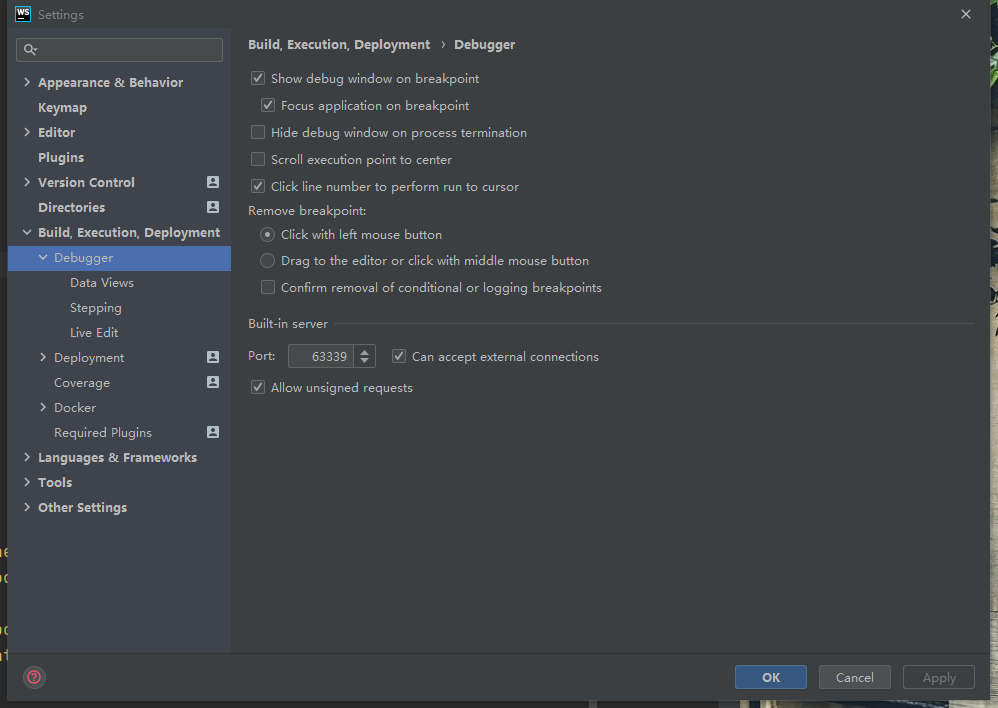

热刷新插件  不需要浏览器开,也不需要ide打开扩展模式,       只需要将端口调小,然后将can accept external connections 勾选即可


### html附加


##### 盒模型

[超链接](https://blog.csdn.net/fdsfasf/article/details/104466911?ops_request_misc=%257B%2522request%255Fid%2522%253A%2522164143527716780264057315%2522%252C%2522scm%2522%253A%252220140713.130102334..%2522%257D&request_id=164143527716780264057315&biz_id=0&utm_medium=distribute.pc_search_result.none-task-blog-2~all~top_click~default-2-104466911.pc_search_em_sort&utm_term=%E7%9B%92%E6%A8%A1%E5%9E%8B&spm=1018.2226.3001.4187)

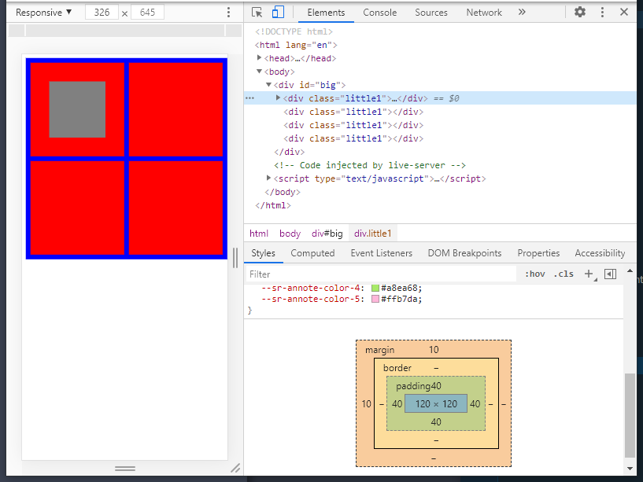

```javascript
<!DOCTYPE html>
<html lang="en">
<head>
    <meta charset="UTF-8">
    <meta http-equiv="X-UA-Compatible" content="IE=edge">
    <meta name="viewport" content="width=device-width, initial-scale=1.0">
    <title>Document</title>
    <style type="text/css">
        #big{
            border-width: 1px;
            width: 430px;
            height: 430px;
            background-color:blue;
            /* padding: 10px 10px 10px 10px; */
        }
        .little1{
            background-color: red;
            width: 120px;
            height: 120px;
            margin: 10px 0 0 10px;
            float: left;
            padding: 40px 40px 40px 40px;
            
        }
        #ll1{
            background-color:gray;
            width: 120px;
            height: 120px;

        }
    </style>
</head>
<body>
    <div id="big">
        <div class="little1">
            <div id="ll1"></div>
        </div>
        <div class="little1"></div>
        <div class="little1"></div>
        <div class="little1"></div>
    </div>
</body>
</html>
```

> 无论是padding还是margin  设置它们的大小均会扩张整个盒子的大小      ,当然border也额外占空间
> 所以在设计大盒子之初就要考虑各个间隙尺寸
> 给大盒子内部的小盒子加margin尚且还能直接将小盒子设置小点,防止小盒子超过预期尺寸
> 但设置大盒子的padding就比较复杂了,可能会直接将大盒子扩大


##### 超链接

取消超链接跳转页面, 

1.  在响应函数中return false
2.  href ="Javascript:;"


##### input标签

value即是输入的值


### css附加

#### css属性

[css所有属性](https://blog.csdn.net/qq_37160320/article/details/77484240?ops_request_misc=%7B%22request_id%22%3A%22164143479116780255261450%22%2C%22scm%22%3A%2220140713.130102334..%22%7D&request_id=164143479116780255261450&biz_id=0&utm_medium=distribute.pc_search_result.none-task-blog-2~all~sobaiduend~default-1-77484240.pc_search_em_sort&utm_term=css%E6%89%80%E6%9C%89%E5%B1%9E%E6%80%A7&spm=1018.2226.3001.4187)

#### 布局

##### float

> 浮动可以设置元素，会使得元素跳出正常的文档流，向右或者向左，靠近父元素的边缘或者是设置了浮动的其他的元素的边缘靠拢。
>
> 何为跳出文档流?  =>也就是说当设置了float的元素后面还有元素时，其他元素会无视它所占据了的区域(一整行)，直接在它身下布局。(不是在下一行布局,而是把他当前位置都占掉了, 就如同飞升上天一样漂浮在文档流的上方,此时就是脱离了正常文档流)    这个标签脱离了文档流的管理,这个标签在原文档流中**所占的空间也被清除了**。
>
> inline-block和float相互矛盾,可相互覆盖
> 虽然有时inline-block和float达到的效果类似,但本质不同
> 浮动元素会脱离文档流,而inline-block则只是修改了元素的块级或内联属性,本质还是在正常文档流内,因此设置inline-block不需要清除浮动。


```html
<head>
    <style type="text/css">
        .d1{
            background-color:royalblue;
            width: 200px;
            height: 200px;
            float: left;
            margin-top:10px;
            margin-left: 10px;
        }
        .d2{
            background-color:rgb(34, 40, 56);
            width: 200px;
            height: 200px;
            /* float: left; */
            margin-top:30px;
            margin-left: 10px;
        }
    </style>
</head>
<body>
    <div class="d1"></div>
    <div class="d1"></div>
    <div class="d1"></div>

    <div class="d2"></div>
    <div class="d2"></div>
    <div class="d2"></div>
</body>
```


##### 文字会考虑浮动元素的存在

> 蓝框占据了红框位置,但蓝框中的字识别到了红框

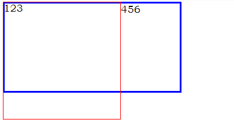


```html
<head>
	<style>  
        .first {  
            width: 200px;  
            height: 200px;  
            border: 1px solid red;  
            float: left;  
        }  
        .second {  
            width: 300px;  
            height: 150px;  
            border: 3px solid blue;  
        }  
    </style>  
</head>  
  
<body>  
  
<div class="first">123</div>  
<div class="second">456</div>  
  
</body>  
 
```


##### 高度坍塌问题


> 在页面中设置一个盒子box，其中在嵌套一个子元素小盒子box1。box设置边框宽度，而高度不去设置**（**高度会由内容撑开**）
>
> 但是当我们向盒子里面添加内容的时候<div class="box1">a</div>,就可以发现父元素被撑开了。
>
> 在文档流定位中**，**父元素的高度默认是被子元素撑开的高度。即子元素的高度就是父元素的高度。
>
> **当为父元素中的子元素设置了向浮动时。**比如说为box1设置向左浮动。就会发现子元素的位置没变，但是父元素box发生了高度坍塌。
>
> **得出结论**：**当为子元素设置浮动的时候，子元素就会完全脱离文档流，此时将会导致子元素无法撑开父元素，导致父元素的高度塌陷**。


[解决方案链接-博客园](https://www.cnblogs.com/nyw1983/p/11374405.html)


##### overflow

当子元素高度大于父元素,子元素会超出父元素

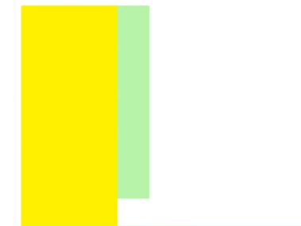 


此时在父元素中设置overflow-hidden 会将超出的子元素隐藏起来
设置overflow-auto父元素会出现滚动条,可以下滑看多余的子元素部分


#### 定位


##### 分层z-index

> z-index是针对网页显示中的一个特殊**属性**。因为显示器是显示的图案是一个二维平面，拥有x轴和y轴来表示位置属性。为了表示三维立体的概念如显示元素的上下层的叠加顺序引入了z-index属性来表示z轴的区别。**表示一个元素在叠加顺序上的上下关系**。
>
> z-index属性适用于定位元素（position属性值为 relative 或 absolute 或 fixed的对象）
> z-index值较大的元素将叠加在z-index值较小的元素之上


##### 相对定位relative

> 相对定位元素不可层叠，依据left、right、top、bottom等属性**在正常文档流中偏移自身位置,但其空间不会被其他元素占据**。


```javascript
<head>
  <style type="text/css">
    .box {
      background: red;
      width: 100px;
      height: 100px;
      float: left;
      margin: 5px;
    }
    .two {
      position: relative;
      top: 50px;
      left: 50px;
    }
  </style>
</head>
<body>
  <div class="box">One</div>
  <div class="box two">Two</div>
  <div class="box">Three</div>
  <div class="box">Four</div>

  <div class="box">One</div>
  <div class="box">Two</div>
  <div class="box">Three</div>
  <div class="box">Four</div>
  <div class="box">Four</div>
  <div class="box">Four</div>
  <div class="box">Four</div>
</body>
```


##### 绝对定位absolute

> 相对于第一个position不是static的父级元素定位，当父级元素的position全是static的时候，absolute是相对于html来进行定位
> 使用left、right、top、bottom等属性相对于其最接近的一个最有定位设置的父级元素进行绝对定位


##### 相对定位与绝对定位区别

> 左边是position: absolute;	右边是position: relative;
>
> 相对定位与绝对定位区别:
>
> 绝对定位好像把不同元素安排到了一栋楼的不同楼层(除首层，文本流放在首层)，它们之间互不影响；相对定位元素在首层，与文本流一起存放，它们之间互相影响。
>
> 被设置了绝对定位的元素，在文档流中是不占据空间的，如果某元素设置了绝对定位，那么它在文档流中的位置会被删除，它浮了起来，其实设置了相对定位也会让元素浮起来，但它们的不同点在于，<font color=#FF6666 size=3>**相对定位不会删除它本身在文档流中占据的空间**</font>，其他元素不可以占据该空间，而绝对定位则会删除掉该元素在文档流中的位置，使其完全从文档流中抽了出来，其他元素可以占据其空间，可以通过z-index来设置它们的堆叠顺序 。

<span></span> <span>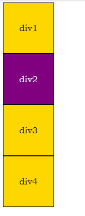</span>   


```html
<html>
	<head>
		<meta charset="UTF-8">
		<style type="text/css">
			.wrapper{
				height:100px;
				width:100px;
				border:1px solid black;
				background-color: gold;
				line-height: 100px;
				text-align: center;
			}
			.wrapper_out{
				height:100px;
				width:100px;
				background-color: purple;
				color: white;
				position: absolute;								//设置float/absolute/fixed/会使该元素脱离普通文档流
                /* position: relative; */
			}
</style>
	</head>
	<body>
		<div class="wrapper">div1</div>
		<div class="wrapper wrapper_out">div2</div>			<!--使第二个div图例文档流-->
		<div class="wrapper">div3</div>
		<div class="wrapper">div4</div>
	</body>
</html>
```


##### fixed

> 完全脱离文档流，相对于浏览器窗口进行定位。（相对于浏览器窗口就是相对于html）


```html
<head>
	<style type="text/css">
        img{
            position: fixed;
            top: 10%;
            left: 90%;
            z-index: 2;
        }
        body{
            height: 2000px;
        }

    </style>
</head>
<body>
    
</body>
</html>
```


#### 块级元素和行内元素

display属性

> 每一个元素都有默认的display属性值，比如div元素，它的**默认display属性值为“block”**，成为“块级”元素(block-level)；而span元素的默认**display属性值为“inline”**，称为“行内”元素。

> 块级元素：占据一定矩形空间，可以通过设置高度、宽度、内外边距等属性，来调整的这个矩形；
> 行内元素 ：自己的独立空间，它是依附于其他块级元素存在的，因此，<font color=#99CCFF size=3>**对行内元素设置高度、宽度、内外边距等属性，都是无效的**</font>


块状元素也可以通过代码display:inline将元素设置为内联元素。如下代码就是将块状元素div转换为内联元素，从而使div元素具有内联元素特点。
这样div一行就也可以有多个

```css
div{

     display:inline;

}
```


内联元素display:inline特点：

1、和其他元素都在一行上

2、**元素的高度、宽度及顶部和底部边距不可设置**

3、**元素的宽度就是它包含的文字或图片的宽度，不可改变。**


块级元素display:block的特点：

1、block元素会独占一行，多个block元素会各自新起一行。默认情况下，block元素宽度自动填满其父元素宽度。

2、block元素可以设置width,height属性。块级元素即使设置了宽度,仍然是独占一行。

3、block元素可以设置margin和padding属性。


##### inline-block

> 当我们既要设置高度宽度(块级元素特点),又不想换行时(内联元素特点)  使用

```html
<head>
	 <style>
		 span{
			background-color:#43be60;
			width:100px;
			height:50px;
			margin-top:20px;
			margin-left:20px;
			display:inline-block;
		 }
	 </style>
</head>
 
<body>
	<div style="background-color:#ededed;width:400px;height:400px;">
		 <span>1</span>
		 <span>10</span>
		 <span>100</span>
		 <span>1000</span>
	</div>
</body>
```


#### 类

> 我们可以通过修改元素的clas性来间接的修改样式这样一来,我们只需要修改一次，
> 即可同时修改多个样式,浏览器只需要重新渲染页面一次，性能比较好，
> 并且这种方式，可以使表现和行为进一步的分离

```css
.classA{
            background-color:red;
            width: 80px;
            height: 80px;
}
.classB{
            background-color: aquamarine;
            width: 100px;
            height: 100px;
            border-radius: 3px;
}

box.className = "classB"

/*we can update css more efficiently by modifying className ,instead of updating as follows*/
box.style.width = "20epx";
box.style.height = "20epx" ;
box.style.backgroundcolor = "yellow" ;
```

但这样缺点也明显,一次全部属性都换掉
