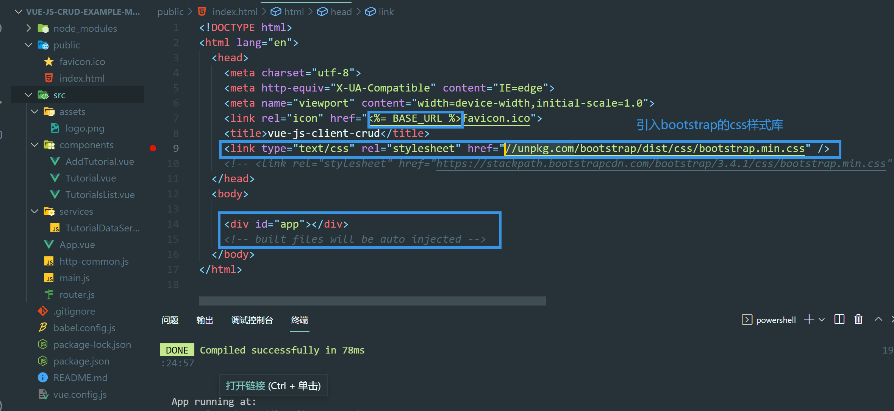
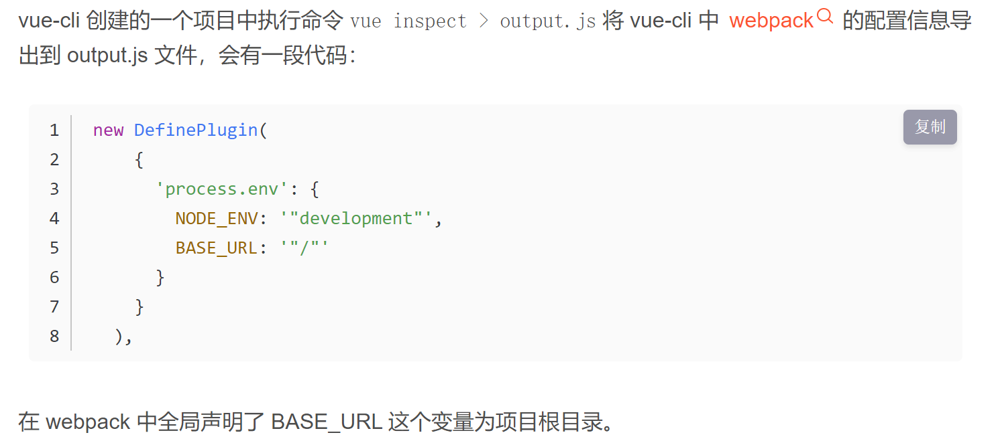
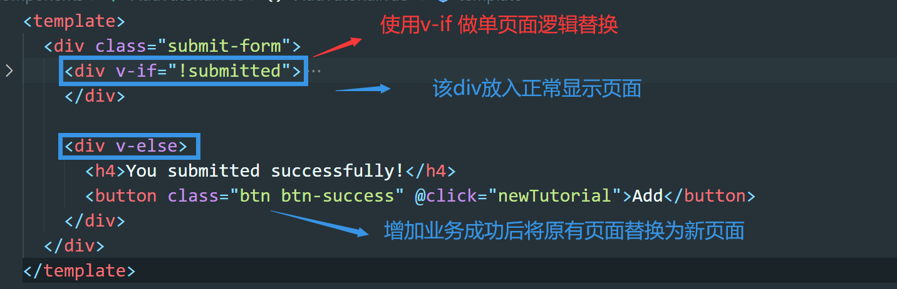
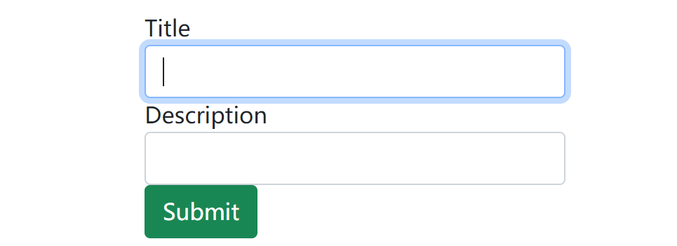
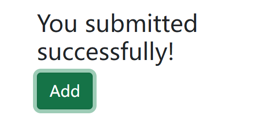

## vue前端项目研究

## public目录=>index.html



#### 引入bootstrap样式库

```html
<link type="text/css" rel="stylesheet" href="//unpkg.com/bootstrap/dist/css/bootstrap.min.css" />
```

#### 相对路径和项目根路径

```html
<link rel="icon" href="<%= BASE_URL %>favicon.ico">
<link rel="icon" href="/favicon.ico">
```

上面两个效果一样,public文件夹里的东西直接/或者<%= BASE_URL %>就可以访问到
毕竟webpack里的配置信息就是


## src目录

### components目录

#### AddTutorial.vue

##### 组件数据

```js
data() {
    return {
      tutorial: {
        id: null,
        title: "",
        description: "",
        published: false
      },
      submitted: false
    };
},
```


##### 页面提交替换



submitted的值 true或者false


##### 输入框页面

输入框vue代码



```html
<div v-if="!submitted">
    
    
  <div class="form-group">
    <label for="title">Title</label>
    <input
      type="text"
      class="form-control"
      id="title"
      required
      v-model="tutorial.title"
      name="title"
    />
  </div>

    
  <div class="form-group">
    <label for="description">Description</label>
    <input
      class="form-control"
      id="description"
      required
      v-model="tutorial.description"
      name="description"
    />
  </div>
  
  <button @click="saveTutorial" class="btn btn-success">Submit</button>
    
    
</div>
```

v-model和v-if的运用很好


##### 提交逻辑

submit按钮触发

```js
saveTutorial() {
    //把所有需要保存的数据包装成一个对象,当做参数传入进去
    var data = {
      title: this.tutorial.title,
      description: this.tutorial.description
    };

    TutorialDataService.create(data)
       //后端接口请求成功后
      .then(response => {
        // this.tutorial.id = response.data.id;
        console.log(response.data);
        //数据成功传入到后端,此时显示提交成功页面,submitted改为true
        this.submitted = true;
      })
      .catch(e => {
        //请求失败
        console.log(e);
     });
},
 
```

1.数组赋值为空很重要

2.对于请求后返回的http返回体成功处理


##### 再次添加逻辑

提交成功后触发,再次进入到添加页面



```js
newTutorial() {
    //通过修改submitted来改变页面
    this.submitted = false;
    //提交后输入框内容清空,,,因为该字段tutorial 被v-model修饰
    this.tutorial = {};
}
```


##### http请求配置


```js
import TutorialDataService from "../services/TutorialDataService";
```


## http-common.js

使用axios先封装一下

```js
import axios from "axios";

export default axios.create({
  //后端接口省略部分
  baseURL: "http://localhost:8080/api",
  headers: {
    "Content-type": "application/json"
  }
});
```

