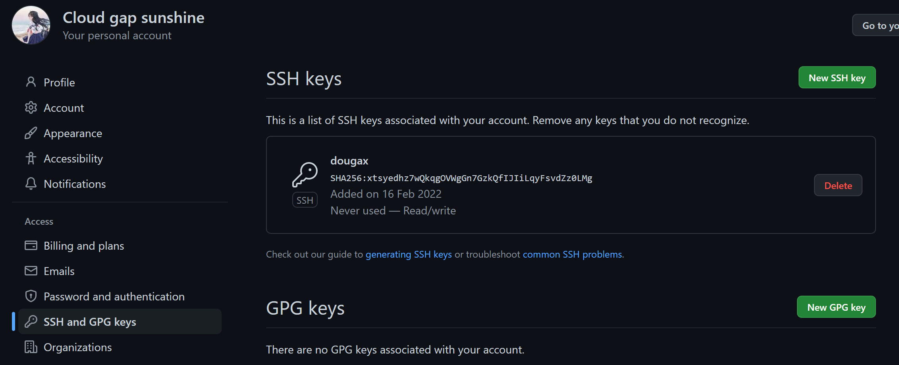

学习 git 之前，我们需要先明白一个概念

**版本控制！**

  

版本控制

版本控制git
-------

版本控制（Revision control）是一种在开发的过程中用于管理我们对文件、目录或工程等内容的修改历史，方便查看更改历史记录，备份以便恢复以前的版本的软件工程技术。

*   实现跨区域多人协同开发
    
*   追踪和记载一个或者多个文件的历史记录
    
*   组织和保护你的源代码和文档
    
*   统计工作量
    
*   并行开发、提高开发效率
    
*   跟踪记录整个软件的开发过程
    
*   减轻开发人员的负担，节省时间，同时降低人为错误
    

简单说就是用于管理多人协同开发项目的技术。

没有进行版本控制或者版本控制本身缺乏正确的流程管理，在软件开发过程中将会引入很多问题，如软件代码的一致性、软件内容的冗余、软件过程的事物性、软件开发过程中的并发性、软件源代码的安全性，以及软件的整合等问题。


##### 常见的版本控制工具

主流的版本控制器有如下这些：

*   **Git**
    
*   **SVN**（Subversion）
    
*   **CVS**（Concurrent Versions System）
    
*   **VSS**（Micorosoft Visual SourceSafe）
    
*   **TFS**（Team Foundation Server）
    
*   Visual Studio Online
    

现在影响力最大且使用最广泛的是 Git 与 SVN


##### 版本控制分类

**1、本地版本控制**

记录文件每次的更新，可以对每个版本做一个快照，或是记录补丁文件，适合个人用，如 RCS。


**2、集中版本控制  SVN**

所有的版本数据都保存在服务器上，协同开发者从服务器上同步更新或上传自己的修改


所有的版本数据都存在服务器上，用户的本地只有自己以前所同步的版本，如果不连网的话，用户就看不到历史版本，也无法切换版本验证问题，或在不同分支工作。而且，所有数据都保存在单一的服务器上，有很大的风险这个服务器会损坏，这样就会丢失所有的数据，当然可以定期备份。代表产品：SVN、CVS、VSS

**3、分布式版本控制 Git**

每个人都拥有全部的代码！安全隐患！

所有版本信息仓库全部同步到本地的每个用户，这样就可以在本地查看所有版本历史，可以离线在本地提交，只需在连网时 push 到相应的服务器或其他用户那里。由于每个用户那里保存的都是所有的版本数据，只要有一个用户的设备没有问题就可以恢复所有的数据，但这增加了本地存储空间的占用。

不会因为服务器损坏或者网络问题，造成不能工作的情况！


##### Git 与 SVN 的主要区别

SVN 是集中式版本控制系统，版本库是集中放在中央服务器的，而工作的时候，用的都是自己的电脑，所以首先要从中央服务器得到最新的版本，然后工作，完成工作后，需要把自己做完的活推送到中央服务器。集中式版本控制系统是必须联网才能工作，对网络带宽要求较高。


Git 是分布式版本控制系统，没有中央服务器，每个人的电脑就是一个完整的版本库，工作的时候不需要联网了，因为版本都在自己电脑上。协同的方法是这样的：比如说自己在电脑上改了文件 A，其他人也在电脑上改了文件 A，这时，你们两之间只需把各自的修改推送给对方，就可以互相看到对方的修改了。Git 可以直接看到更新了哪些代码和文件！

**Git 是目前世界上最先进的分布式版本控制系统。**

  

聊聊 Git 的历史

同生活中的许多伟大事物一样，Git 诞生于一个极富纷争大举创新的年代。

Linux 内核开源项目有着为数众广的参与者。绝大多数的 Linux 内核维护工作都花在了提交补丁和保存归档的繁琐事务上 (1991－2002 年间)。到 2002 年，整个项目组开始启用一个专有的分布式版本控制系统 BitKeeper 来管理和维护代码。

Linux 社区中存在很多的大佬！破解研究 BitKeeper ！

到了 2005 年，开发 BitKeeper 的商业公司同 Linux 内核开源社区的合作关系结束，他们收回了 Linux 内核社区免费使用 BitKeeper 的权力。这就迫使 Linux 开源社区 (特别是 Linux 的缔造者 Linus Torvalds) 基于使用 BitKeeper 时的经验教训，开发出自己的版本系统。（2 周左右！） 也就是后来的 Git！

**Git 是目前世界上最先进的分布式版本控制系统。**

Git 是免费、开源的，最初 Git 是为辅助 Linux 内核开发的，来替代 BitKeeper！


Linux 和 Git 之父李纳斯 · 托沃兹（Linus Benedic Torvalds）1969、芬兰

  

Git 环境配置


环境搭建


打开 [git 官网] https://git-scm.com/，下载 git 对应操作系统的版本。

所有东西下载慢的话就可以去找镜像！

官网下载太慢，我们可以使用淘宝镜像下载：http://npm.taobao.org/mirrors/git-for-windows/


Git 配置
------

安装成功后在开始菜单中会有 Git 项，菜单下有 3 个程序：任意文件夹下右键也可以看到对应的程序！


**Git Bash：**Unix 与 Linux 风格的命令行，使用最多，推荐最多

**Git CMD：**Windows 风格的命令行

**Git GUI**：图形界面的 Git，不建议初学者使用，尽量先熟悉常用命令

```shell
#查看系统config
git config --system --list
　　
#查看当前用户（global）配置
git config --global  --list
```

右键点击git bush here


所有的配置文件，其实都保存在本地！

查看配置 git config -l


查看不同级别的配置文件：  

```shell
git config --global user.name  #查看名称
git config --global user.email  #邮箱
#这个用户名和密码仅仅只是区分 不同合作开发者的  和github以及gitee没关系

```


##### 设置用户名与邮箱（用户标识，必要）


当你安装 Git 后首先要做的事情是设置你的用户名称和 e-mail 地址。这是非常重要的，因为每次 Git 提交都会使用该信息。它被永远的嵌入到了你的提交中：

```shell
$ git config --global user.name "username"
$ git config --global user.email "email@example.com"
```


只需要做一次这个设置，如果你传递了 --global 选项，因为 Git 将总是会使用该信息来处理你在系统中所做的一切操作。如果你希望在一个特定的项目中使用不同的名称或 e-mail 地址，你可以在该项目中运行该命令而不要 --global 选项。总之 --global 为全局配置，不加为某个项目的特定配置。


### gitee/hub配置git

这个其实可以作为大家未来找工作的一个重要信息！

设置本机绑定 SSH 公钥，实现免密码登录！（免密码登录，这一步挺重要的，码云是远程仓库，我们是平时工作在本地仓库！)

```shell
# 进入 C:\Users\Administrator\.ssh 目录
# 生成公钥
ssh-keygen
```

3将公钥信息 public key 添加到码云账户中即可！

使用码云创建一个自己的仓库！

许可证：开源是否可以随意转载，开源但是不能商业使用，不能转载，...  限制！

克隆到本地！

IDEA 中集成 Git

## 配置ssh公钥

```shell
ssh-keygen -t rsa -C "注册邮箱"=
```

然后用户主目录/.ssh/下有两个文件，id_rsa是私钥，id_rsa.pub是公钥


将上面的id_rsa.pub文件里的内容复制,放进github里的ssh中




测试是否连接成功
ssh -T git@github.com


**Git 相关的配置文件：**

1）、Git\etc\gitconfig  ：Git 安装目录下的 gitconfig     --system 系统级

2）、C:\Users\Administrator\ .gitconfig    只适用于当前登录用户的配置  --global 全局

这里可以直接编辑配置文件，通过命令设置后会响应到这里。

## 提交本地仓库

```shell
dougax@lyh MINGW64 /d/github/test (master)
$ vim a.txt

dougax@lyh MINGW64 /d/github/test (master)

#先将文件放入到暂存区
$ git add a.txt
warning: LF will be replaced by CRLF in a.txt.
The file will have its original line endings in your working directory

dougax@lyh MINGW64 /d/github/test (master)
#如果感觉刚才那个文件还需要改,可以先从暂存区退回来

#git rm --cached a.txt


#查看状态
$ git status
On branch master

No commits yet

Changes to be committed:
  (use "git rm --cached <file>..." to unstage)
        new file:   a.txt


dougax@lyh MINGW64 /d/github/test (master)

#再将暂存区中的文件提交到仓库
$ git commit a.txt
warning: LF will be replaced by CRLF in a.txt.
The file will have its original line endings in your working directory
#下面是这次提交新生成的版本号,右边是提交信息
[master (root-commit) 0786e5a] this is the first file i have commited
 1 file changed, 1 insertion(+)
 create mode 100644 a.txt
#然后输入提交信息,相当于注释
```

当文件被更改后查看状态

commit -a直接将修改后的文件提交到主分支中,一步到位

```shell
$ git status
On branch master
Changes not staged for commit:
  (use "git add <file>..." to update what will be committed)
  (use "git restore <file>..." to discard changes in working directory)
        modified:   a.txt

no changes added to commit (use "git add" and/or "git commit -a")


dougax@lyh MINGW64 /d/github/test (master)
$ git commit -a
warning: LF will be replaced by CRLF in a.txt.
The file will have its original line endings in your working directory
[master 724adb9] second,,,,,,,,,,,second
 1 file changed, 6 insertions(+), 1 deletion(-)

```

-m直接写提交信息,不用再进入到vim中再写了

```shell
dougax@lyh MINGW64 /d/github/test (master)
$ vim a.txt

dougax@lyh MINGW64 /d/github/test (master)
$ git add a.txt
warning: LF will be replaced by CRLF in a.txt.
The file will have its original line endings in your working directory

dougax@lyh MINGW64 /d/github/test (master)
$ git commit -m "the third try" a.txt
warning: LF will be replaced by CRLF in a.txt.
The file will have its original line endings in your working directory
[master b7779e5] the third try
 1 file changed, 5 insertions(+), 1 deletion(-)

```


工作流程
----

初始化本地
创建远程仓库
本地建立密钥并放到远程仓库
remote建立连接创建仓库别名
clone版本库
开发
add .  commit   push
push失败,pull merge
push


git 的工作流程一般是这样的：

１、在工作目录中添加、修改文件；

２、将需要进行版本管理的文件放入暂存区域；

３、将暂存区域的文件提交到 git 仓库。

因此，git 管理的文件有三种状态：已修改（modified）, 已暂存（staged）, 已提交 (committed)


Git 多人项目合作开发


本地仓库搭建
------

git init

> init：初始化当前目录为仓库，初始化后会自动将当前仓库设置为master

```shell
#在要建立本地仓库的文件夹下右键  git bash here

# 在当前目录新建一个Git代码库

$ git init

dougax@lyh MINGW64 /d/github/test
$ git init
Initialized empty Git repository in D:/github/test/.git/
```

创建本地仓库的条件是需要一个空目录，然后在空目录中初始化你的项目

如我想创建一个名为“test”的空项目

1.创建目录

```bash
mkdir test
```

2.进入目录

```bash
cd test
```

3.使用git init初始化当前仓库

```bash
git init
```

ls-ah查看隐藏文件, 查看被设置为仓库的目录所生成的 .git 隐藏文件


创建本地仓库的方法有两种：一种是创建全新的仓库，另一种是克隆远程仓库。

1、创建全新的仓库，需要用 GIT 管理的项目的根目录执行：


2、执行后可以看到，仅仅在项目目录多出了一个. git 目录，关于版本等的所有信息都在这个目录里面。

克隆远程仓库
------

```bash
git remote add url   #先remote连接
```

1、另一种方式是克隆远程目录，由于是将远程服务器上的仓库完全镜像一份至本地！

```shell
#先 创建一个目录 ,然后在该目录下打开终端,直接拉取,
#不用init初始化仓库,这个clone会自动生成一个仓库

$ git clone -o 远程主机别名 [url]  # https://github.com/lTbgykio/Books-Free-Books.git
```


上面远程主机别名起叫elecbook
然后remote 查看远程主机名


文件的四种状态
-------

```shell
#查看指定文件状态
git status [filename]

#查看所有文件状态
git status

# git add .                  添加所有文件到暂存区
# git commit -m "消息内容"    提交暂存区中的内容到本地仓库 -m 提交信息
```

版本控制就是对文件的版本控制，要对文件进行修改、提交等操作，首先要知道文件当前在什么状态，不然可能会提交了现在还不想提交的文件，或者要提交的文件没提交上。

*   Untracked: 未跟踪, 此文件在文件夹中, 但并没有加入到 git 库, 不参与版本控制. 通过 git add 状态变为 Staged.
    
*   Unmodify: 文件已经入库, 未修改, 即版本库中的文件快照内容与文件夹中完全一致. 这种类型的文件有两种去处, 如果它被修改, 而变为 Modified. 如果使用 git rm 移出版本库, 则成为 Untracked 文件
    
*   Modified: 文件已修改, 仅仅是修改, 并没有进行其他的操作. 这个文件也有两个去处, 通过 git add 可进入暂存 staged 状态, 使用 git checkout 则丢弃修改过, 返回到 unmodify 状态, 这个 git checkout 即从库中取出文件, 覆盖当前修改 !
    
*   Staged: 暂存状态. 执行 git commit 则将修改同步到库中, 这时库中的文件和本地文件又变为一致, 文件为 Unmodify 状态. 执行 git reset HEAD filename 取消暂存, 文件状态为 Modified
    


  


GIT 分支命令
---------

```shell
# 列出所有本地分支
git branch

# 列出所有远程分支
git branch -r

# 新建一个分支，但依然停留在当前分支
git branch [branch-name]

# 新建一个分支，并切换到该分支
git checkout -b [branch]

# 合并指定分支到当前分支
$ git merge [branch]

# 删除分支
$ git branch -d [branch-name]

# 删除远程分支
$ git push origin --delete [branch-name]
$ git branch -dr [remote/branch]
```

分支在 GIT 中相对较难，分支就是科幻电影里面的平行宇宙，如果两个平行宇宙互不干扰，那对现在的你也没啥影响。不过，在某个时间点，两个平行宇宙合并了，我们就需要处理一些问题了！


git 分支中常用指令：

```shell
# 列出所有本地分支
git branch -v
# 列出所有远程分支
git branch -r
# 新建一个分支，但依然停留在当前分支
git branch [branch-name]
# 新建一个分支，并切换到该分支
git checkout -b [branch]
# 切换分支
git checkout [branch]
# 合并指定分支到当前分支
$ git merge [branch]
# 删除分支
$ git branch -d [branch-name]
# 删除远程分支
$ git push origin --delete [branch-name]
$ git branch -dr [remote/branch]
```

创建一个分支

```shell
$ git branch -v
* master b7779e5 the third try

dougax@lyh MINGW64 /d/github/test (master)
$ git branch fix_shit

dougax@lyh MINGW64 /d/github/test (master)
$ git checkout fix_shit
Switched to branch 'fix_shit'

dougax@lyh MINGW64 /d/github/test (fix_shit)
```

IDEA 中操作  


<font color=#FFCCCC style=" font-weight:bold;">如果同一个文件在合并分支时都被修改了则会引起冲突：解决的办法是我们可以修改冲突文件后重新提交！选择要保留他的代码还是你的代码！</font>

master 主分支应该非常稳定，用来发布新版本，一般情况下不允许在上面工作，工作一般情况下在新建的 dev 分支上工作，工作完后，比如上要发布，或者说 dev 分支代码稳定后可以合并到主分支 master 上来。


## 分支合并

<font color=#FFCCCC style=" font-weight:bold;">没学会</font>

```shell
dougax@lyh MINGW64 /d/github/test (fix_shit)
$ vim a.txt

dougax@lyh MINGW64 /d/github/test (fix_shit)
$ git add a.txt

dougax@lyh MINGW64 /d/github/test (fix_shit)
$ git commit -m "edit by fix_shit 222 " a.txt

dougax@lyh MINGW64 /d/github/test (fix_shit)
$ git checkout master
Switched to branch 'master'

dougax@lyh MINGW64 /d/github/test (master)
$ vim a.txt

dougax@lyh MINGW64 /d/github/test (master)
$ git add a.txt

dougax@lyh MINGW64 /d/github/test (master)
$ git commit -m "edit by master 111 " a.txt
[master 7a16ec4] edit by master 111

#切换到fix_shit分支将master分支合并到fix上
dougax@lyh MINGW64 /d/github/test (master)
$ git checkout fix_shit
Switched to branch 'fix_shit'

dougax@lyh MINGW64 /d/github/test (fix_shit)
$ git merge master
Auto-merging a.txt
CONFLICT (content): Merge conflict in a.txt
Automatic merge failed; fix conflicts and then commit the result.

dougax@lyh MINGW64 /d/github/test (fix_shit|MERGING)
$ vim a.txt

dougax@lyh MINGW64 /d/github/test (fix_shit|MERGING)
$ git add a.txt

dougax@lyh MINGW64 /d/github/test (fix_shit|MERGING)
$ git commit -m "resolve conflect" a.txt
fatal: cannot do a partial commit during a merge.

dougax@lyh MINGW64 /d/github/test (fix_shit|MERGING)
$ git commit -m "resolve conflect"
[fix_shit 013663b] resolve conflect

dougax@lyh MINGW64 /d/github/test (fix_shit)

```

解决冲突后,此时仍然有两个分支,master那个分支保留,fix_shit由于合并了master,所以文件里就会有修改建议


## 暂存区,工作区和远程仓库

Git 本地有三个工作区域：工作目录（Working Directory）、暂存区 (Stage/Index)、资源库(Repository 或 Git Directory)。如果在加上远程的 git 仓库(Remote Directory) 就可以分为四个工作区域。文件在这四个区域之间的转换关系如下：


*   Workspace：工作区，就是你平时存放项目代码的地方

*   Index / Stage：暂存区，用于临时存放你的改动，事实上它只是一个文件，保存即将提交到文件列表信息

*   Repository：仓库区（或本地仓库），就是安全存放数据的位置，这里面有你提交到所有版本的数据。其中 HEAD 指向最新放入仓库的版本

*   Remote：远程仓库，托管代码的服务器，可以简单的认为是你项目组中的一台电脑用于远程数据交换

本地的三个区域确切的说应该是 git 仓库中 HEAD 指向的版本：


*   Directory：使用 Git 管理的一个目录，也就是一个仓库，包含我们的工作空间和 Git 的管理空间。

*   WorkSpace：需要通过 Git 进行版本控制的目录和文件，这些目录和文件组成了工作空间。

*   .git：存放 Git 管理信息的目录，初始化仓库的时候自动创建。

*   Index/Stage：暂存区，或者叫待提交更新区，在提交进入 repo 之前，我们可以把所有的更新放在暂存区。

*   Local Repo：本地仓库，一个存放在本地的版本库；HEAD 会只是当前的开发分支（branch）。

*   Stash：隐藏，是一个工作状态保存栈，用于保存 / 恢复 WorkSpace 中的临时状态。


工作目录（WorkSpace) 一般就是你希望 Git 帮助你管理的文件夹，可以是你项目的目录，也可以是一个空目录，建议不要有中文。

日常使用只要记住下图 6 个命令：


通过ll来查看哪些文件已经存入到暂存区(index/stage)中


上面蓝色的是已经add到暂存区中的文件


git checkout -- \<file> 表示将文件从暂存区的file版本替换到工作区的file版本，如果暂存区没有，就从版本库中的file版本替换工作区的file版本；
当执行 “git checkout .” 或者 “git checkout – ” 命令时，会用暂存区全部或指定的文件替换工作区的文件。这个操作很危险，会清除工作区中未添加到暂存区的改动。

git rm --cached \<file> 只表示将暂存区的file文件删除。


## 关联远程库pull操作

> remote add url 关联另一个远程仓库别名
> git remote 查看所有关联的远程仓库名

```bash
#通过复制github上自己的ssh来关联自己的远程代码仓库
dougax@lyh MINGW64 /d/github/test/jiayou2021 (main)
$ git remote add origin_1 git@github.com:1759728350/jiayou2021.git
#给该远程仓库起的别名为origin_1
```


`git pull`命令作用：从另一个存储库或**本地分支关联的远端分支**获取最新代码，并与本地代码资源整合。
`git pull`命令执行过程：取回远程主机某个分支的更新，再与本地的指定分支合并（可能存在需手动解决的冲突）。

```shell
$ git pull <远程主机名> <远程分支名>:<本地分支名>
```


```bash
#查看你远程添加了几个仓库
dougax@lyh MINGW64 /d/github/test/jiayou2021 (main)
$ git remote -v
origin  git@github.com:1759728350/jiayou2021.git (fetch)
origin  git@github.com:1759728350/jiayou2021.git (push)
origin_1        git@github.com:1759728350/jiayou2021.git (fetch)
origin_1        git@github.com:1759728350/jiayou2021.git (push)

dougax@lyh MINGW64 /d/github/test/jiayou2021 (main)
$ git pull origin_1 main


dougax@lyh MINGW64 /d/github/test/jiayou2021 (main)
$ ll
total 2
-rw-r--r-- 1 dougax 197121 47 Feb 18 10:49 README.md
-rw-r--r-- 1 dougax 197121 19 Feb 18 10:50 first.txt

dougax@lyh MINGW64 /d/github/test/jiayou2021 (main)
$ git branch -v
* main f5d334f [ahead 1] push test

dougax@lyh MINGW64 /d/github/test/jiayou2021 (main)
$ git push origin_1 main
```

## 两仓库分支合并

### <font color=#FFCCCC style=" font-weight:bold;">没学会</font>

```bash
dougax@lyh MINGW64 /d/github/auto
$ git clone https://github.com/chen-kai-1/meituan-shenquan.git
Cloning into 'meituan-shenquan'...

#这个目录下还不是仓库,所以要进入下一目录
dougax@lyh MINGW64 /d/github/auto
$ git branch
fatal: not a git repository (or any of the parent directories): .git

dougax@lyh MINGW64 /d/github/auto
$ ll
total 0
drwxr-xr-x 1 dougax 197121 0 Feb 18 13:06 meituan-shenquan/

dougax@lyh MINGW64 /d/github/auto
$ cd meituan-shenquan/
#可以看出当前是仓库目录
dougax@lyh MINGW64 /d/github/auto/meituan-shenquan (master)
$ ll
total 124
-rw-r--r-- 1 dougax 197121  1083 Feb 18 13:06 LICENSE
-rwxr-xr-x 1 dougax 197121 43942 Feb 18 13:06 mt-action-scripts.py*
-rwxr-xr-x 1 dougax 197121 55031 Feb 18 13:06 mt-terminal-scripts.py*
-rw-r--r-- 1 dougax 197121 18132 Feb 18 13:06 readme.md
#查看分支
dougax@lyh MINGW64 /d/github/auto/meituan-shenquan (master)
$ git branch
* master
#添加自己的远程仓库  并起别名为my
dougax@lyh MINGW64 /d/github/auto/meituan-shenquan (master)
$ git remote add my git@github.com:1759728350/jiayou2021.git
#查看有哪些远程仓库   看自己的远程仓库是否已经添加
dougax@lyh MINGW64 /d/github/auto/meituan-shenquan (master)
$ git remote
my
origin

#抓取远程仓库的分支,注意这里只能用fetch,不能用pull
dougax@lyh MINGW64 /d/github/auto/meituan-shenquan (master)
$ git fetch my
 * [new branch]      main       -> my/main
#创建切换并创建mix分支,关联my/main分支
dougax@lyh MINGW64 /d/github/auto/meituan-shenquan (master)
$ git checkout -b mix my/main
Switched to a new branch 'mix'
Branch 'mix' set up to track remote branch 'main' from 'my'.
#查看mix分支是否已成功创建
dougax@lyh MINGW64 /d/github/auto/meituan-shenquan (mix)
$ git branch
  master
* mix
#将两分支合并,合并到mix分支中,此处失败
dougax@lyh MINGW64 /d/github/auto/meituan-shenquan (mix)
$ git merge master
fatal: refusing to merge unrelated histories
#上网查到原因是两个分支是两个不同的版本，具有不同的提交历史
#需要加--allow-unrelated-histories 强行合并
dougax@lyh MINGW64 /d/github/auto/meituan-shenquan (mix)
$ git merge master --allow-unrelated-histories
Merge made by the 'ort' strategy.
 .github/.DS_Store            |  Bin 0 -> 6148 bytes
 .github/workflows/aciton.yml |   43 ++
 LICENSE                      |   21 +
 mt-action-scripts.py         |  882 +++++++++++++++++++++++++++++++++
 mt-terminal-scripts.py       | 1122 ++++++++++++++++++++++++++++++++++++++++++
 readme.md                    |  182 +++++++
 6 files changed, 2250 insertions(+)
 create mode 100644 .github/.DS_Store
 create mode 100644 .github/workflows/aciton.yml
 create mode 100644 LICENSE
 create mode 100644 mt-action-scripts.py
 create mode 100644 mt-terminal-scripts.py
 create mode 100644 readme.md
#查看文件是否合并进去
dougax@lyh MINGW64 /d/github/auto/meituan-shenquan (mix)
$ ll
total 125
-rw-r--r-- 1 dougax 197121  1083 Feb 18 13:17 LICENSE
-rw-r--r-- 1 dougax 197121    20 Feb 18 13:13 first.txt
-rwxr-xr-x 1 dougax 197121 43942 Feb 18 13:17 mt-action-scripts.py*
-rwxr-xr-x 1 dougax 197121 55031 Feb 18 13:17 mt-terminal-scripts.py*
-rw-r--r-- 1 dougax 197121 18132 Feb 18 13:17 readme.md

#将当前分支提交到远程主机仓库my(这是本机起的别名)的main分支上
dougax@lyh MINGW64 /d/github/auto/meituan-shenquan (mix)
$ git push my mix:main
#git push <远程主机名> <本地分支名> :<远程分支名>
```


## push操作

作用:git push命令用于将本地分支的更新推送到远程主机对应分支

git push的一般形式为 git push <远程主机名> <本地分支名> :<远程分支名> ，例如 git push origin master：refs/for/master ，即是将本地的master分支推送到远程主机origin上的对应master分支， origin 是远程主机名，

第一个master是本地分支名，第二个master是远程分支名。


#### git push origin master

如果远程分支被省略，如上则表示将本地分支推送到与之存在追踪关系的远程分支**（通常两者同名）**，如果该远程分支不存在，则会被新建


```shell
dougax@lyh MINGW64 /d/github/test/jiayou2021 (main)
$ vim first.txt

dougax@lyh MINGW64 /d/github/test/jiayou2021 (main)
$ git add first.txt
warning: LF will be replaced by CRLF in first.txt.
The file will have its original line endings in your working directory

dougax@lyh MINGW64 /d/github/test/jiayou2021 (main)
$ git commit -m "push test" first.txt
warning: LF will be replaced by CRLF in first.txt.
The file will have its original line endings in your working directory
[main f5d334f] push test
 1 file changed, 1 insertion(+)
 create mode 100644 first.txt

dougax@lyh MINGW64 /d/github/test/jiayou2021 (main)
$ git status
On branch main
Your branch is ahead of 'origin/main' by 1 commit.
  (use "git push" to publish your local commits)

nothing to commit, working tree clean

dougax@lyh MINGW64 /d/github/test/jiayou2021 (main)
$ git remote -v
origin  git@github.com:1759728350/jiayou2021.git (fetch)
origin  git@github.com:1759728350/jiayou2021.git (push)
```


## 删除文件操作

git删除已经push的远程文件或文件夹

在使用git提交项目时，有时候会误提交一下文件，比如：.iml，.project，*.settings，.idea/*等文件，有时候这些不需要提交的文件可以加入到.gitignore，在提交的时候可以忽略这些文件，但是有时候我们忘记，就会出现误提交一些文件，这时就需要我们删除误提交的文件，<font color=#99CCFF style=" font-weight:bold;">下面是使用git命令来删除已经push的误提交的文件</font>：

注意：<font color=#FFCCCC style=" font-weight:bold;">该方法适用于我们需要删除暂存区或分支上的文件, 但本地又需要使用, 只是不希望这个文件被版本控制</font>

1.**预览暂存区我们需要删除的文件或文件夹**（此步骤可以预览我们要删除的文件或文件夹是否是我们要删除的，有没有或多或少删除）
比如：我们就拿删除 integration-engine-stream.iml 作为例子

```shell
git rm -r -n --cached 文件/文件夹
$ git add .    #虽然有些IDE在代码更新后会自动add，但是还是最好手动add一下，以防万一
$ git rm -r -n --cached integration-engine-stream.iml
rm 'data-integration-engine-stream/integration-engine-stream.iml'
```

使用 -n 参数，执行命令时，是不会删除任何文件，而是展示此命令要删除的文件列表预览。由此我们看到只有要删除的文件 integration-engine-stream.iml

**git rm -r --cached file/dir**参数为递归删除，递归删除暂存区中的文件夹/文件

2.确认无误后删除暂存区文件或文件夹，只需去掉 -n 参数
3.将本次暂存区的更改提交

```shell
$ git commit -m "delete remote integration-engine-stream.iml"
```

4.push

```shell
$ git push [remote] [branch]
```


## clone和pull的区别

git clone
是在本地没有版本库的时候，从远程服务器克<font color=#FFCCCC style=" font-weight:bold;">隆整个版本库,还有所有分支</font>到本地，是一个本地从无到有的过程。

git pull
在本地有版本库的情况下，从远程库获取最新commit 数据（如果有的话），<font color=#FFCCCC style=" font-weight:bold;">并merge</font>（合并）到本地。

git pull = git fetch + git merge

##### 使用场景

通常情况下，远程操作的第一步，是使用git clone从远程主机克隆一个版本库到本地。

本地修改代码后，每次从本地仓库push到远程仓库之前都要先进行git pull操作，**保证push到远程仓库时没有版本冲突**。也就是说,在这个仓库只有我一个人在提交时,没有第二个人commit,即使不pull也是可以随意push的,因为版本并没有冲突

## 报错解决


```shell
$ git push note master
To github.com:1759728350/note.git
 ! [rejected]        master -> master (non-fast-forward)
error: failed to push some refs to 'github.com:1759728350/note.git'
hint: Updates were rejected because the tip of your current branch is behind
hint: its remote counterpart. Integrate the remote changes (e.g.
hint: 'git pull ...') before pushing again.
hint: See the 'Note about fast-forwards' in 'git push --help' for details.

dougax@lyh MINGW64 /d/elecbook (master)
$ git pull --rebase note master
From github.com:1759728350/note

 * branch            master     -> FETCH_HEAD
   Successfully rebased and updated refs/heads/master.
```


## 忽略文件

```
#为注释
*.txt        #忽略所有 .txt结尾的文件,这样的话上传就不会被选中！
!lib.txt     #但lib.txt除外
/temp        #仅忽略项目根目录下的TODO文件,不包括其它目录temp
build/       #忽略build/目录下的所有文件
doc/*.txt    #会忽略 doc/notes.txt 但不包括 doc/server/arch.txt
```

有些时候我们不想把某些文件纳入版本控制中，比如数据库文件，临时文件，设计文件等

在主目录下建立 ".gitignore" 文件，此文件有如下规则：

1.  忽略文件中的空行或以井号（#）开始的行将会被忽略。

2.  可以使用 Linux 通配符。例如：星号（*）代表任意多个字符，问号（？）代表一个字符，方括号（[abc]）代表可选字符范围，大括号（{string1,string2,...}）代表可选的字符串等。

3.  如果名称的最前面有一个感叹号（!），表示例外规则，将不被忽略。

4.  如果名称的最前面是一个路径分隔符（/），表示要忽略的文件在此目录下，而子目录中的文件不忽略。

5.  如果名称的最后面是一个路径分隔符（/），表示要忽略的是此目录下该名称的子目录，而非文件（默认文件或目录都忽略）。使用码云
