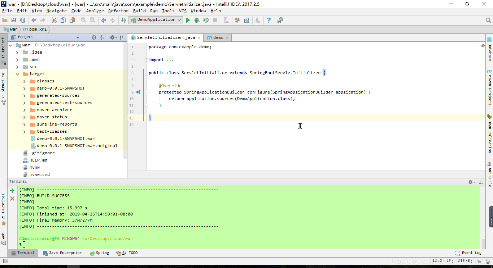

首先给大家来讲一个我们遇到的一个奇怪的问题:

1. 我的一个 springboot 项目，用 mvn install 打包成 [jar](https://so.csdn.net/so/search?q=jar&spm=1001.2101.3001.7020)，换一台有 jdk 的机器就直接可以用 java -jar 项目名. jar 的方式运行，没任何问题，为什么这里不需要 tomcat 也可以运行了？  
2. 然后我打包成 war 放进 [tomcat](https://so.csdn.net/so/search?q=tomcat&spm=1001.2101.3001.7020) 运行，发现端口号变成 tomcat 默认的 8080（我在 server.port 中设置端口 8090）项目名称也必须加上了。  
也就是说我在原来的机器的 IDEA 中运行，项目接口地址为 ip:8090/listall, 打包放进另一台机器的 tomcat 就变成了 ip:8080 / 项目名 / listall。这又是为什么呢？

**通过 jar 运行实际上是启动了内置的 tomcat, 所以用的是应用的配置文件中的端口  
直接部署到 tomcat 之后，内置的 tomcat 就不会启用，所以相关配置就以安装的 tomcat 为准，与应用的配置文件就没有关系了**

哎，现在学编程的基本都不会教历史了，也没人有兴趣去钻研。总体来说吧，很多年前，Sun 还在世的那个年代，在度过了早期用 C++ 写 Html 解析器的蛮荒时期后，有一批最早的脚本程序进入了 cgi 时代，此时的 Sun 决定进军这个领域，为了以示区别并显得自己高大上，于是研发了 servlet 标准，搞出了最早的 jsp。并给自己起了个高大上的称号 JavaEE （ [Java](https://so.csdn.net/so/search?q=Java&spm=1001.2101.3001.7020) 企业级应用标准，我呸，不就是一堆服务器以 http 提供服务吗，吹逼）。既然是企业级标准那自然得有自己的服务器标准。于是 Servlet 标准诞生，以此标准实现的服务器称为 Servle 容器服务器，Tomcat 就是其中代表，被 Sun 捐献给了 Apache 基金会，那个时候的 Web 服务器还是个高大上的概念，当时的 Java Web 程序的标准就是 War 包 (其实就是个 Zip 包)，这就是 War 包的由来。后来随着服务器领域的屡次进化，人们发现我们为什么要这么笨重的 Web 服务器，还要实现一大堆 Servlet 之外的管理功能，简化一下抽出核心概念 servlet 不是更好吗，最早这么干的似乎是 Jetty，出现了可以内嵌的 Servelet 服务器。去掉了一大堆非核心功能。后来 tomcat 也跟进了，再后来，本来很笨重的传统 JavaEE 服务器 Jboss 也搞了个 undertow 来凑热闹。正好这个时候微服务的概念兴起，“ use Jar，not War ”。要求淘汰传统 Servlet 服务器的呼声就起来了。

### jar 包和 war 包的区别：

1、war 是一个 web 模块，其中需要包括 WEB-INF，是可以直接运行的 WEB 模块；jar 一般只是包括一些 class 文件，在声明了 Main_class 之后是可以用 java 命令运行的。

2、war 包是做好一个 web 应用后，通常是网站，打成包部署到容器中；jar 包通常是开发时要引用通用类，打成包便于存放管理。

3、war 是 Sun 提出的一种 Web 应用程序格式，也是许多文件的一个压缩包。这个包中的文件按一定目录结构来组织；classes 目录下则包含编译好的 Servlet 类和 Jsp 或 Servlet 所依赖的其它类（如 JavaBean）可以打包成 jar 放到 WEB-INF 下的 lib 目录下。

**JAR** 文件格式以流行的 ZIP 文件格式为基础。与 ZIP 文件不同的是，JAR 文件不仅用于压缩和发布，而且还用于部署和封装库、组件和插件程序，并可被像编译器和 JVM 这样的工具直接使用。

【格式特点】：

1.  安全性　可以对 JAR 文件内容加上数字化签名。这样，能够识别签名的工具就可以有选择地为您授予软件安全特权，这是其他文件做不到的，它还可以检测代码是否被篡改过。
    
2.  减少下载时间　如果一个 applet 捆绑到一个 JAR 文件中，那么浏览器就可以在一个 HTTP 事务中下载这个 applet 的类文件和相关的资源，而不是对每一个文件打开一个新连接。
    
3.  压缩：JAR 格式允许您压缩文件以提高存储效率。
    
4.  传输平台扩展：Java 扩展框架（Java Extensions Framework）提供了向 Java 核心平台添加功能的方法，这些扩展是用 JAR 文件打包的（Java 3D 和 JavaMail 就是由 Sun 开发的扩展例子）。
    

**WAR 文件：**就是一个 Web 应用程序，建立 WAR 文件，就是把整个 Web 应用程序（不包括 Web 应用程序层次结构的根目录）压缩起来，指定一个 war 扩展名。

【建立的条件】：

1.  需要建立正确的 Web 应用程序的目录层次结构。
    
2.  建立 WEB-INF 子目录，并在该目录下建立 classes 与 lib 两个子目录。
    
3.  将 Servlet 类文件放到 WEB-INF\classes 目录下，将 Web 应用程序所使用 Java 类库文件（即 JAR 文件）放到 WEB-INF\lib 目录下。
    
4.  将 JSP 页面或静态 HTML 页面放到上下文根路径下或其子目录下。
    
5.  建立 META-INF 目录，并在该目录下建立 context.xml 文件。
    

### 下面给大家讲讲怎么将 springboot 项目打包成 jar 和 war

SpringBoot 项目打包成 jar 很简单，也是 SpringBoot 的常用打包格式；本篇博客将 SpringBoot 打包成 jar 和 war 两种方式都记录下来；   
先介绍将 SpringBoot 打包成 jar 包的方式：（以下示例是在 idea 中演示） 

###   
一、打包成 jar 


1）先 new 一个 [Spring](https://so.csdn.net/so/search?q=Spring&spm=1001.2101.3001.7020) Starter Project 



这里注意 packaging 默认为 jar, 不用修改.

2）创建完成后项目的 pom 如下：

```
<?xml version="1.0" encoding="UTF-8"?>
<project xmlns="http://maven.apache.org/POM/4.0.0" xmlns:xsi="http://www.w3.org/2001/XMLSchema-instance"
	xsi:schemaLocation="http://maven.apache.org/POM/4.0.0 http://maven.apache.org/xsd/maven-4.0.0.xsd">
	<modelVersion>4.0.0</modelVersion>
	<parent>
		<groupId>org.springframework.boot</groupId>
		<artifactId>spring-boot-starter-parent</artifactId>
		<version>2.1.4.RELEASE</version>
		<relativePath/> <!-- lookup parent from repository -->
	</parent>
	<groupId>com.example</groupId>
	<artifactId>demo</artifactId>
	<version>0.0.1-SNAPSHOT</version>
	<name>demo</name>
	<description>Demo project for Spring Boot</description>
 
	<properties>
		<java.version>1.8</java.version>
	</properties>
 
	<dependencies>
		<dependency>
			<groupId>org.springframework.boot</groupId>
			<artifactId>spring-boot-starter</artifactId>
		</dependency>
 
		<dependency>
			<groupId>org.springframework.boot</groupId>
			<artifactId>spring-boot-starter-test</artifactId>
			<scope>test</scope>
		</dependency>
	</dependencies>
 
	<build>
		<plugins>
			<plugin>
				<groupId>org.springframework.boot</groupId>
				<artifactId>spring-boot-maven-plugin</artifactId>
			</plugin>
		</plugins>
	</build>
 
</project>
```

3）打成 jar 包（通过 [maven](https://so.csdn.net/so/search?q=maven&spm=1001.2101.3001.7020) 命令的方式）：   
在 Terminal 窗口, 使用 mvn clean package 命令打包： 

然后在 target 目录下就能看到打包好的 jar 包了


### 二、打包成 war 包形式 


1）可以在刚才创建的项目上做改动, 首先打包成 war 需要一个 ServletInitializer 类，这个类的位置需要和启动类在同一个文件下


 （如果一开始选择 war 包形式，会自动创建此类）   
2）修改 pom.xml   
修改 pom.xml 的 war 将原先的 jar 改为 war;   

3) 如果我们的 SpringBoot 是使用 html 作为前端页面开发没有问题，但是如果我们想用 jsp 开发，这个时候就需要配置一些依赖了：主要是排除 SpringBoot 的内置 Tomcat, 添加 javax.servlet-api 和 tomcat-servlet-api（SpringMVC 还需要配置后缀）；   
最后的 pom.xml 如下：

```xml
<?xml version="1.0" encoding="UTF-8"?>
<project xmlns="http://maven.apache.org/POM/4.0.0" xmlns:xsi="http://www.w3.org/2001/XMLSchema-instance"
	xsi:schemaLocation="http://maven.apache.org/POM/4.0.0 http://maven.apache.org/xsd/maven-4.0.0.xsd">
	<modelVersion>4.0.0</modelVersion>
	<parent>
		<groupId>org.springframework.boot</groupId>
		<artifactId>spring-boot-starter-parent</artifactId>
		<version>2.1.4.RELEASE</version>
		<relativePath/> <!-- lookup parent from repository -->
	</parent>
	<groupId>com.example</groupId>
	<artifactId>demo</artifactId>
	<version>0.0.1-SNAPSHOT</version>
	<packaging>war</packaging>
	<name>demo</name>
	<description>Demo project for Spring Boot</description>
 
	<properties>
		<java.version>1.8</java.version>
	</properties>
 
	<dependencies>
        <dependency>
            <groupId>org.springframework.boot</groupId>
            <artifactId>spring-boot-starter-thymeleaf</artifactId>
            <exclusions>
                <exclusion>
                    <groupId>org.springframework.boot</groupId>
                    <artifactId>spring-boot-starter-tomcat</artifactId>
                </exclusion>
            </exclusions>
        </dependency>
        <dependency>
            <groupId>javax.servlet</groupId>
            <artifactId>javax.servlet-api</artifactId>
            <scope>provided</scope>
        </dependency>
 
        <dependency>
            <groupId>org.apache.tomcat</groupId>
            <artifactId>tomcat-servlet-api</artifactId>
            <version>8.0.36</version>
            <scope>provided</scope>
        </dependency>
 
        <dependency>
            <groupId>org.springframework.boot</groupId>
            <artifactId>spring-boot-starter-web</artifactId>
        </dependency>
 
        <dependency>
            <groupId>org.springframework.boot</groupId>
            <artifactId>spring-boot-starter-tomcat</artifactId>
            <scope>provided</scope>
        </dependency>
 
		<dependency>
			<groupId>org.springframework.boot</groupId>
			<artifactId>spring-boot-starter-test</artifactId>
			<scope>test</scope>
		</dependency>
	</dependencies>
 
	<build>
		<plugins>
			<plugin>
				<groupId>org.springframework.boot</groupId>
				<artifactId>spring-boot-maven-plugin</artifactId>
			</plugin>
		</plugins>
	</build>
 
</project>
```

因为 SpringBoot 默认推荐的是 html, 而不是 jsp; 经过上面的修改就可以使用 jsp 进行开发了；   
4）打包成 war：使用 mvn clean package   
如下： 

打包成功后，就可以将 war 包放在 tomcat 下的 webapps 下，然后运行 tomcat，启动项目了；  
记录下来，以后用到的时候看 ^_^； 

(当然了, 在创建项目的时候直接选择 package 为 war, 直接就能打成 war 包了)

当选择 war 为打包方式创建项目时, ServletInitializer 是默认直接创建的


此时, pom 文件如下

```xml
<?xml version="1.0" encoding="UTF-8"?>
<project xmlns="http://maven.apache.org/POM/4.0.0" xmlns:xsi="http://www.w3.org/2001/XMLSchema-instance"
	xsi:schemaLocation="http://maven.apache.org/POM/4.0.0 http://maven.apache.org/xsd/maven-4.0.0.xsd">
	<modelVersion>4.0.0</modelVersion>
	<parent>
		<groupId>org.springframework.boot</groupId>
		<artifactId>spring-boot-starter-parent</artifactId>
		<version>2.1.4.RELEASE</version>
		<relativePath/> <!-- lookup parent from repository -->
	</parent>
	<groupId>com.example</groupId>
	<artifactId>demo</artifactId>
	<version>0.0.1-SNAPSHOT</version>
	<packaging>war</packaging>
	<name>demo</name>
	<description>Demo project for Spring Boot</description>
 
	<properties>
		<java.version>1.8</java.version>
	</properties>
 
	<dependencies>
		<dependency>
			<groupId>org.springframework.boot</groupId>
			<artifactId>spring-boot-starter-web</artifactId>
		</dependency>
 
		<dependency>
			<groupId>org.springframework.boot</groupId>
			<artifactId>spring-boot-starter-tomcat</artifactId>
			<scope>provided</scope>
		</dependency>
		<dependency>
			<groupId>org.springframework.boot</groupId>
			<artifactId>spring-boot-starter-test</artifactId>
			<scope>test</scope>
		</dependency>
	</dependencies>
 
	<build>
		<plugins>
			<plugin>
				<groupId>org.springframework.boot</groupId>
				<artifactId>spring-boot-maven-plugin</artifactId>
			</plugin>
		</plugins>
	</build>
 
</project>
```

直接 mvn clean package 就能打包成功

