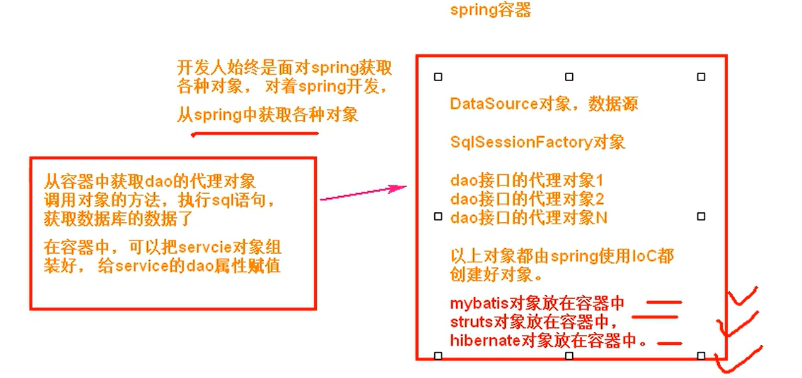

<font color=#66CC99 style=" font-weight:bold; font-size:30px">spring操作篇</font>


### Aop操作配置

ch07-aspectj-before: 使用aspectj框架的注解，实现前置通知实现步骤:

1.新建maven项目
2.修改pom.xml 加入依赖
	spring-context依赖，spring-aspects依赖（能使用aspectj框架的功能)junit
3.创建业务接口和实现类。
4.创建一个叫做切面类，是一个普通类
	1）在类的上面加入@Aspect
	2) 在类中定义方法，方法表示切面的功能。
	在方法的上面加入Aspect框架中的通知注解，例如@Before(value="切入点表达式")
	5.创建spring配置文件。
	1）声明目标对象
	2）声明切面类对象
	3）声明自动代理生成器
	6.创建测试类，测试目标方法执行时，增加切面的功能


#### 实践


##### pom.xml

加入切面依赖

```xml
<?xml version="1.0" encoding="UTF-8"?>

<project xmlns="http://maven.apache.org/POM/4.0.0" xmlns:xsi="http://www.w3.org/2001/XMLSchema-instance"
  xsi:schemaLocation="http://maven.apache.org/POM/4.0.0 http://maven.apache.org/xsd/maven-4.0.0.xsd">
  <modelVersion>4.0.0</modelVersion>

  <groupId>com.oddeye</groupId>
  <artifactId>aop</artifactId>
  <version>1.0-SNAPSHOT</version>

  <name>aop</name>
 
 <!-- maven默认设置jdk为1.7 ,记得改过来-->
  <properties>
    <project.build.sourceEncoding>UTF-8</project.build.sourceEncoding>
    <maven.compiler.source>1.8</maven.compiler.source>
    <maven.compiler.target>1.8</maven.compiler.target>
  </properties>

  <dependencies>
    <dependency>
      <groupId>junit</groupId>
      <artifactId>junit</artifactId>
      <version>4.11</version>
      <scope>test</scope>
    </dependency>
    

    <dependency>
      <groupId>org.springframework</groupId>
      <artifactId>spring-context</artifactId>
      <version>5.1.5.RELEASE</version>
    </dependency>
<!--添加切面包支持 -->
    <dependency>
      <groupId>org.springframework</groupId>
      <artifactId>spring-aspects</artifactId>
      <version>5.1.5.RELEASE</version>
    </dependency>
  </dependencies>


</project>

```

##### applicationContext.xml

配置扫包范围
开启切面

如果报错,看一下xml头中的命名空间和规则有没有写对

```xml
<?xml version="1.0" encoding="UTF-8"?>
<beans xmlns="http://www.springframework.org/schema/beans"
       xmlns:xsi="http://www.w3.org/2001/XMLSchema-instance"
       xmlns:context="http://www.springframework.org/schema/context"
       xmlns:aop="http://www.springframework.org/schema/aop"
       xsi:schemaLocation="http://www.springframework.org/schema/beans
       http://www.springframework.org/schema/beans/spring-beans.xsd
       http://www.springframework.org/schema/context
       https://www.springframework.org/schema/context/spring-context.xsd
       http://www.springframework.org/schema/aop
       http://www.springframework.org/schema/aop/spring-aop.xsd">


<!--    方案一,xml式创建对象-->
<!--    <bean id="mySomeServiceImpl" class="com.oddeye.service.impl.SomeServiceImpl"/>-->
<!--    <bean id="aspect" class="com.oddeye.handle.MyAspect"/>-->
<!--    <aop:aspectj-autoproxy/>-->

<!--    方案二,在MyAspect上创建注解@Compenont   在接口实现类上创建@Service注解-->
        <context:component-scan base-package="com.oddeye"/>
<!--    开启切面代理模式-->
        <aop:aspectj-autoproxy/>
</beans>
```


##### SomeServiceImpl.java

这是目标业务的实现类,可以看出你加不加切片代码都是一点都没有变化的

```java
package com.oddeye.service.impl;

import com.oddeye.service.SomeService;
import org.springframework.stereotype.Service;

@Service("mySomeServiceImpl")
public class SomeServiceImpl implements SomeService {
    @Override
    public void doSome(String name, Integer age) {
        System.out.println("name: " + name + ", age: " + age);
        System.out.println("这是业务代码");


    }
    @Override
    public void doOther(){
    	System.out.println("doOther");
        System.out.println("这是业务代码");
    }
}

```

##### MyAspect.java

配置切入点和切入内容

```java
package com.oddeye.handle;

import org.aspectj.lang.JoinPoint;
import org.aspectj.lang.annotation.Aspect;
import org.aspectj.lang.annotation.Before;
import org.springframework.stereotype.Component;

import java.util.Date;

/*
@Aspect:
切面类的注解。
位置:放在某个类的上面作用:表示当前类是切面类。

切面类:表示切面功能的类
 */

@Component("aspect")
@Aspect
public class MyAspect {
    //切入点表达式
    @Before("execution(public void com.oddeye.service.impl.SomeServiceImpl.*(..))")
    public void myBefore(JoinPoint jp){

        String methodName = jp.getSignature().getName();

        if (methodName.equals("doSome")){
            System.out.println("before doSome");
            System.out.println("before在目标方法之前执行"+new Date());
            Object[] args = jp.getArgs();
            for (Object arg : args) {
                System.out.println(arg);
            }
        }else if (methodName.equals("doOther")){
            System.out.println("before doOther");

        }
    }
}

```

### spring集成

集成思路
spring能集成很多的框架，是spring一个优势功能。通过集成功能，让开发人员使用其他框架更方便集成使用的是spring ioc核心技术。


要使用框架，例如mybatis，怎么使用mybatis ?

使用mybatis，需要创mybatis框架中的某些对象，使用这些对象，就能使用mybatis提供的功能了。
分析: mybatis执行sql语句，需要使用那些对象?
1.需要有Dao接口的代理对象，例如StudentDao接口,需要一个它的代理对象使用SqlSession.getMapper(StudentDao.class)，得到<font color=#66CC99 style=" font-weight:bold;">dao代理对象</font>

⒉.需要有SqISessionFactory,创建<font color=#66CC99 style=" font-weight:bold;">SqlSessionFactory对象</font>，才能使用openSession()得到SqlSession对象

3.数据源<font color=#66CC99 style=" font-weight:bold;">DataSource对</font>象，使用一个更强大，功能更多的连接池对象代替mybatis自己的PooledDataSource


现在集成了spring可以用<font color=#FF6666* style=" font-weight:bold;">ioc技术让spring帮你创建mybatis需要的对象</font>


实现步骤:
1.使用的mysql库,使用学生表student2(id int主键列,自动增长,name varchar(80),
age int)
2.创建maven项目
3.加入依赖
spring依赖，mybatis依赖，mysql驱动。junit依赖
mybatis-spring依赖（mybatis网站上提供的，用来在spring项目中，创建mybatis对象spring有关事务的依赖。)
mybatis和spring整合的时候，事务是自动提交的。
4.创建实体类student
5.创建Dao接口和mapper文件写sql语句6.写mybatis主配置文件
6.写mybatis主配置文件
7.创建service接口和他的实现类
8.创建spring的配置文件
1）声明数据源DataSource,使用的阿里的Druid连接池
2）声明sqlsessionFactoryBean类，在这个类内部创建的是sqlSessionFactory对象。
3）声明Mapperscannerconfiguration类，在内部创建dao代理对象，创建的对象都放在spring容器中。
4)）声明service对象，把3）的中dao赋值给service属性9.测试dao访问数据库
