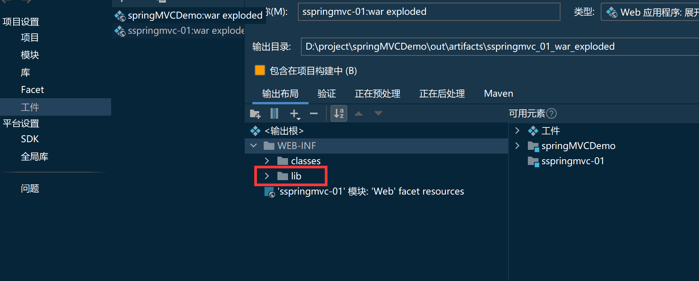
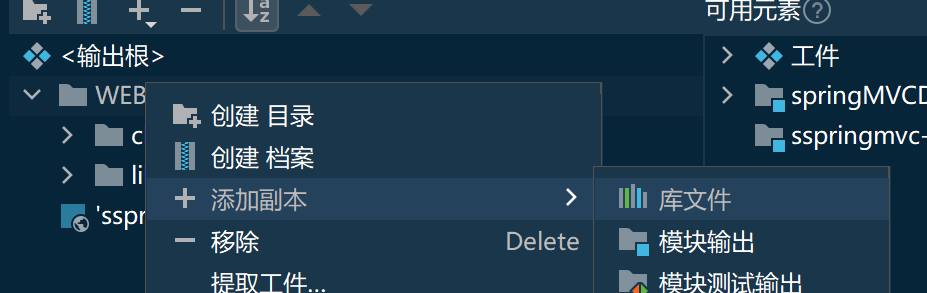

Tomcat 下载教程
-----------

**请先确认你的 JDK 版本**

**Tomcat 在 JDK1.8 环境下能够正常运行，请确认 JDK 版本（在 cmd 窗口输入 java -version），如果是在 12.0 版本，1.7 版本，Tomcat 不能够正常启动！其他 JDK 版本不清楚，没有具体测试运行！**

JDK 以及 Tomcat 安装教程（自备 JDK1.8 和 Tomcat9.0）

确定好后进入官网下载 Tomcat，官网地址 - 点击进入 [http://tomcat.apache.org/](http://tomcat.apache.org/)

选择左侧的 Tomcat 版本，本篇文章举例 Tomcat9，其它的版本安装都一样

Tomcat 安装教程
-----------

解压压缩包，放在想要放在的盘符 (D 盘、E 盘... 无所谓，记着路径就可以，但最好不要是 C 盘，可能会出现拒绝访问)

就比如安装在 D 盘，那就解压出来放在 D 盘下就行，里面的文件名不要改动，或者放在 D 盘某一文件夹下，路径不要包含中文和特殊字符！

Tomcat 配置环境变量教程
---------------

在变量名中填写：**CATALINA_HOME**(不要留空格)

变量值就是你解压后的路径，你可以直接进入解压后的文件夹，点击如图部分，复制这个路径到变量值

在变量值中填写路径；路径就是你解压后 Tomcat 的文件夹路径，就如上述，那么路径就是： **D:\apache-tomcat-9.0.12**

之后再找到系统变量中的 Path

如图，在最后面追加    **%CATALINA_HOME%\bin;**

（小提示：你可以直接按电脑上的 **End** 键 到最后）

分号结尾，第一个 % 前面若没有分号，请手动打上去分号，分号是英文状态下输入的，特别注意

Tomcat 启动和验证配置环境变量是否成功
----------------------

输入 startup.bat 后回车（你也可以到你解压的 tomcat 文件夹下的 bin 目录中点击 startup.bat）

之后出现了 Tomcat 的启动窗口，若没有报错或者一闪而过，那么说明启动成功了，让黑窗口保持运行，不能关，否则你的服务器也就关闭了，若出现了报错或者一闪而过 (启动失败)，可能是你的端口被占用，Tomcat 默认的端口是 8080，出现这两种情况那么可以试试以下两种：

一、重启电脑后再次按以上步骤启动 Tomcat 尝试是否能解决；

二、修改 Tomcat 端口号后，再用以上步骤启动 Tomcat。

之后验证环境变量是否配置成功，浏览器输入一下 http://localhost:8080 

可以直接点击进入 [http://localhost:8080/](http://localhost:8080/)

**切记，黑窗口一定不能关闭，否则等于 Tomcat 也关了！！！**

**切记，黑窗口一定不能关闭，否则等于 Tomcat 也关了！！！**

**切记，黑窗口一定不能关闭，否则等于 Tomcat 也关了！！！**

出现如下图，那么就说明配置成功了

## tomcat乱码

启动后命令行的中文显示乱码，打开tomcat目录下的conf目录，打开logging.properties文件，把 java.util.logging.ConsoleHandler.encoding = UTF-8修改成 
java.util.logging.ConsoleHandler.encoding = GBK

## tomcat修改端口

修改端口方法：进入Tomcat的安装路径conf目录下打开server.xml文件，在Connector标签下修改port后的值即可。一般用8080

## Tomcat 部署项目

**Tomcat 部署 Web 项目 · 内嵌** [https://blog.csdn.net/qq_40881680/article/details/100011988](https://blog.csdn.net/qq_40881680/article/details/100011988)

**Tomcat 部署 Web 项目 · 连接外部路径** [https://blog.csdn.net/qq_40881680/article/details/100047094](https://blog.csdn.net/qq_40881680/article/details/100047094)

#### 部署web项目

出现404 可能未设置应用程序上下文

创建部件然后点击要发布的模块,然后将上下文设置为/

应用程序上下文,你设置为jj,那么到时候你访问时url就得是
http://localhost:8080/jj/hello
如果你将应用程序上下文设置为/那么就是
http://localhost:8080/hello

使用tomcat部署web时,要加入lib包

常见问题
----

### 问题一 · 正常运行却访问不了,闪退

改一个端口号,可能端口被占用
可能jdk版本太高

### 问题二 · 出现 Access Error:404 -- Not Found

改一个端口号,可能端口被占用

