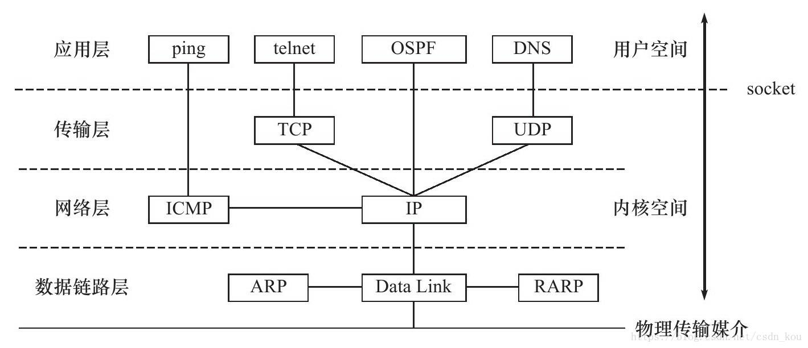
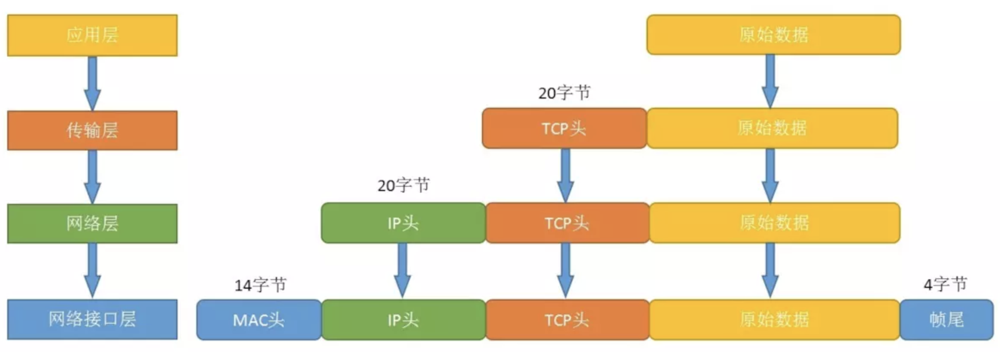
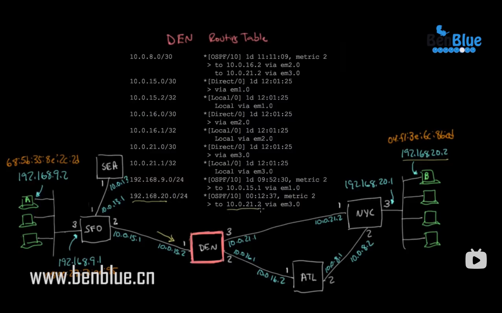

# 计算机网络-数据包运输

### 网络模型

<<<<<<< HEAD

=======

>>>>>>> 810a59c0ad4150a565043aabe1bdc8e7ed7ac38c

### 网络传递

子网中某一主机想与外网(不同网段)联络时    此事是知道目的ip的  ping目的ip
先判断该ip是否在同一网段,若不在走到网关(路由器)
那么怎么走到网关呢
首先要明白物理上两个主机要能通讯的条件是什么
是在同一网段下知道对方的mac地址
如何知道网关的mac地址呢
ARP协议,通过向该网段以太网内广播的形式,找到对应网关路由的ip所对应的mac地址
然后该网关给你发送他的mac地址
你的主机就能发送给她包了

路由与路由之间如何传递包呢
根据ip协议
根据目标ip和   各线路的子网掩码做运算,得到与哪个线路的网络号,网段相同的,就走哪个线路
跳到下一路由器,如此往复,直至进入对应网关

上面每一步应答的过程都是一个包

