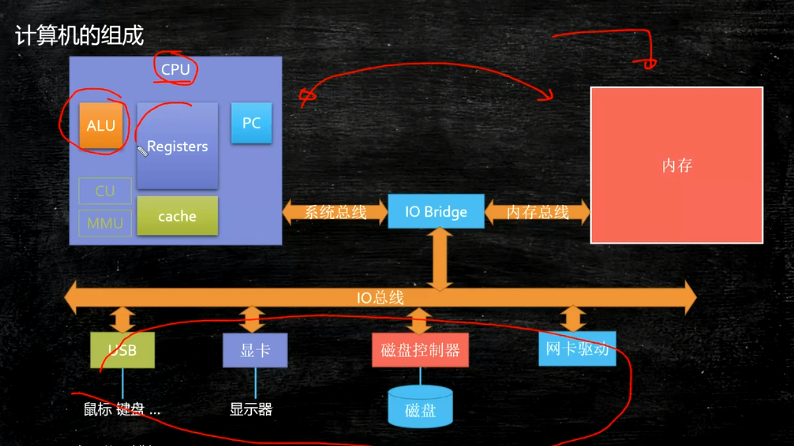
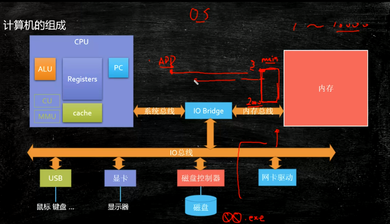
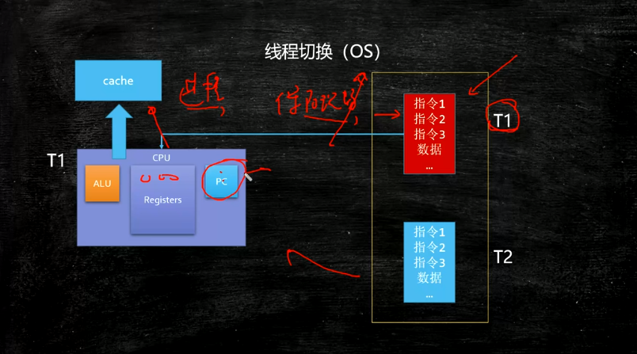
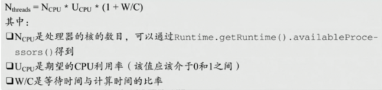
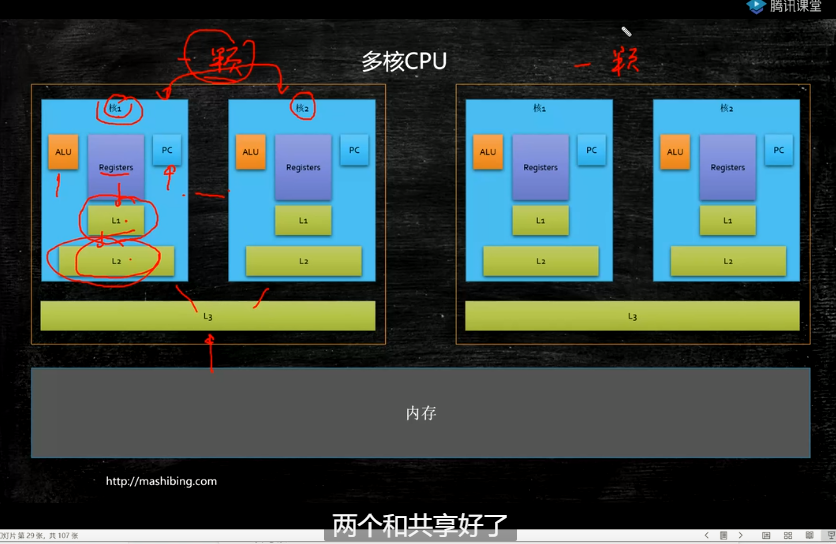
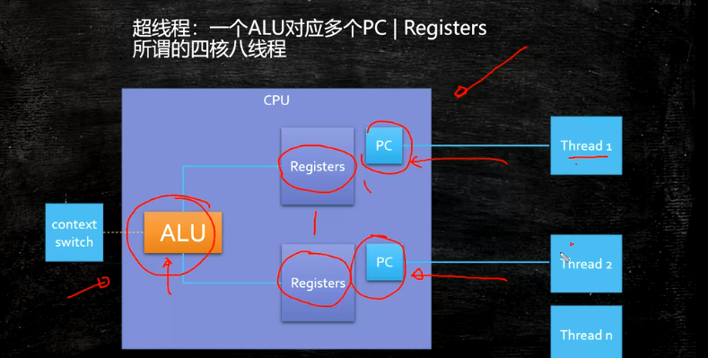
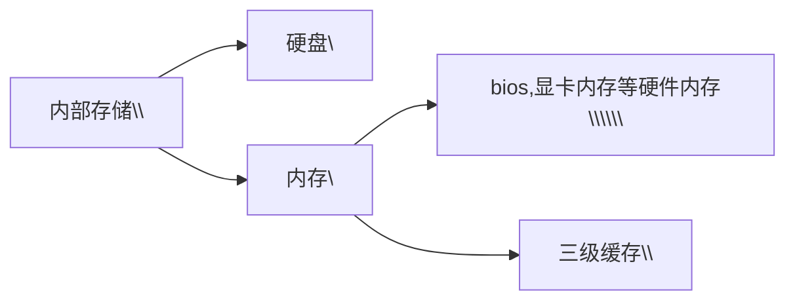

# **organization**

## 发展历史

##### 冯·诺依曼计算机的特点

（机器以运算器为中心）

1. 计算机由运算器、存储器、控制器、输入设备和输出设备五大部件组成
2. 指令(程序)和数据以二进制不加区别地存储在存储器中
3. 程序自动运行


##### 现代计算机由三大部分组成

（已经转化为以存储器为中心）

1. CPU(Central Processing Unit) 中央处理器，核心部件为ALU(Arithmetic Logic Unit,

   算术逻辑单元)和CU(Control Unit,控制单元)

2. I/O设备(受CU控制)

3. 主存储器(Main Memory,MM)，分为RAM(随机存储器)和ROM(只读存储器)
    //CPU与MM合成主机，I/O设备可称为外部设备

## 计算机框架



## 物理构造

#### cpu

##### 

##### 指令

CPU的控制器从内存读取一条指令并放入指令寄存器。指令的格式如下


操作码就是汇编语言里的mov，add，jmp等符号码；操作数地址说明该指令需要的操作数所在的地方，是在内存里还是在CPU的[内部寄存器](https://www.zhihu.com/search?q=内部寄存器&search_source=Entity&hybrid_search_source=Entity&hybrid_search_extra={"sourceType"%3A"article"%2C"sourceId"%3A245119254})里。指令寄存器中的指令经过译码后，CU根据该指令的操作码进行相应操作、根据操作数到内存中拷数据。

##### 一条指令在cpu中的执行

```c
// 专业术语
1. Ad(Address) 形式地址
2. DR(Data Register) 数据寄存器
3. AR(Address Register) 地址寄存器(MAR)
4. IR(Instruction Register) 指令寄存器   其功能是存放当前正在执行的指令。
5. BR(Buffer Register) 缓冲寄存器(MBR)
5. ID(Instruction Decoder) 指令译码器
6. PC(ProgramCounter) 程序计数器  其功能是存放当前欲执行指令的地址，并可自动计数形成下一条指令地址。
```


```swift
1.取指令阶段
    取指令（Instruction Fetch，IF）阶段是将一条指令从主存中取到指令寄存器的过程。
    程序计数器PC中的数值，用来指示当前指令在主存中的位置。当一条指令被取出后，PC中的数值将根据指令字长度	而自动递增：若为单字长指令，则(PC)+1àPC；若为双字长指令，则(PC)+2àPC，依此类推。
    //PC程序计数器(找指令编号与寄存器映射) -> 从AR地址寄存器中获取指令地址 -> 到Memory内存中读指令
    //从Memory中获取指令拷贝 -> 存入IR指令寄存器
2.指令译码阶段
    取出指令后，计算机立即进入指令译码（Instruction Decode，ID）阶段。
	指令寄存器中的指令经过译码，决定该指令应进行何种操作（就是指令里的操作码）、操作数在哪里（操作数的地	  址）。
    //                              { 1.Ad 获取指令的操作数形式地址
    //IR指令寄存器 -> ID指令译码器 -> { 2.PC变化  程序计数器变化一次
    //                              { 3.CU（Control Unit）获取指令的操作码进行相应微操作灯泡开关
3.访存取数阶段
    根据指令需要，有可能要访问主存，读取操作数，这样就进入了访存取数（Memory，MEM）阶段。
    此阶段的任务是：根据指令地址码，得到操作数在主存中的地址，并从主存中读取该操作数用于运算。
    //Ad形式地址 -> AR地址寄存器 -> AB地址总线 -> 到Memory读取操作数
4.执行指令阶段
    在取指令和指令译码阶段之后，接着进入执行指令（Execute，EX）阶段。
    此阶段的任务是完成指令所规定的各种操作，具体实现指令的功能。为此，CPU的不同部分被连接起来，以执行所需     的操作。
    例如，如果要求完成一个加法运算，算术逻辑单元ALU将被连接到一组输入和一组输出，输入端提供需要相加的数     值，输出端将含有最后的运算结果。
    //Memory中拷一份数据 -> 存入DR数据寄存器 -> 数据输入到ALU逻辑单元(运算器) ->结果存到数据寄存器中
5.结果写回阶段
    作为最后一个阶段，结果写回（Writeback，WB）阶段把执行指令阶段的运行结果数据“写回”到某种存储形式：结     果数据经常被写到CPU的内部寄存器中，以便被后续的指令快速地存取；在有些情况下，结果数据也可被写入相对较     慢、但较廉价且容量较大的主存。许多指令还会改变程序状态字寄存器中标志位的状态，这些标志位标识着不同的     操作结果，可被用来影响程序的动作。
    //DR数据寄存器写入到 -> Memory内存
6.循环阶段
    在指令执行完毕、结果数据写回之后，若无意外事件（如结果溢出等）发生，计算机就接着从程序计数器PC中取得     下一条指令地址，开始新一轮的循环，下一个指令周期将顺序取出下一条指令。
	//PC自动生成下一个指令地址
    //重复 1~5
    //遇hlt(holt on)停止
```

当qq启动时,**OS**会将qq的可执行程序.exe拷到内存里

假设拷到了内存的3--2000位,将入口程序(main)作为第一位

然后由**OS的调度算法**，选出qq，让CPU来执行。PC去取3号位的指令过去,注意这里用**控制线**取指令

接下来就是一条指令在cpu内的运行过程了

在后面**指令译码**后读取操作数时就要用到**数据线**了

最终将数据到写回内存

[一条指令运行的图文解析,简书](https://www.jianshu.com/p/bf88d5b5c250)


##### 时钟

cpu统一各寄存器,下至电路的同步    

逻辑如果没有前后顺序的限定,就没有意义


#### bios

BIOS全名 Basic Input Output System即**“基本输出与输入系统”**，是计算机启动时加载的第一个软件。它是储存在主板上的不需要电源的记忆体(芯片)中的一小段代码,是一个程序。我们通常称之为主板“固件”，因为**它是软件和硬件之间的桥梁，没有它的话电脑就无法开机。**

它为[工业计算机](https://www.zhihu.com/search?q=工业计算机&search_source=Entity&hybrid_search_source=Entity&hybrid_search_extra={"sourceType"%3A"article"%2C"sourceId"%3A122927289})提供最低级、最直接的硬件控制，计算机的原始操作都是依照固化在BIOS里的内容来完成的。准确地说,BIOS是**硬件与软件程序**之间的一个“[转换器](https://www.zhihu.com/search?q=转换器&search_source=Entity&hybrid_search_source=Entity&hybrid_search_extra={"sourceType"%3A"article"%2C"sourceId"%3A122927289})”或者说是**接口**，它负责开机时对系统的各项硬件进行初始化设置和测试，以确保系统能够正常工作。用户在使用计算机的过程中，如果硬件不正常则立即停止工作，并把出错的设备信息反馈给用户


#### 主板

主体是一个矩形电路板起到设备连接作用

类似于**赛车壳,有接收电池和马达的接口**

主板上的主要为[芯片组](https://link.zhihu.com/?target=http%3A//www.so.com/s%3Fq%3D%E8%8A%AF%E7%89%87%E7%BB%84%26ie%3Dutf-8%26src%3Dinternal_wenda_recommend_textn)、总线、[输入输出接口bios](https://link.zhihu.com/?target=http%3A//www.so.com/s%3Fq%3D%E8%BE%93%E5%85%A5%E8%BE%93%E5%87%BA%E6%8E%A5%E5%8F%A3%26ie%3Dutf-8%26src%3Dinternal_wenda_recommend_textn)和电源接口。其功能在于： 
1.把CPU、[内存](https://link.zhihu.com/?target=http%3A//www.so.com/s%3Fq%3D%E5%86%85%E5%AD%98%26ie%3Dutf-8%26src%3Dinternal_wenda_recommend_textn)等关键核心部件通过总线和芯片组连接起来，组成电脑的核心； 
2.接收[电脑电源](https://link.zhihu.com/?target=http%3A//www.so.com/s%3Fq%3D%E7%94%B5%E8%84%91%E7%94%B5%E6%BA%90%26ie%3Dutf-8%26src%3Dinternal_wenda_recommend_textn)提供的电能并加以分配，向以上核心部件供电； 
3.接收[电源开关](https://link.zhihu.com/?target=http%3A//www.so.com/s%3Fq%3D%E7%94%B5%E6%BA%90%E5%BC%80%E5%85%B3%26ie%3Dutf-8%26src%3Dinternal_wenda_recommend_textn)和[操作系统](https://link.zhihu.com/?target=http%3A//www.so.com/s%3Fq%3D%E6%93%8D%E4%BD%9C%E7%B3%BB%E7%BB%9F%26ie%3Dutf-8%26src%3Dinternal_wenda_recommend_textn)来的开机信号实现开机、关机、重启、待机和休眠等操作； 
4.把[硬盘](https://link.zhihu.com/?target=http%3A//www.so.com/s%3Fq%3D%E7%A1%AC%E7%9B%98%26ie%3Dutf-8%26src%3Dinternal_wenda_recommend_textn)、[光驱](https://link.zhihu.com/?target=http%3A//www.so.com/s%3Fq%3D%E5%85%89%E9%A9%B1%26ie%3Dutf-8%26src%3Dinternal_wenda_recommend_textn)、[键盘](https://link.zhihu.com/?target=http%3A//www.so.com/s%3Fq%3D%E9%94%AE%E7%9B%98%26ie%3Dutf-8%26src%3Dinternal_wenda_recommend_textn)、[鼠标](https://link.zhihu.com/?target=http%3A//www.so.com/s%3Fq%3D%E9%BC%A0%E6%A0%87%26ie%3Dutf-8%26src%3Dinternal_wenda_recommend_textn)、[显示器](https://link.zhihu.com/?target=http%3A//www.so.com/s%3Fq%3D%E6%98%BE%E7%A4%BA%E5%99%A8%26ie%3Dutf-8%26src%3Dinternal_wenda_recommend_textn)等设备和总线连接起来。


总的来讲，主板就是为CPU、内存、硬盘、光驱、键盘、鼠标、显示器等部件提供了一个方便的安装平台，因为上述部件都是直接或者间接连在主板上的。


#### IO总线(IO桥)

总线英文叫bus —— 公共汽车。     技术文档还是直接读英文好。

总线是**连接多个设备的数据传输通路**。通俗讲，总线就是公共汽车线路，连接的设备就是公交站。传输的数据包就是乘客。每个乘客都要知道自己从哪站上，到哪站下，然后等到站的时候就下去进入另一个设备进行处理。公交车需要个调度室，所以总线需要有个控制器。


##### 总线分为

控制线    CPU从控制线读过来的就是指令

数据线    CPU从数据线读过来的就是数据

地址线    CPU从地址线读过来的就是地址



当qq启动时,os会将qq的可执行程序.exe拷到内存里

假设拷到了内存的3--2000位,将入口程序(main)作为第一位

然后OS叫PC去取3号位的指令过去,注意这里用**控制线**取指令

接下来就是一条指令在cpu内的运行过程了

在后面**指令译码**后读取操作数时就要用到**数据线**了

最终将数据到写回内存


#### 显卡 

显卡简称（GPU）也就是**图形处理器**,显卡分集成显卡和独立显卡。集成显卡就是将gpu芯片集成到主板中或集成在基带芯片中。独立显卡就相当于单独的一块外置设备。


gpu**擅长几何运算**(高强度的浮点运算)，而与之配合的cpu擅长**逻辑运算**。如果CPU想画一个二维图形，只需要发个指令给GPU，如“在坐标位置（x, y）处画个长和宽为a×b大小的长方形，GPU就可以迅速计算出该图形的所有像素，并在显示器上指定位置画出相应的图形，画完后就通知CPU “我画完了”，然后等待CPU发出下一条图形指令。有了GPU，**CPU就从图形处理的任务中解放出来，可以执行其他更多的系统任务，这样可以大大提高计算机的整体性能。**

CPU很快但一般只能做一件事（仅考虑单线程）。但是像图像处理这种事情就是上万道一百以内加减法同时给你做，大佬也不容易做出来。
GPU有上千个核，可以**并行计算**，适合做这种简单但大量的工作。
因为这个性质，显卡也会被用在挖比特币或者训练神经网络上。


##### 显存

cpu将指令发给gpu的时候可以将指令**暂存**在显存里，这样cpu发完指令就可以去干别的活了，就像你不在家的时候快递员给你把快递放到你门口的垫子下面，然后去送别的快递。大大提高使用效率。

#### 光驱


#### 网卡


## 进程与线程


### 多线程和进程存在基础

> **一个最最基础的事实**：CPU太快，太快，太快了，寄存器仅仅能够追的上他的脚步，RAM和别的挂在各**总线**上的设备则难以望其项背。那当多个任务要执行的时候怎么办呢？轮流着来?或者谁优先级高谁来？不管怎么样的策略，一句话就是在**CPU看来就是轮流着来**。而且因为速度差异，CPU实际的执行时间和等待执行的时间是数量级的差异。比如工作1秒钟，休息一个月。所以多个任务，轮流着来，让CPU不那么无聊，给流逝的时间增加再多一点点的意义。这些任务，在**外在表现上就仿佛是同时在执行**。
>
> CPU通过为每个线程分配CPU时间片来实现[多线程机制](https://www.zhihu.com/search?q=多线程机制&search_source=Entity&hybrid_search_source=Entity&hybrid_search_extra={"sourceType"%3A"article"%2C"sourceId"%3A443143964})。CPU通过**时间片分配算法来循环执行任务**，当前任务执行一个时间片后会切换到下一个任务。
>
> 
>
> 线程执行前准备阶段:
> 执行一段程序代码，实现一个功能的过程之前 ，当得到CPU的时候，相关的资源必须也已经就位，就是万事俱备只欠CPU这个东风。**所有这些任务都处于就绪队列**，然后由操作系统的调度算法，选出某个任务，让CPU来执行。
>
> 链接：https://www.zhihu.com/question/25532384/answer/81152571


### 进程是什么

进程有两个概念
**概念1.cpu时间段描述===>进程前后文切换**
**概念2.操作系统进行调度的单位,一个供os调用的无限loop程序  ===>一个程序读入到内存中即称之为进程**

CPU的<font color=#99CCFF size=3>进程和线程都是一个时间段的描述，是CPU工作时间段的描述，不过是颗粒大小不同。</font>是运行中的程序指令的一种描述，这需要与程序中的代码区别开来。
另外注意<font color=#99CCFF size=3>概念1</font>里说的进程线程概念，<font color=#99CCFF size=3>和概念2编程语言中的API接口对应的进程/线程是有差异的。</font>
在软件编码方面，我们说的进程，其实是稍不同的，<font color=#99CCFF size=3>编程语言中创建的进程是一个无限loop</font>，对应的是操作系统内核中的任务控制块(tcb块)。**概念2所研究的进程是操作系统进行调度的单位**。所以和**概念1的cpu执行时间段还是不同的。**


##### 一个程序可以有多个进程吗?

可以,一个qq程序可以开多份  挂多个qq,拥有多个进程
同一个进程内部,有多个任务并发执行的需求(比如一边计算,一边刷新显示界面,一边获取网络数据)

cpu是单任务的,一个cpu在一瞬间只能执行一个任务


### 进程和线程

<font color=#FF6666 size=3>下面讨论的进程和线程既有cpu角度也有操作系统角度</font>

> 进程类似于docker中的容器,起到隔离线程的作用
> 一个程序在被加入都内存中,此时程序变为一个进程,此进程占有一定内存空间,
> 此内存空间对于其他内容相对隔离,
> 在同一个进程中的线程共享该进程占有的内存空间,但不能方位其他进程所占有的内存空间
> 在同一个进程中的线程,共享进程空间,但不共享计算
>
> 程序进入内存,分配内存空间,程序进入内存,同时产生一个主线程
> 线程是一个可执行单元(任务),<font color=#99CCFF size=3>由于进程的颗粒度太大,所有有了线程</font>
>
> <font color=#FF6666 size=3>一个ALU同一时间只能执行一个线程</font>
>
> 同一段代码可以被多个线程执行


##### 线程切换



线程在切换前,会保存当前运行状态**(保存上下文)到缓存cache**(cache也属于内存,高速内存)中,该缓存在**对应进程空间中**

缓存中存线程上下文,每次cpu(ALU)要执行该线程都会先读取该线程上下文,寻找到之前运行到的指令位置

不同于进程切换,线程在同一屋檐下(同一进程中)     进程切换还**需要改变虚拟空间位置**,毕竟不同的进程占据不同的内存空间

所以<font color=#FF6666 size=3>进程的上下文切换的时间开销是远远大于线程上下文时间的开销</font>


##### 线程A切换到线程B

> 1.先**挂起**线程A，将其在cpu中的状态保存在内存中。
>
> <font style="background:#99CCFF" size=4 color=#FF6666 >2.在内存中检索下一个线程B的上下文并将其在 CPU 的寄存器中恢复,执行B线程。</font>
>
> 3.当B执行完，根据程序计数器中指向的位置恢复线程A。
>
> CPU通过为每个线程分配CPU时间片来实现多线程机制。CPU通过时间片分配算法来循环执行任务，当前任务执行一个时间片后会切换到下一个任务。


##### 问题

是不是线程越多越好?
当有10000个活跃线程时,cpu会保证每个线程都有时间片去执行,频繁的切换,会将许多计算资源浪费在了线程切换上

单核cpu多线程有没有意义?
一个应用既要获取网络资源,又要刷新页面,没多线程根本启不起来

对于一个程序,设计多少线程合适?
计算公式如下:



比如50%的时间用于等待网络资源,50%的资源用于计算
W/C=50%/50%=1
假设cpu利用率为一半则U为1/2
但现实没法算W/C,所以还是要看压测来取慢慢调节


##### 知乎


https://www.zhihu.com/question/25532384/answer/81152571

首先来一句概括的总论：**进程和线程都是一个时间段的描述，是CPU工作时间段的描述。是运行中的[程序指令](https://www.zhihu.com/search?q=程序指令&search_source=Entity&hybrid_search_source=Entity&hybrid_search_extra={"sourceType"%3A"answer"%2C"sourceId"%3A81152571})的一种描述，这需要与程序中的代码区别开来。**

另外注意这里我说的[进程线程](https://www.zhihu.com/search?q=进程线程&search_source=Entity&hybrid_search_source=Entity&hybrid_search_extra={"sourceType"%3A"answer"%2C"sourceId"%3A81152571})概念，和编程语言中的API接口对应的进程/线程是有差异的。


## 存储器层次结构

[如何通俗地理解存储器层次结构,  用借书的例子来理解存储器结构](https://zhuanlan.zhihu.com/p/51869081)


### 三级缓存

 


L1和L2缓存都在cpu的某个核内,为每**一个核独享**

L3缓存在核外,CPU内,供**同一个CPU共享**

一旦有数据从内存读到L3或者L3读取到L2/L1,都会将这个数据**存入到当前缓存中,供下次快速获取**

##### 如何理解四核八线程

一个核,只有一个ALU计算单元,理论上只能同一时间运行一个线程
四核八线程为什么多出四线程?
因为

虽然有一个核只有一个计算单元,但有两个存储单元(寄存器) ALU算一会寄存器a,再算一会寄存器b
一个寄存器运行一个线程,一个核就可以同时运行两个线程,这样就可以减少线程切换了


##### 缓存行

缓存行存在的意义:
**空间局部性原理**: 当一个数据/指令被访问时,它相邻的数据也大概率被访问**
**时间局部性原理**: 当一个数据/指令被访问时,它大概率在接下来的一段时间内会被多次/再次访问

缓存行相当于一次取那一块的数据(挖掘机).这也是多级缓存存在的意义
所以数据读取**数据读取命中率和内存消耗之间就要做出取舍**,所以工业界做出的取舍为缓存行大小为64个字节

### 存储种类

 


**内存存储器包含"包含我们所提到的内存"是宽泛的内存**


##### 何为内存?

宽泛的概念就是




内存是由DRAM(动态随机访问存储器)芯片组成

CPU通过**总线**直接对内存进行操作,电脑所有的输入输出，都是要从内存来实现的。

**任何程序的执行都要读取到内存中**

通常的内存指的是计算机存储系统里面在**cache下一层，硬盘上一层**的设备，他的速度比硬盘快，比cache慢，支持随机存取。


##### 硬盘

和传统的ROM不一样,硬盘不是ROM


##### 寄存器

距离ALU最近,最小的存储单元,包括指令寄存器,地址寄存器,程序计数器,数据寄存器等


##### ROM

ROM用MOS管中间的一个[绝缘体](https://www.zhihu.com/search?q=绝缘体&search_source=Entity&hybrid_search_source=Entity&hybrid_search_extra={"sourceType"%3A"answer"%2C"sourceId"%3A"134237780"})来储备电子，可以长期保存。    
这也是数据不丢失的原因

注意:硬盘不是ROM,因为ROM含义为read-only-memory硬盘是可以写入,修改的

对于手机来讲，内部存储中(注意不是内存,这是外存类似于电脑硬盘,手机的内存叫运行内存)中有一部分空间用于存放[系统软件](https://www.zhihu.com/search?q=系统软件&search_source=Entity&hybrid_search_source=Entity&hybrid_search_extra={"sourceType"%3A"article"%2C"sourceId"%3A71383426})，不管你怎么运用也不会把系统软件用坏了。这一部分也可以理解为“只读储存器”。
实际运用的时候会把 内置储存和Flash分成两个部分，一块可以被写入，一块不能被写入 。可以被写入的地方用来储存通讯录、照片、音乐、APP之类的，**不可被写入的ROM用来存放操作系统的软件**。


##### RAM

断电就没了


你同样也很有必要学好[存储器](https://www.zhihu.com/search?q=存储器&search_source=Entity&hybrid_search_source=Entity&hybrid_search_extra={"sourceType"%3A"answer"%2C"sourceId"%3A"2024856160"})、输入输出系统、计算机的运算方法、指令系统、CPU的结构和功能等计组知识，这是因为做大型系统软件会涉及到调优的问题，如果只懂软件，而不知道硬件在怎么运行的话，调优会受到限制，软件无法发挥硬件的最大优势。


