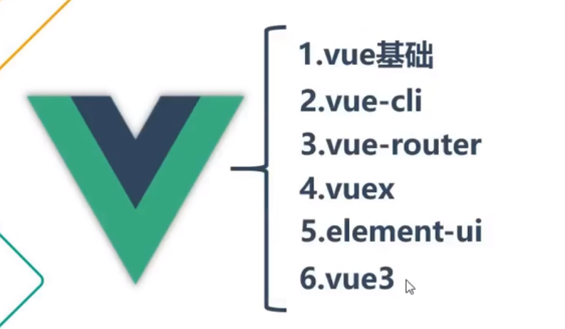
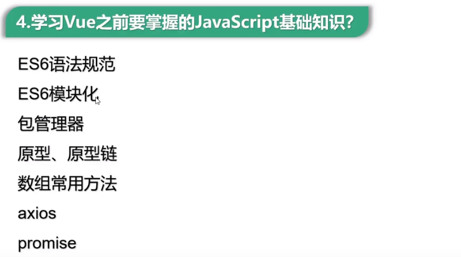
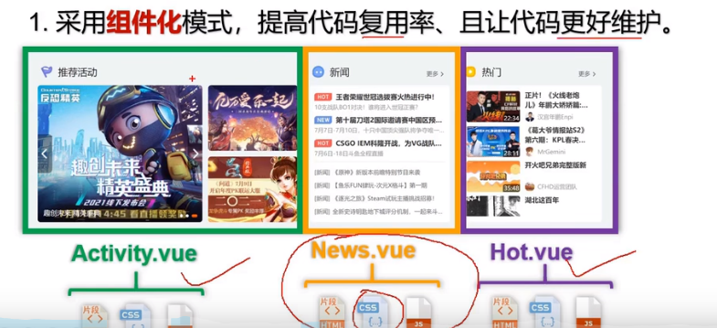
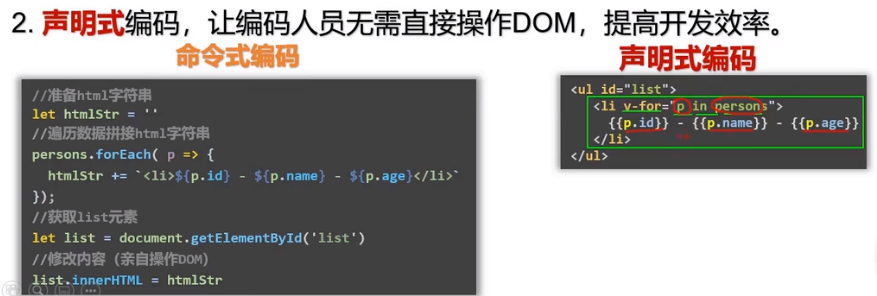
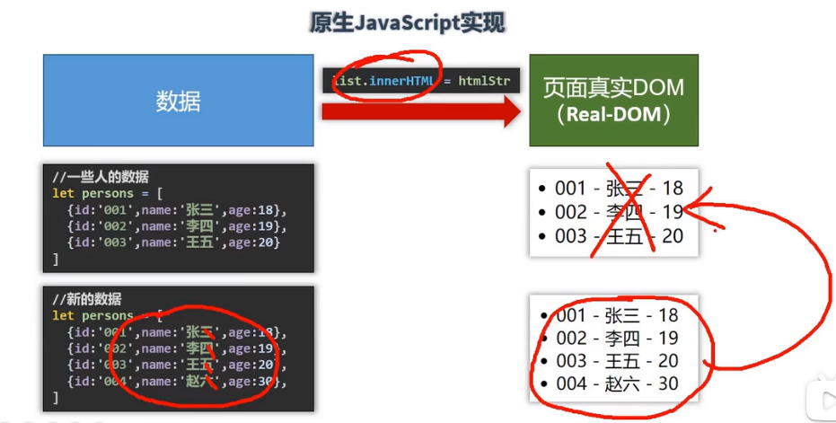
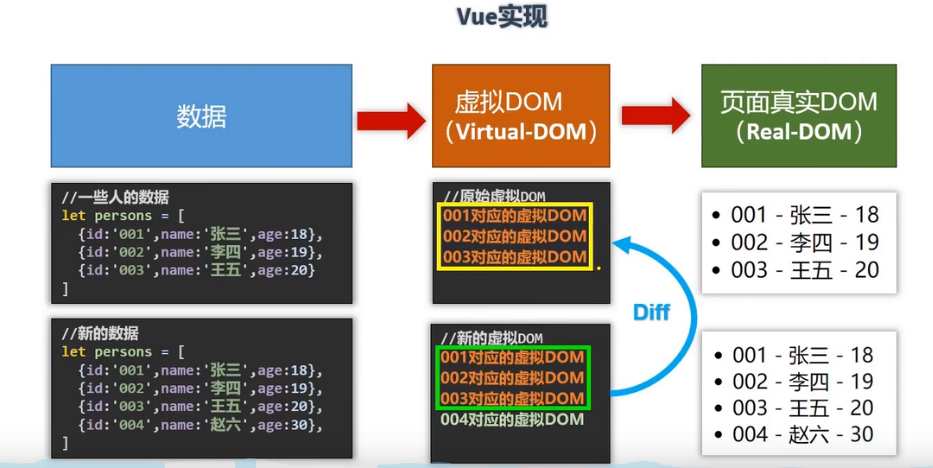

vue




### 前置知识




### vue的特点


#### 组件化



将代码封装为一个个组件,代码之间相互封装隔离,既可以代码复用也可以只修改一处不影响其他组件的代码,达到解耦的目的

#### 声明式



省去了拼接字符串生成语句,再手动操作修改dom的步骤
直接将代码融合进html的dom中,去掉了获取dom,修改dom的代码,一部分js要写的代码,杂糅进了html中

#### 虚拟dom

使用虚拟dom和diff算法复用dom





多利用了一个抽象层(虚拟dom层)利用diff算法来在内存中检测虚拟dom的改变
然后只需要改变不同的结构,减少数据刷新时的重复加载,如上图只需要加载一个,另外三个已经在内存里了

### 脚手架搭建

nodejs安装
官网下载：https://nodejs.org/en/download/

设置npm阿里镜像 cnpm

```shell
npm install cnpm -g --registry=https://registry.npm.taobao.org
```


详见vue/代码/readme.md

