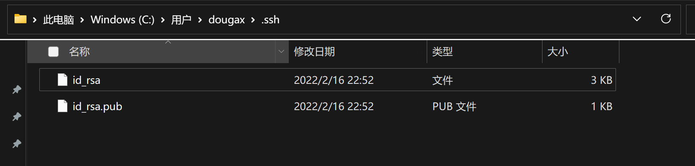
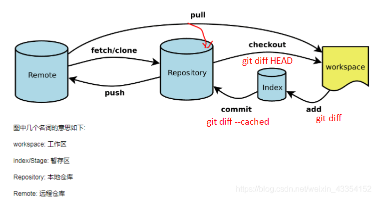

打开 [git 官网] https://git-scm.com/，下载 git 对应操作系统的版本。

所有东西下载慢的话就可以去找镜像！

官网下载太慢，我们可以使用淘宝镜像下载：http://npm.taobao.org/mirrors/git-for-windows/


## Git 配置

安装成功后在开始菜单中会有 Git 项，菜单下有 3 个程序：任意文件夹下右键也可以看到对应的程序！


**Git Bash：**Unix 与 Linux 风格的命令行，使用最多，推荐最多

**Git CMD：**Windows 风格的命令行

**Git GUI**：图形界面的 Git，不建议初学者使用，尽量先熟悉常用命令

```shell
#查看系统config
git config --system --list
　　
#查看当前用户（global）配置
git config --global  --list
```


所有的配置文件，其实都保存在本地！

查看配置 git config -l


查看不同级别的配置文件：  

```shell
git config --global user.name  #查看名称
git config --global user.email  #邮箱
#这个用户名和密码仅仅只是区分 不同合作开发者的  和github以及gitee没关系
```


##### 设置用户名与邮箱（用户标识，必要）

当你安装 Git 后首先要做的事情是设置你的用户名称和 e-mail 地址。这是非常重要的，因为每次 Git 提交都会使用该信息。它被永远的嵌入到了你的提交中：

```shell
$ git config --global user.name "hedley"
$ git config --global user.email "1759728350@qq.com"
```

只需要做一次这个设置，如果你传递了 --global 选项，因为 Git 将总是会使用该信息来处理你在系统中所做的一切操作。如果你希望在一个特定的项目中使用不同的名称或 e-mail 地址，你可以在该项目中运行该命令而不要 --global 选项。总之 --global 为全局配置，不加为某个项目的特定配置。

### 配置ssh公钥

```shell
ssh-keygen -t rsa -C "1759728350@qq.com"
```

然后用户主目录/.ssh/下有两个文件，id_rsa是私钥，id_rsa.pub是公钥



将上面的id_rsa.pub文件里的内容复制,放进github里的ssh中


测试是否连接成功
ssh -T git@github.com


**Git 相关的配置文件：**

1）、Git\etc\gitconfig  ：Git 安装目录下的 gitconfig     --system 系统级

2）、C:\Users\Administrator\ .gitconfig    只适用于当前登录用户的配置  --global 全局

这里可以直接编辑配置文件，通过命令设置后会响应到这里。


### 本地仓库搭建

git init

> init：初始化当前目录为仓库，初始化后会自动将当前仓库设置为master

```shell
#在要建立本地仓库的文件夹下右键  git bash here

# 在当前目录新建一个Git代码库
dougax@lyh MINGW64 /d/github/test
$ git init
Initialized empty Git repository in D:/github/test/.git/
```

创建本地仓库的条件是需要一个空目录，然后在空目录中初始化你的项目

如我想创建一个名为“test”的空项目

1.创建目录

```bash
mkdir test
```

2.进入目录

```bash
cd test
```

3.使用git init初始化当前仓库

```bash
git init
```

ls-ah查看隐藏文件, 查看被设置为仓库的目录所生成的 .git 隐藏文件


创建本地仓库的方法有两种：一种是创建全新的仓库，另一种是克隆远程仓库。
1、创建全新的仓库，需要用 GIT 管理的项目的根目录执行：
2、执行后可以看到，仅仅在项目目录多出了一个. git 目录，关于版本等的所有信息都在这个目录里面。

### 为啥每次提交都需要输密码?
因为你git remote add 的是https的协议url
只要改成ssh的url就不需要验证了

```shell
//先删除之前关联的远程仓库名,以防之后再add时name重复
git remote rm regression 
//重新关联
git remote add regression git@github.com:1759728350/breathe.git
//之后正常提交就行了
```

### 忽略文件

```
#为注释
*.txt        #忽略所有 .txt结尾的文件,这样的话上传就不会被选中！
!lib.txt     #但lib.txt除外
/temp        #仅忽略项目根目录下的TODO文件,不包括其它目录temp
build/       #忽略build/目录下的所有文件
doc/*.txt    #会忽略 doc/notes.txt 但不包括 doc/server/arch.txt
```

有些时候我们不想把某些文件纳入版本控制中，比如数据库文件，临时文件，设计文件等

在主目录下建立 ".gitignore" 文件，此文件有如下规则：

1.  忽略文件中的空行或以井号（#）开始的行将会被忽略。

2.  可以使用 Linux 通配符。例如：星号（*）代表任意多个字符，问号（？）代表一个字符，方括号（[abc]）代表可选字符范围，大括号（{string1,string2,...}）代表可选的字符串等。

3.  如果名称的最前面有一个感叹号（!），表示例外规则，将不被忽略。

4.  如果名称的最前面是一个路径分隔符（/），表示要忽略的文件在此目录下，而子目录中的文件不忽略。

5.  如果名称的最后面是一个路径分隔符（/），表示要忽略的是此目录下该名称的子目录，而非文件（默认文件或目录都忽略）。使用码云

##### 环境变量配置


## 克隆远程仓库


```bash
git remote add url   #先remote连接
```

1、另一种方式是克隆远程目录，由于是将远程服务器上的仓库完全镜像一份至本地！

```shell
#先 创建一个目录 ,然后在该目录下打开终端,直接拉取,
#不用init初始化仓库,这个clone会自动生成一个仓库

$ git clone -o 远程主机别名 [url]  # https://github.com/lTbgykio/Books-Free-Books.git
```

上面远程主机别名起叫elecbook
然后remote 查看远程主机名


### clone和pull的区别
区别:clone不需要你有这个远程仓库的权限
而pull你需要有权限,比如ssh

git clone
是在本地没有版本库的时候，从远程服务器克<font color=#FFCCCC style=" font-weight:bold;">隆整个版本库,还有所有分支</font>到本地，是一个本地从无到有的过程。

git pull
在本地有版本库的情况下，从远程库获取最新commit 数据（如果有的话），<font color=#FFCCCC style=" font-weight:bold;">并merge</font>（合并）到本地。

git pull = git fetch + git merge

##### 使用场景

通常情况下，远程操作的第一步，是使用git clone从远程主机克隆一个版本库到本地。

本地修改代码后，每次从本地仓库push到远程仓库之前都要先进行git pull操作，**保证push到远程仓库时没有版本冲突**。也就是说,在这个仓库只有我一个人在提交时,没有第二个人commit,即使不pull也是可以随意push的,因为版本并没有冲突

### 关联远程库pull操作

> remote add url 关联另一个远程仓库别名
> git remote 查看所有关联的远程仓库名

```bash
#通过复制github上自己的ssh来关联自己的远程代码仓库
dougax@lyh MINGW64 /d/github/test/jiayou2021 (main)
$ git remote add origin_1 git@github.com:1759728350/jiayou2021.git
#给该远程仓库起的别名为origin_1
```


`git pull`命令作用：从另一个存储库或**本地分支关联的远端分支**获取最新代码，并与本地代码资源整合。
`git pull`命令执行过程：取回远程主机某个分支的更新，再与本地的指定分支合并（可能存在需手动解决的冲突）。

```shell
$ git pull <远程主机名> <远程分支名>:<本地分支名>
```


```bash
#查看你远程添加了几个仓库的关联
dougax@lyh MINGW64 /d/github/test/jiayou2021 (main)
$ git remote -v
origin  git@github.com:1759728350/jiayou2021.git (fetch)
origin  git@github.com:1759728350/jiayou2021.git (push)
origin_1        git@github.com:1759728350/jiayou2021.git (fetch)
origin_1        git@github.com:1759728350/jiayou2021.git (push)

$ git pull origin_1 main

$ ll
total 2
-rw-r--r-- 1 dougax 197121 47 Feb 18 10:49 README.md
-rw-r--r-- 1 dougax 197121 19 Feb 18 10:50 first.txt

$ git branch -v
* main f5d334f [ahead 1] push test

dougax@lyh MINGW64 /d/github/test/jiayou2021 (main)
$ git push origin_1 main
```
## 文件的四种状态


```shell
#查看指定文件状态
git status [filename]

#查看所有文件状态
git status
```

版本控制就是对文件的版本控制，要对文件进行修改、提交等操作，首先要知道文件当前在什么状态，不然可能会提交了现在还不想提交的文件，或者要提交的文件没提交上。

*   Untracked: 未跟踪, 此文件在文件夹中, 但并没有加入到 git 库, 不参与版本控制. 通过 git add 状态变为 Staged.
    
*   Unmodify: 文件已经入库, 未修改, 即版本库中的文件快照内容与文件夹中完全一致. 这种类型的文件有两种去处, 如果它被修改, 而变为 Modified. 如果使用 git rm 移出版本库, 则成为 Untracked 文件
    
*   Modified: 文件已修改, 仅仅是修改, 并没有进行其他的操作. 这个文件也有两个去处, 通过 git add 可进入暂存 staged 状态, 使用 git checkout 则丢弃修改过, 返回到 unmodify 状态, 这个 git checkout 即从库中取出文件, 覆盖当前修改 !
    
*   Staged: 暂存状态. 执行 git commit 则将修改同步到库中, 这时库中的文件和本地文件又变为一致, 文件为 Unmodify 状态. 执行 git reset HEAD filename 取消暂存, 文件状态为 Modified
    


## 暂存区,工作区和远程仓库

Git 本地有三个工作区域：工作目录（Working Directory）、暂存区 (Stage/Index)、资源库(Repository 或 Git Directory)。如果在加上远程的 git 仓库(Remote Directory) 就可以分为四个工作区域。文件在这四个区域之间的转换关系如下：


*   Workspace：工作区，就是你平时存放项目代码的地方

*   Index / Stage：暂存区，用于临时存放你的改动，事实上它只是一个文件，保存即将提交到文件列表信息

*   Repository：仓库区（或本地仓库），就是安全存放数据的位置，这里面有你提交到所有版本的数据。其中 HEAD 指向最新放入仓库的版本

*   Remote：远程仓库，托管代码的服务器，可以简单的认为是你项目组中的一台电脑用于远程数据交换

本地的三个区域确切的说应该是 git 仓库中 HEAD 指向的版本：


*   Directory：使用 Git 管理的一个目录，也就是一个仓库，包含我们的工作空间和 Git 的管理空间。

*   WorkSpace：需要通过 Git 进行版本控制的目录和文件，这些目录和文件组成了工作空间。

*   .git：存放 Git 管理信息的目录，初始化仓库的时候自动创建。

*   Index/Stage：暂存区，或者叫待提交更新区，在提交进入 repo 之前，我们可以把所有的更新放在暂存区。

*   Local Repo：本地仓库，一个存放在本地的版本库；HEAD 会只是当前的开发分支（branch）。

*   Stash：隐藏，是一个工作状态保存栈，用于保存 / 恢复 WorkSpace 中的临时状态。


工作目录（WorkSpace) 一般就是你希望 Git 帮助你管理的文件夹，可以是你项目的目录，也可以是一个空目录，建议不要有中文。

日常使用只要记住下图 6 个命令：



通过ll来查看哪些文件已经存入到暂存区(index/stage)中


上面蓝色的是已经add到暂存区中的文件


git checkout -- \<file> 表示将文件从暂存区的file版本替换到工作区的file版本，如果暂存区没有，就从版本库中的file版本替换工作区的file版本；
当执行 “git checkout .” 或者 “git checkout – ” 命令时，会用暂存区全部或指定的文件替换工作区的文件。这个操作很危险，会清除工作区中未添加到暂存区的改动。

git rm --cached \<file> 只表示将暂存区的file文件删除。


## GIT 分支
```shell
# 列出所有本地分支
git branch

# 列出所有远程分支
git branch -r

# 新建一个分支，但依然停留在当前分支
git branch [branch-name]

# 新建一个分支，并切换到该分支
git checkout -b [branch]

# 合并指定分支到当前分支
$ git merge [branch]

# 删除分支
$ git branch -d [branch-name]

# 删除远程分支
$ git push origin --delete [branch-name]
$ git branch -dr [remote/branch]
```

分支在 GIT 中相对较难，分支就是科幻电影里面的平行宇宙，如果两个平行宇宙互不干扰，那对现在的你也没啥影响。不过，在某个时间点，两个平行宇宙合并了，我们就需要处理一些问题了！


git 分支中常用指令：

```shell
# 列出所有本地分支
git branch -v
# 列出所有远程分支
git branch -r
# 新建一个分支，但依然停留在当前分支
git branch [branch-name]
# 新建一个分支，并切换到该分支
git checkout -b [branch]
# 切换分支
git checkout [branch]
# 合并指定分支到当前分支
$ git merge [branch]
# 删除分支
$ git branch -d [branch-name]
# 删除远程分支
$ git push origin --delete [branch-name]
$ git branch -dr [remote/branch]
```

创建一个分支

```shell
$ git branch -v
* master b7779e5 the third try

dougax@lyh MINGW64 /d/github/test (master)
$ git branch fix_shit

dougax@lyh MINGW64 /d/github/test (master)
$ git checkout fix_shit
Switched to branch 'fix_shit'

dougax@lyh MINGW64 /d/github/test (fix_shit)
```

IDEA 中操作  


<font color=#FFCCCC style=" font-weight:bold;">如果同一个文件在合并分支时都被修改了则会引起冲突：解决的办法是我们可以修改冲突文件后重新提交！选择要保留他的代码还是你的代码！</font>

master 主分支应该非常稳定，用来发布新版本，一般情况下不允许在上面工作，工作一般情况下在新建的 dev 分支上工作，工作完后，比如上要发布，或者说 dev 分支代码稳定后可以合并到主分支 master 上来。

### 分支切换和合并
分支xj2


切换到master分支

可以看到切换分支后工作区的文件就换变
每次分支上改动，不要忘add和commit

git merge 分支
在当前分支下合并其他分支

自动合并失败时

这个时候就要手动打开上面提示的m.java去修改
然后add commit

这时候是在当前分支去看哪一块需要保留,不是切换到被合并子分支去改

## 工作流程
初始化本地
创建远程仓库
本地建立密钥并放到远程仓库
remote建立连接创建仓库别名
clone版本库
开发
add .  commit   push
push失败,pull merge
push


git 的工作流程一般是这样的：

１、在工作目录中添加、修改文件；

２、将需要进行版本管理的文件放入暂存区域；

３、将暂存区域的文件提交到 git 仓库。

因此，git 管理的文件有三种状态：已修改（modified）, 已暂存（staged）, 已提交 (committed)


## push操作

作用:git push命令用于将本地分支的更新推送到远程主机对应分支

git push的一般形式为 git push <远程主机名> <本地分支名> :<远程分支名> ，例如 git push origin master：refs/for/master ，即是将本地的master分支推送到远程主机origin上的对应master分支， origin 是远程主机名，

第一个master是本地分支名，第二个master是远程分支名。


##### git push origin master

如果远程分支被省略，如上则表示将本地分支推送到与之存在追踪关系的远程分支**（通常两者同名）**，如果该远程分支不存在，则会被新建
```shell
$ vim first.txt

$ git add first.txt

$ git commit -m "push test" first.txt

$ git status
On branch main
Your branch is ahead of 'origin/main' by 1 commit.
  (use "git push" to publish your local commits)

nothing to commit, working tree clean

dougax@lyh MINGW64 /d/github/test/jiayou2021 (main)
$ git remote -v
origin  git@github.com:1759728350/jiayou2021.git (fetch)
origin  git@github.com:1759728350/jiayou2021.git (push)
```

<<<<<<< HEAD


## 删除文件操作

git删除已经push的远程文件或文件夹

在使用git提交项目时，有时候会误提交一下文件，比如：.iml，.project，*.settings，.idea/*等文件，有时候这些不需要提交的文件可以加入到.gitignore，在提交的时候可以忽略这些文件，但是有时候我们忘记，就会出现误提交一些文件，这时就需要我们删除误提交的文件，<font color=#99CCFF style=" font-weight:bold;">下面是使用git命令来删除已经push的误提交的文件</font>：

注意：<font color=#FFCCCC style=" font-weight:bold;">该方法适用于我们需要删除暂存区或分支上的文件, 但本地又需要使用, 只是不希望这个文件被版本控制</font>

1.**预览暂存区我们需要删除的文件或文件夹**（此步骤可以预览我们要删除的文件或文件夹是否是我们要删除的，有没有或多或少删除）
比如：我们就拿删除 integration-engine-stream.iml 作为例子

```shell
git rm -r -n --cached 文件/文件夹
$ git add .    #虽然有些IDE在代码更新后会自动add，但是还是最好手动add一下，以防万一
$ git rm -r -n --cached integration-engine-stream.iml
rm 'data-integration-engine-stream/integration-engine-stream.iml'
```

使用 -n 参数，执行命令时，是不会删除任何文件，而是展示此命令要删除的文件列表预览。由此我们看到只有要删除的文件 integration-engine-stream.iml

**git rm -r --cached file/dir**参数为递归删除，递归删除暂存区中的文件夹/文件

2.确认无误后删除暂存区文件或文件夹，只需去掉 -n 参数
3.将本次暂存区的更改提交

```shell
$ git commit -m "delete remote integration-engine-stream.iml"
```

4.push

```shell
$ git push [remote] [branch]
```


## 强制拉取远程仓库并覆盖本地仓库代码

```shell
git fetch --all 
git reset --hard master 
git pull #可省略

```


## clone和pull的区别

git clone
是在本地没有版本库的时候，从远程服务器克<font color=#FFCCCC style=" font-weight:bold;">隆整个版本库,还有所有分支</font>到本地，是一个本地从无到有的过程。

git pull
在本地有版本库的情况下，从远程库获取最新commit 数据（如果有的话），<font color=#FFCCCC style=" font-weight:bold;">并merge</font>（合并）到本地。

git pull = git fetch + git merge

##### 使用场景

通常情况下，远程操作的第一步，是使用git clone从远程主机克隆一个版本库到本地。

本地修改代码后，每次从本地仓库push到远程仓库之前都要先进行git pull操作，**保证push到远程仓库时没有版本冲突**。也就是说,在这个仓库只有我一个人在提交时,没有第二个人commit,即使不pull也是可以随意push的,因为版本并没有冲突

## 报错解决


```shell
$ git push note master
To github.com:1759728350/note.git
 ! [rejected]        master -> master (non-fast-forward)
error: failed to push some refs to 'github.com:1759728350/note.git'
hint: Updates were rejected because the tip of your current branch is behind
hint: its remote counterpart. Integrate the remote changes (e.g.
hint: 'git pull ...') before pushing again.
hint: See the 'Note about fast-forwards' in 'git push --help' for details.

dougax@lyh MINGW64 /d/elecbook (master)
$ git pull --rebase note master
From github.com:1759728350/note

 * branch            master     -> FETCH_HEAD
   Successfully rebased and updated refs/heads/master.
```


## 忽略文件

```
#为注释
*.txt        #忽略所有 .txt结尾的文件,这样的话上传就不会被选中！
!lib.txt     #但lib.txt除外
/temp        #仅忽略项目根目录下的TODO文件,不包括其它目录temp
build/       #忽略build/目录下的所有文件
doc/*.txt    #会忽略 doc/notes.txt 但不包括 doc/server/arch.txt
```

有些时候我们不想把某些文件纳入版本控制中，比如数据库文件，临时文件，设计文件等

在主目录下建立 ".gitignore" 文件，此文件有如下规则：

1.  忽略文件中的空行或以井号（#）开始的行将会被忽略。

2.  可以使用 Linux 通配符。例如：星号（*）代表任意多个字符，问号（？）代表一个字符，方括号（[abc]）代表可选字符范围，大括号（{string1,string2,...}）代表可选的字符串等。

3.  如果名称的最前面有一个感叹号（!），表示例外规则，将不被忽略。

4.  如果名称的最前面是一个路径分隔符（/），表示要忽略的文件在此目录下，而子目录中的文件不忽略。

5.  如果名称的最后面是一个路径分隔符（/），表示要忽略的是此目录下该名称的子目录，而非文件（默认文件或目录都忽略）。使用码云


## 为啥每次提交都需要输密码?
因为你git remote add 的是https的协议url
只要改成ssh的url就不需要验证了

```shell
//先删除之前关联的远程仓库名,以防之后再add时name重复
git remote rm regression 
//重新关联
git remote add regression git@github.com:1759728350/breathe.git
//之后正常提交就行了
```
把https切换成git的url就行了
git@github.com:1759728350/breathe.git

## git 为什么要先commit，然后pull，最后再push？
=======
##### git 为什么要先commit，然后pull，最后再push？
>>>>>>> 7e1d85ed1ef3780b3abc7ed44fed5e5733013273

<font color=#66CC99 style=" font-weight:bold;">一般工作先pull初始化一下本地仓库,每次提交在push之前pull一下检查冲突多一个合并过程
否则你啥都不知道的情况下就把人家代码给覆盖掉了</font>


情况是这样的，现在远程有一个仓库，分支就一个，是master。然后我本地的仓库是从远程的master上clone下来的。大家都是clone下来，再在自己本地改好，再commit然后pull然后push，大家都是这么做的。那么现在问题来了：

1，那我本地这个也算是个分支？还是就是一个本地仓库？

答：本地和远程的关系相当于两个分支,你感觉一样是因为你git pull 的时候已经自动给绑定好对应关系了, set-upstream..balbala

2，如果我在远程新建了个分支，然后我pull了下来，那我本地到底有分支这个说法吗？我本地的分支是不是就是那个远程新建的分支？

答：你远程新建了一个分支拉到本地的道理是一样的,属于复制了一份,但是本地分支和远程分支已经是两个东西了

3，本地仓库和本地分支有什么区别？

答：本地分支属于本地仓库里,是包含关系,一个仓库里可以有很多分支

4，commit是提交到本地仓库，然后push，这个push是把所有代码推到远程仓库，还是只是把commit的地方推到远程仓库？

答：肯定不会全量推送到远程的,是通过对比 commit 的记录,如果本地高于远程就直接把多出来的commit 给怼上去,如果本地分支的最新版本和远程的 commit 有冲突，就需要解决冲突。

5，那为什么要先commit，然后pull，然后再push，我pull了，岂不是把自己改的代码都给覆盖掉了嘛，因为远程没有我改的代码，我pull，岂不是覆盖了我本地的改动好的地方了？那我还怎么push？

答：这个先 commit 再 pull 最后再push 的情况就是为了应对多人合并开发的情况,

      1.commit 是为了告诉 git 我这次提交改了哪些东西,不然你只是改了但是 git 不知道你改了,也就无从判断比较;

     2.pull是为了本地 commit 和远程commit 的对比记录,git 是按照文件的行数操作进行对比的,如果同时操作了某文件的同一行那么就会产生冲突,git 也会把这个冲突给标记出来,这个时候就需要先把和你冲突的那个人拉过来问问保留谁的代码,然后在 git add && git commit && git pull 这三连,再次 pull 一次是为了防止再你们协商的时候另一个人给又提交了一版东西,如果真发生了那流程重复一遍,通常没有冲突的时候（也就是没有修改同一行）就直接给你合并了,不会把你的代码给覆盖掉

      3.出现代码覆盖或者丢失的情况:比如A B两人的代码pull 时候的版本都是1,A在本地提交了2,3并且推送到远程了,B 进行修改的时候没有commit 操作,他先自己写了东西,然后 git pull 这个时候 B 本地版本已经到3了,B 在本地版本3的时候改了 A 写过的代码,再进行了git commit && git push 那么在远程版本中就是4,而且 A 的代码被覆盖了,所以说所有人都要先 commit 再 pull,不然真的会覆盖代码的。

修改：看了评论发现上段语句有些不严谨。强调如下：上面B修改的时候不是同一块代码，才可以成功更新（pull）下来到本地仓库，但是此时IDEA里面看不到最新内容，然后不知情的改了A写过的代码，再commit和push，可以成功覆盖git上面的A的修改。        此段主要强调的是：为了避免    不知情的修改了别人代码   还不报错的成功push上去，所以需要先commit再pull，目的就是为了能在IDEA上看的见A修改的代码


## pull拉取
#### 拉取失败解决_强制覆盖
##### 强制拉取远程仓库并覆盖本地仓库代码

```shell
git fetch --all 
git reset --hard master 
git pull #可省略
```

##### 拉取并合并
自己已经写了一部分,但合并时,在你写的这个工程中有别人改了并提交
你可以将自己写的那部分暂存
然后pull再合并
```shell
git stash       //将未提交的内容暂存到栈中
git pull        //拉取
git stash pop   //从暂存区取出储藏 （更新后的代码和自己写的代码合并，可能存在冲突，需要手动解决冲突）
//然后再提交
```

##### 提交然后pull直接覆盖解决冲突
本地工作区修改了内容然后pull了报错
```shell
git add -u //全写为git add --update，仅将被修改的文件提交到暂存区
git commit -m "" 
git pull
```
#### 拉取防止覆盖本地_stash暂存
git pull之前先暂存防止之前写的本地内容被覆盖
```bash
git stash
git pull
git stash pop
//然后add commit
```


## 参考
[学习笔记](https://gitee.com/hongjilin/hongs-study-notes/tree/master/%E7%BC%96%E7%A8%8B_%E5%89%8D%E7%AB%AF%E5%BC%80%E5%8F%91%E5%AD%A6%E4%B9%A0%E7%AC%94%E8%AE%B0/Git%E5%AD%A6%E4%B9%A0%E7%AC%94%E8%AE%B0#1git-stash)
[车子的git十篇命令解析](https://blog.csdn.net/longintchar/category_7883282.html)


## 暂存区
##### add.不能乱用
add是将文件加入到缓存区且让git能追踪到
add . 将所有文件到加入了,有的文件你还没修改后就不要急着推上去

##### 删除暂存区文件
git rm --cached \<file> 只表示将暂存区的file文件删除。

##### 删除已经push的文件
git删除已经push的远程文件或文件夹
这个操作相当于再提交一个版本覆盖之前的提交
我们不需要add(本地还要用这个文件) 只需要把暂存区中的对应文件删掉再提交和push
就可以删除远程仓库的对应文件,本质是覆盖


注意：该方法适用于我们需要删除暂存区或分支上的文件, <font color=#FFCCCC style=" font-weight:bold;">但本地又需要使用</font>, 只是不希望这个文件被版本控制

1.**预览暂存区我们需要删除的文件或文件夹**（此步骤可以预览我们要删除的文件或文件夹是否是我们要删除的，有没有或多或少删除）

```shell
git rm -r -n --cached 文件/文件夹
$ git add .    #虽然有些IDE在代码更新后会自动add，但是还是最好手动add一下，以防万一
$ git rm -r -n --cached integration-engine-stream.iml
rm 'data-integration-engine-stream/integration-engine-stream.iml'
```

使用 -n 参数，执行命令时，是不会删除任何文件，而是展示此命令要删除的文件列表预览。由此我们看到只有要删除的文件 integration-engine-stream.iml

**git rm -r --cached file/dir**参数为递归删除，递归删除暂存区中的文件夹/文件

2.确认无误后删除暂存区文件或文件夹，只需去掉 -n 参数
3.将本次暂存区的更改提交,commit和push,
<font color=#99CCFF style=" font-weight:bold;">千万别add,不然就白rm了</font>


##### git add的存在意义
不知道大家在学习Git的过程中，有没有想过一个问题，就是为什么要有git add 命令．

当一个文件被我们add过后，每次commit前还是需要git add，为什么不像svn那样只用add一次，以后在也不用add命令了．而且我们add文件后，再去修改文件，然后执行commit命令，最后的修改并不会被commit到仓库，这也增加了提交错误的风险．

谈论这个问题前，我们有必要了解一下Git环境下，文件常见的几种状态．

_文件从没有被add过_

![[Pasted image 20220816203520.png]]执行add命令后_

![[Pasted image 20220816203546.png]]
执行commit命令后

![[Pasted image 20220816203604.png]]

执行commit后再进行修改

![[Pasted image 20220816203620.png]]

还有一种是执行add命令后，不commit，然后修改文件

![[Pasted image 20220816203630.png]]

现在我们来讨论上述几种情况：

1.  untracked files 

            说明文件并没有被git管理，所有的git命令对它都不起作用(git add命令除外)。

2. change to be committed

             说明文件准备好被提交，加入到仓库中。

3. nothing to commit, working directory clean

             说明工作区和仓库文件相同

 4.changes not staged for commit

            说明本地文件和仓库不同

 5. 对于同一个文件既有change to be committed 又有 change not staged for commit

            说明文件在add后进行了修改，如果这时候直接执行commit, add过后进行的修改不会修改到仓库，文件的状态会变为第四个，changes not staged for commit:

            如果这时候执行add，然后在commit,这样add后的修改也会一起提交到仓库。

我们平时使用git的时候一般都是2，3，4不断的循环，现在假设Git中没有add命令会怎么样呢？

我们会发现只会有三个状态1，3，4，少了状态2,4，我们只需要在3,4两个状态间循环就可以。也许你会说这不是很好嘛，简单了很多，但是往往复杂的设计是为了带来更多的功能。

一般情况下，一次commit代表完成了某项操作。假如说你一天会完成一项工作，也就是会commit一次，上午完成了一半的工作，下午来的时候发生了意外，你只能将你的代码倒回到今天刚上班的时候，上午的工作也将付之东流。但是有了git add 命令，你可以在随时add，如果代码出现了问题，可以随时倒回到git add 时候的状态。你还可以随时比较当前代码和git add 时代码的差别，git add 时和仓库代码的差别，当前代码和仓库代码的差别。简单来说如下图(并不完全精确，有些命令会重用)：

![[Pasted image 20220816203646.png]]


## 版本库
##### 查看某个文件的提交历史
 ```shell
 git log ${FileName}
```

##### 提交命令
commit -a直接将修改后的文件提交到主分支中,一步到位
-m直接写提交信息,不用再进入到vim中再写了

## 版本穿梭/切换分支
可以切换不同的分支,也可以穿梭到某个commit
```shell
git log  -n //查看n条commit,获取commitId
//commit穿梭
git checkout commitid

切回去
git checkout master
```

切换分支
git checkout 分支

注意:git checkout 文件名
不能乱用,会丢弃掉文件,难以恢复
## 版本回退
```shell
git reset 
//回退三个区,工作区文件目录也变
//难以回退回去,尽量别用
git reset --hard commitId

//不加mixed默认是这个
//回退暂存区add信息 和 版本库提交的信息
git reset --mixed commitId
//回退版本库提交信息
git reset --soft commitId

上面这些都会删日志
```


##### git revert
git revert commitId
再次创建一个新版本commit号,
这个commit会和你之前跳转的commit比较合并
你要修改完了
就可以add + commit
然后就是个新的commit了
你要跳转回去
你直接git checkout commitId
所以这个回退是建立一个新版本且不删除之前回退版本的回退
不会删除日志更安全
更安全

你要删除这个新的revert产生的commit且便会没revert的版本
你就直接git reset --hard commitId就行了
日志也会一并删除


## 挖坑
当需要用到这些命令时再去学吧
git 查看暂存区的使用场景挖坑
git diff 命令
git rebace
查看及删除git远程库不需要的文件
思考
