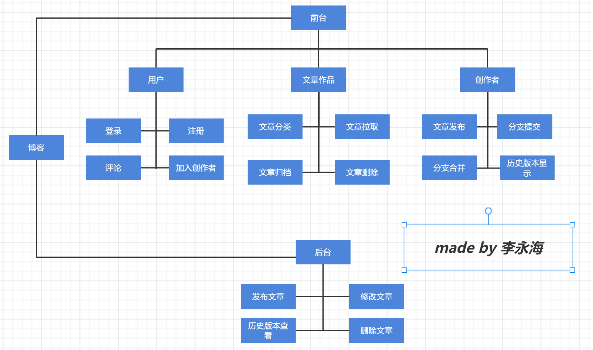

# 个人博客网站的设计

### 基本功能

- 主页文章内容显示
  
  进入网站后或页面刷新后从数据库读取文章显示
  
- 登录功能

  数据库校对用户数据登录用户,以获取发布评论,发布文章权限

- 注册账户功能

  注册账户并将数据写入数据库

- 文章分类功能

  根据发布文章时填写的标签分类展示

- 文章归档功能
  根据发布的文章历史时间进行文章归档

- 评论功能
  读者对文章发布评论

- 发布写入文章功能
  上传自己的文章文件,上传格式为pdf

- 文章拉取功能
  获得到主创者授权,主创者将用户拉取到 " 创作者联盟 "中后,可获得权限,将文章拉取到自己仓库

- 加入创作者联盟功能
  每个文章发布者都会有" 创作者联盟 " 功能,可将其他用户拉入到此联盟中,在 " 创作者联盟 "总的用户获取到文章拉取权限,文章分支提交权限

- 文章分支提交功能
  提交修改后的文章分支

- 文章分支显示功能

  主创者可以看到所有提交的文章分支

- 文章分支合并功能

  主创者可以将文章分支和发布文章进行合并,选择修改部分内容

- 历史版本显示功能

  用户可以看到该文章的历史版本

### 创新点

采用分布式原理
用户可以和创作者商量,创作者可以加用户加入到其 "创作者联盟 " 中,
对方可拉取对方的文章到本地分支,对于其中错误的信息进行修改并提交,
主创者获取到这些提交的修改建议或修改内容,
可以选择合并到主分支,优化文章内容

### 架构图

### 数据库设计

