# 前期工作

## Tomcat7安装与配置

### Tomcat安装

https://tomcat.apache.org/download-70.cgi

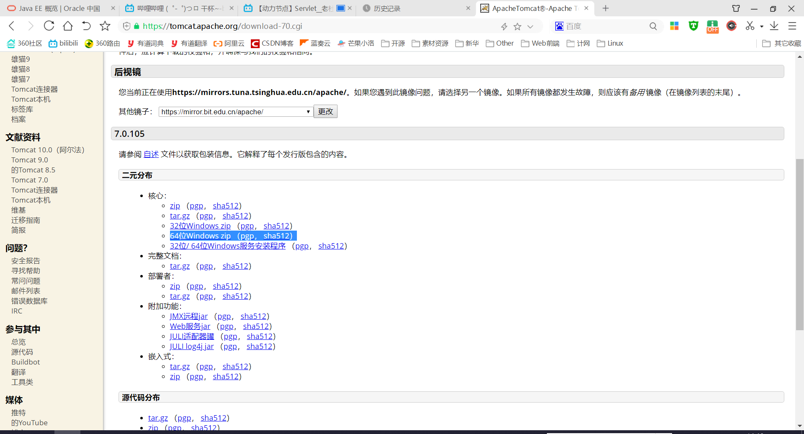

将下载的压缩包解压到你指定的目录即可，如我的

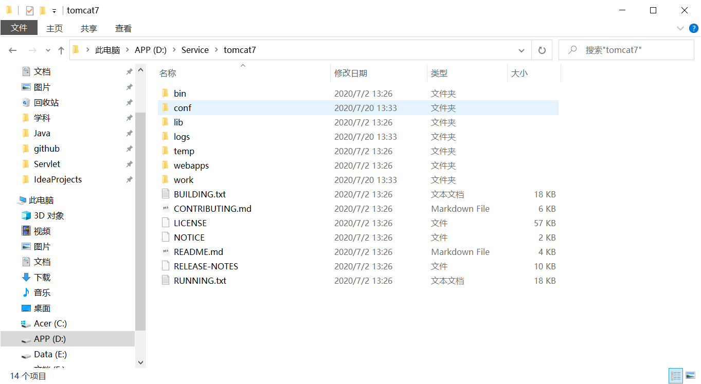

### Tomcat启动与关闭

#### 启动

在命令行窗口进入Tomcat的根目录下的bin目录

执行startup.bat即可启动Tomcat

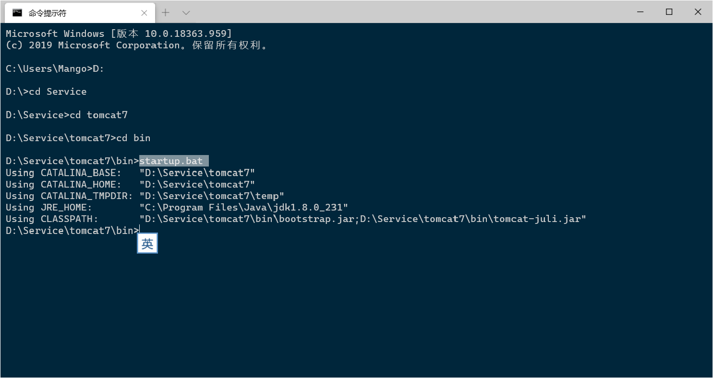

#### 关闭

同样在命令行下执行shutdown.bat文件即可

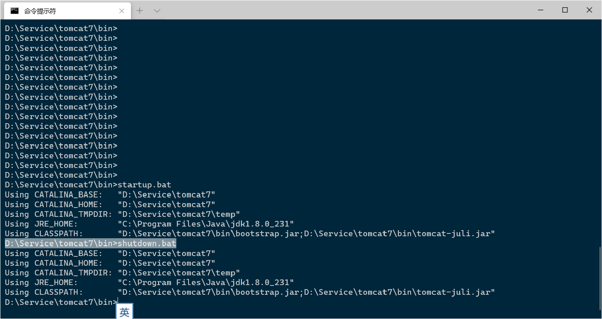

注意，请不雅关闭启动Tomcat后出现的黑窗口，这样会强制关闭Tomcat服务器


### 命令行窗口乱码

启动Tomcat后，会出现乱码

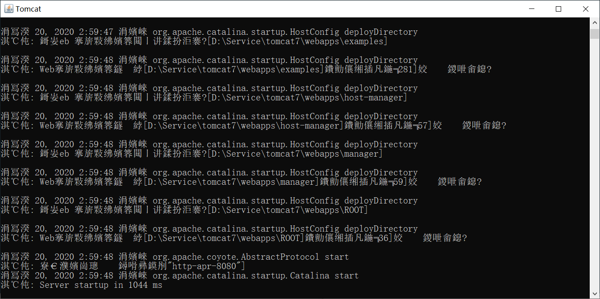


进入Tomcat7根目录下的conf目录，打开 logging.properties文件

找到`java.util.logging.ConsoleHandler.encoding = UTF-8`

在此行前使用`#`将其注释掉即可

### Tomcat配置

#### 配置bin目录

配置bin目录，以使启动和关闭Tomcat命令一起其他命令可以在不进入Tomcat下的bin目录即可使用

在用户变量的Path变量里面添加一条即可，路径为Tomcat下的bin目录，例如我的`D:\Service\tomcat7\bin`

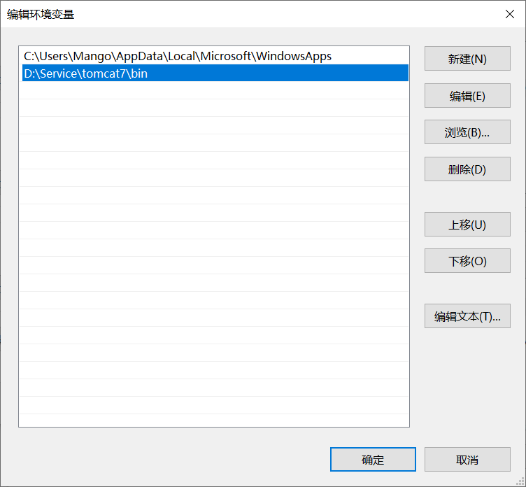

这样我们就可以直接在命令行中，直接使用`startup.bat`和`shutdown.bat`命令了，但是还是无法冲个启动Tomcat，需要再进行CATALINA_HOME的环境变量的配置

#### 配置CATALINA_HOME变量

在用户变量里面新建一个变量，变量名为`CATALINA_HOME`，值为Tomcat的根目录，实际上CATALINA_HOME就是Tomcat的家，即Tomcat的根目录

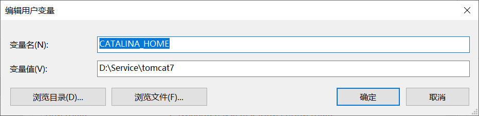

这样我们就可以直接在命令行中，直接使用`startup.bat`和`shutdown.bat`命令了

由于shutdown命令和windows内置的命令冲突，所以使用时要加上后缀，shutdown.bat，而startup可以直接使用；如果要解决问题，可以直接将Tomcat下的bin目录里面的shutdown.bat改一个名字，如stop.bat，这样就解决了shutdown命令与windows系统的命令冲突问题。


## Tomcat服务器目录结构

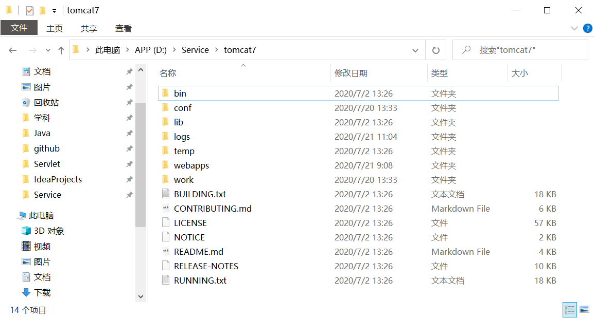


1. bin：
   bin目录主要是用来存放tomcat的命令，主要有两大类，一类是以.sh结尾的（linux命令），另一类是以.bat结尾的（windows命令）。很多环境变量的设置都在此处，例如可以设置JDK路径、tomcat路径
   - startup 用来启动tomcat
   - shutdown 用来关闭tomcat、

2. conf：
   conf目录主要是用来存放tomcat的一些配置文件。
   - server.xml可以设置端口号、设置域名或IP、默认加载的项目、请求编码
   - web.xml可以设置tomcat支持的文件类型
   - context.xml可以用来配置数据源之类的
   - tomcat-users.xml用来配置管理tomcat的用户与权限
   - 在Catalina目录下可以设置默认加载的项目

3. lib:
   lib目录主要用来存放tomcat运行需要加载的jar包。
   例如，像连接数据库的jdbc的包我们可以加入到lib目录中来。

4. logs：
   logs目录用来存放tomcat在运行过程中产生的日志文件，非常重要的是在控制台输出的日志。（清空不会对tomcat运行带来影响）
   在windows环境中，控制台的输出日志在catalina.xxxx-xx-xx.log文件中
   在linux环境中，控制台的输出日志在catalina.out文件中

5. temp：
   temp目录用户存放tomcat在运行过程中产生的临时文件。（清空不会对tomcat运行带来影响）

6. webapps：
   webapps目录用来存放应用程序，当tomcat启动时会去加载webapps目录下的应用程序。可以以文件夹、war包、jar包的形式发布应用。
   当然，你也可以把应用程序放置在磁盘的任意位置，在配置文件中映射好就行。

7. work:
   work目录用来存放tomcat在运行时的编译后文件，例如JSP编译后的文件。
   清空work目录，然后重启tomcat，可以达到清除缓存的作用。


## IDEA创建与部署项目

如图，配置图可以以下图为例进行配置

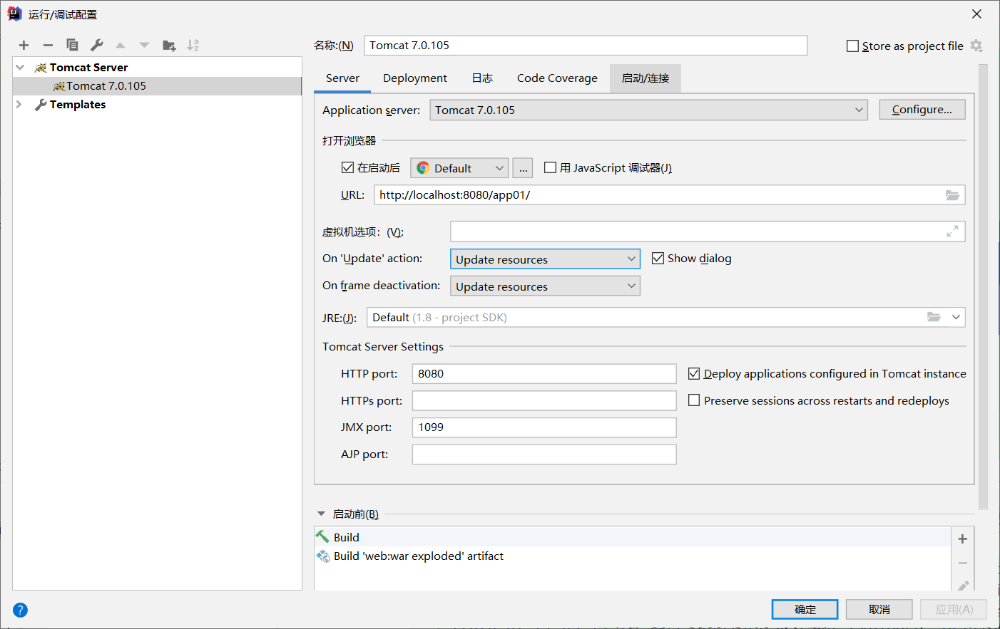

更改项目的部署名称

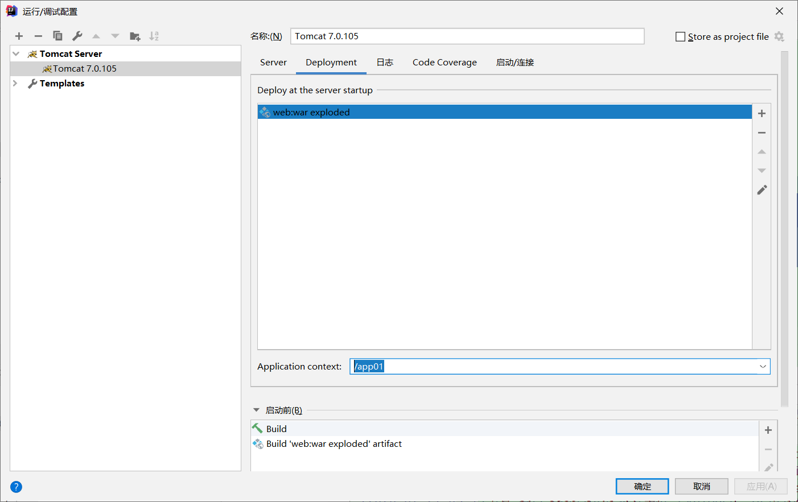


 

# 第一个WebApp(app01)

在html中的超链接，完整的可以写为

```html
<a href="http://localhost:8080/app01/login.html">Login</a>
```

为了更加通用的代码，可以直接从部署的项目名开始写，前面的IP和端口号可以省略，注意，以"/"开头

（如果访问项目时不想加项目名，可以将项目放在webapps/ROOT/目录下，直接访问主机地址就是访问的ROOT目录项目，但是此时需要将链接的项目名去掉，/app01/login.html ——> /login.html）

```html
<a href="/app01/login.html">Login</a>
```


# 第一个带有Servlet的WebApp(app02)

### webApp的目录结构

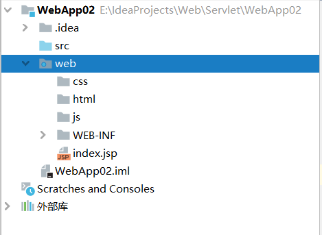

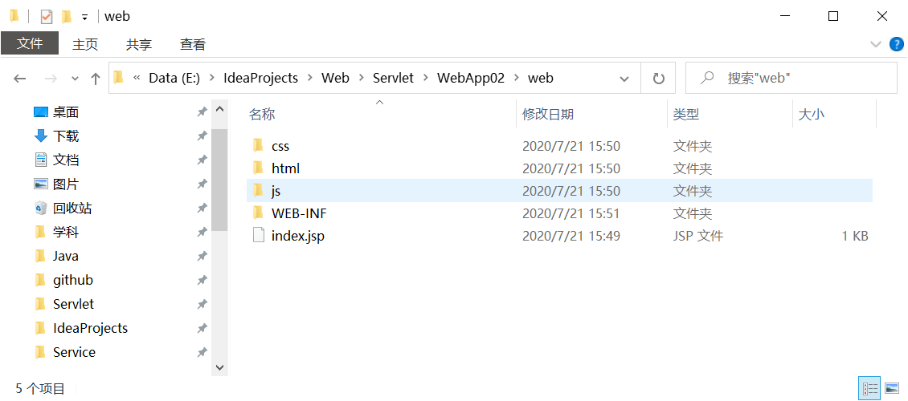

web目录相当于webapp的根目录，是一个项目的根目录

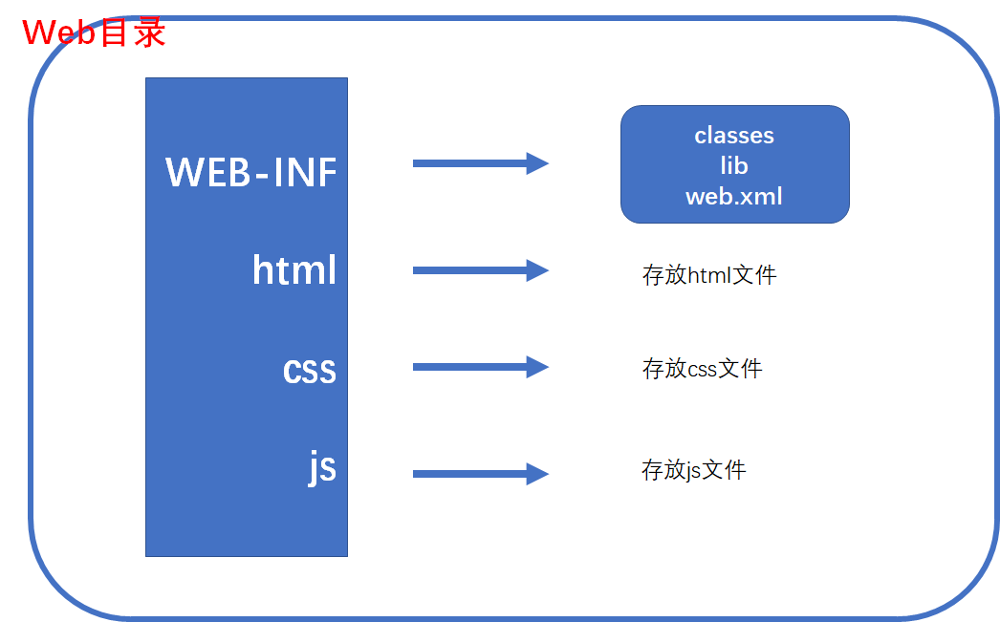

在web目录中，可以创建其他如html、css、js这些目录，用来存放相关的文件

**WEB-INF目录是必须的**

- WEB-INF目录里面必须有classes目录，用来存放Java文件编译后的class字节码文件；在IDEA中，java源文件写在src里面，编译后会自动存放在classes目录中；

- lib用来存放需要的库，如连接数据库的驱动；
- web.xml，写的是请求路径与绑定的从servlet文件（Java文件）


### Tomcat服务器的lib和webapp的lib目录

Tomcat服务器目录的lib是Tomcat的classpath，是全局的

每一个webapp也有一个lib，相当于是项目自己的classpath，是局部的


### web.xml文件编写

**web.xml文件主要配置请求路径和Servlet类名之间的绑定关系**
web.xml文件在Tomcat服务器启动阶段被解析
web.xml文件解析失败，会导致webapp启动失败
web.xml文件中的标签不能随意编写
web.xml文件中的标签也是sun公司指定的Servlet规范

项目目录为

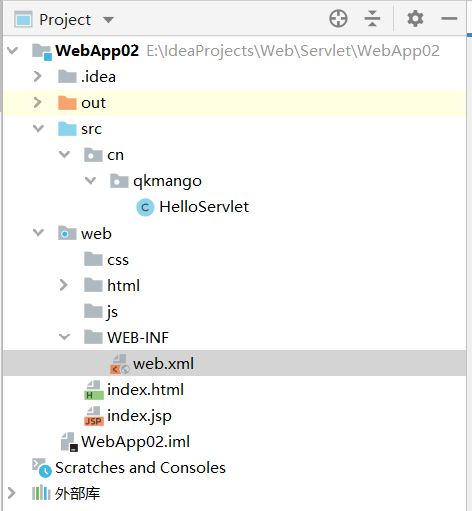

web.xml编写

```xml
<?xml version="1.0" encoding="UTF-8"?>
<web-app xmlns="http://java.sun.com/xml/ns/javaee"
           xmlns:xsi="http://www.w3.org/2001/XMLSchema-instance"
           xsi:schemaLocation="http://java.sun.com/xml/ns/javaee
        http://java.sun.com/xml/ns/javaee/web-app_4_0.xsd"
           version="4.0">

    <servlet>
        <servlet-name>ThisIsHelloServlet</servlet-name>
        <servlet-class>cn.qkmango.HelloServlet</servlet-class>
    </servlet>
    
    <servlet-mapping>
        <servlet-name>ThisIsHelloServlet</servlet-name>
        <!--
			路径随意编写，但是必须以 “/”开始，这个路径是虚拟路径，
            这个路径是cn.qkmango.HelloServlet.class文件的代号，
            用户只要访问这个路径，就会执行cn.qkmango.HelloServlet.class文件
			对应的url-pattern可以有多个
			注意，url-pattern不需要以项目名开头，但是超链接需要以项目名开头
		-->
        <url-pattern>/hello/servlet/test</url-pattern>
        <url-pattern>/hello/servlet</url-pattern>
    </servlet-mapping>
</web-app>
```

浏览器每次访问这个路径（`/hello/servlet/test`），就会自动执行此路径所绑定的类中的`service()`方法


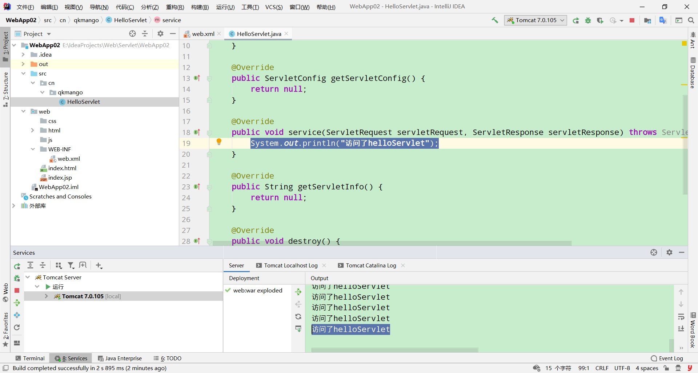


# 将响应结果输出到浏览器中(app03)

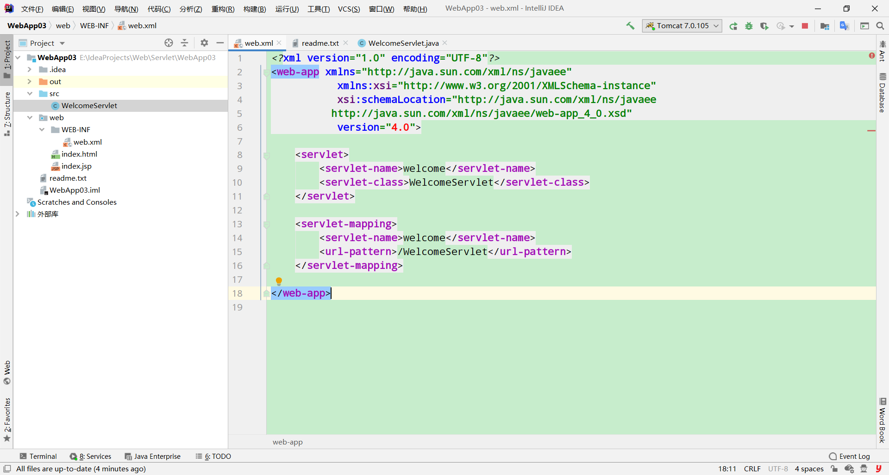

浏览器访问`/WelcomeServlet`时，会执行`WelcomeServlet`对象的`service()`方法


将内入输出到浏览器的三个步骤

1. 解决中文乱码问题
   设置内容类型和字符集
   因为writer是从servletResponse获取的，所以在获取之前进行设置
   `servletResponse.setContentType("text/html;charset=UTF-8");`

2. 获取流对象，直接指向浏览器客户端
   `PrintWriter writer = servletResponse.getWriter();`

3. 将内容输出到浏览器

   `writer.print();`

```java
/* WelcomeServlet类 */
import javax.servlet.*;
import java.io.IOException;
import java.io.PrintWriter;//标准输出流，不需要关闭
public class WelcomeServlet implements Servlet {
    @Override
    public void init(ServletConfig servletConfig) throws ServletException {}

    @Override
    public ServletConfig getServletConfig() {
        return null;
    }

    @Override
    public void service(ServletRequest servletRequest, ServletResponse servletResponse) throws ServletException, IOException {
        
        /**
         * 解决中文乱码问题
         * 设置内容类型和字符集
         * 因为writer是从servletResponse获取的，所以在获取之前进行设置
         */
        servletResponse.setContentType("text/html;charset=UTF-8");

        /**
         * 将信息输出到浏览器上
         * 将HTML字符输出到浏览器上，浏览器解释执行
         * 获取流对象，直接指向浏览器客户端
         */
        PrintWriter writer = servletResponse.getWriter();

        writer.print("<html>" +
                "<head><title>welcome欢迎</title></head>" +
                "<body><h1>welcome Page 欢迎页面</h1></body>" +
                "</html>");
    }

    @Override
    public String getServletInfo() {
        return null;
    }

    @Override
    public void destroy() {}
}
```


# servlet中编写JDBC代码连接数据库(app04)

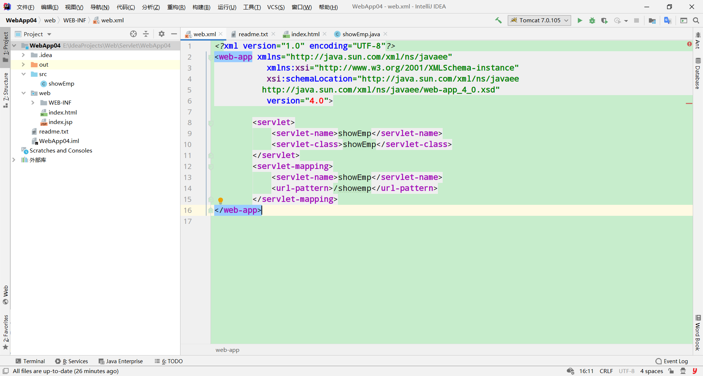

```java
/*showEmp类*/
/* 访问路径"/showemp" 与此类绑定 */
public class showEmp implements Servlet {
    @Override
    public void service(ServletRequest servletRequest, ServletResponse servletResponse) 
        throws ServletException, IOException {
		
        //获取输出流
        servletResponse.setContentType("text/html;charset=UTF-8");
        PrintWriter writer = servletResponse.getWriter();
        //打印HTML代码
        writer.print("<html>" +
                "<title>连接数据库——员工信息</title>" +
                "<body>" +
                "<h1 align='center'>员工信息</h1>" +
                "<hr width='60%' align='center'>" +
                "<table border='1' align='center' width='50%'>" +
                "<tr>" +
                "<th>员工编号</th>" +
                "<th>员工姓名</th>" +
                "<th>工作</th>" +
                "</tr>");
        
        //连接数据库
        Connection conn = null;
        PreparedStatement ps = null;
        ResultSet resultSet = null;
        try {
            Class.forName("com.mysql.jdbc.Driver");
            conn = DriverManager.getConnection("jdbc:mysql://localhost:3306/bjpowernode", "root", "admin");
            ps = conn.prepareStatement("select empno,ename,job from emp");
            resultSet = ps.executeQuery();

            while (resultSet.next()) {
                //查询数据，将数据动态打印到网页
                String empno = resultSet.getString("empno");
                String ename = resultSet.getString("ename");
                String job = resultSet.getString("job");
                writer.print("<tr>");
                writer.print("<td>"+empno+"</td>");
                writer.print("<td>"+ename+"</td>");
                writer.print("<td>"+job+"</td>");
                writer.print("</tr>");
            }

            writer.print("</table></body></html>");
        } catch (ClassNotFoundException | SQLException e) {
            e.printStackTrace();
        } finally {
            /*省略关闭*/
        }
    }
    /*省略其他方法*/
}
```


# Servlet对象的生命周期


## Servlet类中的方法

````java
servlet() 构造方法
void init(ServletConfig config) 初始化方法
void service(ServletRequest req, ServletResponse res) Servlet响应请求
void destroy() 销毁对象前的准备

ServletConfig getServletConfig() 返回一个ServletConfig对象，其中包含此Servlet的初始化和启动参数
String getServletInfo() 返回有关servlet的信息，例如作者，版本和版权
````


## 关于servlet对象的生命周期

### 什么是生命周期？

生命周期表示一个Java对象从最初被创建到最终被销毁，经历的所有过程

### Servlet对象的生命周期是谁来管理的？程序员可以干涉吗？

- Servlet对象的生命周期，javaweb程序员是无权干涉的，包括Servlet对象的相关方法调用，程序员也是无权干涉的
- Servlet对象从最初的创建，方法的调用，以及最后被销毁，是由web容器来管理的
- Web Container管理Servlet对象的生命周期
- 默认情况 下，Servlet对象在Web容器启动阶段不会被实例化。【若希望在web服务器启动阶段实例化Servlet对象，可以进行特殊设置】

### 描述Servlet对象生命周期

1）浏览器访问URL：http://localhost:8080/web_war_exploded/hello
2）web容器截取请求路径：`/web_war_exploded/hello`
3）web容器在容器上下文中找请求路径`/web_war_exploded/hello`对应的Servlet对象
4.1）若没有找到对应的Servlet对象

- 会通过`web.xml`文件中的相关信息，得到请求路径`/web_war_exploded/hello`对应的Servlet完整类名
- 通过反射机制，调用Servlet类的无参构造方法完成Servlet对象的实例化
- web容器调用Servlet对象的`init()`方法完成初始化
- web容器调用Servlet对象的`service()`方法提供服务

4.2）若找到对应的Servlet对象

- web容器直接调用Servlet对象的`service()`方法提供服务

5）Servlet对象销毁

- web容器关闭的时候、webApp重新部署的时候、该Servlet对象长时间没有用户访问的时候，web容器会将Servlet对象销毁，在销毁Servlet对象前，会调用对象的`destroy()`方法进行销毁前的准备

### 总结

- Servlet对象的`构造方法`只执行一次
- Servlet对象的`init()`方法只执行一次
- Servlet对象的`service()`方法，只要用户请求一次，则执行一次
- Servlet对象的`destroy()`方法只执行一次

### 注意

- `init()`方法执行的时候，Servlet对象已经被创建好了
  `destroy()`方法执行的时候，Servlet对象还没被销毁，即将销毁

- Servlet对象是单例，只实例化一个Servlet对象，多用户多线程访问是，使用的是一个Servlet对象；
  Tomcat是支持多线程的，所以Servlet对象是在单实例多线程的环境下运行的；
  那么Servlet对象中若有实例变量，并且实例变量涉及到修改操作，那么这个Servlet对象一定会存在线程安全问题，不建议在Servlet对象中使用实例变量（类的属性），尽量使用局部变量；


## web服务器启动阶段实例化Servlet对象

如希望在web服务器启动阶段实例化Servlet对象，需要在`web.xml`文件中进行相关的配置，例如：
在`servlet`标签中使用`load-on-startup`标签

注意：使用`load-on-startup`标签，数字越小，优先级越高

````xml
<servlet>
    <servlet-name>hello</servlet-name>
    <servlet-class>Hello</servlet-class>
    <!--此处设置Servlet对象在服务器启动阶段实例化的优先级-->
    <load-on-startup>1</load-on-startup>
</servlet>
<servlet-mapping>
    <servlet-name>hello</servlet-name>
    <url-pattern>/hello</url-pattern>
</servlet-mapping>

<servlet>
    <servlet-name>welcome</servlet-name>
    <servlet-class>Welcome</servlet-class>
    <!--此处设置Servlet对象在服务器启动阶段实例化的优先级-->
    <load-on-startup>0</load-on-startup>
</servlet>
<servlet-mapping>
    <servlet-name>welcome</servlet-name>
    <url-pattern>/welcome</url-pattern>
</servlet-mapping>
````


## Servlet对象实例化之后存储到哪里了

大多数的Web容器都是将该Servlet对象以及对应的`url-pattern`存储到`Map集合`中了
在web容器中有这样一个Map集合
**Map<String, Servlet>**

````
key             value
--------------------------------------
/login          LoginServlet对象的引用
/delete         DeleteServlet对象的引用
/insert         InsertServlet对象的引用
````


## 启动阶段解析的web.xml文件，做了什么

服务器启动阶段会解析各个webapp中的web.xml文件，做了什么？

在web容器中有这样一个集合
**Map<String, String>**

````
key             value
---------------------------------------------------------
/login          cn.qkmango.javaweb.servlet.LoginServlet
/delete         cn.qkmango.javaweb.servlet.DeleteServlet
/insert         cn.qkmango.javaweb.servlet.InsertServlet
````

实际上，服务器启动时会解析web.xml文件，并且将解析的数据存放在Map集合中，当在浏览器中输入请求的路径时，web容器在容器会找请求路径对应的Servlet对象，如果没有找到，**实际上不是去web.xml文件中找此路径对应的完整类名，而是去此Map集合中查找**


## Servlet接口中的方法写什么代码？何时使用？

Servlet接口中的这些方法中写什么代码？什么时候使用这些方法？

1. `无参构造方法`【以后就不需要考虑构造方法了，尽量别动构造方法】
2. `init()`
   无参构造方法和`init()`，两个方法执行时间几乎是相同的，都只执行一次
   **若系统要求对象在创建时刻执行一段特殊的程序，这段程序尽量写到`init()`方法中**
   为什么不建议将代码写到构造法中呢？
   存在风险！当程序员编写构造方法的时候，可能会导致无参构造方法不存在
   Servlet中的`init()`方法是SUN公司为程序员专门提供的一个初始化时刻，若希望初始化时刻执行一段程序，这个程序可以编写在`inti()`方法中，将来会被自动调用

3. `service()`
   这个方法是必然重写的，因为这个方法需要完成业务逻辑的处理，请求的处理，以及完成响应
4. `destroy()`
   这个方法是为程序员提供的一个特殊时刻，这个特殊时刻被成为对象销毁时刻；若希望在销毁时刻执行一段特殊代码，需要将这段代码写到`destroy()`方法中，会被自动调用


# ServletConfig接口(app05)

> 研究`javax.servlet.ServletConfig`接口

1. `javax.servlet.ServletConfig`是接口

2. 【作为了解】Apache Tomcat服务器实现了Servlet规范，Tomcat服务器写了一个ServletConfig接口的实现类，实现类的完整类名是`org.apache.catalina.core.StandardWrapperFacade`

3. Javaweb程序员在编程的时候，一直是面向ServletConfig接口去完成调用的，不需要关心具体的实现类，只需要学习ServletConfig接口有哪些可以使用的方法。
   - webapp放到Tomcat服务器中，ServletConfig的实现类是：`org.apache.catalina.core.StandardWrapperFacade`
   - webapp放到JBOSS服务器中，ServletConfig的实现类可能是另外一个类名了

4. Tomcat服务器是一个实现了Servlet规范和JSP规范的容器

6. **ServletConfig到底是什么？**
  - ServletConfig是一个Servlet对象的配置信息对象，ServletConfig对象中封装了一个Servlet对象的配置信息
    - Servlet对象的配置信息在web.xml文件中
- 一个Servlet对象对应一个ServletConfig对象对象，100个Servlet对象对应100个ServletConfig对象
  
7. **如何在`service()`方法中使用`init()`方法中的`servletConfig`参数对象**
    程序员主要编写的是service()方法，在service()方法中我们可能需要使用servletConfig对象
   
   - 在`init()`方法中完成：局部变量servletConfig赋值给实例变量servletConfig
   - 在`getServletConfig()`，提供公开的get方法，目的是供子类使用，只需要修改return返回值即可
   
   ````java
   public class a implements Servlet {
   
       //定义实例变量
       private ServletConfig servletConfig;
   
       @Override
       public void init(ServletConfig servletConfig) throws ServletException {
           //将局部变量中的servletConfig赋值给实例变量servletConfig
           this.servletConfig = servletConfig;
       }
   
       //这个方法是供子类使用的，在子类中若想获取ServletConfig，可以调用这个方法
       @Override
       public ServletConfig getServletConfig() {
           //return null;
           //返回实例变量servletConfig
           return servletConfig;
       }
   }
   ````
   
8. **ServletConfig接口中的方法**

    - String `getInitParameter(String name)` 通过name，获取初始化参数name对应的value

        ````java
        //获取name为driver所对应的value
        String driver = servletConfig.getInitParameter("driver");
        ````
     - Enumeration `getInitParameterNames()` 获取初始化参数的name集合。
        ````java
        //获取name集合
        Enumeration<String> initParameterNames = servletConfig.getInitParameterNames();
        //通过name集合循环遍历拿出name，通过name获取value
        while (initParameterNames.hasMoreElements()) {
            String name = initParameterNames.nextElement();
            String value = servletConfig.getInitParameter(name);
            writer.print(name + " = " + value + "<br>");
        }
        ````
     - String `getServletName()` 获取servletName，`<servlet-name>servletName</servlet-name>`

       ````java
       String servletName = servletConfig.getServletName();
       ````

     - ServletContext `getServletContext()` 获取ServletContext【Servlet上下文】对象
    
        ````java
        ServletContext servletContext = servletConfig.getServletContext();
        ````
    
9. `<init-param>`标签，初始化参数

   - `<init-param>`标签是初始化参数，定义在`<servlet>`标签中
   - `<init-param>`标签内还有`<param-name>`、`<param-value>`标签，`<param-name>`表示key，`<param-value>`表示value
   - `<init-param>`定义的参数属于某一个 Servlet
   - String value = servletConfig.getInitParameter(name)获取的就是`<init-param>`中的参数
   - 这些信息封装在ServletConfig对象中
   ````xml
   <servlet>
       <servlet-name>a</servlet-name>
       <servlet-class>cn.mango.servletConfig.a</servlet-class>
   
       <!--初始化参数init-param-->
       <init-param>
           <param-name>driver</param-name>
           <param-value>com.mysql.jdbc.driver</param-value>
       </init-param>
   
       <init-param>
           <param-name>url</param-name>
           <param-value>jdbc:mysql://localhost:3306/database</param-value>
       </init-param>
   
       <init-param>
           <param-name>user</param-name>
           <param-value>root</param-value>
       </init-param>
   
       <init-param>
           <param-name>password</param-name>
           <param-value>admin</param-value>
       </init-param>
   </servlet>
   ````


# ServletContext接口(app06)


> 研究 `javax.servlet.ServletContext`接口

1. `javax.servlet.ServletContext`接口，Servlet规范

2. Tomcat服务器对ServletContext接口的实现类完整类名是：`org.apache.catalina.core.ApplicationContextFacade`
    javaweb程序员只需要面向ServletContext接口调用方法即可，不需要关心Tomcat具体的实现
    
3. **ServletContext到底是什么？什么时候被创建？什么时候被销毁？创建几个？**
  
    - ServletContext被译为：Servlet上下文
    - 一个webapp只有一个web.xml文件，web.xml文件服务器启动阶段被解析
    - 一个webapp只有一个ServletContext对象，ServletContext对象在服务器启动阶段被实例化
    - ServletContext在服务器关闭的时候被销毁
    - ServletContext对应的是web.xml文件，是web.xml文件的代表
    - ServletContext是所有Servlet对象四周环境的代表，被所有Servlet共享【在同一个webapp中，所有Servlet对象共享一个四周环境对象，该对象就是ServletContext】
    ```mermaid
    classDiagram
        Servlet01--|> ServletContext对象
        Servlet02 --|>ServletContext对象
        Servlet03--|> ServletContext对象
        ServletContext对象:目的是让Servlet之间传递和共享数据
   ```
   - 所有用户若想共享同一个数据，可以将数据放到ServletContext对象中（写到web.xml文件中，或后期通过方法添加）
   - 一般放到ServletContext对象中的数据不建议涉及到修改操作的，以为ServletContext是多线程共享的一个对象，修改的时候会存在线程安全问题
   
4. **ServletContext接口中有哪些常用方法**
  
     - void `setAttribute(String name, Object object)` 向ServletContext中添加数据
     - Object `getAttribute(String name)` 从ServletContext中获取数据
     - void `removeAttribute(String name)` 从ServletContext中移除数据
     - String `getInitParameter(String name)` 从ServletContext中获取name所对应的value初始化参数(\<context-param>标签中)
     - Enumeration `getInitParameterNames()`从ServletContext中获取name所对应的value初始化参数(\<context-param>标签中)
     - String `getRealPath(String path)` 获取文件绝对路径
     
     ````java
     /*向ServletContext中添加数据*/
     servletContext.setAttribute("stuObj",student);
     /*向ServletContext中删除数据*/
     servletContext.removeAttribute("stuObj");
     /*从ServletContext中查询数据*/
     Object stuObj = servletContext.getAttribute("stuObj");
     ````
     
     
     
5. Servlet、ServletConfig、ServletContext之间的关系
    - 一个Servlet对应一个ServletConfig对象
    - 所有的Servlet共享一个ServletContext对象
    
6. **ServletContext范围可以完成跨用户传递数据**
    A用户在ServletContext中存储了一个数据，B用户可以通过name获取对应的数据
    
7. `<context-param>`上下文参数

    - `<context-param>`标签是上下文参数（全局参数），定义在`<web-app>`标签中

    - `<context-param>`标签内还有`<param-name>`、`<param-value>`

      `<param-name>`表示参数的name（key）

      `<param-value>`表示name所对应的value

    - `<context-param>`定义的参数属于全局，所有Servlet共享

    - 这些参数信息封装在ServletContext对象中

    ````xml
    <context-param>
        <param-name>username</param-name>
        <param-value>admin</param-value>
    </context-param>
    <context-param>
        <param-name>password</param-name>
        <param-value>123</param-value>
    </context-param>
    ````


总结注意：

ServletConfig与ServletContext中的`getInitParameter()`、`getInitParameterNames()`不同

1. ServletConfig是每个Servlet对象的配置信息对象，ServletConfig中的`getInitParameter()`与`getInitParameterNames()`获取到的初始化参数是在`<init-param>`标签中的，`<init-param>`标签定义在`<servlet>`标签里面

2. ServletContext是所有Servlet对象的共用的四周环境，ServletContext中的`getInitParameter()`与`getInitParameterNames()`获取到的参数是在`<context-param>`标签中的，`<context-param>`标签定义在`<web-app>`标签里面

ServletContext中的`getInitParameter(String name)`与`getAttribute(String name)`不同

1. `getInitParameter(String name)`获取到的参数是写在web.xml文件`<context-param>`标签中的，获取到的都是字符串参数
2. `getAttribute(String name)`获取到的数据是运行时添加到ServletContext中的数据，数据可以是任何类型，不同用户都可以通过name获取到数据


# 欢迎页面(webapp07)

> 关于wbeapp的欢迎页面的设置

1. 欢迎页面是怎么设置的？
   假设在web/html目录下创建welcome.html，想让welcome.html作为整个webapp的欢迎页面，应该在web.xml文件中添加如下标签
   
   ````xml
   <!--将welcome.html页面作为欢迎页面-->
   <!--注意开头没有“/”-->
   <welcome-file-list>
       <welcome-file>html/welcome.html</welcome-file>
   </welcome-file-list>
   ````
2. 为什么设置欢迎页面？
    * 为了访问更方便，为例提高用户的体验
    * 设置欢迎页面之后，直接在浏览器地址栏上访问该webapp即可，自动定位到欢迎页面，例如`http://localhost:8080/webapp07/`

3. 欢迎页面可以设置多个
    设置多个欢迎页面，越靠上越优先，当前面的欢迎页面找不到时才使用后面的欢迎页面
    
   ````xml
   <welcome-file-list>
       <welcome-file>html/welcome.html</welcome-file>
       <welcome-file>html/welcome2.html</welcome-file>
   </welcome-file-list>
   ````
````
    
4. 欢迎页面可以是任何一种web资源
    欢迎页面不仅可以是html文件，也可以时任何一种web资源，如Servlet
    使用Servlet作为欢迎页面
    
    1. 在web.xml文件中配置好Servlet
    2. \<welcome-file>标签内填写\<servlet>标签中的\<url-pattern>标签中的内容，要注意，此时要去掉开头的“/”
   ````xml
   <!--配置Servlet-->
   <servlet>
       <servlet-name>welcome</servlet-name>
       <servlet-class>cn.qkmango.Welcome</servlet-class>
   </servlet>
   <servlet-mapping>
       <servlet-name>welcome</servlet-name>
       <url-pattern>/system/welcome</url-pattern>
   </servlet-mapping>
   
   <!--Servlet作为欢迎页面-->    
   <welcome-file-list>
       <!--注意此处，去掉开头的“/”-->
       <welcome-file>system/welcome</welcome-file>
   </welcome-file-list>
````


5. 欢迎页面有全局配置和局部配置
    * 全局配置：`CATALINA_HOME/conf/web.xml`
    * 局部配置：`CATALINA_HOME/webapps/webapp/WEB-INF/web.xml`
    
    若有局部配置，优先使用局部配置（就近原则）
    
    **注意**：若在web目录中有index.html、index.htm、index.jsp文件，这些都是默认的欢迎页面，都在全局配置中已经配置过了，即全局配置中，默认以这些文件为欢迎页面


# 常见的错误代码  自定义错误页面(webapp08)

* 404 Not Found 资源未找到
* 500 Server Inner Error 服务器内部错误，一般都是服务器Java程序出现异常

404和500是HTTP协议状态码，是W3C制定的
正常响应的HTTP协议状态码是200

可以在web.xml中添加错误页面
````xml
<error-page>
    <error-code>404</error-code>
    <!--此处的路径前省略了项目的根目录web目录，即相对于当前项目的根目录-->
    <location>/errorPage/404.html</location>
</error-page>
````


# Servlet路径的总结
什么时候以`/webappName`开头
什么时候以`/`开头
什么时候不以`/`开头


## 以`/webappName`开头

客户端浏览器要处理的URL路径时，要以`/webappName`开头，此时`/`前代表的是主机名，如`http://localhost:8080`

例如页面有一个链接

````html
<a href="/oa/login">登陆</a>
````

当你在浏览器点击这个超链接时，浏览器就会请求`http://localhost:8080/oa/login`，所以，在需要浏览器请求的URL时，`/`前省略了主机名

## 以`/`开头

后台服务器处理请求URL路径时，以`/`开头，例如在web.xml文件中配置的servlet

```xml
<servlet>
    <servlet-name>login</servlet-name>
    <servlet-class>cn.qkmango.login</servlet-class>
</servlet>
<servlet-mapping>
    <servlet-name>login</servlet-name>
    <url-pattern>/login</url-pattern>
</servlet-mapping>
```

此处的`<url-pattern>/login</url-pattern>`就是以`/`开头，`/`前省略了hostName和webappName，即`/`前的路径是以当前项目（webapp）


后台服务器处理的是一个文件的路径时，以`/`开头，此时`/`前是相对于web目录（即网站的根目录），如在web.xml中设置错误页面的路径

web
    ├─errorPage
    │      404.htm
    └─WEB-INF
            web.xml

```xml
<error-page>
    <error-code>404</error-code>
    <location>/errorPage/404.html</location>
</error-page>
```


## 不以`/`开头

目前只见于在web.xml中设置欢迎页面

```xml
<!--Servlet作为欢迎页面-->    
<welcome-file-list>
    <welcome-file>system/welcome</welcome-file>
</welcome-file-list>

<!--html文件作为欢迎页面-->
<welcome-file-list>
    <welcome-file>html/welcome.html</welcome-file>
</welcome-file-list>
```

## 总结

- 客户端浏览器请求的URL时，省略了主机名（`http://localhost:8080`）

- 后台服务器处理URL时，省略了项目名，以该项目路径为相对路径（`http://localhost:8080/taobao`）

- 后台服务器处理物理文件时的文件路径，以该项目的根目录（web目录为相对路径）（`E:\webapp08\web`）

当分不清时，可以试着将省略的路径加上，看看拼接起来的路径是否正确


# GenericServlet适配器(webapp09)

> 缺省适配器

1. 目前我们所有的Servlet类直接实现了javax.servlet.Servlet接口，但是这个接口中有很多方法是目前不需要的，我们可能只需要编写`service()`方法。直接实现Servlet接口的代码丑陋，有必要在中间添加一个适配器，以后所有的Servlet类不再直接实现Servlet接口，而而是去继承适配器
2. 适配器可以让代码优雅之外，我们还可以在适配器中提供大量的方法，子类继承之后，可以在子类中直接使用，方便编程


## 自定义GenericServlet类（适配器）

> 适配器类可以让代码变得不那么臃肿，而且可以提供大量的自定义方法

- 问题：为了让适配器类中`init(ServletConfig)`中的代码生效，而被final修饰限制不被重写，那么怎么在初始化时刻执行一段代码呢？

- 解决：`init()`方法为`init(ServletConfig)`同名的重载方法，原本的`init(ServletConfig)`方法为了使其中的代码不被覆盖重写而失效，所以添加了`final`修饰，但是使得`init(ServletConfig)`无法重写而过于局限，所以我们扩展一个同名的`init()`方法供程序员重写，`init()`会被`init(ServletConfig)`调用，这样我们只需要重写`init()`即可，若在Servlet初始化时刻需要执行一段特殊的代码，建议重写此无参数的`init()`方法

```java
public abstract class GenericServlet implements Servlet {
    private ServletConfig config;

    @Override
    public final void init(ServletConfig servletConfig) throws ServletException {
        this.config = servletConfig;
        this.init();
    }

    /**
     * 若在初始化时刻需要执行一段特殊的代码，建议重写此无参数的init()方法
     */
    public void init() {}

    @Override
    public ServletConfig getServletConfig() {
        return config;
    }

    @Override
    public abstract void service(ServletRequest servletRequest, ServletResponse servletResponse) throws ServletException, IOException;

    @Override
    public String getServletInfo() {
        return null;
    }

    @Override
    public void destroy() {
    }

    //-------------------自定义扩展方法，方便子类使用-----------------
    /**
     * 获取ServletContext Servlet上下文对象
     * @return javax.servlet.ServletContext 返回Servlet上下文对象
     */
    public ServletContext getServletContext() {
        return config.getServletContext();
    }
}
```

servlet，重写无参数的init()方法达到初始化时执行代码的目的

````java
public class Hello extends GenericServlet {
    /**
     * 重写自定义GenericServlet类（适配器）中的无参数重载的init()方法，
     使得原本的init(ServletConfig)不会被覆盖
     */

    @Override
    public void init() {
        System.out.println("My Servlet init()......");
    }

    @Override
    public void service(ServletRequest servletRequest, ServletResponse servletResponse) throws ServletException, IOException {
		//.........
    }
}
````


## SUN提供的GenericServlet类（适配器）

其实我们并不需要自己去写一个GenericServlet类，SUN公司已经为我们准备了官方的GenericServlet类

`javax.servlet.GenericServlet`


# HTTP协议(webapp10)

## GET请求与POST请求

### HTTP协议的详细内容

#### 什么是HTTP协议？

- 超文本传输协议
- 浏览器和服务器之间的一种通讯协议
- 该协议时W3C负责制定的，其本质上就是数据传送格式，提前指定好了的。浏览器和服务器都必须按照这种格式接收与发送数据

#### 你们使用的HTTP协议版本号是多少

- HTTP1.1

#### HTTP协议包括几部分

- 请求协议：从Browser发送到Server的时候采用的数据传送格式
- 响应协议：从Server发送到Browser时时候采用的数据传送格式

#### 请求协议

请求协议包括四部分

- 请求行
- 消息报头
- 空白行
- 请求体

请求行包括：请求方式 URI 协议版本号 `POST /webapp10/login HTTP/1.1`

空白行：专门用来分离消息报头和请求体的


如下是通过Httpwatch软件抓取的请求响应流

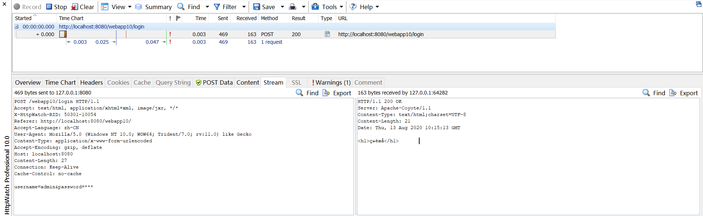

**GET请求**：如下是一个GET请求的登陆页面的请求，由于请求方式为GET，所以发送数据在请求行上发送！故请求体为空

````http
GET /webapp10/login?username=admin&password=123 HTTP/1.1 请求行
Accept: text/html, application/xhtml+xml, image/jxr, */* 消息报头
X-HttpWatch-RID: 50301-10022
Referer: http://localhost:8080/webapp10/
Accept-Language: zh-CN
User-Agent: Mozilla/5.0 (Windows NT 10.0; WOW64; Trident/7.0; rv:11.0) like Gecko
Accept-Encoding: gzip, deflate
Host: localhost:8080
Connection: Keep-Alive
														 空白行
														 请求体
````

**POST请求**：如下是一个POST请求的登陆页面的请求，请求体展示了请求的内容`username=admin&password=***`

````http
POST /webapp10/login HTTP/1.1 请求行						
Accept: text/html, application/xhtml+xml, image/jxr, */* 消息报头
X-HttpWatch-RID: 50301-10054
Referer: http://localhost:8080/webapp10/
Accept-Language: zh-CN
User-Agent: Mozilla/5.0 (Windows NT 10.0; WOW64; Trident/7.0; rv:11.0) like Gecko
Content-Type: application/x-www-form-urlencoded
Accept-Encoding: gzip, deflate
Host: localhost:8080
Content-Length: 27
Connection: Keep-Alive
Cache-Control: no-cache
						空白行
username=admin&password=123 请求体
````


#### 响应协议

响应协议包括四部分

- 状态行
- 响应报头
- 空白行
- 响应体

状态行：协议版本号 状态码

空白行：是用来分离响应报头和响应体的

响应协议中重点掌握状态码：

- 200 响应成功正常结束

- 404  资源未找到

- 500 服务器内部错误

  ......

如下是服务器的响应

````http
HTTP/1.1 200 OK 状态行
Server: Apache-Coyote/1.1 响应报头
Content-Type: text/html;charset=UTF-8
Content-Length: 21
Date: Thu, 13 Aug 2020 10:15:13 GMT
	空白行
<h1>登陆成功</h1> 响应体
````


#### GET请求与POST请求区别

- 什么情况下浏览器发送的请求是GET请求，什么情况下浏览器发送的请求是POST请求？

  只有当使用表单form，并且讲form的标签的method属性设置为method="post"，才是POST请求方式，其余剩下的所有请求都是基于GET请求

- GET请求和POST请求有什么区别？

  - GET请求在请求行上提交数据，格式`uri?name=value&name=value`，这种提交方式最终提交的数据会显示在浏览器地址栏上

  - POST请求在请求体中提交数据，相对安全，提交格式`name=value&name=value`，这种提交方式最终不会显示在浏览器地址栏上
  - POST请求在请求体中提交数据，所以POST请求提交的数据没有长度限制【POST可以提价大数据】
  - GET请求在请求行上提交数据，所以GET请求提交的数据长度有限制
  - GET请求只能提交字符串数据，POST请求可以提交任何类型的数据，包括视频...，所以文件上传必须使用POST请求
  - GET请求最终的结果，会被浏览器缓存收纳，而POST不会被缓存收纳（为什么GET会被缓存？）

- GET请求和POST请求应该如何选择？
  - 有敏感数据 POST
  - 传送的数据不是普通字符串 POST
  - 传送的数据非常多 POST
  - 这个请求是为了修改服务器端资源 POST
  - GET请求多数情况下是从服务器中读取资源，这个读取的资源在短时间内不会发送变化，所以GET请求最终的结果会被浏览器缓存起来
  - POST请求是为了修改服务器端的资源，而每一次修改结果都是不同的，最终结果没有必要被浏览器缓存


## 缓存解决方案

浏览器将资源缓存后，缓存的资源是和某个特定的路径绑定在一起的，只要浏览器再发送这个相同的请求路径，这个时候浏览器就会去缓存中获取资源，不再访问服务器，以这种方式降低服务器的压力，提高用户体验。

但是有的时候我们并不希望走缓存，希望每一次后哦访问服务器，可以在请求路径后面添加时间戳，例如：`http://ip:port/oa/system/logout?timetamp=1234564635423`


# 保证前后端请求方式相同(webapp11)

1. 前端页面发送的请求方式要与服务器端需要的请求方式一致

   - 服务器需要前端发送POST，那么前端就应该发送POST请求，否则服务器应当提示错误信息

   - 服务器需要前端发送GET，那么前端就应该发送GET请求，否则服务器应当提示错误信息


2. 怎么完成以上的需求

   - 在Javaweb程序中想办法获取该请求是什么类型的请求

   - 当我们获取到请求方式以后，在Javaweb程序中可以使用Java语言进行判断

     ```java
     if("POST".equals(method)) {
         //.......
     } else if("GET".equals(method)) {
         //.......
     }
     ```


3. 怎么在Javaweb程序中获取请求方式

   - 重点：HTTP的请求协议全部信息会被自动封装到`javax.servlet.http.HttpServletRequset`对象中
   - 在`HtppServletRequest`接口类型中有一个方法：String getMethod();可以获取请求方式
   - `HtppServletRequest` extends `ServletRequest`

   ```java
   //将ServletRequest强制转换为带有Http的接口类型
   HttpServletRequest httpServletRequest = (HttpServletRequest) servletRequest;
   
   //获取浏览器发送的请求方式
   String method = httpServletRequest.getMethod();
   System.out.println(method);
   ```

   - 问题：HttpServletRequest 继承自 ServletRequest，为什么可以直接向上转型，将父类转换为子类？

     其实`service()`方法的两个参数servletRequest、servletResponse，实际上并不是`new servletRequest()`，Tomcat内部实际上是`new HttpServletRequest()`，所以本质上servletRequest是HttpServletRequest，所以我们进行强转并不会报错；同理，`service()`的另一个参数servletResponse本质上也是HttpservletResponse对象。

     ````java
     //Tomcat内部创建service()的两个参数对象，实际上是使用了多态
     ServletRequest request = new HttpServletRequest();
     ServletResponse response = new HttpServletResponse();
     ````

4. 在每一个Servlet类中都编写了以下程序，来保证前端请求方式和后台需要的请求方式一致的：

   ````java
   //将ServletRequest、ServletResponse强制转换为带有Http的接口类型
   HttpServletRequest httpServletRequest = (HttpServletRequest) servletRequest;
   HttpServletResponse httpServletResponse = (HttpServletResponse) servletResponse;
   
   httpServletResponse.setContentType("text/html;charset=UTF-8");
   PrintWriter writer = httpServletResponse.getWriter();
   
   //获取浏览器发送的请求方式
   String method = httpServletRequest.getMethod();
   System.out.println(method);
   
   
   //login是处理登陆的，要求前端必须发送POST请求
   if("GET".equals(method)) {
       //后台报出错误
       writer.print("405-您应当发送POST请求");
       //前端报出错误
       throw new RuntimeException("405-您应当发送POST请求");
   }
   
   //如果程序可以执行到这一步，说明用户发送的是POST请求，程序正常执行
   writer.print("正在登陆......");
   ````

   

5. 以上代码在每一个Servlet类中都需要编写，怎么能封装一下，以后在每一个具体的Servlet类中不写这样的代码了，但是还是能够达到同样的效果？

   SUN公司提供了一个类`HttpServlet` 


# HttpServlet(webapp12)

为了使前后端的请求方式相同，我们需要在后端获取请求方式，然后进行判断前端发送的请求是否为规定的请求方式，如果不是规定的请求方式，就会报错；

为了实现上述功能，此功能的代码需要在每一个Servlet类中都需要编写，怎么能封装一下，以后在每一个具体的Servlet类中不写这样的代码了，但是还是能够达到同样的效果？


## 自定义的HttpServlet

- 自定义的HttpServlet类，解决判断前后端请求方式是否一致的问题

```java
public class HttpServlet extends GenericServlet {
    /**
     *  此方法为原始service()方法，方法内将ServletRequest、ServletResponse强转为带有http的接口
     *  然后调用重载的service(HttpServletRequest, HttpServletResponse)方法
     *  所以此方法我们无需进行重写
     */
    @Override
    public void service(ServletRequest req, ServletResponse res) throws ServletException, IOException {
        HttpServletRequest request = (HttpServletRequest) req;
        HttpServletResponse response = (HttpServletResponse) res;
        service(request,response);
    }

    /**
     * 此方法获取请求方式后进行判断，
     * 如果是GET请求就执行doGet()
     * 如果是POST请求就执行doPost()
     * 此方法没有理由重写，只需要将业务代码写在doGet()或doPost()方法中即可
     */
    public void service(HttpServletRequest request, HttpServletResponse response) throws IOException {
        String method = request.getMethod();
        if("POST".equals(method)) {
            doPost(request, response);
        } else if("GET".equals(method)) {
            doGet(request, response);
        }
    }

    /**
     * 我们需要什么请求时，子类继承此父类就应当重写对应的doGet()或者doPost()方法之一
     * 在doGet()或者doPost()方法内写业务代码，即将原来的service()内的业务代码写到doXXX()中
     */
    public void doPost(HttpServletRequest request, HttpServletResponse response) 
        throws IOException {
        response.setContentType("text/html;charset=UTF-8");
        response.getWriter().print("应当发送GET请求");
        throw new RuntimeException("应当发送GET请求");
    }

    public void doGet(HttpServletRequest request, HttpServletResponse response) 
        throws IOException {
        response.setContentType("text/html;charset=UTF-8");
        response.getWriter().print("应当发送POST请求");
        throw new RuntimeException("应当发送POST请求");
    }
}
```

当有了HttpServlet类之后，写一个login类（Servlet）来继承HttpServlet类试试

```java
public class login extends cn.test.HttpServlet {
    @Override
    public void doPost(HttpServletRequest request, HttpServletResponse response) 
        throws IOException {
        response.setContentType("text/html;charset=UTF-8");
        response.getWriter().print("登陆成功！");
    }
}
```

当Tomcat服务器启动并且通过浏览器访问此Servlet对应的页面时，Tomcat会执行login类，假设login类需要的是POST请求，所以我们将继承自父类的doPost()重写为我们需要的业务代码，执行顺序为：

- 假设前端发送的是POST请求

  1. `service(ServletRequest, ServletResponse)` 将两个参数强转为带有Http的接口，之后执行

  2. `service(HttpServletRequest, HttpServletResponse) `获取请求方式POST并通过判断执行重写的doPost()方法

  3. `doPost(HttpServletRequest, HttpServletResponse)` 执行业务代码

- 假设前端发送的是GET请求

  1. `service(ServletRequest, ServletResponse)` 将两个参数强转为带有Http的接口，之后执行

  2. `service(HttpServletRequest, HttpServletResponse)`获取请求方式GET并通过判断执行未被重写的doGet()方法

  3. `doGet()` 报错，将错误信息输出到控制台和前端页面

 所以，我们的Servlet继承HttpServlet后，后端需要的是什么请求，那么我们就重写对应的doPost()/doGet()方法，方法内是我们的业务代码，并不需要重写service()方法


## 官方的HttpServlet

实际上SUN公司为我们提供了一个类来解决判断前后端请求方式是否一致的类`javax.servlet.http.HttpServlet`

此类和我们自定义的HttpServlet类的使用方法和原理类似，所以总结如下的使用方法和注意

1. 我们的Servlet继承HttpServlet后，后端需要的是什么请求，那么我们就重写对应的`doPost()`/`doGet()`方法
2. `doPost()`/`doGet()`方法内就是我们的业务代码，`doXXX()`可以看作`main()`方法
3. 代码不在`service()`内编写了，不需要重写`service()`方法
4. HttpServlet中重载的两个`service()`方法并不需要也没有理由去重写这两个方法
5. 当浏览器发送的请求方式和后台处理方式不同时，会出现一个错误，代号：405


# 模版方法设计模式(templateMethod)

## 未使用模板方法设计模式

首先看一个不使用模版方法设计模式的几个类

可以将Student类和Worker类中的day()方法内的代码看作是算法，可以发现，Student类和Worker类的算法相同，不同的只是算法的每一个步骤的具体实现细节。

两个类中的算法相同，每个类也都要写一遍，代码冗余，而且修改算法步骤也不方便

````java
public class Student {
    /**/
    public void day(){
        System.out.println("学生起床");
        System.out.println("学生上课");
        System.out.println("学生放学");
    }
}
public class Worker {

    public void day(){
        System.out.println("工人起床");
        System.out.println("工人上班");
        System.out.println("工人下班");
    }
}

/*测试类*/
public class Test {
    public static void main(String[] args) {
        Student student = new Student();
        student.day();

        Worker worker = new Worker();
        worker.day();
    }
}
````

## 使用模版方法设计模式

- Person类

  templateMethod()是一个模版方法，定义核心算法骨架，具体的实现步骤延迟到子类中完成

  算法为了受到保护，所以模版方法一般都使用final修饰，不被重写

  核心算法骨架不需要每一次在具体的类中编写了，这个核心算法只在模版方法中编写一次

  算法步骤改变，只要更改模版就可以，同时也避免了算法在每一个具体的类中编写而冗余

- Student类 Worker类

  Student和Worker只需要关心算法的具体实现细节即可，不需要关心算法的步骤

  也不需要在每一个类中都写上算法，这样避免了代码冗余，增加了模板方法的代码通用性

  修改代码的算法步骤也只需要修改模板类即可

```java
public abstract class Person {
    /**
     * templateMethod是一个模版方法，定义核心算法骨架，具体的实现步骤延迟到子类中完成
     * 算法为了受到保护，所以模版方法一般都使用final修饰，不被重写
     * 核心算法骨架不需要每一次在具体的类中编写了，这个核心算法只在模版方法中编写一次
     * 算法步骤改变，只要更改模版就可以，同时也避免了算法在每一个具体的类中编写而冗余
     */
    public final void templateMethod() {
        //核心算法骨架
        do1();
        do2();
        do3();
    }
    /**
     * 这就是具体的实现，这个具体的步骤可以延迟到子类中完成
     * 这个方法通常是抽象方法
     */
    protected abstract void do1();
    protected abstract void do2();
    protected abstract void do3();
}

public class Student extends Person {
    @Override
    protected void do1() {
        System.out.println("学生起床");
    }

    @Override
    protected void do2() {
        System.out.println("学生上课");
    }

    @Override
    protected void do3() {
        System.out.println("学生放学");
    }
}

public class Worker extends Person{
    @Override
    protected void do1() {
        System.out.println("工人起床");
    }

    @Override
    protected void do2() {
        System.out.println("工人上班");
    }

    @Override
    protected void do3() {
        System.out.println("工人下班");
    }
}

public class Test {
    public static void main(String[] args) {
        Student student = new Student();
        student.templateMethod();

        Worker worker = new Worker();
        worker.templateMethod();
    }
}
```


## 总结

模版方法设计模式属于行为行设计模式

模版方法有一个特点：`doXXX()`

模板方法设计模式的主要作用：

1. 核心算法得到保护
2. 核心算法得到复用
3. 在不改变算法的前提下，却可以重新定义算法步骤的具体实现


模板方法设计模式的例子

- Servlet规范中的HttpServlet

- HttpServlet就是一个典型的模板方法设计模式

- HttpServlet是一个模板类
- 其中的service(HttpServletRequest, HttpServletResponse)方法是典型的模板方法，该方法中定义了核心算法骨架，doGet()、doPost()......具体的实现细节延迟到子类中完成


# HttpServletRequest接口(webapp13)

1. HttpServletRequest是一个接口，Servlet规范中重要的接口之一

2. 继承关系

   ````java
   public interface HttpServletRequest extends ServletRequest
   ````

3. HttpServletRequest接口的实现类时Web容器负责的，Tomcat服务器有自己的实现。但是程序要还是只需要面向HttpServletRequest接口调用方法即可，不需要关心具体的实现类

4. HttpServletRequest这个对象中封装了哪些信息？

   封装了HTTP请求协议的全部内容：

   - 请求方式

   - URI

   - 协议版本号

   - 表单提交的数据

     ......

5. HttpServletRequest一般对象的名字叫做：request；

   HttpServletRequest对象代表一次请求，一次请求执行一次service()方法，对应一个request对象，100个请求对应100个request对象，所以request对象的生命周期是短暂的；

   什么是一次请求？到目前为止，我们可以这样理解一次请求：在网页上点击超链接，到最终网页停下来，这就是一次完整的请求；（后面学习重定向，浏览器会自动跳转到其他地址，会重新发送新的请求，这句话就不正确了）

6. 获取用户信息，表单提交的这些数据被自动封装在request对象中了
   表单数据是这样的格式提交的，POST请求，在请求体中提交，数据格式：

   ``` url
   username=admin&password=123&sex=boy&interest=sport&interest=music&grade=gz&introduce=student
   ```

   表单提交的数据会自动封装到request对象中，request对象中有一个Map集合，存储这些数据

   ```
   Map<String, String>
   key          value（value是数组）
   -------------------------------
   username     {"admin"}
   password     {"123"}
   sex          {"boy"}
   interest     {"sport",music}
   grade        {"gz"}
   introduce    {"IAmAStudent"}
   ```

   

7. HttpServletRequest中常用的方法

   表单提交的数据会封装在request对象的Map集合中，key是name，value是一个一维数组

   ```java
   /*获取浏览器提交的数据*/
   String getParameter(String name) 获取key对应的一维数组的首元素
   Map getParameterMap() 获取request对象中的Map集合
   Enumeration getParameterNames() 获取所有的Map集合中所有的key
   String[] getP arameterValues(String name) 返回String数组，数组包含key对应的多个value值
   
   /*获取路径、URL、URI、IP*/
   String getContextPath() 获取上下文路径（web项目根路径）
   String getMethod() 获取浏览器请求方式
   String getRequestURI() 获取请求的URI
   StringBuffer getRequestURL() 获取请求的URL
   String getServletPath() 获取请求的ServletPath，即servlet对应的请求路径
   String getRemoteAddr() 获取客户端IP地址
   
   /*从一次请求对应的HttpServletRequest对象范围中增删查数据*/
   Object getAttribute(String name) 从此次请求对应的request对象范围中获取数据
   void setAttribute(String name, Object o) 从此次请求对应的request对象范围中存储数据
   void removeAttribute(String name) 从此次请求对应的request对象范围中删除数据
   
   /*请求转发器*/
   RequestDispatcher getRequestDispatcher(String path) 获取请求转发器
   
   /*编码*/
   void setCharacterEncoding(String env) 覆盖此请求正文中使用的字符编码的名称

   /**/
   HttpSession getSession() 返回与此请求关联的当前会话，或者如果该请求没有会话，则创建一个。
   Cookie[] getCookies() 返回一个数组，其中包含Cookie 客户端与此请求一起发送的所有对象。
   ```
   
   

8. HttpServletRequest和ServletContext的范围

   - HttpServletRequest是一次请求对应一个request对象，所以范围小
   - ServletContext是webapp的上下文对象，范围极大

   - setAttribute、getAttribute、removeAttribute这些方法，在ServletContext和ServletContext接口中都存在，用来在其各自的范围内进行数据的增删查，所以在request对象的范围增删查和在Servlet上下文对象的范围增删查是不一样，且互不干扰的

9. 一次请求Servlet对应的request对象，在此request中存储数据，可以在此request对象中取出；但是在另一次请求Servlet对应的request对象，是没有第一次请求时在request对象中添加的数据的。

   要解决这个不同请求对应的不同request对象之间无法共享数据的问题，需要使用**请求转发技术**。


# 请求转发(webapp13)

> 一次请求Servlet对应的request对象，在此request中存储数据，可以在此request对象中取出；但是在另一次请求Servlet对应的request对象，是没有第一次请求时在request对象中添加的数据的
>
> 要解决这个不同请求对应的不同request对象之间传递，需要使用**请求转发技术**。

## 步骤

1. 获取请求转发器对象
2. 调用请求转发器的`forward()`方法即可完成转发

````java
/*
    /a路径对应AServlet，/b路径对应BServlet，

    通过request对象的getRequestDispatcher方法获取请求转发器对象，
    然后调用请求转发器对象的forward方法进行转发
    
    以下代码是从AServlet转发到BServlet
*/

//获取请求转发器，以下转发器指向了BServlet
RequestDispatcher requestDispatcher = request.getRequestDispatcher("/b");
//调用请求转发器的forward()
requestDispatcher.forward(request,response);
````

## 实例

第一次请求AServlet，在AServlet中的request对象中存储数据后，通过请求转发，转发到BServlet，BServlet对应的request对象中包含了AServlet对应的request对象的数据，数据被传递了，实现了跨请求（跨Servlet）传递数据

```java
/*AServlet*/
public class AServlet extends HttpServlet {
    @Override
    protected void doGet(HttpServletRequest request, HttpServletResponse response) 
        throws ServletException, IOException {
        
        User admin = new User(111, "admin");
        request.setAttribute("user",admin);         //向request范围中存数据
        //转发
        request.getRequestDispatcher("/b").forward(request,response);
    }
}


/*BServlet*/
public class BServlet extends HttpServlet {
    @Override
    protected void doGet(HttpServletRequest request, HttpServletResponse response) 
        throws ServletException, IOException {

        response.setContentType("text/html;charset=UTF-8");
        PrintWriter writer = response.getWriter();
        Object user = request.getAttribute("user"); //从request范围中取数据
        writer.print(user);
    }
}
```


## 转发过程

以上述实例为例

1. 浏览器向AServlet发出访问请求；
2. AServlet调用forward()方法，在服务器端将请求转发给BServlet；
3. 最终由BServlet做出响应


## 特点

在浏览器端进行一次请求，服务器端将请求从一个Servlet转发给另一个Servlet......，浏览器端的地址不变，但是实际上可能后台是好几个Servlet依次处理浏览器的请求，并相应给浏览器

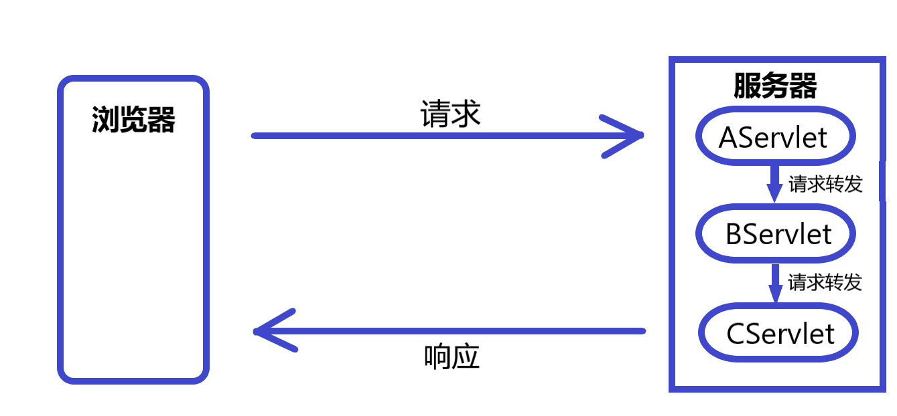


## 关于范围对象的选择

ServletContext 应用范围极大，可以跨用户传递数据，整个webapp只有一个ServletContext对象

ServletRequest请求范围小，只能在同一个请求中传递数据【跨Servlet传递数据，需要使用请求转发技术】

优先选择使用ServletRequest传递数据

## 总结

请求转发可以跨Servlet（跨请求）传递数据，一次请求对应的Servlet中的request对象的数据，可以传递给请求转发的另一个Servlet的request对象

请求转发，是一次请求，浏览器向服务器只请求了一次


# 程序乱码解决方案(webapp14)

## 乱码经常出现在什么位置

- 数据保存过程中的乱码
- 数据展示过程中的乱码
- 数据传递过程中的乱码

## 数据保存过程中的乱码

- 数据保存到数据库表中的时候，数据出现乱码
- 导致数据保存过程中的乱码包括以下两种情况：
  - 前一种情况：在保存之前，数据本身就是乱码，保存到数据库表中的时候一定是乱码
  - 第二种情况：保存之前，数据不是乱码，但是由于数据库本身数据库不支持简体中文，保存之后出现乱码

## 数据展示过程中的乱码

- 最终显示到网页上的数据出现中文乱码

- 怎么解决？

  - 经过执行Java程序之后，Java程序负责向浏览器响应的时候，中文乱码

    Java程序中设置响应的内容类型，以及对应的字符字符集

    ````java
    response.setContentType("text/html;charset=UTF-8");
    ````

  - 没有经过Java程序，直接访问的是静态页面

    文件编码时字符集，与浏览器解析时使用的字符集要一致，例如文件编码时使用的字符集是UTF-8，那么可以在网页文件中使用`<meta charset="UTF-8">`标签来指定网页编码时使用的字符集

## 数据传递过程中的乱码

- 将数据从浏览器发送给服务器的时候，服务器接收到的数据时乱码


### GET

#### 浏览器对数据进行编码发送到服务器

1. GET请求的数据在请求体，所以会对部分URL进行编码

2. 如何编码

   将表单中的数据（键值对）经过URLencode编码后追加到url中

   （URLencode编码过程使用的字符集由浏览器决定）

3. 编码流程图

   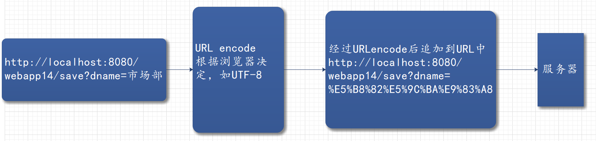

#### 服务器接收到数据进行解码

1. 如何解码

   以Tomcat7.0为例，Tomcat会使用默认的ISO-8859-1进行解码，此时字符集可能与浏览器端编码的字符集不同而出现乱码

2. 解码流程图

   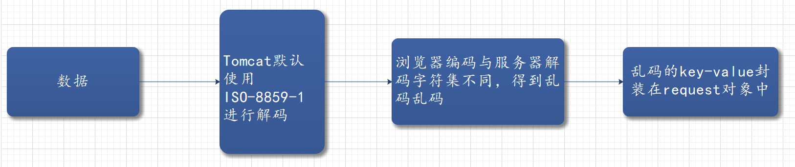

### POST

#### 浏览器对数据进行编码发送到服务器

1. POST请求方式数据在请求体中

2. 如何编码

   将表单中的数据（键值对）经过URLencode编码后放到请求体中

   （URLencode编码过程使用的字符集默认由网页标签属性设置决定）

3. 编码流程图

   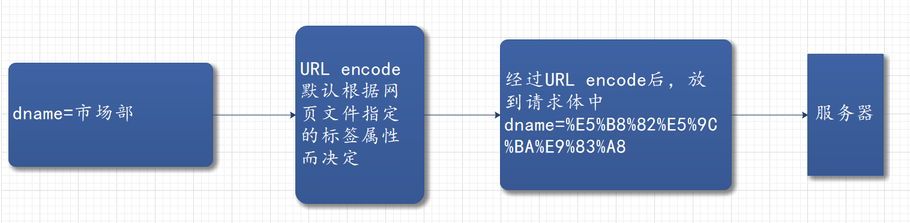

#### 服务器接收到数据进行解码

1. 如何解码

   以Tomcat7.0为例，Tomcat会使用默认的ISO-8859-1进行解码，此时字符集可能与浏览器端编码的字符集不同而出现乱码（可通过Java程序进行字符集的设置）

2. 解码流程图

   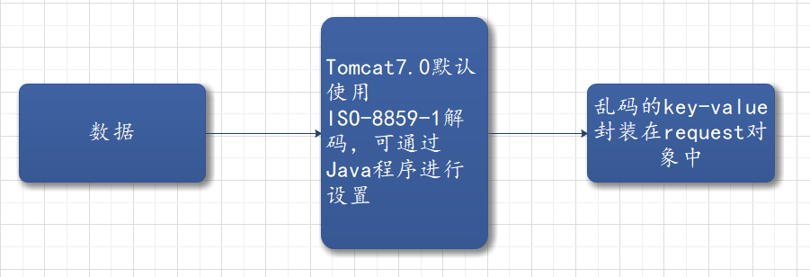


### 解决方法

适用于POST和GET

````java
//获取乱码字符
String value = request.getParameter("name");
//将乱码字符通过错误的ISO-8859-1编码方式重新还原回去
byte[] bytes = dname.getBytes("ISO-8859-1");
//再通过正确的编码方式进行解码
value = new String(bytes, "UTF-8");
````


仅支持POST请求

```java
//设置字符编码方式
request.setCharacterEncoding("UTF-8");
//获取正确的字符
String value = request.getParameter("name");
```


仅支持GET

修改Tomcat默认的编码字符集

```
修改CATALINA_HOME/conf/server.xml文件，
加上URLEncoding="UTF-8"属性，设置请求行上的编码方式，解决GET请求乱码

<Connector port="8080" 
	protocol="HTTP/1.1"
	connectionTimeout="20000"
	redirectPort="8443" 
	URLEncoding="UTF-8"/>
```


### URLencode

是将字符通过某种字符集进行编码后，再使用百分号编码

如字符通过UTF-8字符集进行编码后得到的二进制文件，然后将二进制转化为16进制，在每一个字符前面加上%作为分隔

```
		  UTF-8							   百分号编码
"销售部"  ------> E9 94 80 E5 94 AE E9 83 A8 ------> %E9%94%80%E5%94%AE%E9%83%A8
```


# Servlet线程安全问题(webapp15)

> Servlet是单实例多线程环境下运行的，Servlet对象只有一个，被多个线程共享；new出来的对象在堆空间，所有线程共享一个堆；


## 什么时候程序存在线程安全问题

- 多线程并发
- 有共享数据
- 共享数据有修改

## JVM中哪些数据存在线程安全问题

- 局部变量内存空间不共享，一个线程一个栈，局部变量在栈中存储，局部变量不会存在线程安全问题
- 所有线程共享一个堆
  - 堆内存中new出来的对象在堆内存中存储，对象内部有“实例变量”，所以“实例变量”的内存多线程共享的；实例变量多线程访问，并涉及到修改操作时就会发生线程安全问题
- 所有线程共享一个方法区
  - 方法区中有静态变量，静态变量的内存也是共享的，若涉及到修改操作，静态变量也存在线程安全问题

## 数据库线程安全问题

线程安全问题不止体现在JVM中，还有可能发生在数据库中，例如：多个线程共享一张表，并且同时去修改一些记录，那么这些记录就存在线程安全问题；

怎么解决数据库中的线程安全问题？（至少两种方式）

- 第一种方案：在Java程序中使用`synchronized`关键字，线程排队，自然不会在数据库中并发
- 第二种方案：行级锁（悲观锁）
- 第三种方案：事务隔离级别，例如：串行化
- 第四种方案：乐观锁

## 怎么解决线程安全问题

1. 不使用实例变量（类变量、属性），尽量使用局部变量
2. 若必须使用实例变量，可以考虑将该对象变量多利对象，一个线程一个Java对象，实例变量的内存也不会共享
3. 若必须使用单利，那就只能使用`synchronized`线程同步机制，线程一旦排队执行，则吞吐量降低，降低用户体验

6. Servlet怎么解决线程安全问题
   1. 不使用实例变量，尽量使用局部变量
   2. Servlet是单例的，所以剩下的方式只能考虑使用`synchronized`，线程同步机制


## 案例

注册页面，前端填入用户名后，后台Servlet获取用户名，并打印刚刚填写的用户名，

1. 当获取的用户名赋值给全局变量（实例变量）username时，会存在线程安全问题
2. synchronized线程同步机制，将修改操作虽然解决了线程安全问题，但是降低了用户体验，线程线程需要排队进入synchronized代码块
3. 使用局部变量，局部变量存储在栈中，一个线程一个栈，解决了线程安全问题

````java
public class Register extends HttpServlet {

    //全局变量
    private String username;

    @Override
    protected void doPost(HttpServletRequest request, HttpServletResponse response) 
        throws IOException {

        response.setContentType("text/html;charset=UTF-8");
        PrintWriter writer = response.getWriter();

        /**
         * 1. 使用实例变量，存在线程安全问题
         */
        // username = request.getParameter("username");
        // writer.print(username);

        /**
         * 2. 使用synchronized，虽然解决了线程安全问题，
         * 但是降低了用户体验，线程需呀排队进入synchronized代码块
         */
        // synchronized (this) {
        //     username = request.getParameter("username");
        //     writer.print(username);
        // }

        /**
         * 3. 使用局部变量（推荐）
         */
        String username = request.getParameter("username");
        writer.print(username);
    }
}
````


# 转发与重定向

## 跳转的方式

- 转发 forward
- 重定向 redirect

## 转发和重定向代码怎么完成

- 转发

  ```java
  //请求转发到/b对应的Servlet
  request.getRequestDispatcher("/b").forward(request,response);
  ```

  

- 重定向

  ```java
  response.sendRedirect(request.getContextPath() + "/b");
  ```

## 转发和重定向的区别？

- 相同点：都可以完成资源的跳转
- 不同点：
  - 转发是request对象触发的，服务器内部进行转发
  - 重定向是response对象触发的，要将重定向的路径相应给浏览器
  - 转发是一次请求，浏览器地址栏上地址不变
  - 重定向是两次请求，浏览器地址栏上的地址发生变化
  - 重定向路径需要加项目名（webapp跟路径web目录）
  - 转发是在本项目内部完成资源的跳转
  - 重定向可以完成跨app跳转，例如可以跳转到`https://www.baidu.com`

## 跳转的下一个资源可以是什么？

跳转的下一个资源可以是web服务器中任何一种资源：Servlet、HTML、JSP ......


## 什么时候采用转发，什么时候采用重定向？

大部分情况下都使用重定向

- 若想完成跨app跳转，必须采用重定向
- 若在上一个资源中向request范围中存储了数据，希望在下一个资源中从request范围中取出，必须使用转发
- 重定向可以解决浏览器的刷新问题


## 重定向原理是什么？

```java
response.sendRedirect("/jd/login");
```

程序执行到以上代码，将请求路径`/jd/login`反馈给浏览器，

浏览器又向web服务器发送了一次全新的请求：/jd/login

浏览器地址栏上最终显示的地址是：/jd/login


# 重定向解决页面刷新问题

重定向可以解决页面的刷新问题


案例：页面进行表单提交，后台连接数据库后插入提交的数据，然后跳转到插入成功页面；跳转的方式有两种

- 转发
- 重定向

```java
public class Save extends HttpServlet {
    @Override
    protected void doPost(HttpServletRequest request, HttpServletResponse response) 
        throws ServletException, IOException {

        //解决中文乱码
        request.setCharacterEncoding("UTF-8");

        //获取表单数据
        String usercode = request.getParameter("usercode");
        String username = request.getParameter("username");

        Connection conn = null;
        PreparedStatement ps = null;
        int row = 0;

        try {
            Class.forName("com.mysql.jdbc.Driver");
            conn = DriverManager.getConnection("jdbc:mysql://localhost:3306/javaee", "root", "admin");
            conn.setAutoCommit(false);
            ps = conn.prepareStatement("insert into t_user(usercode,username) value(?,?)");
            ps.setString(1,usercode);
            ps.setString(2,username);
            row = ps.executeUpdate();
            conn.commit();
        } catch (ClassNotFoundException e) {
            e.printStackTrace();
        } catch (SQLException throwables) {
            //如果发生异常，如果conn!=null，回滚数据
            if(conn != null) {
                try {
                    conn.rollback();
                } catch (SQLException e) {
                    e.printStackTrace();
                }
            }
            throwables.printStackTrace();
        } finally {
            //省略关闭
        }

        if(row ==1) {
            //执行成功，跳转到成功页面

            //1. 转发
            //浏览器只进行一次请求，如果此时浏览器进行刷新，浏览器刷新的是最后一次请求，即提交表单的请求，
            //此时多次刷新浏览器，那么就会请求多次，就会执行多次Servlet，
            //就会多次连接数据库插入数据，导致数据重复插入
            //request.getRequestDispatcher("/success.html").forward(request,response);

            //2. 重定向
            //服务器返回重定向的地址（success.html），浏览器就会请求新的地址，
            //一共有两次请求：提交表单的请求和重定向的请求
            //此时如果浏览器多次刷新，那么请求的也是重定向的success.html静态页面，
            //不会因为刷新而导致多次提交表单
            response.sendRedirect(request.getContextPath() + "/success.html");
        }
    }
}
```


浏览器刷新，刷新的是浏览器的最后一次请求

使用转发：

浏览器提交表单后，后台进行转发到access.html成功页面，浏览器只进行了一次请求，如果此时浏览器进行刷新，那么就会刷新最后一次提交表单的请求，会导致因为多次刷新而提交多次表单，导致后台执行多次Servlet，导致数据库插入多条重复记录

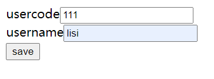

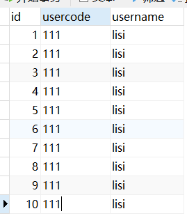

使用重定向：

浏览器提交表单后，后台通过重定向，将重定向的地址（/webapp17/access.html）发送给浏览器，浏览器会请求重定向的地址；这个过程中一共有两次请求：提交表单的请求、重定向的新的地址的请求；此时浏览器进行刷新，刷新的是最后一次重定向地址的请求，请求的资源是access.html，多次刷新就会多次请求access.html，并不会导致多次提交表单！

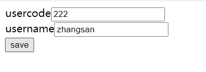

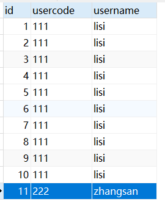


# Cookie(webapp19)

## Cookie是什么？

- Cookie可以保存会话状态，但是这个会话状态是保留在客户端上的
- 只要Cookie清除，或者Cookie失效，这个会话状态就没有了
- Cookie是保存在浏览器客户端上的
- Cookie可以保存在浏览器的缓存中，浏览器关闭Cookie消失
- Cookie可以用保存在客户端硬盘文件中，浏览器关闭Cookie还在，除非Cookie消失

## 创建Cookie

> 服务器创建Cookie并发送给浏览器

```java
//创建cookie
Cookie cookie = new Cookie(String name, String value);
//设置Cookie有效期
cookie.setMaxAge(60*60*60);
//设置Cookie绑定的路径
cookie.setPath("/webapp19/user");
//将cookie发送给浏览器
response.addCookie(cookie);
```

## Cookie绑定路径

### Cookie未绑定路径时默认绑定的路径

在默认情况下，未设置Cookie绑定路径的Cookie，会绑定当前访问路径的上一层路径，如：

访问`/webapp/test/a`路径时，服务器发送的Cookie（此Cookie未人为设置绑定路径），那么此Cookie默认绑定的路径未`/webapp/test`，所以访问/webapp/test、/webapp/test/a/c/d都会将此Cookie发送给服务器


### Cookie绑定路径

`cookie.setPath();`来设置此Cookie绑定的访问路径

当设置此Cookie绑定的路径时，浏览器只有访问此路径，以及此路径下的其他资源时，浏览器才会将此Cookie发送到服务器

如下：那么此Cookie只有浏览器访问/webapp19/user路径，以及/webapp/user/a/d等等其他此路径下的其他资源时，浏览器才会将此Cookie发送到服务器

```java
cookie.setPath("/webapp19/user");
```

### 总结

- 只有访问Cookie绑定的路径以及此路径下的其他资源时，浏览器才会将Cookie发送给服务器

- 不设置绑定路径时，默认绑定的是访问路径的上一级路径，如

  访问路径为`/webapp/user/b`，那么默认绑定的是`/webapp/user`路径

- （设置Cookie绑定的路径时，绑定的路径就是设置的路径）


## Cookie有效时长

`cookie.setMaxAge(int expiry)`

参数是一个整数

- 值为正数，以秒为单位指定Cookie的最长期限，Cookie存储在硬盘文件当中；
- 值为负数，则此Cookie在关闭此窗口页面后即失效；
- 如果为零，则删除此Cookie；

例如：以下设置Cookie有效期为24小时

````java
cookie.setMaxAge(60*60*24);
````


# url-pattern的编写方式和路径总结

## 路径的编写方式

- 超链接

  ```html
  <a href="/项目名/资源路径"</a>
  ```

- form表单

  ```html
  <form action="/项目名/资源路径"</form>
  ```

- 重定向

  ```java
  response.sendRedirect("/项目名/资源路径");
  ```

- 转发 

  ```java
  request.getRequestDispatcher("/资源路径").forward(request,response);
  ```

- 欢迎页面 

  ```xml
  <welcome-file-list>
      <welcome-file>index.html</welcome-file>
      <welcome-file>WelcomeServlet</welcome-file>
  </welcome-file-list>
  ```

- Servlet 路径

  ```xml
  <servlet>
      <servlet-name>hello</servlet-name>
      <servlet-class>cn.qkmango.HelloServlet</servlet-class>
  </servlet>
  <servlet-mapping>
      <servlet-name>hello</servlet-name>
      <url-pattern>/资源路径</url-pattern>
  </servlet-mapping>
  ```

- Cookie 设置path

  ```java
  cookie.setPath("/项目名/资源路径");
  ```

- ServletContext

  ```java
  this.getServletConfig();
  ServletConfig config = super.getServletConfig();
  ServletContext context = config.getServletContext();
  
  context.getRealPath("/WEB-INF/classes/db.properties");
  context.getRealPath("/资源路径");
  ```

  


## url-pattern的编写方式

- 一个Servlet可以编写多个url-pattern

- 精确匹配

  ```xml
  <url-pattern>/system/hello</url-pattern>
  <url-pattern>/user</url-pattern>
  ```

- 扩展匹配

  ```xml
  <url-pattern>/user/*</url-pattern>
  ```

- 后缀匹配

  ```xml
  <url-pattern>*.action</url-pattern>
  <url-pattern>*.do</url-pattern>
  ```

- 全部匹配

  ```xml
  <url-pattern>/*</url-pattern>
  ```

  


# HttpSession(webapp23)

> javax.servlet.http.HttpSession

## Session概述

1. Cookie可以将会话状态保存在客户端，而HttpSession可以将会话状态保存在服务器端
2. HttpSession对象是一个会话级别的对象，一次会话对应一个HttpSession对象
3. 在会话进程中，web服务器一直为当前这个用户维护着一个会话对象HttpSession
5. 在web容器中，维护了大量的HttpSession对象，换句话说，在web容器中应该有一个“Session”列表

思考：为什么当前会话中的每一次请求都可以获取到属于自己的Session会话对象？


## 获取Session对象

```java
HttpSession session = request.getSession();
```

注意：`request.getSession(boolean)`需要一个boolean类型的参数

- 当参数为true时，`getSession(true)`：session存在则返回；如果session不存在，则创建一个新的session对象并返回（无参数默认为true）
- 当参数为false时，`getSession(false)`：session存在则返回；如果session不存在，则不会创建session对象，返回null


## Session实现原理

1. 浏览器发送请求，服务器对应的Servlet**首次调用**`request.getSession(true);`方法时获取Session对象
   1. 服务器会创建一个Session对象，同时创建一个对应的Cookie对象，并且Cookie对象的name是JSESSIONID，Cookie的value是32位长度的字符串
   2. 服务器将Cookie的value和HttpSession对象绑定到session列表中(Map集合)
   3. 服务器将Cookie发送到客户端浏览器，浏览器将Cookie保存到缓存中

2. 浏览器再次发送请求，会自动提交Cookie
   1. 当服务器Servlet**再次调用**`request.getSession();`方法时获取Session对象

   2. 服务器接收到Cookie，验证Cookie的name为JSESSIONID，然后获取Cookie的value

   3. 通过Cookie的value去session列表(Map集合)中检索对应的HttpSession对象


## Session对象生命周期

1. web系统中引入了session超时的概念
2. 当很长一段时间（这个时间可以配置）没有用户再访问session对象，此时session对象超时，web服务器自动回收session对象

3. 设置Session对象失效时间（两次请求之间的最大时间间隔），优先级 1 > 2 > 3

   1. 通过Java代码实现，单位秒

      ```java
      HttpSession session = request.getSession();
      session.setMaxInactiveInterval(60*60);
      ```

   2. 修改项目的web.xml文件，单位分钟

      ```xml
      <session-config>
          <session-timeout>60</session-timeout>
      </session-config>
      ```

   3. 修改Tomcat默认配置，单位分钟，默认30分钟

      ```xml
      <!-- Tomcat7/conf/web.xml -->
      <session-config>
          <session-timeout>30</session-timeout>
      </session-config>
      ```


## HttpSession中常用方法

```java
void setAttribute(String name, Object value) 向会话范围中存储数据

Object getAttribute(String name) 从会话范围中获取数据

void removeAttribute(String name) 从会话范围中移除某个数据

void invalidate() 销毁session对象

void setMaxInactiveInterval(int interval) 设置session对象失效时间（浏览器向服务器两次请求之间最大时间间隔，超过最大设置时间间隔则销毁此session）
```


## ServletContext、HttpSession、HttpServletRequest对比

1. 以上都是范围对象

2. `ServletContext application` 是应用范围

3. `HttpSession session` 是会话范围

4. `HttpServletRequest request` 是请求范围

5. 三个范围的大小 application > session > request 

6. application完成跨用户共享数据；

   session完成跨请求共享数据，但是这些请求必须在同一个会话当中；

   request完成跨Servlet共享数据，但是这些servlet必须在同一个请求当中（请求转发）

7. 使用原则：由小到大尝试，优先使用小范围

   例如：登陆成功之后，已经登陆的状态需要保存起来，可以将这个状态保存到session对象中；

   登陆成功状态不能保存在request范围中，因为一次请求对应一个request对象；

   登陆成功的状态也不能保存在application范围中，因为登陆成功的状态属于会话级别，不能所有用户共享。


## 什么是一次会话？

- 一般可以这样理解：用户打开浏览器，在浏览器上发送多次请求，直到最终浏览器关闭，表示一次完整的回话。

- 本质上理解：Session对象创建到最终超时销毁，才是真正意义的一次会话；因为即使浏览器关闭，可以通过重写URL的方式从其他电脑其他浏览器同样使用这个Session对象。


## 其他的一些问题

1. HttpSession对象关联的这个Cookie的name是比较特殊的，在Java中就叫做：JSESSIONID

2. 浏览器禁用Cookie会出现什么问题？

   - 浏览器禁用Cookie，则浏览器缓存中不再保存Cookie
   - 导致在同一个会话中，无法获取到对应的会话对象
   - 禁用Cookie之后，每一次获取的会话对象都是新的

3. 浏览器禁用Cookie后怎么解决？

   - 浏览器禁用Cookie之后，若还想拿到对应的Session对象，必须使用URL重写机制，怎么重写URL：

     ```
     http://localhost:8080/webapp23/testSession;jsessionid=384A8D1CE7821C76EDC445F7D029C46A
     ```
     
     重写URL会给编程带来难度/复杂度，所以web站点是不建议禁用Cookie
     
     使用重写URL，即使换浏览器换电脑，只要访问的是同一个jsessionid，就可以得到同一个Session对象

4. 浏览器关闭后，服务器端对应的session对象会被销毁吗？

   - 浏览器关闭后，服务器不会销毁session对象；因为B/S架构的系统基于HTTP协议，而HTTP协议是一种无连接/无状态的协议

   - 什么是无连接/无状态？

     请求的瞬间浏览器和服务器之间的通道是打开的，请求响应结束后，通道关闭；这样做的目的是降低服务器的压力

     


