什么是 Maven？
---------------------------------------------------------------------------

如今我们构建一个项目需要用到很多第三方的类库，如写一个使用 Spring 的 Web 项目就需要引入大量的 jar 包。一个项目 Jar 包的数量之多往往让我们瞠目结舌，并且 Jar 包之间的关系错综复杂，一个 Jar 包往往又会引用其他 Jar 包，缺少任何一个 Jar 包都会导致项目编译失败。

以往开发项目时，程序员往往需要花较多的精力在引用 Jar 包搭建项目环境上，而这一项工作尤为艰难，少一个 Jar 包、多一个 Jar 包往往会报一些让人摸不着头脑的异常。

而 Maven 就是一款帮助程序员构建项目的工具，我们只需要告诉 Maven 需要哪些 Jar 包，它会帮助我们下载所有的 Jar，极大提升开发效率。

安装 Maven
-----------------------------

 [安装 Maven](https://maven.apache.org/install.html)


## Maven 软件结构

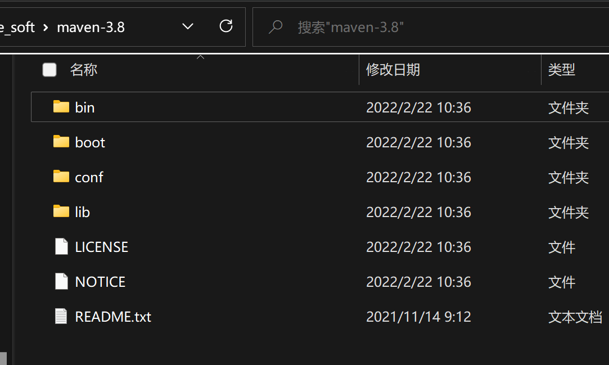


- bin中的mvn和mvn.cmd文件
  用shell和window-api写的读取本机java相关环境变量的脚本

- boot中的jar包是maven程序的类加载器,是启动程序,maven是拿java开发的程序

- conf文件,maven配置文件

  logging:日志配置文件

  setting.xml:核心配置,这个配置文件是拿xml语言编写的

- lib文件

  maven运行所需要的其他jar包(java代码)
  这些jar包直接解压不出来,需要发编译才能看源码

## Maven 配置

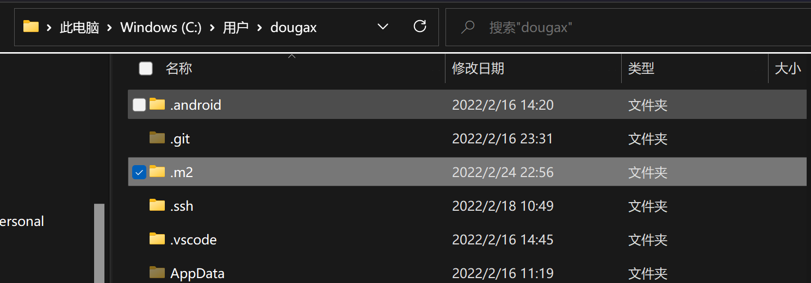

你在cmd控制台输出mvn命令会在你用户文件夹下创建.m2文件
文件内部有一个空的repository文件夹,这就是我们的本地仓库

#### 更改仓库位置

```xml
<!-- localRepository
   | The path to the local repository maven will use to store artifacts.
   |
   | Default: ${user.home}/.m2/repository
<localRepository>/path/to/local/repo</localRepository>
 -->
```

打开setting.xml文件上面指出本地仓库的默认位置就是用户文件夹下
现在我们改成自己想要的位置

```xml
<localRepository>D:\middle_soft\maven-3.8\repository</localRepository>
<!--注意,写这个地址时用\ 而不是/-->
```


Maven 规定的目录结构
-------------

若要使用 Maven，那么项目的目录结构必须符合 Maven 的规范，其目录结构如下：

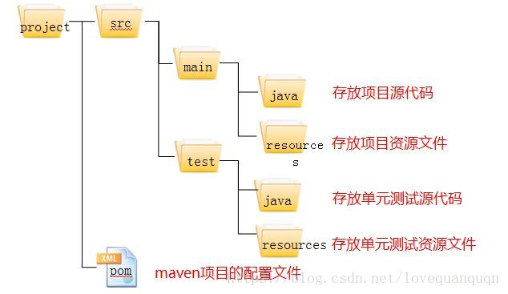


Maven 基本命令
----------

1.  **-v:** 查询 Maven 版本
    
    本命令用于检查 maven 是否安装成功。
    
    Maven 安装完成之后，在命令行输入 **mvn -v**，若出现 maven 信息，则说明安装成功。
    
2.  **compile**：编译
    
    将 java 源文件编译成 class 文件
    
3.  **test**: 测试项目
    
    执行 test 目录下的测试用例
    
4.  **package**: 打包
    
    将项目打成 jar 包
    
5.  **clean**: 删除 target 文件夹
    
6.  **install**: 安装
    
    将当前项目放到 Maven 的本地仓库中。供其他项目使用


#### mvn compile 

<font color=#FFCCCC style=" font-weight:bold;">compile后</font>
在项目目录中会<font color=#FF6666* style=" font-weight:bold;">生成一个target目录</font>(先在cmdz中 cd/d d:\\project进入到项目文件夹下)


同时,可以观察到仓库中增加了许多jar包
这些jar包是maven构建项目时的插件(java编写)

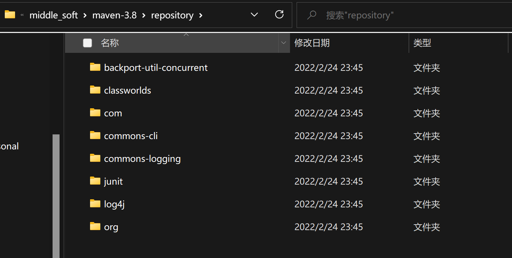

将 java 源文件编译成 class 文件放入到classes文件夹下


#### mvn clean

clear可以删除当前项目文件夹下compile的target文件


#### mvn test

测试项目
执行 test 目录下的测试用例


```java
package com.oddeye;
import org.junit.Test;
import org.junit.Assert;
public class DemoTest {
    @Test
    public void testjj(){
        Demo demo = new Demo();
        String ret = demo.print("JJ");
        Assert.assertEquals("JJ", ret);
    }
}
```

写在test.java.com.oddeye的DemoTest测试main.java.com.oddeye的Demo返回结果是否符合预期

同时在target下生成测试日志


#### mvn install

将你这个项目打成jar包放入本地仓库

#### mvn package

将项目打成 jar 包,target下生成
注意这个包只包含源程序Demo.class不包含test里的文件

什么是 Maven 仓库？
-------------

Maven 仓库用来存放 Maven 管理的所有 Jar 包。分为：本地仓库 和 中央仓库。

*   **本地仓库**：Maven 本地的 Jar 包仓库。
*   **中央仓库**： Maven 官方提供的远程仓库。

当项目编译时，Maven 首先从本地仓库中寻找项目所需的 Jar 包，若本地仓库没有，再到 Maven 的中央仓库下载所需 Jar 包。


#### 远程仓库配置

阿里云镜像

```xml
<mirror>  
      <id>alimaven</id>  
      <name>aliyun maven</name>  
      <url>http://maven.aliyun.com/nexus/content/groups/public/</url> 
	  <!--mirrorof表示用这个镜像代替哪个仓库--> 
      <mirrorOf>central</mirrorOf>    
	  <!--central表示代替中央仓库-->       
</mirror>  
```

到<font color=#666699 style=" font-weight:bold;">setting.xml</font>文件中配置


什么是 “坐标”？
---------

在 Maven 中，坐标是 Jar 包的唯一标识，Maven 通过坐标在仓库中找到项目所需的 Jar 包。

如下代码中，groupId 和 artifactId 构成了一个 Jar 包的坐标。

```xml
<dependency>
   <groupId>cn.missbe.web.search</groupId>
   <artifactId>resource-search</artifactId>
   <packaging>jar</packaging>
   <version>1.0-SNAPSHOT</version>
</dependency>
```

*   **groupId**: 所需 Jar 包的项目名
*   **artifactId**: 所需 Jar 包的模块名
*   **version**: 所需 Jar 包的版本号

## 项目创建

#### 创建一个有坐标的项目

创建一个坐标为:com.oddeye.dougax的项目,其要导入junit的包
它本身被打包后也是一个可以用坐标导入的包

```xml
<?xml version="1.0" encoding="UTF-8"?>
<project xmlns="http://maven.apache.org/POM/4.0.0"  
  xmlns:xsi="http://www.w3.org/2001/XMLSchema-instance"  
  xsi:schemaLocation="http://maven.apache.org/POM/4.0.0  
                      http://maven.apache.org/maven-v4_0_0.xsd">
    <modelVersion>4.0.0</modelVersion>
    <!-- 
        含义：组织标识，定义了项目属于哪个组，风向标，坐标，或者说若把本项目打包
        用途：此名称则是本地仓库中的路径，列如：otowa.user.dao，在M2_REPO目录下，将是: otowa/user/dao目录
        命名规范:项目名称，模块，子模块
    -->
    <groupId>com.oddeye</groupId>
    <!-- 
        含义：项目名称也可以说你所模块名称，定义当面Maven项目在组中唯一的ID
        用途：例如：user-dao，在M2_REPO目录下，将是：otowa/user/dao/user-dao目录
        命名规范:唯一就好
    -->
    <artifactId>dougax</artifactId>
    <!-- 
        含义：项目当前的版本号
        用途：例如：0.0.1-SNAPSHOT，在M2_REPO目录下，将是：otowa/user/dao/user-dao/0.0.1-SNAPSHOT目录
    -->
    <version>1.0</version>
    <!-- 打包的格式，可以为：pom , jar , maven-plugin , ejb , war , ear , rar , par -->
    <packaging>jar</packaging>
    
    <dependencies>
        <dependency>
            <groupId>junit</groupId>
            <artifactId>junit</artifactId>
            <version>4.12</version>
        </dependency>
    </dependencies>
</project>

```

#### idea中快速创建项目

自动生成maven项目架构

> org.apache.maven.archetypes:maven-archetype-quickstart

配置maven设置

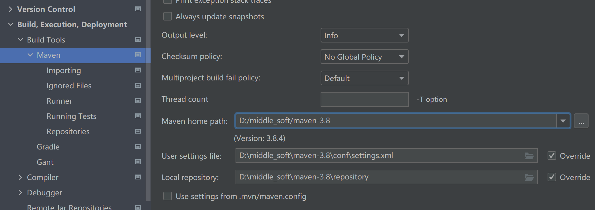

#### 创建maven模块

如果想在当前项目中创建一个带pom.xml的maven模块
可以setting=>structure=>new module


#### maven快速调试


#### tomcat插件下载

加完build标签后刷新maven,可以看到plugin中有tomcat,点击tomcat中的run
启动服务器
作用:<font color=#FF6666* style=" font-weight:bold;">不用自己下一个tomcat了</font>,直接通过xml定义的标签配置maven下载下来的tomcat

```xml
<build>
        <plugins>
            <plugin>
                <groupId>org.apache.tomcat.maven</groupId>
                <artifactId>tomcat7-maven-plugin</artifactId>
                <version>2.1</version>
                <configuration>
                    <port>8080</port>
                    <path>/</path>
                </configuration>
            </plugin>
        </plugins>
</build>
```


异常信息

> Error configuring application listener of class org.springframework.web.context.ContextLoaderListener java.lang.ClassNotFoundException: org.springframework.web.context.ContextLoaderListener 	at org.apache.catalina.loader.WebappClassLoader.loadClass(WebappClassLoader.java:1713) 	at org.apache.catalina.loader.WebappClassLoader.loadClass(WebappClassLoader.java:1558) 	at org.apache.catalina.core.DefaultInstanceManager.loadClass(DefaultInstanceManager.java:527) 	at org.apache.catalina.core.DefaultInstanceManager.loadClassMaybePrivileged(DefaultInstanceManager.java:509) 	at org.apache.catalina.core.DefaultInstanceManager.newInstance(DefaultInstanceManager.java:137) 	at org.apache.catalina.core.StandardContext.listenerStart(StandardContext.java:4733) 	at org.apache.catalina.core.StandardContext.startInternal(StandardContext.java:5291) 	at org.apache.catalina.util.LifecycleBase.start(LifecycleBase.java:150) 	at org.apache.catalina.core.ContainerBase$StartChild.call(ContainerBase.java:1559) 	at org.apache.catalina.core.ContainerBase$StartChild.call(ContainerBase.java:1549) 	at java.util.concurrent.FutureTask.run(FutureTask.java:266) 	at java.util.concurrent.ThreadPoolExecutor.runWorker(ThreadPoolExecutor.java:1149) 	at java.util.concurrent.ThreadPoolExecutor$Worker.run(ThreadPoolExecutor.java:624) 	at java.lang.Thread.run(Thread.java:750)

web.xml配置全部删去,否则报错

```xml
<web-app version="2.4"
         xmlns="http://java.sun.com/xml/ns/j2ee"
         xmlns:xsi="http://www.w3.org/2001/XMLSchema-instance"
         xsi:schemaLocation="http://java.sun.com/xml/ns/j2ee http://java.sun.com/xml/ns/j2ee/web-app_2_4.xsd">

</web-app>
```


传递依赖 与 排除依赖
-----------

*   传递依赖：如果我们的项目引用了一个 Jar 包，而该 Jar 包又引用了其他 Jar 包，那么在默认情况下项目编译时，Maven 会把直接引用和简洁引用的 Jar 包都下载到本地。
*   排除依赖：如果我们只想下载直接引用的 Jar 包，那么需要在 pom.xml 中做如下配置：(将需要排除的 Jar 包的坐标写在中)

```xml
<exclusions>
   <exclusion>
      <groupId>cn.missbe.web.search</groupId>
      <artifactId>resource-search</artifactId>
      <packaging>pom</packaging>
      <version>1.0-SNAPSHOT</version>
   </exclusion>
</exclusions>
```

**依赖范围 scope**
--------------

在项目发布过程中，帮助决定哪些构件被包括进来。欲知详情请参考依赖机制。      
- **compile** ：默认范围，用于编译        
- **provided**：类似于编译，但支持你期待 jdk 或者容器提供，类似于 classpath        
- **runtime**: 在执行时需要使用        
- **test**:    用于 test 任务时使用        
- **system**: 需要外在提供相应的元素。通过 systemPath 来取得        
- **systemPath**: 仅用于范围为 system。提供相应的路径        
- **optional**:   当项目自身被依赖时，标注依赖是否传递。用于连续依赖时使用

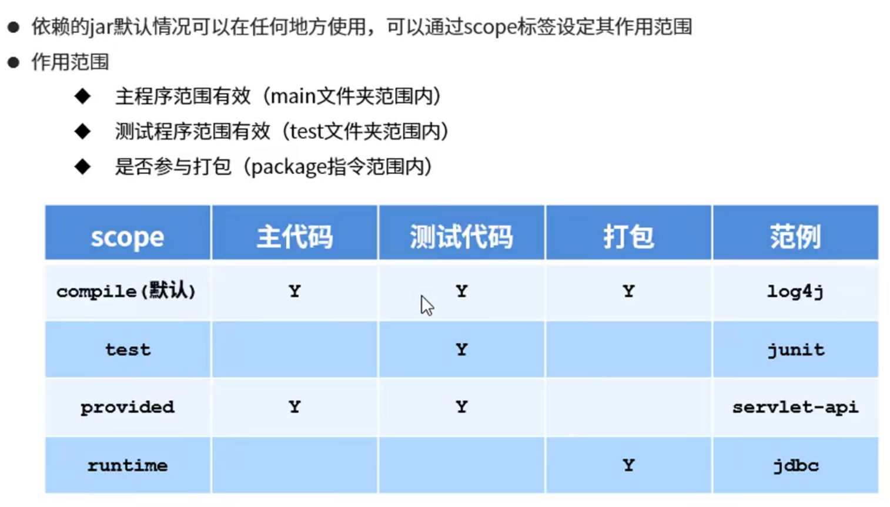

对于servlet-api来说,你是不能将其打包到服务器上的,服务器上的Tomcat上已经有servlet的包了,你本地导入的包只是开发测试时跑跑本地tomcat用的,你要是打包了,就容易<font color=#FF6666* style=" font-weight:bold;">版本冲突</font>(两个同名jar包,版本不一样,用谁的?不报错?)

像junit这种测试代码的包就测试部分代码用,不用打包

log4j这种日志类jar包,在服务器上运行时也是要<font color=#FFCCCC style=" font-weight:bold;">实时观测排查</font>的,所以要打包

依赖冲突
----

#### 依赖具有传递性

- 直接依赖:在当前项目中通过依赖配置建立的依赖关系
- 间接依赖:被资源的资源如果依赖其他资源，当前项目间接依赖其他资源

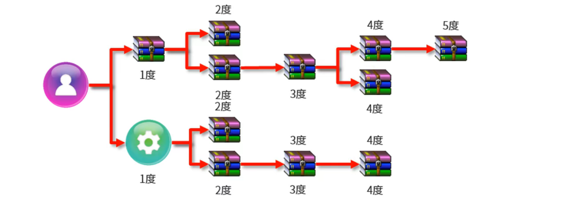

#### 依赖传递冲突问题

- 路径优先:当依赖中出现相同的资源时，<font color=#66CC99 style=" font-weight:bold;">层级越深，优先级越低</font>，层级越浅，优先级越高
- 声明优先:当资源在相同层级被依赖，<font color=#66CC99 style=" font-weight:bold;">引用路径长度相同时，在 pom.xml 中谁先被声明，就使用谁。</font>
- 特殊优先:当同级配置了<font color=#FF6666* style=" font-weight:bold;">相同资源的不同版本</font><font color=#66CC99 style=" font-weight:bold;">**配置顺序靠前的优先**</font>,后配置的覆盖先配置的

若项目中多个 Jar 同时引用了相同的 Jar 时，会产生依赖冲突，但 Maven 采用了避免冲突的策略，因此在 Maven 中是不存在依赖冲突的。

#### 模块添加

protectStruct=>+=>import module=>


也可以
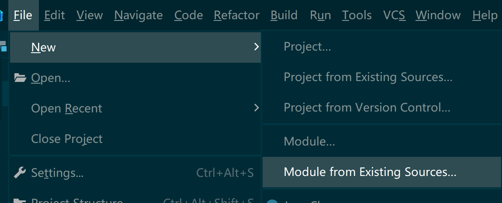


#### 依赖排除

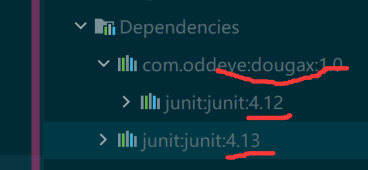

```xml
<dependencies>
    <dependency>
<!--      导入的b模块-->
      <groupId>com.oddeye</groupId>
      <artifactId>dougax</artifactId>
      <version>1.0</version>
        
<!--      b模块里也有junit且版本冲突-->
      <exclusions>
<!--        排除这个依赖模块-->
        <exclusion>
          <groupId>junit</groupId>
          <artifactId>junit</artifactId>
<!--          不需要填写版本号-->
        </exclusion>
      </exclusions>
    </dependency>
    
    <dependency>
      <groupId>junit</groupId>
      <artifactId>junit</artifactId>
      <version>4.13</version>
    </dependency>

</dependencies>
```


## 生命周期

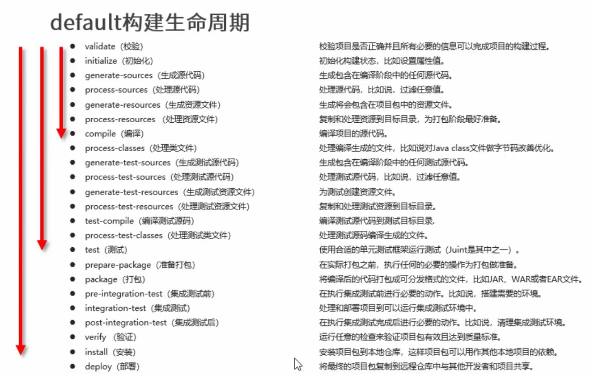

每一步操作并不是独立的,而是建立在之前操作流之上,所以一些操作需要遵循生命周期

[关于maven生命周期的插件](https://maven.apache.org/plugins/index.html)https://maven.apache.org/plugins/index.html
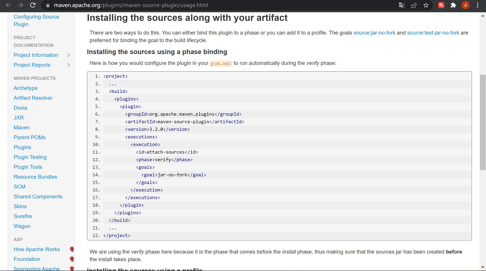

官网上教你怎么用这些插件,比如source插件,你绑定要产生源码时的生命周期阶段:verify阶段

插件与生命周期理解:
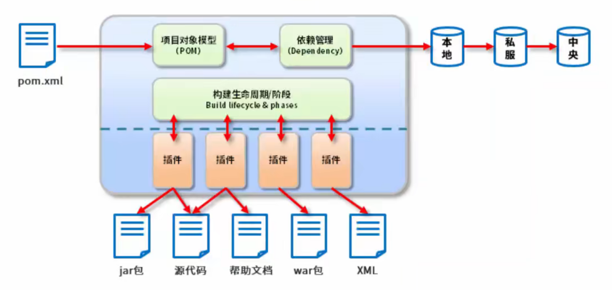

## 模块拆分

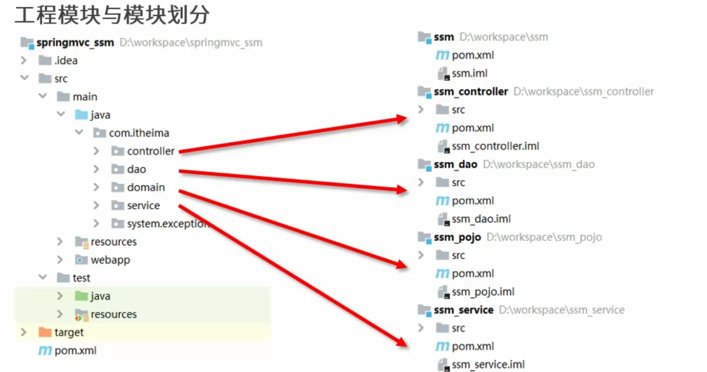

项目较小,暂时用不到

模块聚合
--

1.  什么是聚合？
    
    通过操作一个父模块来将<font color=#666699 style=" font-weight:bold;">多个模块</font>同时运行或进行同一操作就称为聚合。
    
2.  如何实现聚合？
    
    创建一个模块,将其标记为父模块, (注意父模块和子模块在文件夹中的相对位置)
    
    在父模块pom 中作如下配置即可实现与子模块聚合：
    

```xml
	<groupId>com.oddeye</groupId>
    <artifactId>ssm</artifactId>
    <version>1.0-SNAPSHOT</version>
<!--    表示该模块为父管理模块-->
    <packaging>pom</packaging>
<!--    该父模块所管理的子模块名-->
    <modules>
<!--        子模块和父模块存储在同一级文件夹里-->
        <module>../maven-project</module>
        <module>../maven02_inIdea</module>
        <module>../maven_dependenceDelivery/maven_dependenceDelivery</module>

    </modules>
```

子工程不写packaging,默认以jar打包

继承
--

1.  什么是继承？
    
    在聚合多个项目时，如果这些被聚合的项目中需要引入相同的 Jar，那么可以将这些 Jar 写入父 pom 中，各个子项目继承该 pom 即可。
    
2.  如何实现继承？
    

*   父 pom 配置：将需要继承的 Jar 包的坐标放入标签即可。
    

```xml
<dependencyManagement>
    <dependencies>
          <dependency>
            <groupId>cn.missbe.web.search</groupId>
            <artifactId>resource-search</artifactId>
            <packaging>pom</packaging>
            <version>1.0-SNAPSHOT</version>
          </dependency> 
    </dependencies>
</dependencyManagement>
```

*   子 pom 配置：

```xml
<parent>
      <groupId>父pom所在项目的groupId</groupId>
      <artifactId>父pom所在项目的artifactId</artifactId>
      <version>父pom所在项目的版本号</version>
       <!--   如果子工程正好在父工程底下就不用写相对路径了-->
	  <relativePath>父工程相对路径<relativePath>
</parent>
 <parent>
      <artifactId>resource-search</artifactId>
      <groupId>cn.missbe.web.search</groupId>
      <version>1.0-SNAPSHOT</version>
</parent>
```

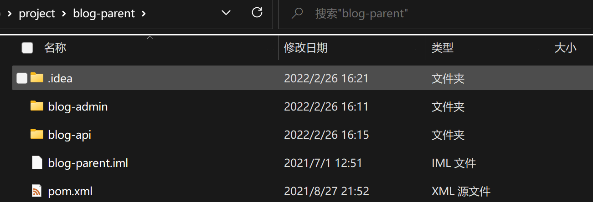

#### 父工程blog-parent

在父工程内<font color=#66CC99 style=" font-weight:bold;">统一依赖</font>,子工程声明依赖就不需要写版本号了

```xml
<?xml version="1.0" encoding="UTF-8"?>
<project xmlns="http://maven.apache.org/POM/4.0.0"
         xmlns:xsi="http://www.w3.org/2001/XMLSchema-instance"
         xsi:schemaLocation="http://maven.apache.org/POM/4.0.0 http://maven.apache.org/xsd/maven-4.0.0.xsd">
    <modelVersion>4.0.0</modelVersion>

    <groupId>org.example</groupId>
    <artifactId>blog-parent</artifactId>
    <version>1.0-SNAPSHOT</version>
    <!--   子模块有哪些 -->
    <modules>
        <module>blog-api</module>
        <module>blog-admin</module>
    </modules>
    <!--   表示该工程是父管理模块 -->
    <packaging>pom</packaging>


    <parent>
        <groupId>org.springframework.boot</groupId>
        <artifactId>spring-boot-starter-parent</artifactId>
        <version>2.5.0</version>
        <relativePath/>
    </parent>
<!--    编码设置-->
    <properties>
        <project.build.sourceEncoding>UTF-8</project.build.sourceEncoding>
        <project.reporting.outputEncoding>UTF-8</project.reporting.outputEncoding>
        <java.version>1.8</java.version>
    </properties>

    <dependencyManagement>
        <dependencies>

    <!--        把父工程中的   未加版本号的 依赖 删去  -->
            <dependency>
                <groupId>com.alibaba</groupId>
                <artifactId>fastjson</artifactId>
                <version>1.2.76</version>
            </dependency>


            <dependency>
                <groupId>commons-collections</groupId>
                <artifactId>commons-collections</artifactId>
                <version>3.2.2</version>
            </dependency>

            <dependency>
                <groupId>com.baomidou</groupId>
                <artifactId>mybatis-plus-boot-starter</artifactId>
                <version>3.4.3</version>
            </dependency>

    	</dependencies>
    </dependencyManagement>

    <build>
        <!--        打包插件-->
        <plugins>
            <plugin>
                <groupId>org.springframework.boot</groupId>
                <artifactId>spring-boot-maven-plugin</artifactId>
            </plugin>
        </plugins>

<!--        <resources>-->
<!--            <resource>-->
<!--                <directory>src/main/java</directory>-->
<!--                <includes>-->
<!--                    <include>**/*.properties</include>-->
<!--                    <include>**/*.xml</include>-->
<!--                </includes>-->
<!--                <filtering>false</filtering>-->
<!--            </resource>-->
<!--            <resource>-->
<!--                <directory>src/main/resources</directory>-->
<!--                <includes>-->
<!--                    <include>**/*.properties</include>-->
<!--                    <include>**/*.xml</include>-->
<!--                </includes>-->
<!--                <filtering>false</filtering>-->
<!--            </resource>-->
<!--        </resources>-->


    </build>

</project>
```


#### 子工程blog-api

```xml
<?xml version="1.0" encoding="UTF-8"?>
<project xmlns="http://maven.apache.org/POM/4.0.0"
         xmlns:xsi="http://www.w3.org/2001/XMLSchema-instance"
         xsi:schemaLocation="http://maven.apache.org/POM/4.0.0 http://maven.apache.org/xsd/maven-4.0.0.xsd">
    
    <!--  父工程名  -->
    <parent>
        <artifactId>blog-parent</artifactId>
        <groupId>org.example</groupId>
        <version>1.0-SNAPSHOT</version>
    </parent>
    <!--  pom规范版本  -->
    <modelVersion>4.0.0</modelVersion>
	<!--  子工程名  -->
    
   	<!--   <groupId>org.example</groupId>默认与父工程保持一致  -->
    <artifactId>blog-api</artifactId>
    <!--   打包方式默认为jar不写 -->

    <dependencies>

        <dependency>
            <groupId>org.springframework.boot</groupId>
            <artifactId>spring-boot-starter</artifactId>
            <!-- 排除 默认使用的logback  -->
            <exclusions>
                <exclusion>
                    <groupId>org.springframework.boot</groupId>
                    <artifactId>spring-boot-starter-logging</artifactId>
                </exclusion>
            </exclusions>
        </dependency>

        <!-- log4j2 -->
        <dependency>
            <groupId>org.springframework.boot</groupId>
            <artifactId>spring-boot-starter-log4j2</artifactId>
        </dependency>

        <dependency>
            <groupId>org.springframework.boot</groupId>
            <artifactId>spring-boot-starter-aop</artifactId>
        </dependency>

        <dependency>
            <groupId>org.springframework.boot</groupId>
            <artifactId>spring-boot-starter-mail</artifactId>
        </dependency>
        <dependency>
            <groupId>org.springframework.boot</groupId>
            <artifactId>spring-boot-starter-web</artifactId>
        </dependency>

        <dependency>
            <groupId>org.springframework.boot</groupId>
            <artifactId>spring-boot-starter-test</artifactId>
            <scope>test</scope>
        </dependency>

        <dependency>
            <groupId>org.springframework.boot</groupId>
            <artifactId>spring-boot-starter-data-redis</artifactId>
        </dependency>


        <dependency>
            <groupId>com.alibaba</groupId>
            <artifactId>fastjson</artifactId>
            <version>1.2.76</version>
        </dependency>

        <dependency>
            <groupId>mysql</groupId>
            <artifactId>mysql-connector-java</artifactId>
        </dependency>

        <dependency>
            <groupId>org.springframework.boot</groupId>
            <artifactId>spring-boot-configuration-processor</artifactId>
            <optional>true</optional>
        </dependency>

        <dependency>
            <groupId>org.apache.commons</groupId>
            <artifactId>commons-lang3</artifactId>
        </dependency>

        <dependency>
            <groupId>commons-collections</groupId>
            <artifactId>commons-collections</artifactId>
            <version>3.2.2</version>
        </dependency>

        <dependency>
            <groupId>com.baomidou</groupId>
            <artifactId>mybatis-plus-boot-starter</artifactId>
            <version>3.4.3</version>
        </dependency>

        <dependency>
            <groupId>org.projectlombok</groupId>
            <artifactId>lombok</artifactId>
        </dependency>
        <!-- https://mvnrepository.com/artifact/joda-time/joda-time -->
        <!--        处理时间的工具类-->
        <dependency>
            <groupId>joda-time</groupId>
            <artifactId>joda-time</artifactId>
            <version>2.10.10</version>
        </dependency>
        <!--jwt加密-->
        <dependency>
            <groupId>io.jsonwebtoken</groupId>
            <artifactId>jjwt</artifactId>
            <version>0.9.1</version>
        </dependency>
        <!--        md5加密-->
        <dependency>
            <groupId>commons-codec</groupId>
            <artifactId>commons-codec</artifactId>
        </dependency>
<!--        七牛云-->
        <dependency>
            <groupId>com.qiniu</groupId>
            <artifactId>qiniu-java-sdk</artifactId>
            <version>[7.7.0, 7.7.99]</version>
        </dependency>
    </dependencies>

    <build>
        <plugins>
            <plugin>
                <groupId>org.springframework.boot</groupId>
                <artifactId>spring-boot-maven-plugin</artifactId>
            </plugin>
        </plugins>

        
        <resources>
            <resource>
                <directory>src/main/java</directory>
                <includes>
                    <include>**/*.properties</include>
                    <include>**/*.xml</include>
                </includes>
                <filtering>false</filtering>
            </resource>
            <resource>
                <directory>src/main/resources</directory>
                <includes>
                    <include>**/*.properties</include>
                    <include>**/*.xml</include>
                </includes>
                <filtering>false</filtering>
            </resource>
        </resources>

    </build>

</project>
```

#### 插件继承

父工程

```xml
<build>
    <!--将父工程加上pluginManagement-->
    <pluginManagement>
        <!--设置插件-->
    	<plugins>
    	<!--具体的插件配置-->
            <plugin>
                <grouprd>org.apache .tomcat.maven</groupId>
                <artifactId>tomcat7-maven-plugin</artifactId>
                <version>2.1</version>
                <configuration>
                    <port>80</port>
                    <path>/</path>
                </configuration>	
            </plugin>
        </plugins>
    </pluginManagement>
</build>
```

子工程

```xml
<build>
    	<plugins>
            <plugin>
                <grouprd>org.apache .tomcat.maven</groupId>
                <artifactId>tomcat7-maven-plugin</artifactId>
				<!--子工程不需要写版本号了-->
                <!--<version>2.1</version>-->
             
            </plugin>
        </plugins>
</build>
```

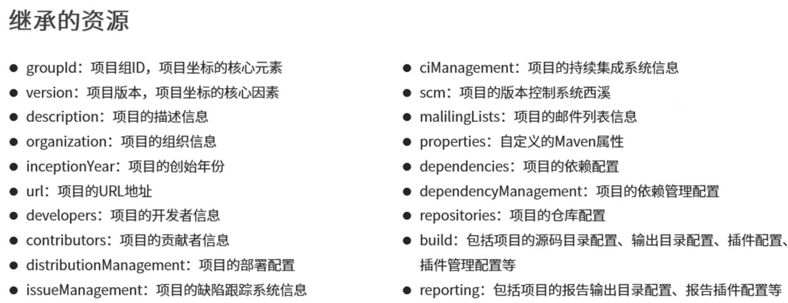

## 版本统一

当多jar包要用同一个版本时,创建变量统一版本

```xml
<!--定义自定义属性-->
<properties>
	<spring.version>5.1.9.RELEASE</ spring.version>
</properties>

<dependency>
	<groupId>org.springframework</ groupId>
    <artifactId>spring-context</ artifactId>
    <version>${spring.version}</version>
</dependency>

```

${version}默认引用该工程version

属性类别:Setting属性
作用:
使用Maven配置文件setting.xml中的标签属性，用于动态配置
调用格式:
$ {settings.localRepository}

## 配置属性管理

利用maven在pom文件中自定义标签来取代properties配置的属性

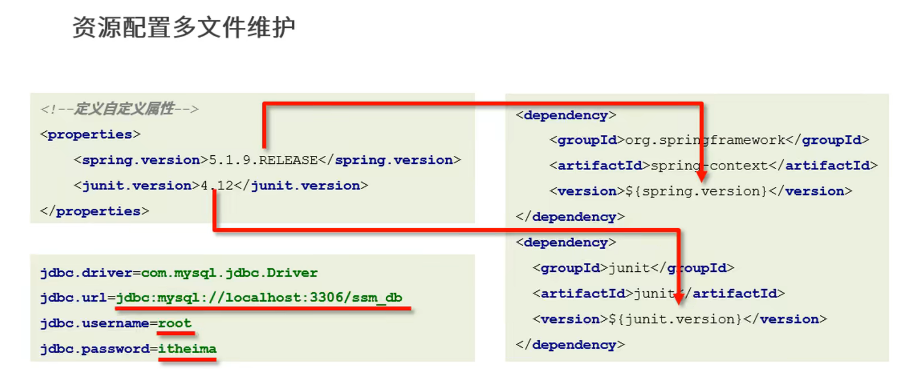

```xml
<!--定义自定义属性-->
<properties>
<spring. version>5.1.9.RELEASE</ spring.version>
    <junit.version>4.12</ljunit.version>
	<jdbc.url>jdbc:mysql://127.0.0.1:3306/ssm_db</jdbc.url>
</properties>
```

jdbc.properties配置文件:

```properties
jdbc.driver=com.mysql.jdbc.Driver
jdbc.ur1=$ {jdbc.url}
jdbc.username=root
jdbc.password=123
```


使用 Maven 构建 Web 项目
------------------

1.  New Maven 项目：选择 WebApp：
    
2.  若使用 JSP，需添加 Servlet 依赖：
    
    注：Servlet 依赖只在编译和测试时使用！
    

```xml
<dependency>
    <groupId>javax.servlet</groupId>
    <artifactId>javax.servlet-api</artifactId>
    <version>3.0.1</version>
    <!-- 只在编译和测试时运行 -->
    <scope>provided</scope>
</dependency>
```

1.  在 Bulid Path 中设置 resource 输出目录：
    
2.  勾选：Dynamic Web Module
    
3.  删掉测试目录
    
4.  在 pom 中加入 jetty 的插件，并设置 JDK 版本：
    

```xml-dtd
<plugins> 
  <plugin> 
    <groupId>org.apache.maven.plugins</groupId>  
    <artifactId>maven-compiler-plugin</artifactId>  
    <configuration> 
      <source>1.8</source>  
      <target>1.8</target> 
    </configuration> 
  </plugin>  
  <plugin> 
    <groupId>org.eclipse.jetty</groupId>  
    <artifactId>jetty-maven-plugin</artifactId>  
    <version>9.3.10.v20160621</version>  
    <executions> 
      <execution> 
        <phase>package</phase> 
      </execution> 
    </executions> 
  </plugin> 
</plugins>
```

1.  运行项目：
    
2.  输入：jetty:run
    
3.  访问 127.0.0.1:8080
    
    若出现如下界面，表示成功！
    

pom.xml 详解
----------

pom.xml 是 Maven 的核心，你的项目需要什么 Jar 包就在 pom.xml 里面配置。当编译项目时 Maven 读取该文件，并从仓库中下载相应的 Jar 包。

```xml
<?xml version="1.0" encoding="utf-8"?>
 
<project xmlns="http://maven.apache.org/POM/4.0.0" xmlns:xsi="http://www.w3.org/2001/XMLSchema-instance" xsi:schemaLocation="http://maven.apache.org/POM/4.0.0http://maven.apache.org/maven-v4_0_0.xsd">  
  <!--父项目的坐标。如果项目中没有规定某个元素的值，
那么父项目中的对应值即为项目的默认值。 
坐标包括group ID，artifact ID和 version。-->  
  <parent> 
    <!--被继承的父项目的构件标识符-->  
    <artifactId/>  
    <!--被继承的父项目的全球唯一标识符-->  
    <groupId/>  
    <!--被继承的父项目的版本-->  
    <version/> 
  </parent>  
  <!--声明项目描述符遵循哪一个POM模型版本。模型本身的版本很少改变，虽然如此，
但它仍然是必不可少的，这是为了当Maven引入了新的特性或者其他模型变更的时候，
确保稳定性。-->  
  <modelVersion>4.0.0</modelVersion>  
  <!--项目的全球唯一标识符，通常使用全限定的包名区分该项目和其他项目。
并且构建时生成的路径也是由此生成， 如com.mycompany.app生成的相对路径为：
/com/mycompany/app-->  
  <groupId>cn.missbe.web</groupId>  
  <!-- 构件的标识符，它和group ID一起唯一标识一个构件。换句话说，
你不能有两个不同的项目拥有同样的artifact ID和groupID；在某个 
特定的group ID下，artifact ID也必须是唯一的。构件是项目产生的或使用的一个东西，
Maven为项目产生的构件包括：JARs，源码，二进制发布和WARs等。-->  
  <artifactId>search-resources</artifactId>  
  <!--项目产生的构件类型，例如jar、war、ear、pom。插件可以创建
他们自己的构件类型，所以前面列的不是全部构件类型-->  
  <packaging>war</packaging>  
  <!--项目当前版本，格式为:主版本.次版本.增量版本-限定版本号-->  
  <version>1.0-SNAPSHOT</version>  
  <!--项目的名称, Maven产生的文档用-->  
  <name>search-resources</name>  
  <!--项目主页的URL, Maven产生的文档用-->  
  <url>http://www.missbe.cn</url>  
  <!-- 项目的详细描述, Maven 产生的文档用。  当这个元素能够用HTML格式描述时
（例如，CDATA中的文本会被解析器忽略，就可以包含HTML标 签）， 
不鼓励使用纯文本描述。如果你需要修改产生的web站点的索引页面，
你应该修改你自己的索引页文件，而不是调整这里的文档。-->  
  <description>A maven project to study maven.</description>  
  <!--描述了这个项目构建环境中的前提条件。-->  
  <prerequisites> 
    <!--构建该项目或使用该插件所需要的Maven的最低版本-->  
    <maven/> 
  </prerequisites>  
  <!--构建项目需要的信息-->  
  <build> 
    <!--该元素设置了项目源码目录，当构建项目的时候，
构建系统会编译目录里的源码。该路径是相对于pom.xml的相对路径。-->  
    <sourceDirectory/>  
    <!--该元素设置了项目脚本源码目录，该目录和源码目录不同：
绝大多数情况下，该目录下的内容 会被拷贝到输出目录(因为脚本是被解释的，而不是被编译的)。-->  
    <scriptSourceDirectory/>  
    <!--该元素设置了项目单元测试使用的源码目录，当测试项目的时候，
构建系统会编译目录里的源码。该路径是相对于pom.xml的相对路径。-->  
    <testSourceDirectory/>  
    <!--被编译过的应用程序class文件存放的目录。-->  
    <outputDirectory/>  
    <!--被编译过的测试class文件存放的目录。-->  
    <testOutputDirectory/>  
    <!--使用来自该项目的一系列构建扩展-->  
    <extensions> 
      <!--描述使用到的构建扩展。-->  
      <extension> 
        <!--构建扩展的groupId-->  
        <groupId/>  
        <!--构建扩展的artifactId-->  
        <artifactId/>  
        <!--构建扩展的版本-->  
        <version/> 
      </extension> 
    </extensions>  
    <!--这个元素描述了项目相关的所有资源路径列表，例如和项目相关的属性文件，
这些资源被包含在最终的打包文件里。-->  
    <resources> 
      <!--这个元素描述了项目相关或测试相关的所有资源路径-->  
      <resource> 
        <!-- 描述了资源的目标路径。该路径相对target/classes目录（例如${project.build.outputDirectory}）。举个例 子，如果你想资源在特定的包里(org.apache.maven.messages)，你就必须该元素设置为org/apache/maven /messages。
然而，如果你只是想把资源放到源码目录结构里，就不需要该配置。-->  
        <targetPath/>  
        <!--是否使用参数值代替参数名。参数值取自properties元素或者文件里配置的属性，
文件在filters元素里列出。-->  
        <filtering/>  
        <!--描述存放资源的目录，该路径相对POM路径-->  
        <directory/>  
        <!--包含的模式列表，例如**/*.xml.-->  
        <includes/>  
        <!--排除的模式列表，例如**/*.xml-->  
        <excludes/> 
      </resource> 
    </resources>  
    <!--这个元素描述了单元测试相关的所有资源路径，例如和单元测试相关的属性文件。-->  
    <testResources> 
      <!--这个元素描述了测试相关的所有资源路径，参见build/resources/resource元素的说明-->  
      <testResource> 
        <targetPath/>
        <filtering/>
        <directory/>
        <includes/>
        <excludes/> 
      </testResource> 
    </testResources>  
    <!--构建产生的所有文件存放的目录-->  
    <directory/>  
    <!--产生的构件的文件名，默认值是${artifactId}-${version}。-->  
    <finalName/>  
    <!--当filtering开关打开时，使用到的过滤器属性文件列表-->  
    <filters/>  
    <!--子项目可以引用的默认插件信息。该插件配置项直到被引用时才会被解析或绑定到生命周期。
给定插件的任何本地配置都会覆盖这里的配置-->  
    <pluginManagement> 
      <!--使用的插件列表 。-->  
      <plugins> 
        <!--plugin元素包含描述插件所需要的信息。-->  
        <plugin> 
          <!--插件在仓库里的group ID-->  
          <groupId/>  
          <!--插件在仓库里的artifact ID-->  
          <artifactId/>  
          <!--被使用的插件的版本（或版本范围）-->  
          <version/>  
          <!--是否从该插件下载Maven扩展（例如打包和类型处理器），由于性能原因，
只有在真需要下载时，该元素才被设置成enabled。-->  
          <extensions/>  
          <!--在构建生命周期中执行一组目标的配置。每个目标可能有不同的配置。-->  
          <executions> 
            <!--execution元素包含了插件执行需要的信息-->  
            <execution> 
              <!--执行目标的标识符，用于标识构建过程中的目标，或者匹配继承过程中需要合并的执行目标-->  
              <id/>  
              <!--绑定了目标的构建生命周期阶段，如果省略，目标会被绑定到源数据里配置的默认阶段-->  
              <phase/>  
              <!--配置的执行目标-->  
              <goals/>  
              <!--配置是否被传播到子POM-->  
              <inherited/>  
              <!--作为DOM对象的配置-->  
              <configuration/> 
            </execution> 
          </executions>  
          <!--项目引入插件所需要的额外依赖-->  
          <dependencies> 
            <!--参见dependencies/dependency元素-->  
            <dependency>......</dependency> 
          </dependencies>  
          <!--任何配置是否被传播到子项目-->  
          <inherited/>  
          <!--作为DOM对象的配置-->  
          <configuration/> 
        </plugin> 
      </plugins> 
    </pluginManagement>  
    <!--使用的插件列表-->  
    <plugins> 
      <!--参见build/pluginManagement/plugins/plugin元素-->  
      <plugin> 
        <groupId/>
        <artifactId/>
        <version/>
        <extensions/>  
        <executions> 
          <execution> 
            <id/>
            <phase/>
            <goals/>
            <inherited/>
            <configuration/> 
          </execution> 
        </executions>  
        <dependencies> 
          <!--参见dependencies/dependency元素-->  
          <dependency>......</dependency> 
        </dependencies>  
        <goals/>
        <inherited/>
        <configuration/> 
      </plugin> 
    </plugins> 
  </build>  
  <!--模块（有时称作子项目） 被构建成项目的一部分。
列出的每个模块元素是指向该模块的目录的相对路径-->  
  <modules/>  
  <!--发现依赖和扩展的远程仓库列表。-->  
  <repositories> 
    <!--包含需要连接到远程仓库的信息-->  
    <repository> 
      <!--如何处理远程仓库里发布版本的下载-->  
      <releases> 
        <!--true或者false表示该仓库是否为下载某种类型构件（发布版，快照版）开启。 -->  
        <enabled/>  
        <!--该元素指定更新发生的频率。Maven会比较本地POM和远程POM的时间戳。这里的选项是：always（一直），daily（默认，每日），interval：X（这里X是以分钟为单位的时间间隔），或者never（从不）。-->  
        <updatePolicy/>  
        <!--当Maven验证构件校验文件失败时该怎么做：ignore（忽略），fail（失败），或者warn（警告）。-->  
        <checksumPolicy/> 
      </releases>  
      <!-- 如何处理远程仓库里快照版本的下载。有了releases和snapshots这两组配置，
POM就可以在每个单独的仓库中，为每种类型的构件采取不同的 策略。
例如，可能有人会决定只为开发目的开启对快照版本下载的支持。
参见repositories/repository/releases元素 -->  
      <snapshots> 
        <enabled/>
        <updatePolicy/>
        <checksumPolicy/> 
      </snapshots>  
      <!--远程仓库唯一标识符。可以用来匹配在settings.xml文件里配置的远程仓库-->  
      <id>banseon-repository-proxy</id>  
      <!--远程仓库名称-->  
      <name>banseon-repository-proxy</name>  
      <!--远程仓库URL，按protocol://hostname/path形式-->  
      <url>http://192.168.1.169:9999/repository/</url>  
      <!-- 用于定位和排序构件的仓库布局类型-可以是default（默认）或者legacy（遗留）。Maven 2为其仓库提供了一个默认的布局；然 而，Maven 1.x有一种不同的布局。我们可以使用该元素指定布局是default（默认）还是legacy（遗留）。-->  
      <layout>default</layout> 
    </repository> 
  </repositories>  
  <!--发现插件的远程仓库列表，这些插件用于构建和报表-->  
  <pluginRepositories> 
    <!--包含需要连接到远程插件仓库的信息.参见repositories/repository元素-->  
    <pluginRepository>......</pluginRepository> 
  </pluginRepositories>  
  <!--该元素描述了项目相关的所有依赖。 这些依赖组成了项目构建过程中的一个个环节。
它们自动从项目定义的仓库中下载。要获取更多信息，请看项目依赖机制。-->  
  <dependencies> 
    <dependency> 
      <!--依赖的group ID-->  
      <groupId>org.apache.maven</groupId>  
      <!--依赖的artifact ID-->  
      <artifactId>maven-artifact</artifactId>  
      <!--依赖的版本号。 在Maven 2里, 也可以配置成版本号的范围。-->  
      <version>3.8.1</version>  
      <!-- 依赖类型，默认类型是jar。它通常表示依赖的文件的扩展名，但也有例外
。一个类型可以被映射成另外一个扩展名或分类器。类型经常和使用的打包方式对应，
 尽管这也有例外。一些类型的例子：jar，war，ejb-client和test-jar。
如果设置extensions为 true，就可以在 plugin里定义新的类型。所以前面的类型的例子不完整。-->  
      <type>jar</type>  
      <!-- 依赖的分类器。分类器可以区分属于同一个POM，但不同构建方式的构件。
分类器名被附加到文件名的版本号后面。例如，如果你想要构建两个单独的构件成 JAR，
一个使用Java 1.4编译器，另一个使用Java 6编译器，你就可以使用分类器来生成两个单独的JAR构件。-->  
      <classifier/>  
      <!--依赖范围。在项目发布过程中，帮助决定哪些构件被包括进来。欲知详情请参考依赖机制。    
                - compile ：默认范围，用于编译      
                - provided：类似于编译，但支持你期待jdk或者容器提供，类似于classpath      
                - runtime: 在执行时需要使用      
                - test:    用于test任务时使用      
                - system: 需要外在提供相应的元素。通过systemPath来取得      
                - systemPath: 仅用于范围为system。提供相应的路径      
                - optional:   当项目自身被依赖时，标注依赖是否传递。用于连续依赖时使用-->  
      <scope>test</scope>  
      <!--仅供system范围使用。注意，不鼓励使用这个元素，
并且在新的版本中该元素可能被覆盖掉。该元素为依赖规定了文件系统上的路径。
需要绝对路径而不是相对路径。推荐使用属性匹配绝对路径，例如${java.home}。-->  
      <systemPath/>  
      <!--当计算传递依赖时， 从依赖构件列表里，列出被排除的依赖构件集。
即告诉maven你只依赖指定的项目，不依赖项目的依赖。此元素主要用于解决版本冲突问题-->  
      <exclusions> 
        <exclusion> 
          <artifactId>spring-core</artifactId>  
          <groupId>org.springframework</groupId> 
        </exclusion> 
      </exclusions>  
      <!--可选依赖，如果你在项目B中把C依赖声明为可选，你就需要在依赖于B的项目（例如项目A）中显式的引用对C的依赖。可选依赖阻断依赖的传递性。-->  
      <optional>true</optional> 
    </dependency> 
  </dependencies>  
  <!-- 继承自该项目的所有子项目的默认依赖信息。这部分的依赖信息不会被立即解析,
而是当子项目声明一个依赖（必须描述group ID和 artifact ID信息），
如果group ID和artifact ID以外的一些信息没有描述，
则通过group ID和artifact ID 匹配到这里的依赖，并使用这里的依赖信息。-->  
  <dependencyManagement> 
    <dependencies> 
      <!--参见dependencies/dependency元素-->  
      <dependency>......</dependency> 
    </dependencies> 
  </dependencyManagement>  
  <!--项目分发信息，在执行mvn deploy后表示要发布的位置。
有了这些信息就可以把网站部署到远程服务器或者把构件部署到远程仓库。-->  
  <distributionManagement> 
    <!--部署项目产生的构件到远程仓库需要的信息-->  
    <repository> 
      <!--是分配给快照一个唯一的版本号（由时间戳和构建流水号）？
还是每次都使用相同的版本号？参见repositories/repository元素-->  
      <uniqueVersion/>  
      <id>banseon-maven2</id>  
      <name>banseon maven2</name>  
      <url>file://${basedir}/target/deploy</url>  
      <layout/> 
    </repository>  
    <!--构件的快照部署到哪里？如果没有配置该元素，默认部署到repository元素配置的仓库，
参见distributionManagement/repository元素-->  
    <snapshotRepository> 
      <uniqueVersion/>  
      <id>banseon-maven2</id>  
      <name>Banseon-maven2 Snapshot Repository</name>  
      <url>scp://svn.baidu.com/banseon:/usr/local/maven-snapshot</url>  
      <layout/> 
    </snapshotRepository>  
    <!--部署项目的网站需要的信息-->  
    <site> 
      <!--部署位置的唯一标识符，用来匹配站点和settings.xml文件里的配置-->  
      <id>banseon-site</id>  
      <!--部署位置的名称-->  
      <name>business api website</name>  
      <!--部署位置的URL，按protocol://hostname/path形式-->  
      <url>scp://svn.baidu.com/banseon:/var/www/localhost/banseon-web</url> 
    </site>  
    <!--项目下载页面的URL。如果没有该元素，用户应该参考主页。
使用该元素的原因是：帮助定位那些不在仓库里的构件（由于license限制）。-->  
    <downloadUrl/>  
    <!-- 给出该构件在远程仓库的状态。不得在本地项目中设置该元素，
因为这是工具自动更新的。有效的值有：none（默认），
converted（仓库管理员从 Maven 1 POM转换过来），partner（直接从伙伴Maven 2仓库同步过来），deployed（从Maven 2实例部 署），verified（被核实时正确的和最终的）。-->  
    <status/> 
  </distributionManagement>  
  <!--以值替代名称，Properties可以在整个POM中使用，也可以作为触发条件（见settings.xml配置文件里activation元素的说明）。格式是<name>value</name>。-->  
  <properties/> 
</project>
```

## 构建

maven项目在ide中编译出的war包一般不会有很多问题。
但是经过集成环境打war包会出现war包中打不进xml、properties等文件。这样打war包不会报错，但是war包放进tomcat中部署就报错了。
解决方法
在pom.xml的build节点配置src/main/java和src/main/resources

```xml
<build>
  <resources>
    <!-- 编译之后包含xml -->
    <resource>
      <directory>src/main/java</directory>
      <includes>
        <include>**/*.xml</include>
      </includes>
      <filtering>true</filtering>
    </resource>
    <!-- 编译之后包含xml和properties -->
    <resource>
      <directory>src/main/resources</directory>
      <includes>
        <include>**/*</include>
      </includes>
      <filtering>true</filtering>
    </resource>
  </resources>
</build>
```


## 问题解决

设置maven在不联网的情况下使用本地插件

一般使用maven为我们提供好的骨架时，是需要联网的，配置这个，可以在没有网路的情况下，我们可以正常创建工程，并从之前已经使用过的工程中找到相应的骨架。

输入内容：`-DarchetypeCatalog=internal`


