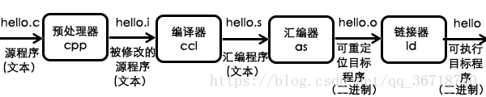
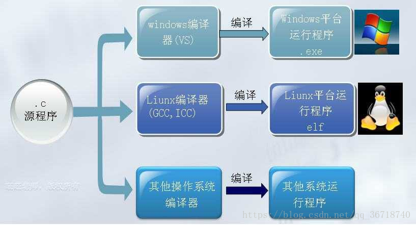
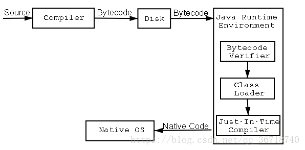
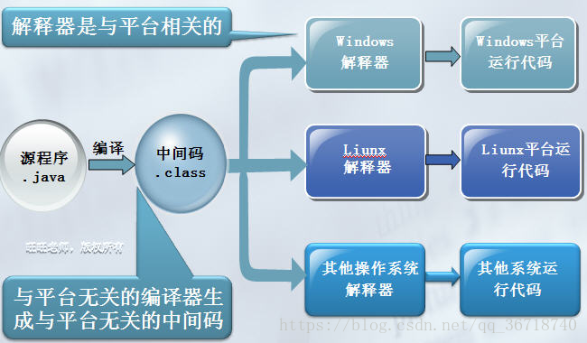
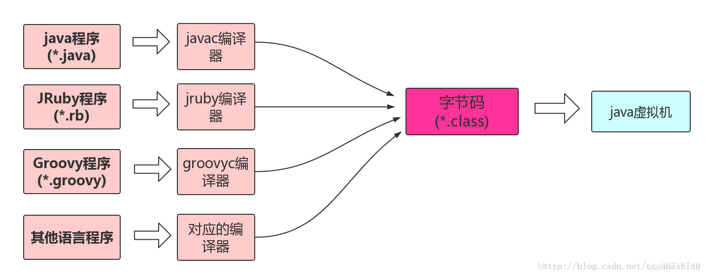

> 本文由 [简悦 SimpRead](http://ksria.com/simpread/) 转码， 原文地址 [blog.csdn.net](https://blog.csdn.net/qq_36718740/article/details/82902754?ops_request_misc=%257B%2522request%255Fid%2522%253A%2522164266366516780264040058%2522%252C%2522scm%2522%253A%252220140713.130102334..%2522%257D&request_id=164266366516780264040058&biz_id=0&utm_medium=distribute.pc_search_result.none-task-blog-2~all~sobaiduend~default-2-82902754.pc_search_insert_es_download&utm_term=%E5%A6%82%E4%BD%95%E7%90%86%E8%A7%A3java%E5%92%8Cc%E8%AF%AD%E8%A8%80%E7%9A%84%E8%B7%A8%E5%B9%B3%E5%8F%B0&spm=1018.2226.3001.4187)

**一、C/C++语言的编译和执行过程**  
**1、编译过程**  
包括预处理、编译、汇编和链接四个阶段：  

1）预处理：伪指令（#，如宏、头文件等）转换和特殊符号处理，生成最终需要编译部分的代码文件；  
2）编译：通过操作系统中安装的编译器，将高级语言代码文件（.c/.cpp格式）编译为汇编语言文件（.s）；  
3）汇编：汇编语言文件通过汇编器编译成目标代码（.o/.obj）；  
4）链接：将一个程序执行需要的二进制文件关联起来，形成可执行文件（.exe）

**2、C/C++的编译器**  
C语言在不同操作系统上需要使用不同的编译器。不同编译器生成的二进制机器码是不同的。原因在于：  
1）硬件不同（如CPU不同）导致操作硬件的指令集不同，因此需要不同的机器码来驱动；  
2）硬件相同，虽然最终通过操作系统下发给硬件的机器码相同，但由于链接过程中需要按照操作系统装载可执行文件的要求来给机器码文件增加信息，所以最终会导致不同操作系统的目标代码（.o）是不同的。  
因此，总结来说就是：  
目标代码的一部分，是跟CPU直接相关的； 而目标代码的另一部分（系统调用），要符合指定OS的要求（格式和接口）。实际上，用户需要给编译器事先配置好的目标硬件与目标操作系统，使得编译器知道了该生成怎样的目标代码以顺利运行（比如可以window上编译手机程序，就需要告诉编译器手机的CPU型号和操作系统）。

 

**二、JAVA语言的编译和执行过程**  
Java程序从源文件创建到程序运行要经过两大步骤：1、源文件由编译器编译成字节码.class文件（ByteCode） 2、字节码由java虚拟机解释运行。因为java程序既要编译同时也要经过JVM的解释运行，所以说Java被称为半解释语言（ “semi-interpreted” language）。  
  

因此，JAVA虚拟机实际上扮演了一个中间件的角色，只要能够在平台上安装JAVA虚拟机，就可以在平台上运行JAVA程序编译后的.class文件。  

 

**三、总结：JAVA和C语言跨平台的理解**  
我们所说的C语言不能跨平台运行，是指C语言编译后的二进制代码文件.obj并不能在不同平台上运行，而要在不同的平台上进行重新的C语言源代码编译，形成能够在对应平台上运行的二进制代码文件。这里面的原因包括：  
1、不同CPU的指令集不同，编译器会在不同平台上将同一份源代码编译为不同的二进制代码以便CPU能够被控制；  
2、程序的任何操作都需要由操作系统转手给硬件处理，因此实际上程序的二进制代码只能在对应操作系统上执行的，而不仅仅是与硬件有关。操作系统带来的差异体现在两方面，一个是.o文件（目标代码）如果涉及到系统内核调用库和函数（系统API），不同操作系统的API是不同的，因而.o文件只能在对应操作系统上执行；另一个原因是虽然根据相同的硬件平台产生对应的指令序列，但不同的操作系统对应的目标文件格式可能不同，如win-pe linux-elf 操作的链接器装载器也相应不同，这些一般在abi(应用二进制接口)规范里会说明好。

而对于JAVA来说，实际上JAVA语言不是直接被编译机器目标代码，而是翻译成中间的.class中间语言；.class文件并不是直接运行在平台，而是通过JAVA虚拟机JVM充当解释器的角色进行了解释，生成最终的机器代码。因此.class文件可以在任何运行JVM的平台上使用，而不需要在每个平台逐一重新将JAVA源代码编译成.class文件。  
可见，JAVA语言的跨平台有两层含义：一是需要在平台上运行对应的JVM，而JVM实际上是有不同的平台对应版本的，用来适配不同的操作系统和底层CPU，Solaris、windows、linux、MacOS等等。二是跨平台的实际上是.class文件，而不是JAVA语言本身。实际上，其它一些语言也有对应的编译器能够生成.class文件，从而运行在JVM中。从这个意义上来讲，JAVA是平台无关的语言，可以做到“一次编译，处处运行”，JVM与平台相关，但又以不同版本适配方式实现跨平台部署，同时能做到“语言无关”。  

参考一篇很好的讨论：[http://www.newsmth.net/nForum/#!article/CSArch/57081?p=1](http://www.newsmth.net/nForum/#!article/CSArch/57081?p=1)  
参考：[https://www.cnblogs.com/jmsjh/p/7808764.html](https://www.cnblogs.com/jmsjh/p/7808764.html)  
参考：[https://www.cnblogs.com/roger-yu/p/5827452.html](https://www.cnblogs.com/roger-yu/p/5827452.html)  
参考库函数和系统调用关系：[https://blog.csdn.net/lht1314tttt/article/details/79150776](https://blog.csdn.net/lht1314tttt/article/details/79150776)  
关于编译器和操作系统关系的讨论：[https://bbs.csdn.net/wap/topics/110037375](https://bbs.csdn.net/wap/topics/110037375)