# python基础语法

### print函数

##### 自带换行

```python
print('hello','llll','world');     #若要同一行 逗号表示空一格
```

##### 可以将内容输入到文件

```python
fp = open('D:/tttttt.txt','a+')
print('hello',file=fp)            #指定file参数
fp.close()
```

#### 转义字符

```python
print('hello\nworld')
#\t
print('hello\tnworld')     #制表符占四位,若前面字符数除以4余数为x   设制表符长度为y    y=4-x
#\的转义
print('http:\\\\baidu.com')      #http:\\baidu.com
#网站url的转义
print('http:////baidu.com')
#单引号的转义
print('他说:\'我爱你\'')        #在单引号前面加\进行转义

#希望转义字符失效
print(r'hello\nworld')        #r使得后面所有的转义字符全部失效变为普通
```

### 变量

##### 变量即对象
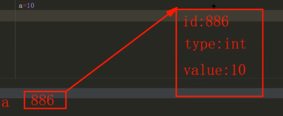

```python
name = 'asd'
x = 4
print(name)
print(x)
print('表示',id(name))
print('x表示',id(x))
print('类型 ',type(name))
print('x类型 ',type(x))

asd
4
表示 1771589788528
x表示 140725531248400
类型  <class 'str'>
x类型  <class 'int'>
```

##### 变量赋值

每次赋值后变量id不同,因为之前的值被垃圾回收了

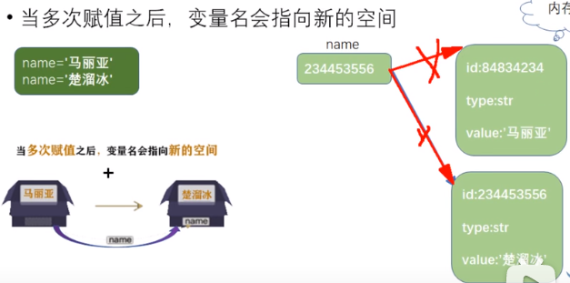


##### 解包赋值

```python
a,b,c = 20,30,40
```

##### 变量比较

```python
a == b #比较value
a is b #判断两个变量id是否相等
a is not
```


##### 变量类型

浮点类
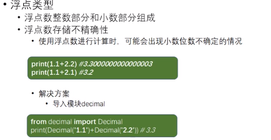

```python
print(1.1+2.2)                #3.3000000000000003
#解决方案
from decimal import Decimal      #这里即使转换为float也会有精度丢失
print(Decimal('1.1') + Decimal('2.2'))       #3.3
```

##### 类型转换

```python
x1 = 1
# print('wo'+x1+'ss')      python中 加号只能用于连接同类型字符串  这里x1是int 需要转型
print('wo'+str(x1)+'ss')

#类型转换后,该变量本身的类型就变了   x1不再是数字了
```

#### 文件保存方式

```
# coding:utf-8
```

### input函数

```python
x = input("输入的第一个数")
y = input("输入的第二个数")
x = int(x)
y = int(y)                            #字符串类型需要转型
#y = int(input("输入的第二个数"))
print('x+y=',x+y)          #x+y= 8
```

### 运算符

整除运算符//

幂运算      2**2  表示2的2次方     后一个参数表示几次

#### 布尔运算符-对象的布尔值

```python
print(bool(False))
print(bool(0))      #如果输入的数字是0 那么这个数字可能会被当做false去处理 因为其bool值为False
print(bool(0.0))
print(bool(None))
print(bool(''))
print(bool(""))
print(bool(()))  # 空元祖
print(bool({}))  # 空字典
print(bool([]))  # 列表
print(bool(set()))
print(bool(dict()))
print(bool(tuple()))  # 元祖
print(bool(list()))
```

### 控制结构语法糖

##### if

```python
x = 4
if x == 4:
    print(x,'is 4')
else:
    print(2*x,'*')
```

```python
x = 4
y = 100
if x != 4 and x > 3:
    print(x,'is 4')
elif x > 4 and y < 100:
    print(2*x,'*')
elif x == 4 and y == 100:
    print(2*x*y,'*')
```

##### range函数

一定步长构造初始化序列      只要把这个数给列表就能像for循环那样生成

相当于一个数组

```python
r = range(10)
print(r)
print(list(r))

r = range(1, 10)
print(list(r))

r = range(1, 10, 2)
print(list(r))

range(0, 10)
[0, 1, 2, 3, 4, 5, 6, 7, 8, 9]
[1, 2, 3, 4, 5, 6, 7, 8, 9]
[1, 3, 5, 7, 9]

print(10 in r)			#in /not in 判断列表中是否包含某元素(可以是任何类型),返回布尔值
print(10 not in r)
```

##### while循环

```python
x = 0
res = 0
while x < 101:
    if x % 2 == 0:
        res += x

    x += 1
print(res)
```

##### for in遍历

```python
for item in 'python':
    print(item)

for item in range(5):
    print("dsfds")
    print(item)

for _ in range(5):
    print('没元素只需重复打印字符串')

sum = 0;
for item in range(1,101):
    if item % 2 == 0:
        sum+=item

print('和为',sum)
```

##### continue

结束当前循环执行下一循环

##### for和while的else

在for和while循环中,没有碰到break执行else

```python
sum = 0;
for item in range(1, 101):
    if item % 2 == 0:
        sum += item
        if sum == 2550:
            break              
else:
    print("25000")              #只要循环中只有一次碰到break都不会执行后面的else

print('和为', sum)            
```

### 容器

#### 列表

##### 列表在内存中的结构     

其指向一个id名为728的数组,这个数组每个值为元素id
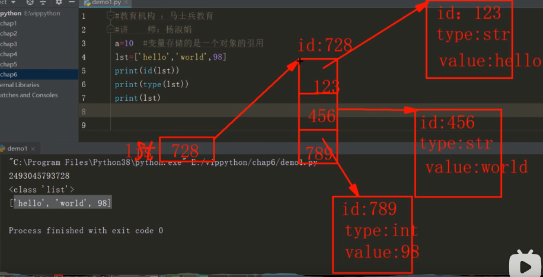


##### 列表初始化

```python
lst=['dsf','sdfsdf',999999]
print(lst)
lst2=list(lst)  #lst2 = list(lst)
print(lst2)
```

##### index('element')

返回列表中符合条件的元素第一个索引

index('element',1,3) 从索引为1到3查找,返回索引

##### 列表切片操作1

```python
lst=['dsf','sdfsdf','fgfg',4,6,7,8,9]
lst2=lst

lst4 = lst2[0:6:2]     #第一个参数是起始索引    第二个参数是结束索引   第三个参数是步长
print(lst4)            #返回一个列表
lst5 = lst2[:6:2]      #第一个参数不填默认0 第二个默认最后一个 第三个默认1
print(lst5)
```

##### append函数

在列表末尾添加一个元素注意 这个

```python
print(lst4,id(lst4))
lst4.append(777)
print(lst4,id(lst4))

['dsf', 'fgfg', 6] 1544613737024
['dsf', 'fgfg', 6, 777] 1544613737024    #id没变,在对应id的空间(类似数组)后面再加了一个777值的id
```

##### extend函数

列表和列表拼接

```python
lst = [1,2,3,4]
lst1 = ['d','d','e']
lst1.extend(lst)
print(lst1)
lst2 = lst1
lst2.append(lst)
print(lst2)

['d', 'd', 'e', 1, 2, 3, 4]                   #extend和append区别
['d', 'd', 'e', 1, 2, 3, 4, [1, 2, 3, 4]]
```

##### insert函数

在对应位置上插入元素

```python
lst2.insert(2,'jjj')
```

##### 切片操作2

```python
lst2[2:]=lst
print(lst2)

['d', 'd', 'jjj', 'e', 1, 2, 3, 4, [1, 2, 3, 4]]
['d', 'd', 1, 2, 3, 4]      #索引2之后全部切掉替换为lst
```

##### 删除remove函数

参数为元素,注意是元素,不是索引

##### pop函数

根据索引删除元素

##### clear函数

清除列表所有元素返回一个[ ]

#### p55--p87跳过

#### 可变序列与不可变序列

,判断一个序列是否可变主要看增删改后其id是否改变(地址是否改变,改变了就不是原来那个而是新创建了一个)

```python
#不可变
str1 = 'jjj'
print(str1,id(str1))
str1 = 'elsejjj'
print(str1,id(str1))
#可变序列
lst =[1,5,6]
print(id(lst))
lst.append(4)
print(id(lst))

jjj 2003864970416
elsejjj 2003864970480
2003835626304
2003835626304
```


#### 元祖

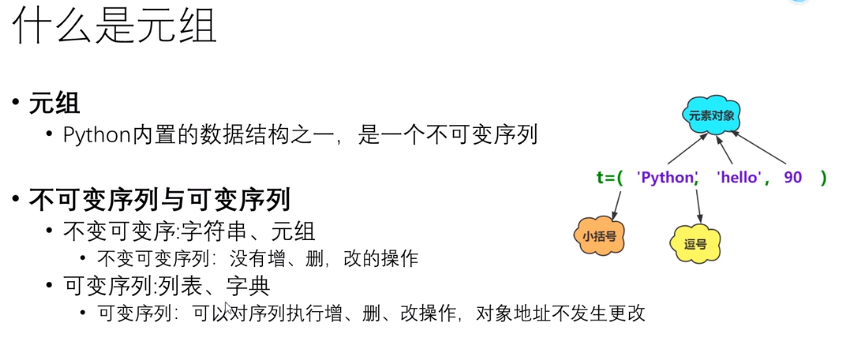

元祖的创建方式

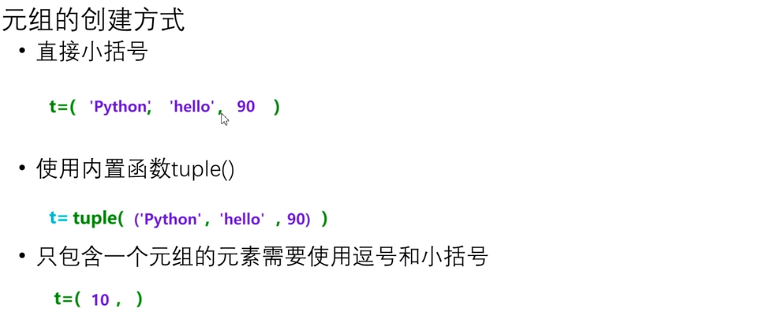

元祖不可变,但其内部元素列表时可变序列,所以可以改变

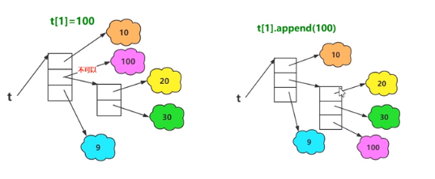

#### 字典

特点:浪费较大内存,但读取速度快,拿空间换时间

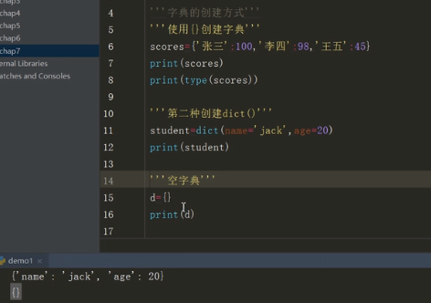

##### 元素获取

get('key')    #找不到返回None

in /not in可以判断是否在其中

##### 元素的增删改

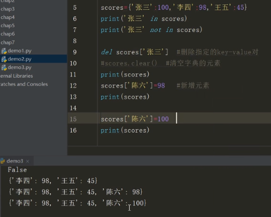

##### 字典视图

```python
scores = {'lll': 123, 'dd': 144, 'jkl': 555}

keys = scores.keys()
values =scores.values()
items = scores.items()

print(keys)
# dict_keys(['lll', 'dd', 'jkl'])
print(values)
# dict_values([123, 144, 555])
print(items)
# dict_items([('lll', 123), ('dd', 144), ('jkl', 555)])
#这是被(包含 ==> 是元祖,只可读
print(scores)
#{'lll': 123, 'dd': 144, 'jkl': 555}
#直接输出还是个字典,通过keys和values输出则是列表
```

##### 字典遍历

```python
for i in scores:
    print(i,scores.get(i)) #输出键和值
```

##### 字典生成式

将两个列表一个当做键,一个当做值 合并为一个字典

若两个长度不相等,按照短的那个

```python
names =['dog','cat','jjj']
ids = [33,22,11]
dic = {names:ids for names,ids in zip(names,ids)}
print(dic) #{'dog': 33, 'cat': 22, 'jjj': 11}
```


### 函数

#### 函数传递内存分析

实参得到形参所指向的内容后,形参被销毁

```python
def fun(num):
    odd=[]
    even=[] #ou
    for i in num:
        if i%2:
            odd.append(i)
        else:
            even.append(i)
    return odd,even               #([1, 3, 5], [2, 4])  函数返回元祖

print(fun([1,2,3,4,5]))
```

#### 函数的参数默认值

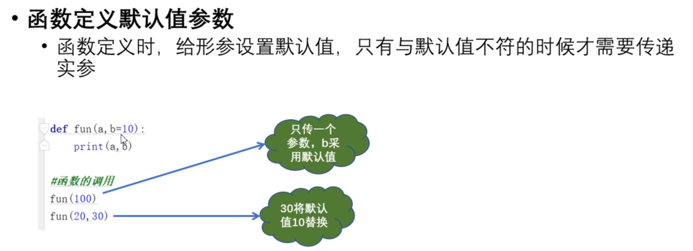

#### 可变个数参数

##### 按位置传参 

,返回的是一个元祖

```python
def fun2(*args):
    print(args)

fun2(4,5,8,77)
fun2(4,5)

#(4, 5, 8, 77)
#(4, 5)
```

##### 关键字传参

,返回的是一个字典

```python
def fun(**arg1s):
    print(arg1s)

fun(a=1,b=4,c = 5)  #{'a': 1, 'b': 4, 'c': 5}
```

### p93-106


### 方法和属性的动态绑定

### 模块局部导入

import 模块名 as 别名

import 包名

from 模块名 import 函数/属性

from 包名 import 模块名

from 包名.模块名 import 属性/函数

main能起到隔离作用减少代码片段对于方法的影响


验证安装成功

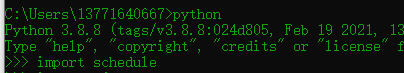


### 定时执行函数

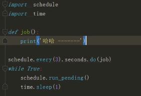

### python解释器位置


