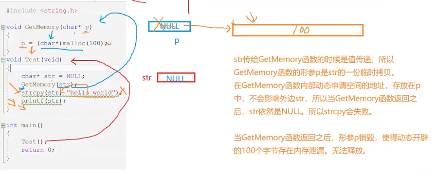
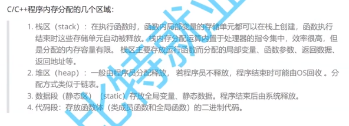
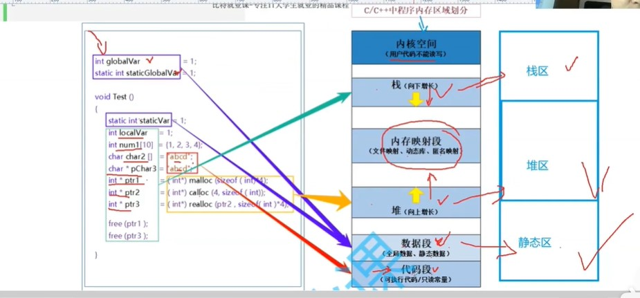

# C语言-动态内存

## 1.内存释放常见错误

##### 1.开辟动态内存常见错误：对NULL指针解引用操作

```c
int *p = (int*)malloc(100000000000000000);
int i = 0;
for (i = 0; i < 10; i++) {
    *(p+i) = i;
}
return 0;
```

当malloc分配内存失败时，会返回空指针

不能对空指针解引用

空指针NULL实质是<stdio.h>中声明的全局变量


##### 2.开辟空间越界访问

```c
int *p = (int*)malloc(10* sizeof(int));

int i = 0;
for (i = 0; i < 40; i++) {
    *(p + i) = i;
    printf("%x\n",p+i);
}
return 0;
```

我们只开辟了40个字节  p访问了160个字节  4*40


##### 3.不能用free()函数来清除非动态开辟的内存

```c
int arr[] = {1,2,3};
int *p = arr;
free(p);
```

非动态开辟的内存不用销毁收回？


##### 4.使用free释放分配的动态内存中的一部分


要从开辟的第一个地址开始释放

所以我们要建立一个临时指针存储一开始的malloc分配的指针


5动态开辟内存 忘记释放(memory leak)

注意：开辟的空间不在函数内释放，就要作为参数传出去在外部释放，不然那个指向动态内存的指针被销毁后，你也找不到你开辟的空间在哪了


##### malloc释放机制

1.主动free

2.主程序执行结束


#### memory problem

##### 1.out of memory(内存溢出)

if system only has 1G space ，you allocate 2G space to your program 


##### 2.memory leak

you forget to recover the allocated space

more and more memory leak will cause the out of memory 


## 2.指针在函数中的传递错误

#### 错误实践




##### 第一种修改方式

```c
int main() {
    Test();
    return 0;

}
char* GetMemory(char *p) {
    p = (char*)malloc(100);
    return p;                      //函数传出指针
}
void Test(void){
    char* str = NULL;
    str = GetMemory(str);
    strcpy(str,"hello world");
    printf(str);
}
```

##### 第二种修改方式

```c
void GetMemory(char **p) {         //普通变量的指针是一级指针，字符串/数组/指针的指针是二级指针
    *p = (char*)malloc(100);

}
void Test(void){
    char* str = NULL;             
    GetMemory(&str);              //函数传入二级指针，参数用地址传递 而非指针变量传递(值传递)
    strcpy(str,"hello world");
    printf(str);
}
```

#### 不要返回栈空间地址

```c
char* GetMemory(void) {
    char p[] = "hello world";  // 不同于*p = (char*)malloc(100);的强引用(相当于java中的new)在堆中创建， 不会轻易销毁free    
    return p;					//char p[] 是在栈中创建，getMemory函数结束后，就会弹出栈 p被销毁
}								//所以一个函数不要返回栈变量的指针 因为那块地方已经被销毁,你再通过指针去访问已经访问不到
void Test(void){
    char* str = NULL;
    str = GetMemory();
    printf(str);
    printf("str");
}
```


#### 常见指针使用错误案例

##### 返回栈空间地址

```c
int *f1(void){
    int x = 10;
    return (&x);
}
```

##### 指针未初始化造成野指针

```c
int *f2(void){
    int *ptr;
    *ptr = 10;
    return ptr;
}
```






截止到柔性数组

