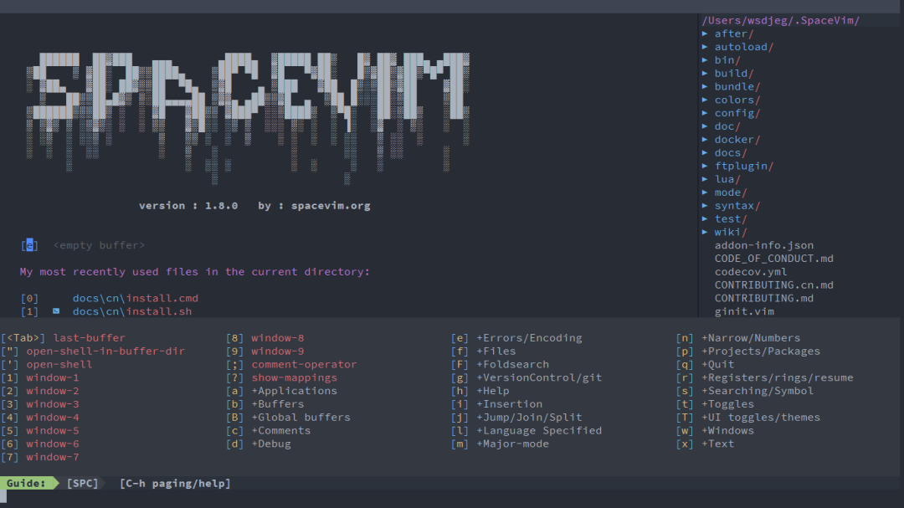
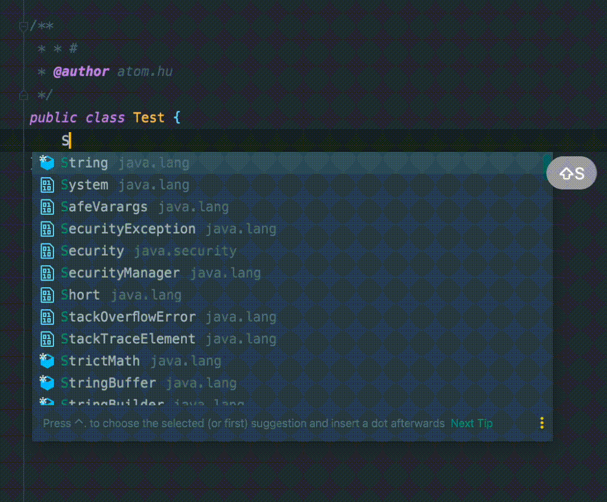

  

**不去说 Vim 好不好用，因为其实大部分同学可能还没真正入门就放弃了，我来分享下我自己学习 Vim 的一些经历和自己整理的笔记吧。**

我在真正切换到 Vim 模式下的时候，我问过自己很多次这个问题，Vim 真的能提高我自己的效率吗？

这个答案是肯定的，肯定没有我自己用的这么熟练的 Idea 效率搞，**开玩笑** 我自己各种快捷键铭记于心，各种多光标操作花里胡哨门清


所以 Vim 肯定不会在原本我自己的本来就很熟练的编辑器上带来什么帮助。

> 地址：https://www.zhihu.com/question/300830746/answer/672248406

真正让我去切换并坚持下来，一个是常年使用机械键盘打字，在每天晚上的时候自己的手腕就很酸了。这个时候每次还需要去移动鼠标到目标位置，还要使用方向盘。我真是吐了🤮。


这是我的第一个机械键盘，青轴的。买的时候真的喜欢，真的帅，声音是真的好听，用起来是真的爽。但是后面手是真的痛。

还有就是确实有时候会去服务端编辑配置文件，不会 vim 的时候就很焦虑。

**问题**
------

先不说 Vim 好不好用，因为我发现大部分人在还没有学会的时候 就因为各种问题 **放弃了**。

在你在学习 Vim 的路途中一定会遇到一些问题，如果你没有解决，那么可能还没学会就放弃了。

这也是为什么很多大佬说 Vim 其实入门是最难的。这里我先把我自己学习过程中遇到的问题整体梳理了一遍。

### **Esc 可太远了**

第一个问题就是 Esc 可太远了。



因为 Vim 从编辑模式到插入模式需要通过 Esc 键进行切换，但是 Esc 键说实话太远了，毕竟其实每次从编辑模式到命令模式都需要退出的，所以 Esc 键是非常常用的键，所以 Esc 一直放在左上角肯定不行，这样下去手肯定都废了。

#### **jk 替换 Esc**


在 Vim 中我们可以设置键位映射，怎么理解，就是可以将键盘上的某个按键与 Vim 的命令绑定起来。例如使用以下命令，可以通过 F5 键将单词用花括号括起来：

```
:map <F5> i{ea}<Esc>
```

因为有这种映射方案，所以我们就可以选择将一些不常用的按键替换为 Esc 键，社区里面使用的比较多的是使用 **jk 键 替换掉 Esc**，我自己试用过，我感觉还是很不错的.

#### **中英文切换 -> Esc**


还有一种方案就是将 CAPSLOCK 替换为 Esc ，我目前就是使用这种方案，感觉还不错。Mac 下直接就可以系统修改按键了，Windows 则需要借助一些外部工具，我知道的有 AutoHotKey.

**中英文切换问题**  


这个问题最开始我是不知道的，根本不知道还有这种问题，因为这个问题我自己一度想要放弃使用中 Vim ，主要是真的非常麻烦

有的时候我们在书写完注释后，需要切换到下一个地方编码，然后就会发现 人傻了，直接弹出输入法。

还有一个场景就是我可以刚好之前是在使用 **企业微信** 和产品各自问候家人


然后回到编辑器写代码，发现没反应直接弹出输入法，还是比较烦人的。


#### **VSCode Vim 中英文解决方案** 

好在社区也有解决方案，

**im-select** GitHub 地址

**im-select**  从终端切换输入法。该项目是对 **VSCodeVim** 的基本支持。它为 **VSCodeVim** 的 **autoSwitchIM** 功能提供命令行程序

里面针对 Window，Linux，Mac Inter ｜ M1 都有对应的方案  

#### **Jetbrains 全家桶 Vim 中英文解决方案** 

AppCode | CLion | DataGrip | DataSpell | Fleet | GoLand | IntelliJ IDEA | PhpStorm | PyCharm | Rider | RubyMine | WebStorm

Jetbrains 的方案更加简单一点，只需要两步操作就可以完美解决

**1. 安装 IdeaVimExtens 插件**【前提，已经安装好 Vim 插件了】


2. 在 .ideaVim 配置中添加一行配置

```
" 为IdeaVim插件增加自动切换为英文输入法的功能," idea 需要安装 IdeaVimExtension pluginset keep-english-in-normal
```

这样就可以解决这个问题了

### **复制问题**

上面的两个问题解决了，你会发现你又会遇到一个新的问题，那就是 Vim 的剪切板和 电脑的剪切板不是互通的，当时也是一度让我想放弃。觉得这是什么垃圾玩意，太难用了吧。哈哈哈哈哈

**解决方案**

**Jetbrains** 加入以下配置文件，在 **.ideavimrc** 中加入以下配置

```
set clipboard^=unnamed,unnamedplus
```

**VSCode**

在 设置页面 选择 **Vim Configuration** 找到 **Vim: Use System Clipboard** 勾选一下


### 快捷键冲突问题


👆 这位同学提到的这个算事一个小问题，不过问题虽小，如果你不知道解决方案也是很头痛的，因为本来我们用 Vim 其实也是和 Idea 编辑器的功能互相结合，利用各自的优势来更加高效的完成任务。

如果因为用了 Vim 而不能使用 IDE 中其他非常好的功能，那属实 **路走窄了 The road is narrow**


**JetBrains 系列 IDE 处理快捷键冲突**

**进入 设置 -> Editor -> Vim**


这里就列举出了 IDE 中常见的快捷键和你想要让他使用 IDE 的功能，还是 Vim 的功能。像实现接口，重写父类方法，最近文件，延展光标 这些肯定还是需要用原生 IDE 的 好一些。

**VSCode 配置键位映射**

**插件 Github 地址**


```
{  "vim.easymotion": true,  "vim.incsearch": true,  "vim.useSystemClipboard": true,  "vim.useCtrlKeys": true,  "vim.hlsearch": true,  "vim.insertModeKeyBindings": [    {      "before": ["j", "j"],      "after": ["<Esc>"]    }  ],  "vim.normalModeKeyBindingsNonRecursive": [    {      "before": ["<leader>", "d"],      "after": ["d", "d"]    },    {      "before": ["<C-n>"],      "commands": [":nohl"]    }  ],  "vim.leader": "<space>",  "vim.handleKeys": {    "<C-a>": false,    "<C-f>": false  }}
```

**学习**
------


我相信大部分的同学是看不到这里的，因为毕竟要注意这么多问题，这属实有点为难我们打工人了，哈哈哈哈哈

解决了👆的问题, 算是基本上有一个舒服的学习环境了

### **安装**


在 `Intellj Idea` 中 安装以下三个插件

*   `IdeaVim`
    
*   `IdeaVim-EasyMotion`
    
*   `IdeaVimExtension`
    


发现图标像上面一样编程一个小方块的时候 就代表插件安装成功不得不说 `vim` 的学习成本还是有的，典型的入门很难 入门之后就会爱不释手。我这里对一些基础操作进行一些简单的总结和整理。

### **练习一：方向键联系 hjkl**


根据我自己的经验总结下来从原生编辑器过度到 `Vim` 最不习惯的当属方向键的移动从原本的 方向键变成了 `hjkl`


这里有一个大佬的评论，哈哈哈哈，这个就看大家的习惯吧，毕竟我是不想用方向键才学 Vim 的


不行，我就要练😈😈😈

**这个其实没有太多好说的 就是需要克服这一关。多练就行。（下图为 Gif 演示）**



### **练习二：复制 & 粘贴**


`CV` 大法好，毕竟大家有时候自嘲都是 `C V` 工程师 😈 所以 复制 粘贴 还是需要在第一时间学会，这样才能更好的 `coding`💩。

*   `yy` 复制当前行
    
*   `p` 粘贴
    


**练习三：在学多一点点**


在我们学会了简答的移动和 CV ，其实个人感觉基本的 Vim 就够了，接下来就开始学习更多的命令，在多学一点点  


#### **y p f h c i**


gif 中步骤如下

`1. yy` 复制当前行 `private String username;`「备注：也可以用大写的 Y 代替 yy 效果一样」

`2. p` 将复制的内容进行粘贴

`3. f;` 跳转到字符 `;` 处，这里其实就是相当于行位。

`4. h` 向左移动一个光标

`5. ciw` 删除当前处的词，并进入 `插入模式`

`6. password` 输入 password 完成

#### **v j d**


gif 中步骤如下

1.  `V` 进入内容选择模式
    
2.  `kkk` 向上移动 3 行，并进行选中
    
3.  `d` 删除选中部分
    

#### 块级删除「常用」di* da*


`di"` 删除`"` 内的内容，个人感觉这个还是非常常用了。也是初步在效率上优于传统的 intellj idea 的操作方式。如果想要删除之后马上进入插入模式 可以使用 `ci"`


`di(` 删除`(` 内的内容，如果想要删除之后马上进入插入模式 可以使用 `ci(`


`di{` 删除`{` 内的内容，如果想要删除之后马上进入插入模式 可以使用 `ci{`

#### 各种进入插入模式

*   `i`在光标之前，进入插入模式
    
*   `I`在本行开头，进入插入模式
    
*   `a`在光标之后，进入插入模式
    
*   `A`在本行结尾，进入插入模式
    
*   `o`在本行之后新增一行，并进入插入模式
    
*   `O`在本行之前新增一行，并进入插入模式
    
*   `s`删除当前字符，并进入插入模式
    
*   `S`删除当前行中的所有文本，并进入插入模式
    

在我最开始的学习 vim 的时候只知道 `i` 进入插入模式。后面才知道还有这么多种方式。如果你真的是切换过来之后 这里所有的方式都能用到。

**下面是 gif 演示 可以直接跳过**


*   `a`在光标之后，进入插入模式
    


*   `i`在光标之前，进入插入模式
    


*   `o`在本行之后新增一行，并进入插入模式
    


*   `A` 在本行结尾，进入插入模式
    


*   `I` 在本行开头，进入插入模式
    


*   `O` 在本行之前新增一行，并进入插入模式
    

### **练习四：jump**


在自 Vim 怎么这么难用下的回答的评论。


不得不说我们使用 vim 更多的就是为了减少鼠标操作，因为使用鼠标你的手需要离开键盘。一来一回 麻烦！！！所以我们需要了解更多光标移动操作

*   `[n]f{word}`  `f` 用来查找在**当前行** 当前光标后是否存在某个字符 `{word}` 如果存在则将光标移动过去
    
*   `$ | ^` `$` 跳转到行尾 `^` 跳转到行首
    
*   `%` 括号匹配跳转 `() [] {}`
    
*   `*` 跳转到下一个字符的定位处
    
*   `#` 跳转到上一个字符的定位处
    
*   `[n]h/j/k/l` 数字加上方向键 代表重复运行多少次
    
*   2jj 向下移动两行
    
*   10l 向右移动 10 个字符
    
*   3kk 向下移动 3 行
    
*   20h 向左移动 20 字符
    
*   `G | gg`  
    
*   G 移动到最后一行
    
*   gg 移动到第一行
    
*   `H | M | L`
    
*   H 移动到当前页的第一行
    
*   M 移动到编辑器中部
    
*   L 移动到当前页的最后一行
    
*   `[n]w` 移动到后面 word 的开始位置，前面加上数字 代表重复多少次
    
*   `e` 移动到下一个词语的末尾
    
*   `b` 移动到上一个单词的开头
    
*   `zz` 改变窗口的整体位置，将当前光标所在处 移动到窗口中部
    
*   `zc` 折叠代码
    
*   `zz` 展开代码
    

**下面是 gif 演示**

**演示**


*   `[n]f{word}`  `f` 用来查找在**当前行** 当前光标后是否存在某个字符 `{word}` 如果存在则将光标移动过去。
    
*   如果将这里的 f 改为 F 则是反向查找
    


*   `$ | ^` `$` 跳转到行尾 `^` 跳转到行首
    


*   `%` 括号匹配跳转 `() [] {}`
    

**进阶**  

能看到这里的人，哈哈哈 应该是个位数了。哈哈哈哈 甚至没有。但是这里才是我真正想要输出的东西

完成了上面的练习，算是熟悉 Vim 了，在 IDE 中完全使用 VIm 肯定也是没问题的。接下来的东西是我自己这半年的使用和技巧总结。算是对自己这使用 半年 Vim 的一个交代。

### **特殊 P 命令**

这里的 p 需要特殊的说一下，Vim 中的 P 代表一个段落，像 dip 删除整一段落，yap 复制整一段。但是这个在真正的代码场景下是有问题的


就比如拿上面这段代码来说，在实际的应用场景里面我会有一个需求就是，这个方法现在没用了，我可以删除了。我最开的理解就是直接使用 dip 就能删除，后面了解到他是连续的一段可以删除


但是下面的场景就不行


### **组合命令删除代码段 V$%d**

鉴于上面的问题，所以我自己在平时在处理这种段落删除的时候 有一段时间处理起来还是比较麻烦一点，后面我想出了一个组合命令来解决这个问题。`V$%d`

`V$%d` 咋一看你可能觉得很复杂，我们依次对这个命令进行拆解一下

*   V 虚拟模式选中一行
    
*   $ 跳到结尾
    
*   % 跳到当前符号匹配出 比如我现在是在 {处，当我按下 % 那么光标就会去到这个 { 对应的} 处 因为我自己目前是在 虚拟模式下，所以到了这里就选中了所有的代码部分。
    
*   d 因为已经选中了所有的部分，所以直接删除即可
    


上面是一个比较慢的 GIF 图，大家可以看下。

### **Vim 对前端开发同学不要太友好**

Vim 给我带来最直观的便利，莫过于在写 Vue 处理标签的时候通过 dat dit 快速的删除标签内代码的功能, YYDS 太爽了


两个场景

*   第一个场景就是我需要删除某个标签下的所有的元素 | 在以前我就只能够拖动鼠标选中删除或者做其他操作，当出现跨屏幕的时候 处理起来非常低效。「dip，dap」
    
*   就是在其他的页面可能求快我需要复制某个元素下的所有代码「yap，yip」
    

上面这两个场景都是我自己经常会遇到的，不知道大家会不会遇到。当我用了 Vim 之后就非常的方便，爽歪歪


### 删除光标前或后光标后所有，这里单独拿出来提一嘴，属于花式操作了

*   删除光标前 d^
    
*   删除光标后 D
    


**单词前 单词后 编辑**  

这个算是我自己在这半年中新研究出来的组合技巧，我自己在工作中使用起来非常顺手。这个技巧就是随意的在一个单词前编辑或者单词后编辑.

首先复习一下几个命令


*   e 移动到当前单词的末尾
    
*   b 移动到单词的开头
    
*   a 在当前位置前插入光标
    
*   i 在当前位置后插入光标
    

当将上面四个命令组合一下 ea | bi 就能达到上面的效果了


**Rename**  

这里主要演示的是 Idea 的 Rename Action 通过


原理就是通过 Vim 的按键映射 出发 Idea 的 actions

**rename 的配置**

```
nnoremap <Leader>ls :action FileStructurePopup<CR>
```

### 当 Vim 遇上多光标


上面演示的多光标里面，在 copy 的时候 我还是使用的 command + c 这是因为在多光标下，如果我们使用 y x 这种复制命令，但是它并不能在粘贴的时候被携带。所以就只能使用系统的 复粘贴了。

### **Ctrl N & Ctrl P**

在我使用一段时间之后，我发现还是有一个通点比较烦人。那就是代码提示


就比如说上面这段代码，我自己真正想打的是 `StringIndexOutOfBoundsException` 这时我看见提示已经比较靠前，所以我就想直接向下选择。

但是问题来了，就是这在这个提示的场景下，我已经不能使用 j/k 进行上下选择了，那么这个时候没有其他办法，那么就又只有去使用上下方向键，这个问题也属实困扰了我蛮久。

后面我发下在 Mac 下除了使用上下方向键，还可以使用 Ctrl P  Ctrl N 进行上下移动。


**其他**
------

这里主要是围绕 Vim 生态的有的是帮助更好的使用 Vim，有的是一些 Vim 插件

### **AutoSwitchInput**

官网 这个是 Mac 上的一个自动帮助切换舒服法的软件。


简单讲，你可以设置当你激活某个软件的时候，他会自动讲你切换到你自己制定的输入法下面，比如我从 IDE 的英文模式，突然来消息需要回一下，这样打开微信之后，它回自动讲舒服法切换到中文状态，相反，在聊天工具里面切换到编辑器下面，它也会自动帮我们切换到英文模式。用了这个软件也能比较好的提升 Vim 的使用体验。

### **SpaceVim**


一般系统里面的 Vim 就像一张白字，如果你刚开始没有什么探索欲，还是挺不容易坚持的。

SpaceVim 是一个社区驱动的模块化的 Vim IDE，以模块的方式组织管理插件以及相关配置， 为不同的语言开发量身定制了相关的开发模块，该模块提供代码自动补全， 语法检查、格式化、调试、REPL 等特性。用户仅需载入相关语言的模块即可得到一个开箱即用的 Vim IDE。

SpaceVim 可以一键配置 Vim，配置之后有很多开箱即用的配置，语法提示。


**配置**  

这里是我自己 .ideaVimrc

```
"语法高亮syntax on"显示行号set number relativenumber"显示光标所在位置的行号和列号set rulerset wrap "自动折行set shiftwidth=4set tabstop=4set softtabstop=4set expandtab "将tab替换为相应数量空格set smartindentset backspace=2set co=5"设置取消备份 禁止临时文件生成set nobackupset noswapfile" 为IdeaVim插件增加自动切换为英文输入法的功能," idea 需要安装 IdeaVimExtension pluginset keep-english-in-normal"设置匹配模式 类似当输入一个左括号时会匹配相应的那个右括号set showmatchset clipboard^=unnamed,unnamedplus"set laststatus=2 "命令行为两行"set fenc=utf-8 "文件编码"set mouse=a "启用鼠标"set ignorecase "忽略大小写set cursorline "突出显示当前行"set cursorcolumn "突出显示当前列set fdm=marker"jj退出insert模式"inoremap <C-j> <ESC>inoremap jk <ESC>"nmap ,v "+p"vmap ,c "+y"nmap ,c "+yvmap ,c :w !pbcopy<CR><CR>nmap ,c :w !pbcopy<CR><CR>nmap ,v :r !pbpaste<CR><CR>let mapleader = '\<space>'"Idea action 配置" 重命令元素nnoremap <Leader>re :action RenameElement<CR>nnoremap <Leader>gi :action GotoImplementation<CR>nnoremap <Leader>im :action ImplementMethods<CR>nnoremap <Leader>rv :action IntroduceVariable<CR>nnoremap <Leader>cr :action CopyReference<CR>nnoremap <Leader>em :action ExtractMethod<CR>nnoremap <Leader>sw :action SurroundWith<CR>" 处理空行nmap <CR> o<Esc>knmap <Leader>a A<ESC>nmap <Leader>i I<ESC>nmap <Leader>p yyp<ESC>"设置vundleset nocompatible " be iMprovedfiletype off " required!set rtp+=~/.vim/bundle/vundle/call vundle#rc()filetype plugin indent on     " required!"vundle设置完毕"Bundle 'taglist.vim'"let Tlist_Ctags_Cmd='ctags'"let Tlist_Show_One_File=1 "不同时显示多个文件的tag，只显示当前文件的"let Tlist_WinWidt =28 "设置taglist的宽度"let Tlist_Exit_OnlyWindow=1 "如果taglist窗口是最后一个窗口，则退出vim"let Tlist_Use_Right_Window=1 "在右侧窗口中显示taglist窗口"let Tlist_Use_Left_Windo =1 "在左侧窗口中显示taglist窗口Bundle 'majutsushi/tagbar'"nmap <Leader>tb :TagbarToggle<CR> "快捷键设置let g:tagbar_ctags_bin='ctags'          "ctags程序的路径let g:tagbar_width=20                   "窗口宽度的设置map <F3> :Tagbar<CR>map <C-t> :Tagbar<CR>"autocmd BufReadPost *.cpp,*.c,*.h,*.hpp,*.cc,*.cxx call tagbar#autoopen() "如果是c语言的程序的话，tagbar自动开启Bundle 'scrooloose/nerdtree'let NERDTreeWinPos='left'let NERDTreeWinSize=25let g:NERDTreeNodeDelimiter = "\u00a0""let g:NERDTreeNodeDelimiter = ''"map <F2> :NERDTreeToggle<CR>map <C-n> :NERDTreeToggle<CR>"打开NERDTree"autocmd vimenter * NERDTree"光标默认在主窗口"wincmd w"autocmd VimEnter * wincmd w"vim 退出时直接关闭NERDTree"autocmd bufenter * if (winnr("$") == 1 && exists("b:NERDTree") && b:NERDTree.isTabTree()) | q | endifBundle 'bling/vim-airline'set laststatus=2Bundle 'scrooloose/nerdcommenter'nnoremap <C-l> gtnnoremap <C-h> gTnnoremap <leader>t : tabe<CR>Bundle 'terryma/vim-multiple-cursors'let g:multi_cursor_use_default_mapping=0" Default mappinglet g:multi_cursor_next_key='<C-m>'let g:multi_cursor_prev_key='<C-p>'let g:multi_cursor_skip_key='<C-x>'let g:multi_cursor_quit_key='<Esc>'"vim-multiple-cursors 多光标选中"Bundle 'terryma/vim-multiple-cursors'"let g:multi_cursor_use_default_mapping=0"let g:multi_cursor_start_key='<C-m>'"let g:multi_cursor_start_word_key='g<C-m>'"let g:multi_cursor_next_key='<C-m>'"let g:multi_cursor_prev_key='<C-p>'"let g:multi_cursor_skip_key='<C-x>'"let g:multi_cursor_quit_key='<C-j>'"MatchTagAlwaysBundle 'Valloric/MatchTagAlways'"Markdown语法高亮Bundle 'godlygeek/tabular'"Bundle 'plasticboy/vim-markdown'"markdown实时显示Bundle 'suan/vim-instant-markdown'"indentLine 代码缩进线标志线Plugin 'Yggdroot/indentLine'let g:indentLine_char = '┆'let g:indentLine_color_term = 239let g:indentLine_enabled = 1"映射到ctrl+i键"map <C-i> :IndentLinesToggle<CR>"delimitMate 自动补全引号(单引号/双引号/反引号), 括号(()[]{})
```

**文档**

我自己在学的时候，还是查了很多的资料。看了很多大神的笔记，我将它们放在这里。

*   B 站 vim 入门讲解
    
*   简明 VIM 练级攻略
    
*   learn-vim
    
*   Vim 配置
    
*   12 Vim Tips
    


