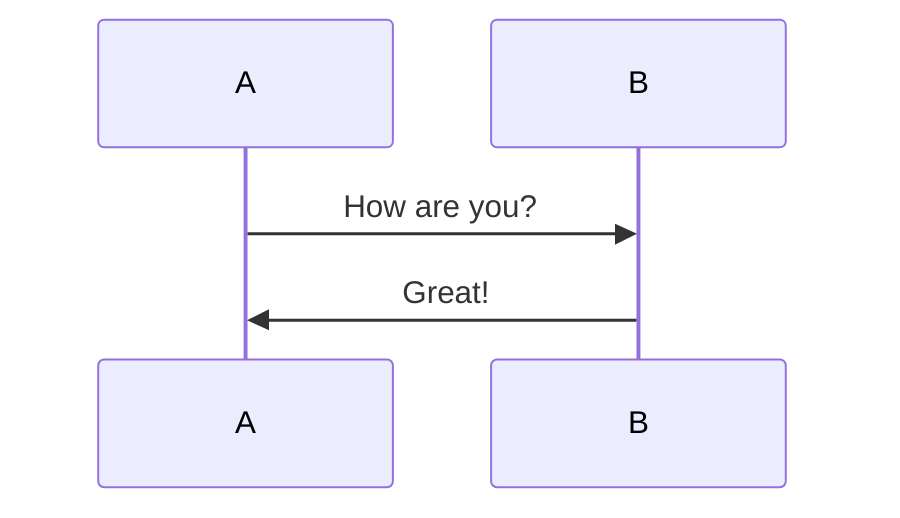

$$
they\ are\  keyshots\ remember\ and\ try\ to\ use
$$

1. 标题：Ctrl+1/2/3/4/5

2. 段落：Ctrl+0

3. ##### 增大标题级别：Ctrl+=

4. 前后*\*ss**   起到段落文字中的文字加强作用,不影响别的字布局

5. 给段落中某个文字加上超链接  [组成\](http://baidu.com)   用时把组成后面的转义符'\'删去      **hr**

6. ##### 减少标题级别：Ctrl±

7. ##### 表格：Ctrl+T

8. ##### 代码块：Ctrl+Shift+K

9. ###### 公式块：Ctrl+Shift+M

10. ##### 引用：Ctrl+Shift+Q

11. ###### 有序列表：Ctrl+Shift+[

12. 无序列表：Ctrl+Shift+]

13. 增加缩进：Ctrl+]

14. 减少缩进：Ctrl+[

15. 删除线：Alt+Shift+5

16. 超链接：Ctrl+K

17. 清除样式：Ctrl+

18. ctrl+/  进入代码模式ide模式

19. shift+enter换行     直接enter换一行

快捷键设置  

hr------超链接

im------图片左对齐

da------字加粗

fo字

bac字背景

ctrl+t   创建表格

1. 把利器，利用好它可以提升你0个教程我
   $$
   大家讲了5点：1.Markdown是什么？2.Markdow
   $$

$$
作者：undefined
$$

### 

|      |      |      |
| ---- | ---- | ---- |
|      |      |      |
|      |      |      |
|      |      |      |

### 

> [https://blog.csdn.net/weixin_40941516/article/details/110052571?ops_request_misc=%257B%2522request%255Fid%2522%253A%2522163739784816780274112813%2522%252C%2522scm%2522%253A%252220140713.130102334..%2522%257D&request_id=163739784816780274112813&biz_id=0&utm_medium=distribute.pc_search_result.none-task-blog-2~all~top_positive~default-1-110052571.pc_search_es_clickV2&utm_term=typora%E5%BF%AB%E6%8D%B7%E9%94%AE&spm=1018.2226.3001.4187](https://blog.csdn.net/weixin_40941516/article/details/110052571?ops_request_misc=%257B%2522request%255Fid%2522%253A%2522163739784816780274112813%2522%252C%2522scm%2522%253A%252220140713.130102334..%2522%257D&request_id=163739784816780274112813&biz_id=0&utm_medium=distribute.pc_search_result.none-task-blog-2~all~top_positive~default-1-110052571.pc_search_es_clickV2&utm_term=typora%E5%BF%AB%E6%8D%B7%E9%

!(C:\Users\13771640667\Desktop\笔记\linux网络\虚拟主机.jpg)

保存：Ctrl+s
关闭：Ctrl+w
**撤销：Ctrl+z**
复制：Ctrl+c
粘贴：Ctrl+v
剪切：Ctrl+X
全选：Ctrl+A
**选中当前行/句：Ctrl+L**
选中当前格式文本:Ctrl+E
选中当前词:Ctrl+D
表格:Ctrl+T
公式快：Ctrl+Shift+m
引用：Ctrl+shift+Q
有序列表：Ctrl+shift+[
无序列表：Ctrl+Shift+]
加粗:Ctrl+B
斜体:Ctrl+I
下划线:Ctrl+U
代码:Ctrl+shift+`或者``中间
删除线：Alt+shift+5
图像：Ctrl+Shift+I
清除式样：Ctrl+\
大纲视图：Ctrl+Shift+1
搜索：Ctrl+Shift+f
